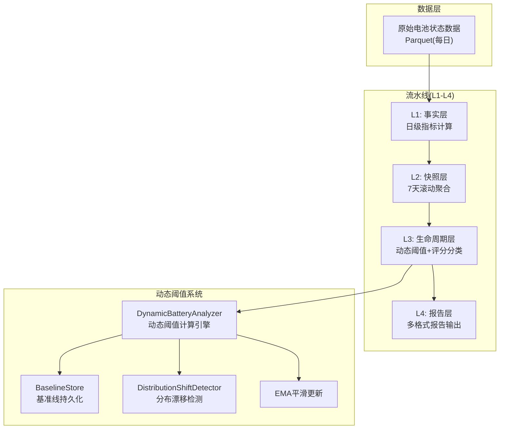
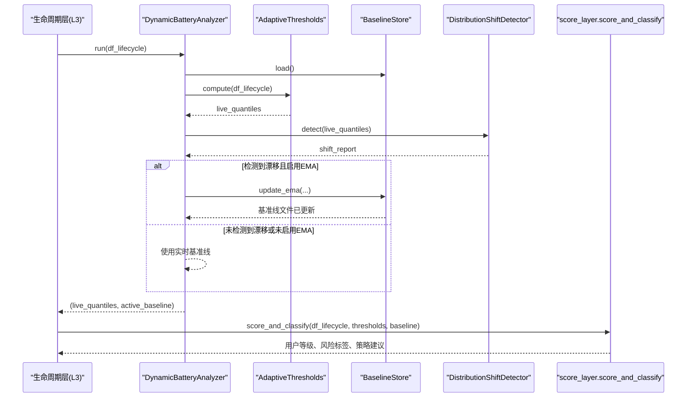
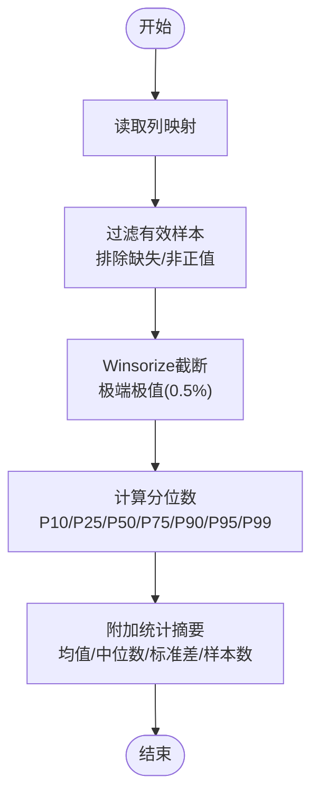
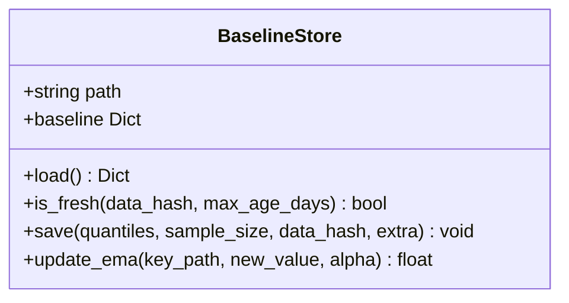
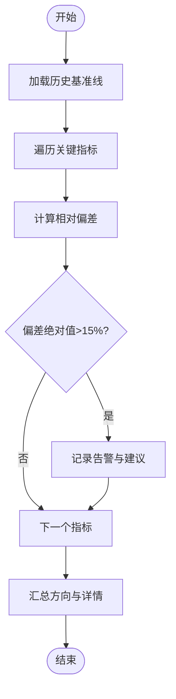
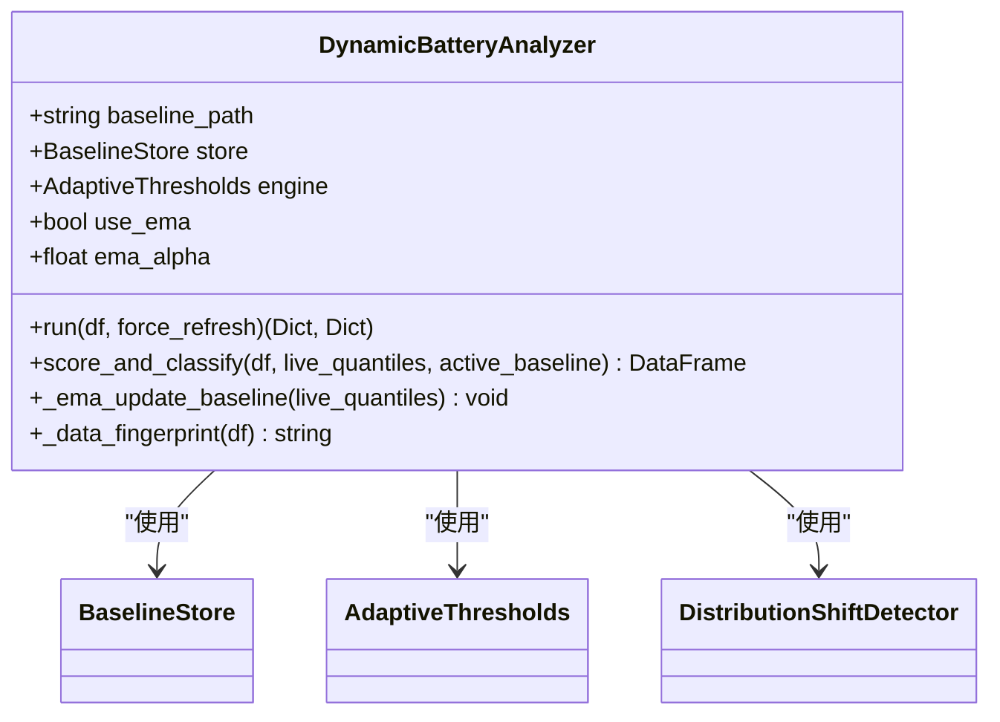
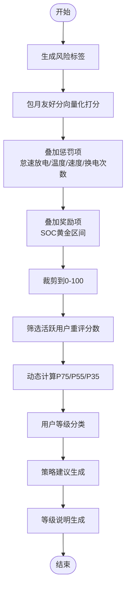
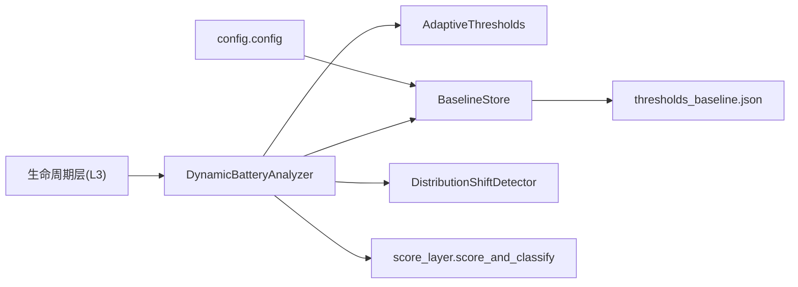

# 动态阈值系统

<cite>
**本文引用的文件**
- [dynamic_thresholds.py](file://src/pipeline/dynamic_thresholds.py)
- [score_layer.py](file://src/pipeline/score_layer.py)
- [score_common.py](file://src/pipeline/score_common.py)
- [run_pipeline.py](file://src/pipeline/run_pipeline.py)
- [config.py](file://config/config.py)
- [thresholds_baseline.json](file://src/tools/thresholds_baseline.json)
- [README.md](file://README.md)
</cite>

## 目录
1. [简介](#简介)
2. [项目结构](#项目结构)
3. [核心组件](#核心组件)
4. [架构总览](#架构总览)
5. [详细组件分析](#详细组件分析)
6. [依赖关系分析](#依赖关系分析)
7. [性能考量](#性能考量)
8. [故障排查指南](#故障排查指南)
9. [结论](#结论)
10. [附录](#附录)

## 简介
本技术文档聚焦“两轮车换电用户特征画像系统”的动态阈值系统，围绕其设计目标、工作原理、实现细节与在用户等级分类中的应用展开。系统旨在解决静态阈值无法适应业务变化的问题，通过分位数动态计算、基准线持久化、分布漂移检测与EMA指数移动平均平滑更新，实现阈值随数据分布变化而自适应演进，从而提升用户等级分类的稳定性与准确性。

## 项目结构
动态阈值系统位于数据流水线的生命周期层（L3），与评分层（L3）紧密协作，形成“阈值计算—评分分类—策略建议”的闭环。系统采用分层解耦、增量处理与运行日志等设计原则，确保可扩展性与可维护性。

图表来源
- [run_pipeline.py:104-166](file://src/pipeline/run_pipeline.py#L104-L166)
- [dynamic_thresholds.py:349-456](file://src/pipeline/dynamic_thresholds.py#L349-L456)
- [score_layer.py:416-468](file://src/pipeline/score_layer.py#L416-L468)

章节来源
- [README.md:136-155](file://README.md#L136-L155)
- [run_pipeline.py:104-166](file://src/pipeline/run_pipeline.py#L104-L166)

## 核心组件
- 动态阈值计算引擎（AdaptiveThresholds）：从7天滚动窗口数据动态计算分位数阈值，支持截断极值与统计摘要。
- 基准线持久化（BaselineStore）：负责阈值基准线的读取、保存、新鲜度判断与EMA平滑更新。
- 分布漂移检测（DistributionShiftDetector）：基于关键指标的实时分位数与历史基准线对比，检测相对偏差是否超过阈值，输出漂移方向与建议。
- 动态阈值分析器（DynamicBatteryAnalyzer）：统一调度上述组件，决定是否复用历史基准线、是否进行EMA更新，并输出用于评分分类的阈值。
- 评分与分类（score_layer.score_and_classify）：基于动态阈值对用户进行评分、风险标签、等级分类与策略建议生成。

章节来源
- [dynamic_thresholds.py:33-145](file://src/pipeline/dynamic_thresholds.py#L33-L145)
- [dynamic_thresholds.py:147-235](file://src/pipeline/dynamic_thresholds.py#L147-L235)
- [dynamic_thresholds.py:237-344](file://src/pipeline/dynamic_thresholds.py#L237-L344)
- [dynamic_thresholds.py:345-511](file://src/pipeline/dynamic_thresholds.py#L345-L511)
- [score_layer.py:80-411](file://src/pipeline/score_layer.py#L80-L411)

## 架构总览
动态阈值系统在生命周期层（L3）中被调用，先计算实时分位数，再与历史基准线对比，若检测到分布漂移则通过EMA平滑更新基准线，最终将阈值传递给评分层进行用户等级分类。

图表来源
- [dynamic_thresholds.py:373-456](file://src/pipeline/dynamic_thresholds.py#L373-L456)
- [dynamic_thresholds.py:489-497](file://src/pipeline/dynamic_thresholds.py#L489-L497)
- [score_layer.py:470-517](file://src/pipeline/score_layer.py#L470-L517)

## 详细组件分析

### 动态阈值计算引擎（AdaptiveThresholds）
- 设计原则
  - 分位数动态计算（不复用历史阈值）
  - 仅使用有效正值数据计算分位数
  - 对极端极值（>99.5%分位）做Winsorize截断，避免异常值扭曲阈值
  - 支持配置分位数列表（P10/P25/P50/P75/P90/P95/P99）
- 关键实现
  - 列名映射：将原始列名映射到逻辑列名，便于统一处理
  - 样本过滤：对特定指标（如包月友好分）过滤沉默用户（固定值）以还原真实得分分布
  - 统计摘要：额外输出均值、中位数、标准差与样本数
- 输出结构：按逻辑列名组织的分位数字典，包含各分位数与统计摘要

图表来源
- [dynamic_thresholds.py:273-324](file://src/pipeline/dynamic_thresholds.py#L273-L324)

章节来源
- [dynamic_thresholds.py:237-344](file://src/pipeline/dynamic_thresholds.py#L237-L344)

### 基准线持久化（BaselineStore）
- 设计原则
  - 基准线文件结构包含版本、更新时间、数据指纹、样本量、分位数、用户等级阈值与可选EMA基准线
  - 新鲜度判断：基于更新时间与数据指纹一致性
  - EMA平滑更新：对指定阈值路径进行指数平滑，避免单次波动导致基准线剧烈跳变
- 关键实现
  - load：读取基准线文件，异常时返回None
  - is_fresh：判断基准线是否在有效期且数据指纹一致
  - save：保存基准线文件，包含版本、更新时间、数据指纹、样本量与分位数
  - update_ema：递归定位键路径并进行EMA平滑更新，同时持久化到文件

图表来源
- [dynamic_thresholds.py:33-145](file://src/pipeline/dynamic_thresholds.py#L33-L145)

章节来源
- [dynamic_thresholds.py:33-145](file://src/pipeline/dynamic_thresholds.py#L33-L145)
- [thresholds_baseline.json:1-141](file://src/tools/thresholds_baseline.json#L1-L141)

### 分布漂移检测（DistributionShiftDetector）
- 设计原则
  - 基于关键指标（平均/最大电流、百公里电耗、日均换电次数）的实时P90与历史基准线P90对比
  - 相对偏差超过阈值（默认15%）即认为存在显著分布漂移
  - 输出漂移方向（改善/恶化/稳定/混合）与建议
- 关键实现
  - 指标映射：定义关键指标与友好名称及“正向是否为坏”的标志
  - 偏差计算：相对偏差=(实时-基准)/基准
  - 建议生成：根据偏差方向给出“上调/下调”建议

图表来源
- [dynamic_thresholds.py:151-235](file://src/pipeline/dynamic_thresholds.py#L151-L235)

章节来源
- [dynamic_thresholds.py:147-235](file://src/pipeline/dynamic_thresholds.py#L147-L235)

### 动态阈值分析器（DynamicBatteryAnalyzer）
- 设计原则
  - 零人工干预：阈值从数据中来，到评级里去
  - 分支决策：强制刷新、基准线新鲜且数据指纹一致、基准线过期或数据指纹变化三种情形
  - EMA自动更新：在检测到分布漂移且启用EMA时，将实时分位数以EMA方式更新基准线文件
- 关键实现
  - run：主流程，决定是否复用历史基准线、是否进行EMA更新，并返回用于评分的阈值
  - score_and_classify：委托给评分层，确保统一的评分逻辑
  - _ema_update_baseline：遍历实时分位数并逐项调用update_ema
  - _data_fingerprint：基于行数、列数与数值列均值之和的哈希，快速判断数据是否变化

图表来源
- [dynamic_thresholds.py:349-511](file://src/pipeline/dynamic_thresholds.py#L349-L511)

章节来源
- [dynamic_thresholds.py:345-511](file://src/pipeline/dynamic_thresholds.py#L345-L511)

### 评分与分类（score_layer.score_and_classify）
- 设计原则
  - 基于动态阈值对用户进行评分、风险标签、等级分类与策略建议生成
  - 向量化优化：使用numpy向量化操作替代apply(axis=1)，性能提升10-100倍
  - 动态等级门槛：基于活跃用户（非沉默用户）的真实重评分数分布动态计算P75/P55/P35作为等级门槛
- 关键实现
  - 风险标签：暴力放电、极端电流、超保护板电流、频繁超80A、中高电流频繁、持续高耗流、深度亏电、月用电超标、电池高温等
  - 包月友好分：多维度向量化打分，叠加怠速放电惩罚、温度/速度扣分、换电次数扣分、SOC黄金区间奖励
  - 等级分类：考虑暴力风险、高风险、中风险、新兵保护期、高能耗用户、普通用户、优质/良好/普通/高损耗用户等
  - 策略建议：结合用户形态、车辆形态、工作特点生成差异化建议

图表来源
- [score_layer.py:80-411](file://src/pipeline/score_layer.py#L80-L411)

章节来源
- [score_layer.py:80-411](file://src/pipeline/score_layer.py#L80-L411)

## 依赖关系分析
- 动态阈值系统依赖于生命周期层（L3）提供的7天滚动窗口数据
- 评分层依赖动态阈值系统输出的阈值字典
- 基准线文件位于工具目录，供动态阈值系统读取与更新
- 配置模块提供基准线文件路径等基础配置

图表来源
- [dynamic_thresholds.py:349-456](file://src/pipeline/dynamic_thresholds.py#L349-L456)
- [score_layer.py:416-468](file://src/pipeline/score_layer.py#L416-L468)
- [config.py:53-54](file://config/config.py#L53-L54)

章节来源
- [dynamic_thresholds.py:349-456](file://src/pipeline/dynamic_thresholds.py#L349-L456)
- [score_layer.py:416-468](file://src/pipeline/score_layer.py#L416-L468)
- [config.py:53-54](file://config/config.py#L53-L54)

## 性能考量
- 向量化优化：评分层广泛使用numpy向量化操作，避免逐行apply，显著提升性能
- 数据指纹：通过行数、列数与数值列均值之和的哈希快速判断数据是否变化，减少不必要的阈值重算
- EMA平滑：仅在检测到分布漂移时更新基准线，避免频繁I/O与文件写入
- 增量处理：流水线支持增量模式，仅处理新增日期，避免重复计算

章节来源
- [score_layer.py:80-90](file://src/pipeline/score_layer.py#L80-L90)
- [dynamic_thresholds.py:479-488](file://src/pipeline/dynamic_thresholds.py#L479-L488)
- [run_pipeline.py:135-166](file://src/pipeline/run_pipeline.py#L135-L166)

## 故障排查指南
- 基准线读取失败
  - 现象：基准线文件不存在或损坏，返回None并发出警告
  - 处理：检查文件路径与权限，确认文件格式正确
- 数据指纹不一致
  - 现象：数据源发生变化或基准线过期，触发重新计算
  - 处理：确认数据源是否变更，必要时强制刷新
- 分布漂移检测未触发
  - 现象：相对偏差未超过阈值（默认15%），未进行EMA更新
  - 处理：适当调整EMA平滑系数或阈值，或确认指标是否确实发生漂移
- 评分分类异常
  - 现象：等级分类不符合预期
  - 处理：检查阈值来源（实时/EMA平滑），核对活跃用户样本数量与动态门槛计算逻辑

章节来源
- [dynamic_thresholds.py:68-78](file://src/pipeline/dynamic_thresholds.py#L68-L78)
- [dynamic_thresholds.py:408-412](file://src/pipeline/dynamic_thresholds.py#L408-L412)
- [score_layer.py:290-301](file://src/pipeline/score_layer.py#L290-L301)

## 结论
动态阈值系统通过分位数动态计算、基准线持久化、分布漂移检测与EMA平滑更新，有效解决了静态阈值无法适应业务变化的问题。系统在保证零人工干预的同时，实现了阈值随数据分布变化而自适应演进，并通过评分层统一生成用户等级、风险标签与策略建议，为运营决策提供了可靠的数据支撑。

## 附录

### 动态阈值在用户等级分类中的应用
- 阈值计算流程
  - 从7天滚动窗口数据计算实时分位数
  - 与历史基准线对比，检测分布漂移
  - 若检测到漂移且启用EMA，则以EMA方式更新基准线
  - 将阈值传递给评分层进行用户等级分类
- 更新触发条件
  - 数据指纹变化或基准线过期
  - 分布漂移检测结果为“有显著漂移”
  - 启用EMA平滑更新
- 效果评估方法
  - 对比不同阈值下的等级分布与策略建议
  - 监控风险标签与等级变化趋势
  - 通过报告层导出统计摘要与明细

章节来源
- [dynamic_thresholds.py:373-456](file://src/pipeline/dynamic_thresholds.py#L373-L456)
- [score_layer.py:290-343](file://src/pipeline/score_layer.py#L290-L343)
- [README.md:724-800](file://README.md#L724-L800)

### 配置参数说明与调优建议
- 基础参数
  - use_ema_update：是否启用EMA自动更新（默认True）
  - ema_alpha：EMA平滑系数（默认0.3），越大越敏感，越小越平滑
  - SHIFT_THRESHOLD_PCT：分布漂移检测阈值（默认15%）
  - WINSORIZE_LEVEL：极值截断比例（默认0.5%）
- 调优建议
  - 敏感性与稳定性平衡：在业务波动较大时提高alpha以更快响应，在业务稳定时降低alpha以减少抖动
  - 漂移阈值：根据业务容忍度调整相对偏差阈值，避免过度触发EMA更新
  - 分位数选择：根据业务需求调整分位数列表，确保覆盖关键业务场景
  - 样本量：确保有效样本数大于阈值计算的最小样本要求（如阈值计算中对某些指标要求有效样本>30）

章节来源
- [dynamic_thresholds.py:166-167](file://src/pipeline/dynamic_thresholds.py#L166-L167)
- [dynamic_thresholds.py:251-251](file://src/pipeline/dynamic_thresholds.py#L251-L251)
- [dynamic_thresholds.py:363-369](file://src/pipeline/dynamic_thresholds.py#L363-L369)
- [dynamic_thresholds.py:299-303](file://src/pipeline/dynamic_thresholds.py#L299-L303)