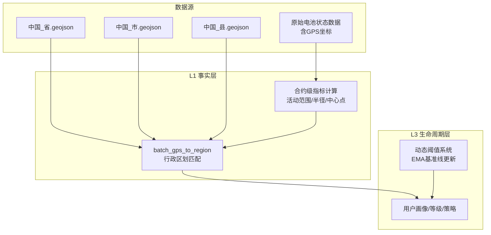
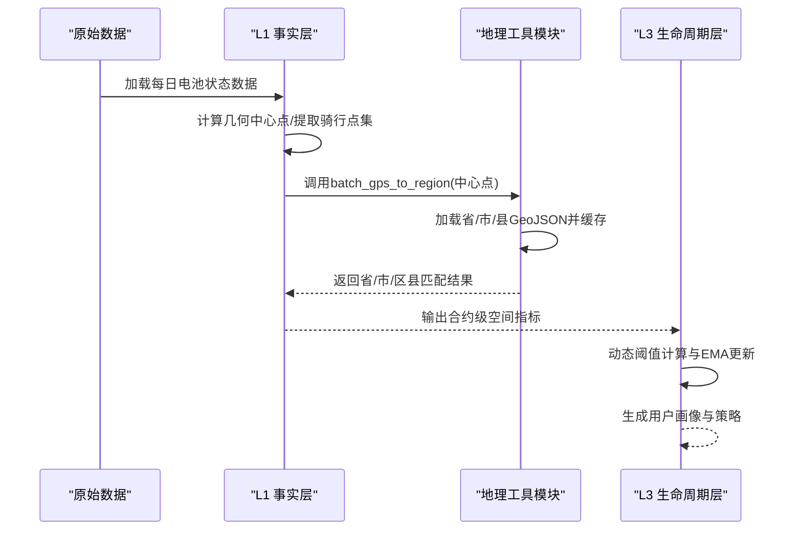
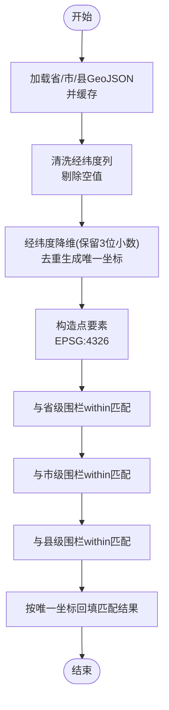
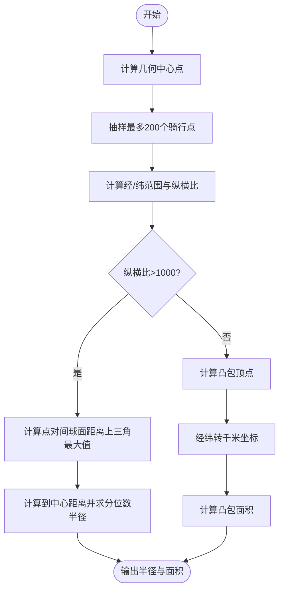
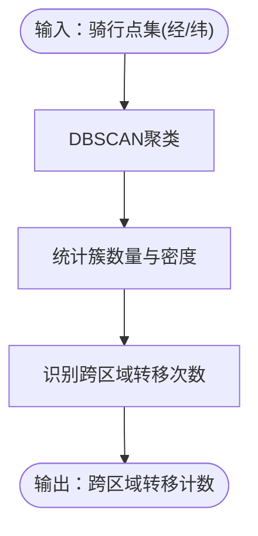
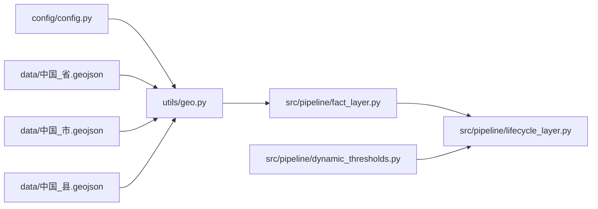

# 地理空间分析

<cite>
**本文引用的文件**
- [utils/geo.py](file://utils/geo.py)
- [config/config.py](file://config/config.py)
- [src/pipeline/fact_layer.py](file://src/pipeline/fact_layer.py)
- [src/pipeline/lifecycle_layer.py](file://src/pipeline/lifecycle_layer.py)
- [src/pipeline/dynamic_thresholds.py](file://src/pipeline/dynamic_thresholds.py)
- [README.md](file://README.md)
- [data/中国_省.geojson](file://data/中国_省.geojson)
- [data/中国_市.geojson](file://data/中国_市.geojson)
- [data/中国_县.geojson](file://data/中国_县.geojson)
</cite>

## 目录
1. [简介](#简介)
2. [项目结构](#项目结构)
3. [核心组件](#核心组件)
4. [架构总览](#架构总览)
5. [详细组件分析](#详细组件分析)
6. [依赖关系分析](#依赖关系分析)
7. [性能考量](#性能考量)
8. [故障排查指南](#故障排查指南)
9. [结论](#结论)
10. [附录](#附录)

## 简介
本章节聚焦两轮车换电用户特征画像系统的地理空间分析能力，围绕以下目标展开：
- GPS坐标匹配算法：基于GeoJSON围栏数据的空间匹配流程与实现原理
- 三级行政区划匹配机制：省→市→县的匹配顺序与优先级策略
- 活动范围分析：凸包计算、几何中心点与活动半径估算
- 空间聚类与位置变化检测：DBSCAN在用户行为模式识别中的应用
- 数据处理流程：从原始GPS坐标到行政区划信息的转换链路
- 结果可视化与业务应用：用户活动范围分析、区域热点识别等

## 项目结构
地理空间分析功能主要分布在如下模块：
- L1事实层：负责合约级指标计算，包含活动范围与行政区划匹配
- L3生命周期层：整合动态阈值与用户画像，部分字段包含跨区域转移计数（DBSCAN派生）
- 工具模块：通用地理空间工具（围栏加载、空间匹配、距离计算）

**图表来源**
- [src/pipeline/fact_layer.py](file://src/pipeline/fact_layer.py)
- [utils/geo.py](file://utils/geo.py)
- [src/pipeline/lifecycle_layer.py](file://src/pipeline/lifecycle_layer.py)
- [src/pipeline/dynamic_thresholds.py](file://src/pipeline/dynamic_thresholds.py)

**章节来源**
- [README.md](file://README.md)
- [config/config.py](file://config/config.py)

## 核心组件
- 围栏数据加载与缓存：统一加载省/市/县三级GeoJSON，确保坐标系一致，缓存以提升性能
- 空间匹配算法：基于Point-in-Polygon匹配，按省→市→县顺序逐级细化
- 凸包与活动半径：基于骑行轨迹点集计算凸包、几何中心与活动半径
- DBSCAN位置变化检测：通过聚类识别跨区域转移，用于用户行为模式识别
- 动态阈值与EMA：对基准线进行漂移检测与平滑更新，间接支撑空间行为阈值

**章节来源**
- [utils/geo.py](file://utils/geo.py)
- [src/pipeline/fact_layer.py](file://src/pipeline/fact_layer.py)
- [src/pipeline/dynamic_thresholds.py](file://src/pipeline/dynamic_thresholds.py)

## 架构总览
地理空间分析在系统中的位置与交互如下：

**图表来源**
- [src/pipeline/fact_layer.py](file://src/pipeline/fact_layer.py)
- [utils/geo.py](file://utils/geo.py)
- [src/pipeline/lifecycle_layer.py](file://src/pipeline/lifecycle_layer.py)
- [src/pipeline/dynamic_thresholds.py](file://src/pipeline/dynamic_thresholds.py)

## 详细组件分析

### GPS坐标匹配与围栏数据加载
- 围栏数据加载
  - 从配置中读取省/市/县GeoJSON路径，统一转换为EPSG:4326坐标系
  - 自动识别名称字段（name/名称/省/市/县），提取名称与几何列
  - 缓存加载结果，避免重复I/O
- 空间匹配流程
  - 将输入DataFrame中的经纬度列转换为数值型，剔除空值
  - 对经纬度进行降维（保留三位小数），合并唯一坐标集合
  - 构造GeoDataFrame并执行within空间连接（sjoin），逐级匹配省/市/县
  - 将匹配结果回填至原索引，保证输出与输入对齐

**图表来源**
- [utils/geo.py](file://utils/geo.py)
- [config/config.py](file://config/config.py)

**章节来源**
- [utils/geo.py](file://utils/geo.py)
- [config/config.py](file://config/config.py)
- [README.md](file://README.md)

### 三级行政区划匹配机制与优先级
- 匹配顺序：省→市→县，逐级细化，确保结果稳定与可解释
- 名称字段识别：优先匹配英文name或中文“名称/省/市/县”字段，若缺失则抛出错误
- 输出字段：核心活动省份、核心活动城市、核心活动区县，以及中心经纬度

**章节来源**
- [utils/geo.py](file://utils/geo.py)
- [README.md](file://README.md)

### 凸包计算与活动范围分析
- 输入：骑行状态为1的有效GPS点集（纬度/经度）
- 中心点：几何中心（平均纬度/平均经度）
- 凸包计算：
  - 对点集进行抽样（最多200个点），避免过大规模计算
  - 计算点集的纵横范围与纵横比，若纵横比过大则采用球面距离矩阵估算最大出行距离
  - 否则使用凸包计算，得到凸包顶点；进一步将经纬度转换为千米坐标，计算凸包面积
- 活动半径：
  - 基于点集到几何中心的距离分位数（R90/R95）估计日常与核心活动半径
  - 若纵横比过大或异常，半径置零以规避异常值影响

**图表来源**
- [src/pipeline/fact_layer.py](file://src/pipeline/fact_layer.py)

**章节来源**
- [src/pipeline/fact_layer.py](file://src/pipeline/fact_layer.py)

### 空间聚类与位置变化检测（DBSCAN）
- 聚类目标：识别用户在空间上的位置变化与跨区域转移
- 输入：骑行状态为1的GPS点集（经度/纬度）
- 处理思路：
  - 使用DBSCAN对点集进行聚类，簇数量作为潜在活动区域数
  - 通过簇数量与密度变化识别跨区域转移（例如众包骑手的频繁跨区）
  - 在生命周期层中，该类指标可用于用户形态与行为模式识别（如“近7d最大跨区域转移次数”）

**图表来源**
- [src/pipeline/fact_layer.py](file://src/pipeline/fact_layer.py)
- [src/pipeline/lifecycle_layer.py](file://src/pipeline/lifecycle_layer.py)

**章节来源**
- [src/pipeline/fact_layer.py](file://src/pipeline/fact_layer.py)
- [src/pipeline/lifecycle_layer.py](file://src/pipeline/lifecycle_layer.py)

### 距离计算与Haversine公式
- 用于球面距离计算，支持米/千米两种单位
- 在凸包半径与最大出行距离计算中被广泛使用

**章节来源**
- [utils/geo.py](file://utils/geo.py)

### 动态阈值与EMA对空间行为的影响
- 动态阈值系统对空间行为指标（如跨区域转移次数）提供自适应阈值
- EMA平滑更新基准线，避免单次波动导致阈值剧烈变化
- 生命周期层据此生成用户等级与策略建议，间接支撑空间行为的运营策略

**章节来源**
- [src/pipeline/dynamic_thresholds.py](file://src/pipeline/dynamic_thresholds.py)
- [src/pipeline/lifecycle_layer.py](file://src/pipeline/lifecycle_layer.py)

## 依赖关系分析
- utils/geo.py
  - 依赖配置模块读取GeoJSON路径
  - 依赖GeoPandas进行空间连接与几何操作
- src/pipeline/fact_layer.py
  - 依赖utils/geo.py提供的空间匹配与距离计算
  - 依赖scipy.spatial.ConvexHull进行凸包计算
- src/pipeline/lifecycle_layer.py
  - 依赖动态阈值系统进行阈值与等级划分
  - 依赖外部数据（合约信息、用户画像）进行综合画像
- data/中国_省.geojson、中国_市.geojson、中国_县.geojson
  - 作为空间匹配的底图数据，必须与EPSG:4326一致

**图表来源**
- [config/config.py](file://config/config.py)
- [utils/geo.py](file://utils/geo.py)
- [src/pipeline/fact_layer.py](file://src/pipeline/fact_layer.py)
- [src/pipeline/lifecycle_layer.py](file://src/pipeline/lifecycle_layer.py)
- [src/pipeline/dynamic_thresholds.py](file://src/pipeline/dynamic_thresholds.py)
- [data/中国_省.geojson](file://data/中国_省.geojson)
- [data/中国_市.geojson](file://data/中国_市.geojson)
- [data/中国_县.geojson](file://data/中国_县.geojson)

**章节来源**
- [config/config.py](file://config/config.py)
- [utils/geo.py](file://utils/geo.py)
- [src/pipeline/fact_layer.py](file://src/pipeline/fact_layer.py)
- [src/pipeline/lifecycle_layer.py](file://src/pipeline/lifecycle_layer.py)
- [src/pipeline/dynamic_thresholds.py](file://src/pipeline/dynamic_thresholds.py)

## 性能考量
- 围栏数据缓存：全局缓存避免重复加载，显著降低I/O开销
- 坐标降维：对经纬度进行三位小数降维，减少唯一坐标数量，提升空间连接效率
- 凸包抽样：对大量点集进行抽样（最多200个），平衡精度与性能
- 纵横比阈值：当点集分布极度扁平时，采用球面距离矩阵直接估算最大出行距离，避免复杂几何计算

**章节来源**
- [utils/geo.py](file://utils/geo.py)
- [src/pipeline/fact_layer.py](file://src/pipeline/fact_layer.py)

## 故障排查指南
- 围栏数据加载失败
  - 检查GeoJSON路径是否正确，文件是否存在
  - 确认名称字段存在（name/名称/省/市/县），否则会抛出错误
- 空间匹配结果为空
  - 检查经纬度列是否为数值型，是否存在空值
  - 确认坐标系为EPSG:4326
- 凸包面积为0或半径异常
  - 检查点集数量是否小于3
  - 检查是否存在极端异常值或分布极度扁平的情况
- DBSCAN聚类异常
  - 检查输入点集是否为空或仅有少量点
  - 调整DBSCAN参数（eps/min_samples）以适配不同用户行为模式

**章节来源**
- [utils/geo.py](file://utils/geo.py)
- [src/pipeline/fact_layer.py](file://src/pipeline/fact_layer.py)

## 结论
本系统通过“围栏数据+空间匹配+凸包分析+DBSCAN聚类”的组合，实现了从原始GPS坐标到用户活动范围与行为模式的多维刻画。三级行政区划匹配确保了结果的可解释性；凸包与半径计算提供了量化活动范围的能力；DBSCAN聚类为跨区域转移等行为模式识别提供了工具。动态阈值与EMA进一步提升了阈值的自适应性，支撑运营策略的持续优化。

## 附录
- 业务应用场景
  - 用户活动范围分析：基于凸包与半径，识别集中型/分散型用户
  - 区域热点识别：结合行政区划匹配与骑行点密度，识别高频活动区域
  - 行为模式识别：基于DBSCAN聚类的跨区域转移次数，区分众包/专送等用户形态
- 可视化建议
  - 点云图：展示骑行点集与几何中心
  - 凸包图：叠加凸包轮廓与活动半径
  - 热力图：按行政区划叠加骑行密度
  - 聚类图：DBSCAN聚类结果与簇数量统计