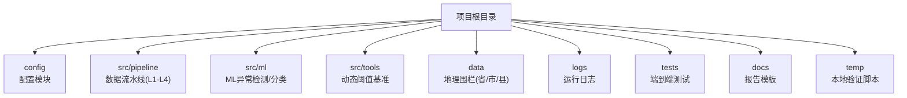
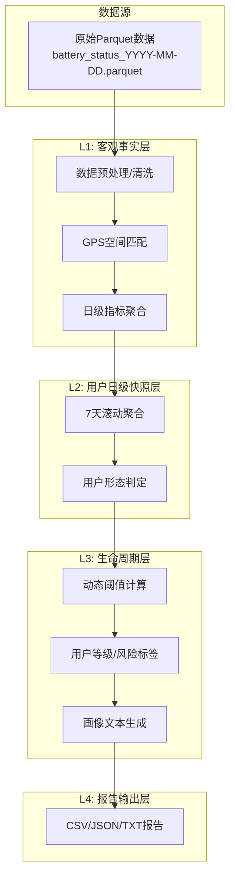
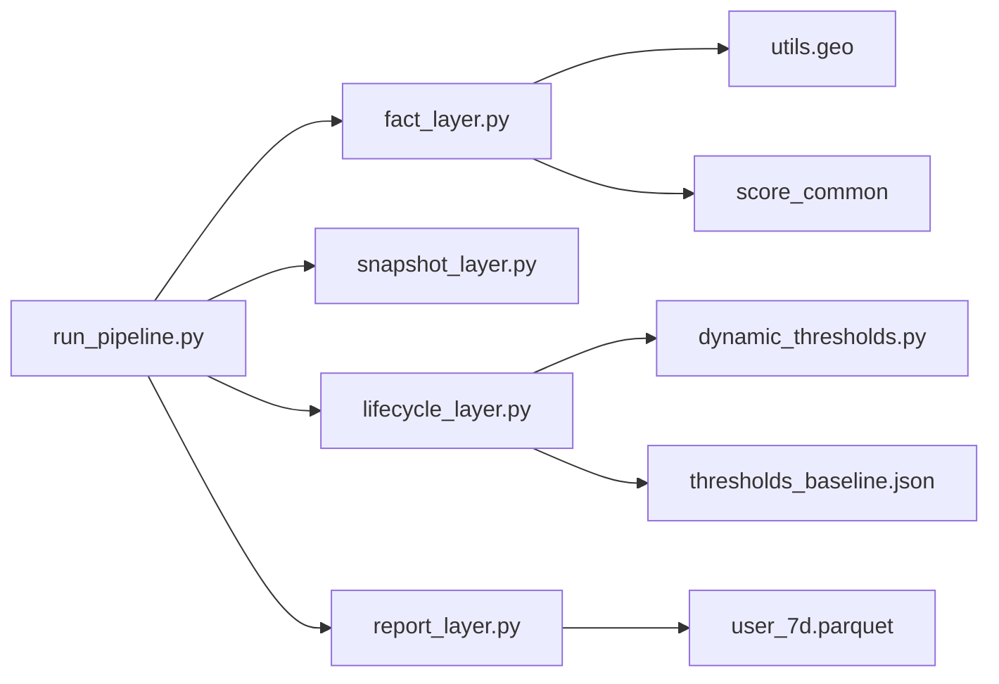

# 快速开始

<cite>
**本文引用的文件**
- [README.md](file://README.md)
- [requirements.txt](file://requirements.txt)
- [config/config.py](file://config/config.py)
- [src/pipeline/run_pipeline.py](file://src/pipeline/run_pipeline.py)
- [src/pipeline/fact_layer.py](file://src/pipeline/fact_layer.py)
- [src/pipeline/snapshot_layer.py](file://src/pipeline/snapshot_layer.py)
- [src/pipeline/lifecycle_layer.py](file://src/pipeline/lifecycle_layer.py)
- [src/pipeline/report_layer.py](file://src/pipeline/report_layer.py)
- [src/ml/run_ml.py](file://src/ml/run_ml.py)
- [src/tools/thresholds_baseline.json](file://src/tools/thresholds_baseline.json)
- [tests/test_pipeline.py](file://tests/test_pipeline.py)
- [docs/用户运营分析报告.md](file://docs/用户运营分析报告.md)
- [temp/run_full_pipeline_local.py](file://temp/run_full_pipeline_local.py)
</cite>

## 目录
1. [简介](#简介)
2. [项目结构](#项目结构)
3. [核心组件](#核心组件)
4. [架构总览](#架构总览)
5. [详细组件分析](#详细组件分析)
6. [依赖关系分析](#依赖关系分析)
7. [性能考虑](#性能考虑)
8. [故障排查指南](#故障排查指南)
9. [结论](#结论)
10. [附录](#附录)

## 简介
本指南面向首次接触“两轮车换电用户特征画像系统”的用户，帮助你在30分钟内完成环境准备、安装依赖、配置项目路径、运行数据流水线、查看输出结果，并生成用户画像报告。系统采用分层架构（L1-L4），支持多种执行模式（全量重建、增量处理、刷新聚合、重新评级、仅报告），并内置动态阈值与ML异常检测能力，便于快速落地业务场景。

## 项目结构
项目采用模块化分层组织，核心目录如下：
- config：配置模块，定义输入/输出路径与测试模式
- src/pipeline：数据流水线四层实现（L1-L4）
- src/ml：机器学习异常检测与监督分类入口
- src/tools：动态阈值基准文件
- data：辅助地理围栏数据（GeoJSON）
- logs：运行日志输出
- tests：端到端流水线测试脚本
- docs：报告模板与说明
- temp：本地验证脚本与中间产物输出

图表来源
- [config/config.py:1-54](file://config/config.py#L1-L54)
- [src/pipeline/run_pipeline.py:1-381](file://src/pipeline/run_pipeline.py#L1-L381)
- [src/ml/run_ml.py:1-395](file://src/ml/run_ml.py#L1-L395)

章节来源
- [README.md: 79-156:79-156](file://README.md#L79-L156)
- [config/config.py: 1-L54:1-54](file://config/config.py#L1-L54)

## 核心组件
- 环境与依赖
  - Python 3.13+（推荐使用虚拟环境）
  - 依赖包：pandas、numpy、scipy、scikit-learn、tqdm、fpdf2、pyarrow、xgboost、geopandas
  - 依赖安装：pip install -r requirements.txt
- 配置模块
  - config/config.py：定义基础路径、输入/输出路径、测试模式开关
  - 默认使用正式路径；如需测试，将 TEST_MODE 设置为 True
- 数据流水线入口
  - src/pipeline/run_pipeline.py：统一调度L1-L4，支持多种执行模式
- L1-L4分层
  - L1（Fact Layer）：日级事实指标计算
  - L2（Snapshot Layer）：7天滚动聚合与用户形态判定
  - L3（Lifecycle Layer）：用户评分/分类/画像生成
  - L4（Report Layer）：多格式报告输出
- ML模块
  - src/ml/run_ml.py：异常检测、标注管理、监督训练、预测与全流程

章节来源
- [requirements.txt: 1-9:1-9](file://requirements.txt#L1-L9)
- [config/config.py: 1-L54:1-54](file://config/config.py#L1-L54)
- [src/pipeline/run_pipeline.py: 1-L381:1-381](file://src/pipeline/run_pipeline.py#L1-L381)
- [src/ml/run_ml.py: 1-L395:1-395](file://src/ml/run_ml.py#L1-L395)

## 架构总览
系统采用“原始数据 → L1日级事实 → L2滚动快照 → L3评分分类画像 → L4报告输出”的流水线架构，支持增量处理与断点续跑，日志自动保存，便于问题追踪与回溯。

图表来源
- [README.md: 136-143:136-143](file://README.md#L136-L143)
- [src/pipeline/fact_layer.py: 1-L200:1-200](file://src/pipeline/fact_layer.py#L1-L200)
- [src/pipeline/snapshot_layer.py: 1-L200:1-200](file://src/pipeline/snapshot_layer.py#L1-L200)
- [src/pipeline/lifecycle_layer.py: 1-L200:1-200](file://src/pipeline/lifecycle_layer.py#L1-L200)
- [src/pipeline/report_layer.py: 1-L200:1-200](file://src/pipeline/report_layer.py#L1-L200)

## 详细组件分析

### 环境与依赖安装
- Python 3.13+：建议使用虚拟环境隔离依赖
- 安装依赖：pip install -r requirements.txt
- 若安装过程中出现编译错误，可参考常见问题章节进行处理

章节来源
- [requirements.txt: 1-9:1-9](file://requirements.txt#L1-L9)
- [README.md: 44-52:44-52](file://README.md#L44-L52)

### 配置文件设置
- 修改 config/config.py 中的 TEST_MODE 控制是否使用测试路径
- 确认输入/输出路径指向你的数据目录（默认指向 OneDrive 数据库路径）
- 确保 data/ 目录存在中国_省.geojson、中国_市.geojson、中国_县.geojson
- 确保 src/tools/thresholds_baseline.json 存在（动态阈值基准）

章节来源
- [config/config.py: 1-L54:1-54](file://config/config.py#L1-L54)
- [src/tools/thresholds_baseline.json: 1-L141:1-141](file://src/tools/thresholds_baseline.json#L1-L141)

### 基本使用示例
- 增量处理（默认模式）
  - python src/pipeline/run_pipeline.py
  - 自动检测缺失日期，仅处理新日期
- 全量重建
  - python src/pipeline/run_pipeline.py --mode full
  - 清空历史L1-L4输出，重新计算
- 刷新聚合（修改L2逻辑后）
  - python src/pipeline/run_pipeline.py --mode refresh
- 重新评级（修改L3规则后）
  - python src/pipeline/run_pipeline.py --mode recalculate
- 仅生成报告
  - python src/pipeline/run_pipeline.py --mode report_only
- 从指定层开始重建
  - python src/pipeline/run_pipeline.py --layer L1/L2/L3/L4
- 关闭数据完整性检查
  - python src/pipeline/run_pipeline.py --skip-incomplete false

章节来源
- [src/pipeline/run_pipeline.py: 13-L41:13-41](file://src/pipeline/run_pipeline.py#L13-L41)
- [src/pipeline/run_pipeline.py: 307-L378:307-378](file://src/pipeline/run_pipeline.py#L307-L378)

### L1：日级事实层（Fact Layer）
- 输入：每日原始Parquet文件（battery_status_YYYY-MM-DD.parquet）
- 处理流程：数据预处理 → GPS空间匹配 → 合约级指标聚合
- 输出：按日期分区的fact/daily/parquet文件
- 关键特性：数据完整性校验（时间跨度≥20小时、小时覆盖≥20个/24小时），不满足则跳过该日期

章节来源
- [README.md: 160-387:160-387](file://README.md#L160-L387)
- [src/pipeline/fact_layer.py: 1-L200:1-200](file://src/pipeline/fact_layer.py#L1-L200)

### L2：用户日级快照层（Snapshot Layer）
- 输入：L1输出（fact/daily/*.parquet）
- 处理流程：加载全量历史 → 7天滚动聚合 → 用户形态判定
- 输出：snapshot/user_daily.parquet（全量用户记录）
- 关键特性：按用户分组，对数值型指标进行sum/mean/max聚合，占比型指标采用比率加权平均

章节来源
- [README.md: 389-499:389-499](file://README.md#L389-L499)
- [src/pipeline/snapshot_layer.py: 1-L200:1-200](file://src/pipeline/snapshot_layer.py#L1-L200)

### L3：生命周期层（Lifecycle Layer）
- 输入：snapshot/user_daily.parquet（最近30天窗口）
- 处理流程：加载合约信息 → 动态阈值计算（EMA更新）→ 用户等级/风险标签→ 画像文本→ 月度用电预估
- 输出：lifecycle/user_7d.parquet（完整用户画像，120+字段）
- 关键特性：基于7天滚动窗口计算实时分位数，与历史基准对比检测分布漂移，必要时EMA平滑更新基准

章节来源
- [README.md: 501-700:501-700](file://README.md#L501-L700)
- [src/pipeline/lifecycle_layer.py: 1-L200:1-200](file://src/pipeline/lifecycle_layer.py#L1-L200)
- [src/tools/thresholds_baseline.json: 1-L141:1-141](file://src/tools/thresholds_baseline.json#L1-L141)

### L4：报告输出层（Report Layer）
- 输入：lifecycle/user_7d.parquet
- 输出：多格式报告（CSV/JSON/TXT），包含用户明细、等级分布、风险告警、摘要、月度出勤明细等
- 编码：UTF-8 with BOM（Excel兼容）

章节来源
- [README.md: 702-722:702-722](file://README.md#L702-L722)
- [src/pipeline/report_layer.py: 1-L200:1-200](file://src/pipeline/report_layer.py#L1-L200)

### ML模块（可选）
- 异常检测：孤立森林 + DBSCAN
- 标注管理：生成待标注、保存标注、统计
- 监督训练：XGBoost多分类器
- 预测：对新数据进行异常类型预测
- 全流程：anomaly → label generate → (人工标注) → train → predict

章节来源
- [src/ml/run_ml.py: 1-L395:1-395](file://src/ml/run_ml.py#L1-L395)

## 依赖关系分析
- 运行入口依赖各层模块：run_pipeline.py 导入 fact_layer、snapshot_layer、lifecycle_layer、report_layer
- L1依赖地理工具与通用评分模块（utils.geo、score_common）
- L3依赖动态阈值模块（dynamic_thresholds）与阈值基准文件（thresholds_baseline.json）
- L4依赖生命周期输出（user_7d.parquet）

图表来源
- [src/pipeline/run_pipeline.py: 96-L101:96-101](file://src/pipeline/run_pipeline.py#L96-L101)
- [src/pipeline/fact_layer.py: 30-L36:30-36](file://src/pipeline/fact_layer.py#L30-L36)
- [src/pipeline/lifecycle_layer.py: 29-L30:29-30](file://src/pipeline/lifecycle_layer.py#L29-L30)
- [src/tools/thresholds_baseline.json: 1-L141:1-141](file://src/tools/thresholds_baseline.json#L1-L141)

章节来源
- [src/pipeline/run_pipeline.py: 96-L101:96-101](file://src/pipeline/run_pipeline.py#L96-L101)
- [src/pipeline/fact_layer.py: 30-L36:30-36](file://src/pipeline/fact_layer.py#L30-L36)
- [src/pipeline/lifecycle_layer.py: 29-L30:29-30](file://src/pipeline/lifecycle_layer.py#L29-L30)

## 性能考虑
- Parquet列式存储：L1-L3输出均为Parquet，压缩比高，读写效率高
- 批量处理与并行：L1使用pandas/numpy批量化计算，L2使用滚动窗口聚合
- 进度显示：tqdm提供处理进度条，便于监控长时间任务
- 断点续跑：增量模式自动跳过已有日期，减少重复计算
- OneDrive兼容：清理目录时处理文件锁定，优先覆盖写入

章节来源
- [README.md: 145-155:145-155](file://README.md#L145-L155)
- [src/pipeline/run_pipeline.py: 222-L259:222-259](file://src/pipeline/run_pipeline.py#L222-L259)

## 故障排查指南
- 依赖安装失败
  - 确认Python版本为3.13+
  - 使用 pip install -r requirements.txt 安装依赖
  - 若编译失败，尝试安装Microsoft C++ Build Tools或使用conda
- 路径配置错误
  - 检查 config/config.py 中的 BASE_EXPORT_PATH 与各输出路径
  - 确保 data/ 目录存在中国_省.geojson、中国_市.geojson、中国_县.geojson
  - 确保 src/tools/thresholds_baseline.json 存在
- 数据完整性检查导致跳过日期
  - 如需关闭检查：python src/pipeline/run_pipeline.py --skip-incomplete false
- OneDrive文件锁定
  - 清理目录时系统会提示被锁定文件数量，最终仍会覆盖写入
- 日志查看
  - 运行日志保存在 logs/ 目录，包含完整traceback，便于定位问题

章节来源
- [config/config.py: 1-L54:1-54](file://config/config.py#L1-L54)
- [src/pipeline/run_pipeline.py: 33-L41:33-41](file://src/pipeline/run_pipeline.py#L33-L41)
- [src/pipeline/run_pipeline.py: 80-L90:80-90](file://src/pipeline/run_pipeline.py#L80-L90)
- [src/pipeline/run_pipeline.py: 222-L259:222-259](file://src/pipeline/run_pipeline.py#L222-L259)

## 结论
通过本快速开始指南，你可以在30分钟内完成环境准备、依赖安装、配置设置，并成功运行数据流水线，生成用户画像报告。系统支持多种执行模式，具备良好的容错与日志能力，适合在生产环境中稳定运行。建议在首次使用时采用增量模式，逐步熟悉各层输出后再进行全量重建或ML模块的部署。

## 附录

### 常用命令行模式
- 增量处理（默认）：python src/pipeline/run_pipeline.py
- 全量重建：python src/pipeline/run_pipeline.py --mode full
- 刷新聚合：python src/pipeline/run_pipeline.py --mode refresh
- 重新评级：python src/pipeline/run_pipeline.py --mode recalculate
- 仅报告：python src/pipeline/run_pipeline.py --mode report_only
- 指定层重建：python src/pipeline/run_pipeline.py --layer L1/L2/L3/L4
- 关闭完整性检查：python src/pipeline/run_pipeline.py --skip-incomplete false

章节来源
- [src/pipeline/run_pipeline.py: 13-L41:13-41](file://src/pipeline/run_pipeline.py#L13-L41)

### 初步数据验证方法
- L1：检查 data/fact/daily/ 是否生成对应日期的parquet文件
- L2：检查 snapshot/user_daily.parquet 是否存在且包含用户记录
- L3：检查 lifecycle/user_7d.parquet 是否存在且字段丰富（120+）
- L4：检查 data/reports/ 是否生成CSV/JSON/TXT报告
- ML：检查 data/ml_anomaly/ 是否生成异常报告、模型与预测结果

章节来源
- [README.md: 127-133:127-133](file://README.md#L127-L133)
- [src/pipeline/report_layer.py: 192-L235:192-235](file://src/pipeline/report_layer.py#L192-L235)

### 示例报告与可视化
- 用户运营分析报告模板：docs/用户运营分析报告.md
- 本地验证脚本：temp/run_full_pipeline_local.py（演示L3到报告的完整流程）

章节来源
- [docs/用户运营分析报告.md: 1-L278:1-278](file://docs/用户运营分析报告.md#L1-L278)
- [temp/run_full_pipeline_local.py: 1-L114:1-114](file://temp/run_full_pipeline_local.py#L1-L114)