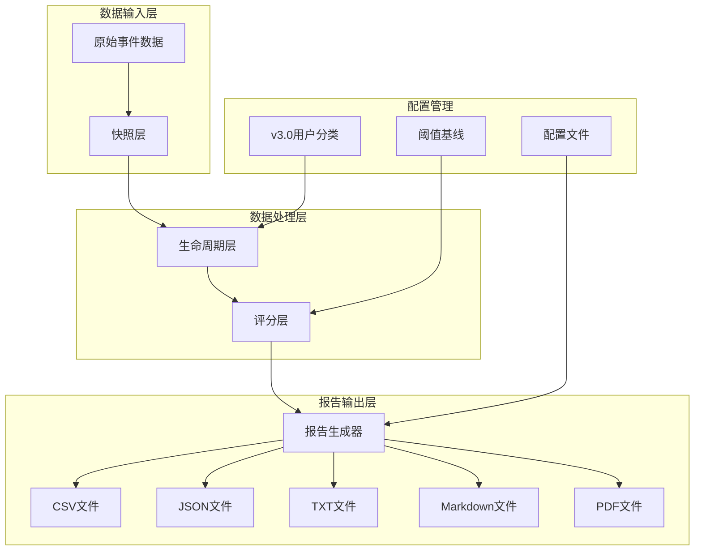
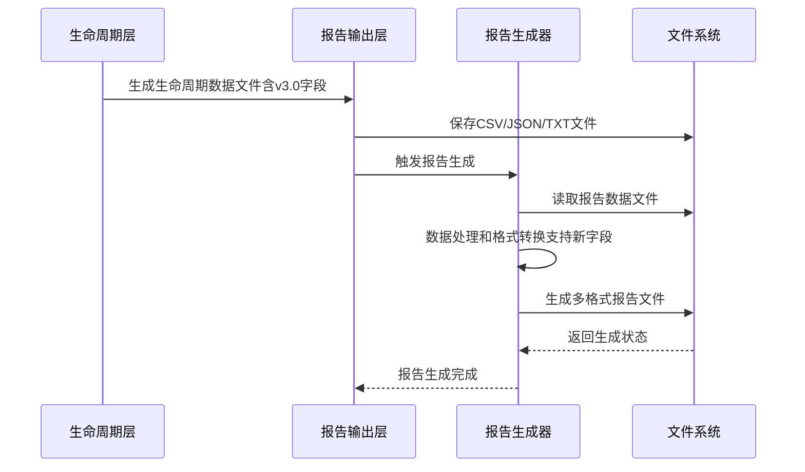
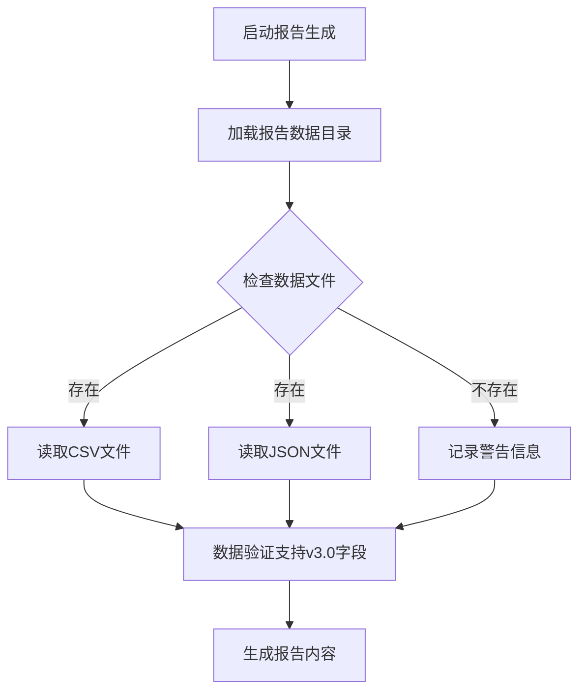
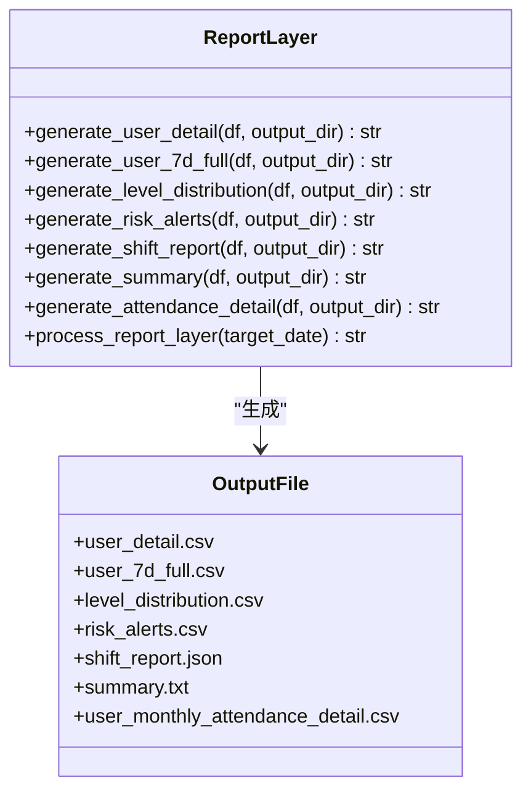
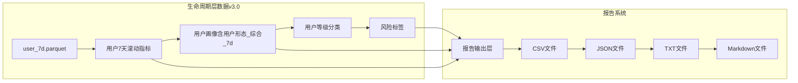
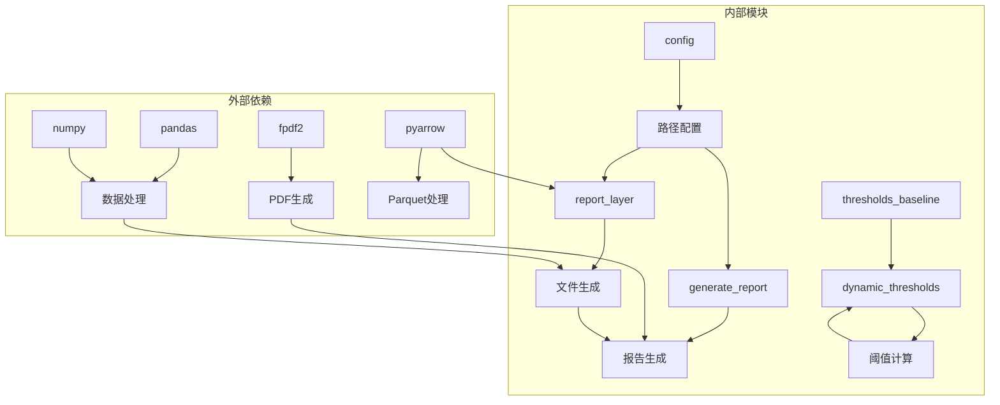

# 报告系统

<cite>
**本文档引用的文件**
- [generate_report.py](file://src/report/generate_report.py)
- [report_layer.py](file://src/pipeline/report_layer.py)
- [lifecycle_layer.py](file://src/pipeline/lifecycle_layer.py)
- [run_pipeline.py](file://src/pipeline/run_pipeline.py)
- [config.py](file://config/config.py)
- [用户运营分析报告.md](file://docs/用户运营分析报告.md)
- [报告逻辑及计算方法.md](file://docs/报告逻辑及计算方法.md)
- [run_full_pipeline_local.py](file://temp/run_full_pipeline_local.py)
- [requirements.txt](file://requirements.txt)
- [thresholds_baseline.json](file://src/tools/thresholds_baseline.json)
- [dynamic_thresholds.py](file://src/pipeline/dynamic_thresholds.py)
- [test_pipeline.py](file://tests/test_pipeline.py)
</cite>

## 更新摘要
**变更内容**
- 更新了用户形态字段结构，新增 `用户形态_综合_7d` 和 `车辆形态_7d` 字段
- 移除了旧的用户形态字段，反映v3.0版本的用户分类系统
- 更新了阈值参数表，支持v3.0版本的动态阈值体系
- 增强了报告模板，支持新的用户形态分析

## 目录
1. [简介](#简介)
2. [项目结构](#项目结构)
3. [核心组件](#核心组件)
4. [架构概览](#架构概览)
5. [详细组件分析](#详细组件分析)
6. [依赖关系分析](#依赖关系分析)
7. [性能考虑](#性能考虑)
8. [故障排除指南](#故障排除指南)
9. [结论](#结论)
10. [附录](#附录)

## 简介

两轮车换电用户特征画像系统的报告生成功能是一个完整的数据分析和可视化解决方案，负责从生命周期层数据到多格式报告输出的转换过程。该系统支持多种报告格式（CSV、JSON、TXT），提供丰富的业务洞察和决策支持。

报告系统基于四层数据流水线架构，从原始事件数据开始，经过快照层、生命周期层，最终生成面向业务的报告文件。系统不仅支持自动化的报告生成，还提供了灵活的模板设计和质量控制机制。

**更新** 系统现已升级至v3.0版本，采用新的用户分类体系，新增了`用户形态_综合_7d`和`车辆形态_7d`字段，提供更精确的用户画像分析。

## 项目结构

报告系统采用模块化设计，主要包含以下核心模块：

**图表来源**
- [config.py:44-54](file://config/config.py#L44-L54)
- [report_layer.py:192-230](file://src/pipeline/report_layer.py#L192-L230)
- [dynamic_thresholds.py:349-456](file://src/pipeline/dynamic_thresholds.py#L349-L456)

**章节来源**
- [config.py:1-54](file://config/config.py#L1-L54)
- [run_pipeline.py:104-133](file://src/pipeline/run_pipeline.py#L104-L133)

## 核心组件

### 报告生成器（Report Generator）

报告生成器是系统的核心组件，负责将生命周期层生成的数据转换为各种格式的报告文件。它支持以下功能：

- **多格式输出**：支持CSV、JSON、TXT、Markdown、PDF等多种格式
- **自动化处理**：自动加载数据源，生成报告，保存到指定目录
- **格式转换**：提供专门的格式转换函数，确保数据的一致性和准确性
- **v3.0用户形态支持**：新增对`用户形态_综合_7d`和`车辆形态_7d`字段的支持

### 报告输出层（Report Layer）

报告输出层负责从生命周期Parquet文件生成各类面向业务的输出文件，不进行任何计算操作：

- **用户明细文件**：生成包含用户基本信息的CSV文件，现包含新的用户形态字段
- **等级分布统计**：生成用户等级、用户形态、策略分布的统计文件
- **风险告警列表**：生成高风险用户的详细信息
- **月度用电预估**：生成用户月度用电量预估明细
- **漂移检测报告**：生成JSON格式的关键指标汇总报告

### 数据格式支持

系统支持以下数据格式：

| 格式 | 文件扩展名 | 特点 | 适用场景 |
|------|------------|------|----------|
| CSV | .csv | 结构化数据，易读易编辑 | 数据分析、导入数据库 |
| JSON | .json | 结构化数据，便于程序处理 | API接口、前端展示 |
| TXT | .txt | 简洁文本格式 | 快速查看、日志记录 |
| Markdown | .md | 富文本格式，支持格式化 | 报告展示、文档生成 |
| PDF | .pdf | 打印友好格式 | 正式报告、汇报材料 |

**章节来源**
- [report_layer.py:26-190](file://src/pipeline/report_layer.py#L26-L190)
- [generate_report.py:47-96](file://src/report/generate_report.py#L47-L96)

## 架构概览

报告系统采用分层架构设计，确保各层职责清晰、耦合度低：

**图表来源**
- [run_pipeline.py:125-129](file://src/pipeline/run_pipeline.py#L125-L129)
- [report_layer.py:192-230](file://src/pipeline/report_layer.py#L192-L230)

系统架构的主要特点：

1. **分层解耦**：每层都有明确的职责边界，降低模块间的耦合度
2. **数据驱动**：通过中间文件传递数据，确保各层独立运行
3. **可扩展性**：支持新报告类型的添加和现有格式的扩展
4. **自动化**：支持批处理和定时任务，减少人工干预
5. **v3.0兼容**：完全支持新的用户分类体系和字段结构

**章节来源**
- [run_pipeline.py:104-220](file://src/pipeline/run_pipeline.py#L104-L220)

## 详细组件分析

### 报告生成器组件

报告生成器实现了完整的报告生成流程，包括数据加载、处理、格式转换和输出。

#### 数据加载机制

**图表来源**
- [generate_report.py:47-96](file://src/report/generate_report.py#L47-L96)

#### 核心处理函数

报告生成器包含多个核心处理函数：

1. **数据加载函数**：`load_data()` - 统一加载所有报告数据源，现支持新的用户形态字段
2. **统计函数**：提供安全的统计计算方法
3. **报告生成函数**：`generate_report()` - 主要的报告生成逻辑，新增v3.0用户形态分析
4. **格式转换函数**：支持多种输出格式的转换

#### 报告模板设计

报告采用Markdown格式，具有以下设计原则：

- **层次结构**：使用多级标题组织内容
- **表格标准化**：统一的表格格式和样式
- **业务导向**：重点关注运营和管理决策相关的指标
- **可读性**：清晰的标签和注释说明
- **v3.0支持**：新增用户形态和车辆形态分析章节

**更新** 报告模板现已包含新的用户形态分析章节，支持`用户形态_综合_7d`和`车辆形态_7d`字段的详细分析。

**章节来源**
- [generate_report.py:132-673](file://src/report/generate_report.py#L132-L673)

### 报告输出层组件

报告输出层负责将生命周期层的数据转换为各种业务报告文件：

#### 文件生成策略

**图表来源**
- [report_layer.py:26-190](file://src/pipeline/report_layer.py#L26-L190)

#### 数据字段映射

报告输出层对数据字段进行了精心设计，确保报告的业务价值：

**更新** 字段映射现已更新至v3.0版本：

| 字段类别 | 关键字段 | 业务含义 |
|----------|----------|----------|
| 用户基本信息 | 用户id、统计日期 | 标识用户和数据时效性 |
| 行为特征 | 近7d总行驶距离、出勤天数 | 用户活跃度和使用频率 |
| 电耗指标 | 近7d百公里电耗、平均骑行电流 | 电池使用效率和健康状况 |
| 风险评估 | 风险标签、策略建议 | 用户风险等级和应对措施 |
| 用户形态 | 用户形态_综合_7d | v3.0版本的综合用户形态分类 |
| 车辆形态 | 车辆形态_7d | v3.0版本的车辆形态分类 |
| 策略建议 | 用户等级、用户形态 | 针对性的运营策略 |

**章节来源**
- [report_layer.py:30-189](file://src/pipeline/report_layer.py#L30-L189)

### 生命周期层集成

报告系统与生命周期层紧密集成，确保报告数据的准确性和时效性：

#### 数据依赖关系

**图表来源**
- [lifecycle_layer.py:186-200](file://src/pipeline/lifecycle_layer.py#L186-L200)
- [report_layer.py:206-214](file://src/pipeline/report_layer.py#L206-L214)

#### 数据质量保证

生命周期层为报告系统提供了高质量的数据基础：

1. **时间窗口处理**：确保7天滚动窗口的准确性
2. **权重计算**：使用时间衰减权重提高指标的时效性
3. **异常值处理**：内置的数据清洗和异常值检测机制
4. **一致性保证**：统一的数据格式和字段定义
5. **v3.0兼容性**：完全支持新的用户分类体系

**章节来源**
- [lifecycle_layer.py:165-184](file://src/pipeline/lifecycle_layer.py#L165-L184)

## 依赖关系分析

报告系统依赖于多个外部库和内部模块：

**图表来源**
- [requirements.txt:1-9](file://requirements.txt#L1-L9)
- [config.py:44-54](file://config/config.py#L44-L54)

### 核心依赖库

| 依赖库 | 版本要求 | 用途 |
|--------|----------|------|
| pandas | >=2.0 | 数据处理和分析 |
| numpy | >=1.24 | 数值计算和数组操作 |
| fpdf2 | >=2.7 | PDF格式报告生成 |
| pyarrow | >=14.0 | Parquet文件处理 |
| geopandas | >=1.0 | 地理空间数据分析 |

### 内部模块依赖

报告系统内部模块之间的依赖关系清晰明确：

1. **配置模块**：为所有模块提供统一的路径配置
2. **报告输出层**：依赖生命周期层的数据，现支持v3.0字段
3. **报告生成器**：依赖报告输出层生成的文件
4. **动态阈值模块**：提供v3.0版本的阈值计算支持
5. **运行管道**：协调各层的执行顺序

**章节来源**
- [requirements.txt:1-9](file://requirements.txt#L1-L9)
- [run_pipeline.py:96-101](file://src/pipeline/run_pipeline.py#L96-L101)

## 性能考虑

报告系统在设计时充分考虑了性能优化：

### 数据处理优化

1. **内存管理**：使用分块读取和流式处理减少内存占用
2. **并行处理**：支持多进程并行处理提高吞吐量
3. **缓存机制**：对重复计算的结果进行缓存
4. **增量处理**：支持增量更新，避免全量重新计算
5. **v3.0优化**：针对新的字段结构进行优化处理

### 输出格式优化

不同格式的输出有不同的性能特点：

- **CSV文件**：读写速度快，适合大数据量处理
- **JSON文件**：结构清晰，便于程序解析
- **PDF文件**：生成较慢但适合打印和分享
- **Markdown文件**：生成快速，适合文档展示

### 扩展性设计

系统支持水平扩展和垂直扩展：

1. **模块化设计**：易于添加新的报告类型
2. **插件机制**：支持第三方报告格式扩展
3. **配置驱动**：通过配置文件控制报告生成行为
4. **API接口**：提供编程接口供其他系统集成
5. **v3.0兼容**：支持未来版本的用户分类系统扩展

## 故障排除指南

### 常见问题及解决方案

#### 数据文件缺失

**问题**：报告生成过程中提示数据文件不存在

**解决方案**：
1. 检查生命周期层是否正确生成数据文件
2. 验证文件路径配置是否正确
3. 确认文件权限设置是否允许读取
4. **新增**：检查v3.0字段是否正确生成（用户形态_综合_7d、车辆形态_7d）

#### 格式转换错误

**问题**：PDF生成失败或格式转换异常

**解决方案**：
1. 检查fPDF2库是否正确安装
2. 验证中文字体文件是否存在
3. 确认字符编码设置是否正确

#### 内存不足

**问题**：处理大型数据集时出现内存不足错误

**解决方案**：
1. 使用分块处理替代全量加载
2. 增加系统内存或使用更高配置的服务器
3. 优化数据过滤条件减少处理量

#### v3.0字段兼容性问题

**问题**：新版本字段在旧报告中无法识别

**解决方案**：
1. 确保使用最新版本的报告生成器
2. 检查阈值基线文件是否更新至v3.0
3. 验证生命周期层是否正确生成新字段

### 调试工具

报告系统提供了多种调试和监控工具：

1. **日志系统**：详细的执行日志和错误信息
2. **进度显示**：实时显示处理进度和状态
3. **性能监控**：监控内存使用和处理时间
4. **数据验证**：检查数据质量和完整性
5. **v3.0验证**：新增对新字段的验证功能

**章节来源**
- [run_pipeline.py:57-78](file://src/pipeline/run_pipeline.py#L57-L78)

## 结论

两轮车换电用户特征画像系统的报告生成功能是一个设计精良、功能完善的自动化解决方案。系统通过清晰的分层架构、灵活的格式支持和强大的数据处理能力，为运营人员和管理层提供了全面的业务洞察。

**更新** 系统现已升级至v3.0版本，采用全新的用户分类体系，提供更精确的用户画像分析。新版本的主要优势包括：

1. **自动化程度高**：从数据准备到报告输出的完整自动化流程
2. **格式多样化**：支持多种输出格式满足不同需求
3. **业务导向**：重点关注运营和管理决策相关的指标
4. **可扩展性强**：模块化设计便于功能扩展和定制
5. **质量保证**：完善的错误处理和数据验证机制
6. **v3.0兼容性**：完全支持新的用户分类体系和字段结构

未来可以进一步改进的方向包括：

1. **实时报告**：支持实时数据流的报告生成
2. **个性化定制**：提供更多样化的报告模板和样式
3. **智能分析**：集成机器学习算法提供预测性分析
4. **云端部署**：支持云原生部署和弹性扩展
5. **v4.0准备**：为未来的用户分类系统升级做好准备

## 附录

### 报告模板样式规范

报告系统采用统一的模板样式，确保报告的专业性和一致性：

#### 标题层级规范

- **一级标题**：居中显示，字号较大，用于报告名称
- **二级标题**：加粗显示，用于主要章节标题
- **三级标题**：加粗显示，用于子章节标题
- **四级标题**：正常显示，用于细分子主题

#### 表格格式规范

- **表头**：加粗显示，居中对齐
- **数据单元格**：左对齐或数字右对齐
- **边框**：使用实线边框，保持简洁
- **颜色**：使用黑白配色，确保打印兼容性

#### 颜色和字体

- **字体**：使用系统默认字体，确保跨平台兼容
- **颜色**：主要使用黑色，重要信息使用蓝色强调
- **字号**：正文使用12号字，标题使用14-18号字

### 报告质量控制

系统实施了多层次的质量控制机制：

1. **数据完整性检查**：验证关键字段的存在和有效性
2. **业务逻辑验证**：检查计算结果的合理性
3. **格式一致性检查**：确保输出格式符合规范
4. **性能监控**：监控处理时间和资源使用情况
5. **v3.0验证**：新增对新字段的验证和兼容性检查

### 扩展指南

添加新的报告类型和格式的方法：

1. **创建新的输出函数**：在报告输出层添加新的文件生成函数
2. **更新报告生成器**：在报告生成器中添加相应的处理逻辑
3. **配置文件更新**：在配置文件中添加新的路径和参数
4. **测试验证**：编写测试用例验证新功能的正确性
5. **v3.0适配**：确保新功能支持v3.0版本的字段结构

**章节来源**
- [用户运营分析报告.md:1-278](file://docs/用户运营分析报告.md#L1-L278)
- [报告逻辑及计算方法.md:557-571](file://docs/报告逻辑及计算方法.md#L557-L571)