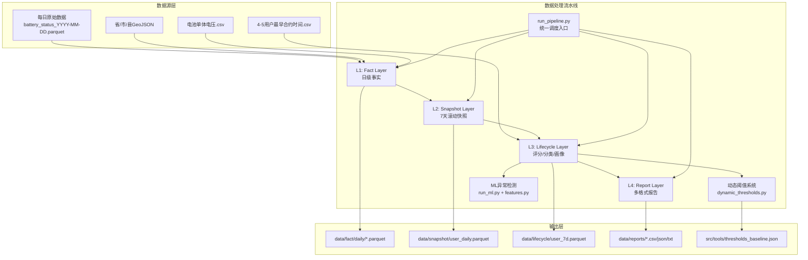
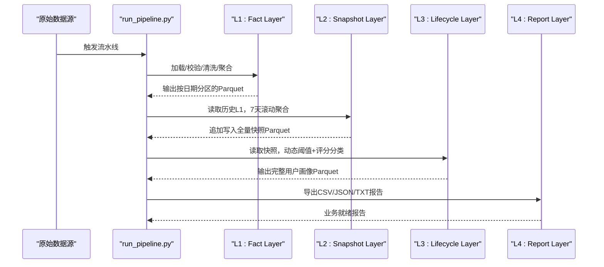
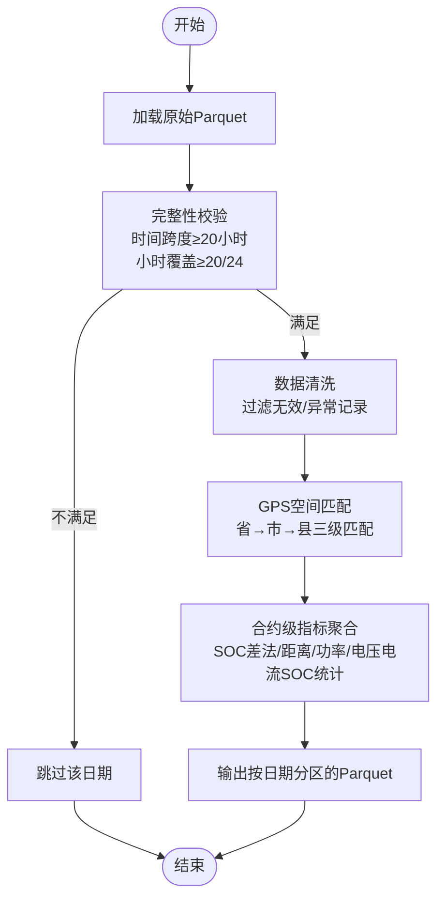
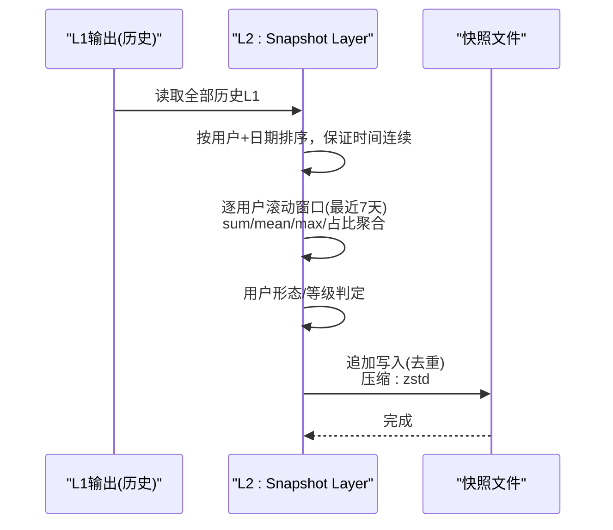
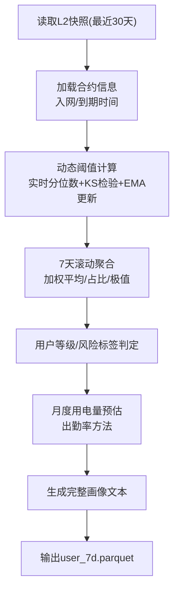
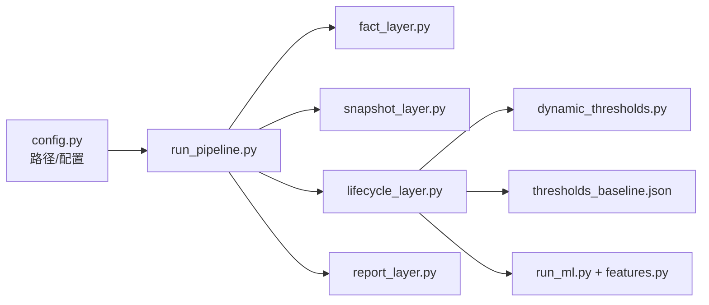

# 数据模型和格式

<cite>
**本文引用的文件**
- [README.md](file://README.md)
- [config.py](file://config/config.py)
- [run_pipeline.py](file://src/pipeline/run_pipeline.py)
- [fact_layer.py](file://src/pipeline/fact_layer.py)
- [snapshot_layer.py](file://src/pipeline/snapshot_layer.py)
- [lifecycle_layer.py](file://src/pipeline/lifecycle_layer.py)
- [dynamic_thresholds.py](file://src/pipeline/dynamic_thresholds.py)
- [features.py](file://src/ml/features.py)
- [run_ml.py](file://src/ml/run_ml.py)
- [thresholds_baseline.json](file://src/tools/thresholds_baseline.json)
- [user_7d.parquet](file://temp/pipeline_output/lifecycle/user_7d.parquet)
- [用户运营分析报告.md](file://docs/用户运营分析报告.md)
</cite>

## 目录
1. [简介](#简介)
2. [项目结构](#项目结构)
3. [核心组件](#核心组件)
4. [架构总览](#架构总览)
5. [详细组件分析](#详细组件分析)
6. [依赖关系分析](#依赖关系分析)
7. [性能考量](#性能考量)
8. [故障排查指南](#故障排查指南)
9. [结论](#结论)
10. [附录](#附录)

## 简介
本文件面向两轮车换电用户特征画像系统，聚焦“数据模型与格式”。围绕Parquet列式存储的选型与优势、字段定义与映射、数据完整性校验、生命周期管理、质量监控与异常检测等主题，提供系统化说明，帮助开发者与业务人员准确理解数据结构与处理流程。

## 项目结构
系统采用分层流水线架构，自下而上包含四层：L1客观事实层、L2用户日级快照层、L3生命周期层、L4报告输出层；并配套动态阈值系统与ML异常检测模块。

图表来源
- [README.md:83-134](file://README.md#L83-L134)
- [run_pipeline.py:307-381](file://src/pipeline/run_pipeline.py#L307-L381)
- [config.py:22-54](file://config/config.py#L22-L54)

章节来源
- [README.md:79-134](file://README.md#L79-L134)
- [config.py:1-54](file://config/config.py#L1-L54)

## 核心组件
- L1客观事实层：将每日原始Parquet数据清洗、完整性校验、GPS空间匹配与合约级指标聚合，输出按日期分区的Parquet文件。
- L2用户日级快照层：读取历史L1输出，按用户滚动聚合7天指标，追加写入全量快照文件。
- L3生命周期层：整合合约信息、动态阈值、7天滚动指标，生成用户画像、风险标签、策略建议与月度用电预估。
- L4报告输出层：将生命周期层结果导出为CSV/JSON/TXT等业务友好的报告格式。
- 动态阈值系统：基于实时分位数与历史基准线对比，EMA平滑更新阈值，支撑L3用户等级与风险标签。
- ML异常检测：基于生命周期层特征，使用无监督与监督方法识别异常用户，形成闭环。

章节来源
- [README.md:160-700](file://README.md#L160-L700)
- [run_pipeline.py:104-303](file://src/pipeline/run_pipeline.py#L104-L303)
- [dynamic_thresholds.py:251-277](file://src/pipeline/dynamic_thresholds.py#L251-L277)

## 架构总览
系统以Parquet为核心载体贯穿全链路，配合PyArrow Schema与压缩策略，实现高性能、可扩展的数据处理与存储。

图表来源
- [run_pipeline.py:104-166](file://src/pipeline/run_pipeline.py#L104-L166)
- [fact_layer.py:1-200](file://src/pipeline/fact_layer.py#L1-L200)
- [snapshot_layer.py:157-218](file://src/pipeline/snapshot_layer.py#L157-L218)
- [lifecycle_layer.py:1-200](file://src/pipeline/lifecycle_layer.py#L1-L200)

## 详细组件分析

### L1 客观事实层（日级事实）
- 输入：每日一个Parquet文件，命名规则battery_status_YYYY-MM-DD.parquet。
- 关键流程：完整性校验（时间跨度、小时覆盖）、数据清洗（无效采样、缺失字段、速度/电流异常过滤）、GPS空间匹配（省/市/县三级匹配）、合约级指标聚合（SOC差法计算用电量、骑行距离、功率、电压/电流/SOC统计、活动半径等）。
- 输出：按日期分区的Parquet文件，每个日期一个文件，字段覆盖原始字段与合约级指标。

图表来源
- [fact_layer.py:135-200](file://src/pipeline/fact_layer.py#L135-L200)
- [README.md:213-223](file://README.md#L213-L223)

章节来源
- [README.md:160-211](file://README.md#L160-L211)
- [fact_layer.py:135-200](file://src/pipeline/fact_layer.py#L135-L200)

### L2 用户日级快照层（7天滚动快照）
- 输入：L1历史输出（按日期分区的多个Parquet文件）。
- 关键流程：按用户+日期排序，逐用户取最近7天数据进行滚动聚合（sum/mean/max/占比），并进行用户形态与等级判定。
- 输出：全量用户日级快照文件（追加写入，按用户id+统计日期去重），字段包含7天滚动指标与用户形态/等级等。

图表来源
- [snapshot_layer.py:157-218](file://src/pipeline/snapshot_layer.py#L157-L218)
- [README.md:390-434](file://README.md#L390-L434)

章节来源
- [README.md:389-434](file://README.md#L389-L434)
- [snapshot_layer.py:157-218](file://src/pipeline/snapshot_layer.py#L157-L218)

### L3 生命周期层（评分/分类/画像）
- 输入：L2用户日级快照（最近30天窗口）、合约信息CSV、动态阈值基准文件。
- 关键流程：加载合约信息（入网/到期时间），动态阈值计算（实时分位数+KS检验+EMA更新），7天滚动指标加权聚合，用户等级与风险标签生成，月度用电量预估（基于出勤率），生成完整用户画像文本。
- 输出：用户7天画像Parquet（120+字段），包含等级、风险标签、策略建议、画像文本等。

图表来源
- [lifecycle_layer.py:58-115](file://src/pipeline/lifecycle_layer.py#L58-L115)
- [dynamic_thresholds.py:251-277](file://src/pipeline/dynamic_thresholds.py#L251-L277)
- [README.md:501-685](file://README.md#L501-L685)

章节来源
- [README.md:501-685](file://README.md#L501-L685)
- [lifecycle_layer.py:58-115](file://src/pipeline/lifecycle_layer.py#L58-L115)
- [dynamic_thresholds.py:251-277](file://src/pipeline/dynamic_thresholds.py#L251-L277)

### L4 报告输出层（多格式报告）
- 输入：L3用户7天画像Parquet。
- 输出：CSV/JSON/TXT等业务友好的报告文件，包含完整画像、月度出勤预估明细、统计摘要等。

章节来源
- [README.md:702-722](file://README.md#L702-L722)
- [用户运营分析报告.md:1-200](file://docs/用户运营分析报告.md#L1-L200)

### 动态阈值系统
- 目标：解决静态阈值无法适应业务变化的问题，通过实时分位数与历史基准线对比，EMA平滑更新阈值。
- 关键流程：计算实时分位数→加载历史基准→KS检验检测分布漂移→生成自适应阈值→EMA更新基准文件。
- 输出：thresholds_baseline.json，包含分位数、样本量、更新时间等元信息。

章节来源
- [README.md:724-800](file://README.md#L724-L800)
- [dynamic_thresholds.py:251-277](file://src/pipeline/dynamic_thresholds.py#L251-L277)
- [thresholds_baseline.json:1-141](file://src/tools/thresholds_baseline.json#L1-L141)

### ML异常检测与特征工程
- 输入：L3用户7天画像Parquet。
- 关键流程：无监督异常检测（孤立森林+DBSCAN）→生成待标注→人工标注→监督训练（XGBoost）→预测与低置信度样本提示。
- 特征工程：自动列名匹配、缺失值处理、特征组合与衍生特征（如功率电流比、速度波动比等），输出ML-ready特征矩阵。

章节来源
- [run_ml.py:83-250](file://src/ml/run_ml.py#L83-L250)
- [features.py:1-200](file://src/ml/features.py#L1-L200)
- [features.py:296-321](file://src/ml/features.py#L296-L321)

## 依赖关系分析
- 路径与配置：config.py集中管理输入/输出路径、辅助数据路径与基准文件路径。
- 层间依赖：L1→L2→L3→L4逐层依赖；L3依赖动态阈值系统与合约信息；ML模块依赖L3输出。
- 外部依赖：PyArrow/Parquet（列式存储与压缩）、GeoJSON/Shapely（空间匹配）、DBSCAN/孤立森林（异常检测）。

图表来源
- [config.py:1-54](file://config/config.py#L1-L54)
- [run_pipeline.py:96-101](file://src/pipeline/run_pipeline.py#L96-L101)

章节来源
- [config.py:1-54](file://config/config.py#L1-L54)
- [run_pipeline.py:96-101](file://src/pipeline/run_pipeline.py#L96-L101)

## 性能考量
- 列式存储与压缩：Parquet列式布局与Snappy/ZSTD压缩显著降低I/O与存储成本，提升扫描与过滤性能。
- 批量处理与并行：L1批量处理多日期数据，L2滚动聚合按用户分组并行化，L3动态阈值与权重聚合减少重复计算。
- 增量模式：仅处理新增日期，避免重复计算；快照文件追加写入并去重，减少全量重写。
- Schema兼容：PyArrow自动对齐列与类型，保障跨版本输出的兼容性。

章节来源
- [README.md:145-155](file://README.md#L145-L155)
- [snapshot_layer.py:157-218](file://src/pipeline/snapshot_layer.py#L157-L218)

## 故障排查指南
- 数据完整性校验失败：若某日数据不满足时间跨度或小时覆盖阈值，则自动跳过该日，不参与统计与出勤率计算。可通过参数关闭校验。
- 文件锁与覆盖：输出目录清理时兼容OneDrive文件锁，失败文件将被覆盖写入。
- 日志记录：统一输出到logs目录，包含完整traceback，便于定位异常。
- 动态阈值漂移：若检测到分布漂移，自动触发EMA更新基准文件；可通过日志确认更新标记。

章节来源
- [README.md:213-223](file://README.md#L213-L223)
- [run_pipeline.py:222-259](file://src/pipeline/run_pipeline.py#L222-L259)
- [run_pipeline.py:364-377](file://src/pipeline/run_pipeline.py#L364-L377)

## 结论
本系统以Parquet为核心数据格式，结合分层流水线与动态阈值、ML异常检测，实现了从原始数据到用户画像与业务报告的全链路自动化。通过严格的完整性校验、Schema兼容与增量处理，确保数据质量与处理效率；通过动态阈值与特征工程，持续适配业务变化并提升识别能力。

## 附录

### 数据格式与字段定义

- 原始字段（L1输入）
  - 统计日期、统计时间、时间戳、用户id、代理id、合约id、电池id、电压(mV)、电流(A)、容量、电池SOC(%)、温度(°C)、是否在线、纬度、经度、速度(km/h)
  - 参考来源：[README.md:172-191](file://README.md#L172-L191)

- 中间处理字段（L1合约级指标）
  - 日总用电量(kWh)、平均功率(kW)、最大功率(kW)、用电时长(h)、骑行距离(km)、百公里耗电(kWh)、平均速度(km/h)、最大速度(km/h)、平均电压(V)、最小电压(V)、平均电流(A)、最大电流(A)、平均SOC(%)、最小SOC(%)、SOC低于10%/20%时长占比、中心经度/纬度、核心活动省市县、活动半径(km)
  - 参考来源：[README.md:348-377](file://README.md#L348-L377)

- 中间处理字段（L2快照）
  - 7天滚动指标（sum/mean/max/占比）、用户形态、用户等级、等级说明、形态说明
  - 参考来源：[README.md:436-498](file://README.md#L436-L498)

- 最终输出字段（L3生命周期）
  - 用户等级、风险标签、策略建议、月度预估、画像文本、车辆形态/用户形态综合、功率特征、行为规律特征等（字段数量≥120）
  - 参考来源：[README.md:686-699](file://README.md#L686-L699)

- 报告字段（L4）
  - 完整用户画像CSV、月度出勤预估明细CSV、用户画像TXT、生命周期摘要JSON
  - 参考来源：[README.md:708-722](file://README.md#L708-L722)

### 数据完整性校验机制
- 校验条件：时间跨度≥20小时、小时覆盖≥20/24；不满足则跳过该日，不计入出勤率与统计。
- 可配置：通过命令行参数关闭完整性检查。
- 参考来源：[README.md:213-223](file://README.md#L213-L223)

### 数据生命周期管理
- 产生：每日原始Parquet文件（battery_status_YYYY-MM-DD.parquet）。
- 处理：L1→L2→L3→L4逐层加工；L2快照文件全量保留，L3输出按用户覆盖。
- 存储：按层分区存储，Parquet列式+压缩；阈值基准文件定期EMA更新。
- 归档：历史L1按日期分区归档，L2/L3/L4作为业务基表长期保存。
- 参考来源：[README.md:127-133](file://README.md#L127-L133)

### 数据质量监控与异常检测
- 质量监控：完整性校验、Schema对齐、类型修复、日志记录与traceback。
- 异常检测：动态阈值漂移检测（KS检验）+EMA更新；ML异常检测（无监督→人工标注→监督训练→预测）。
- 参考来源：[dynamic_thresholds.py:251-277](file://src/pipeline/dynamic_thresholds.py#L251-L277), [run_ml.py:83-250](file://src/ml/run_ml.py#L83-L250)