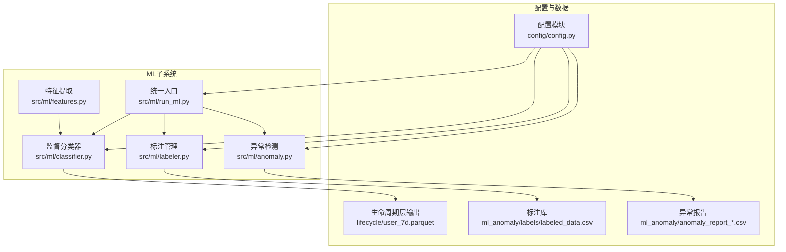
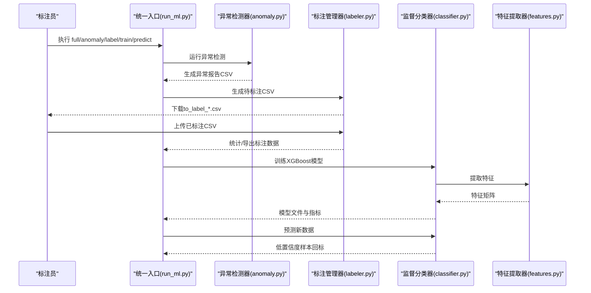
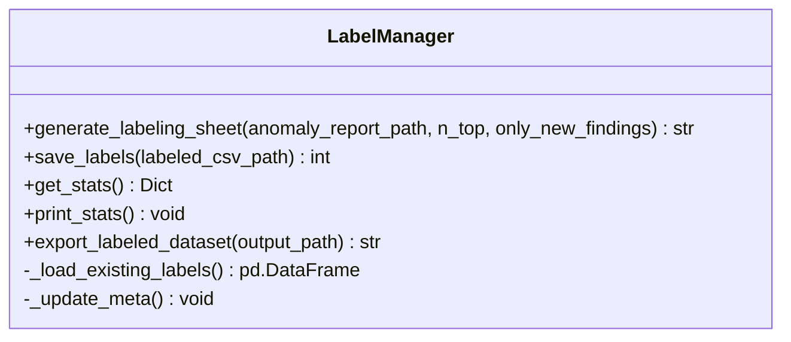
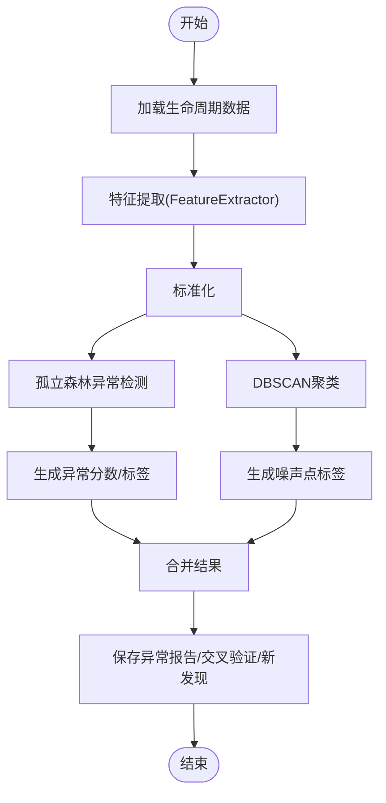
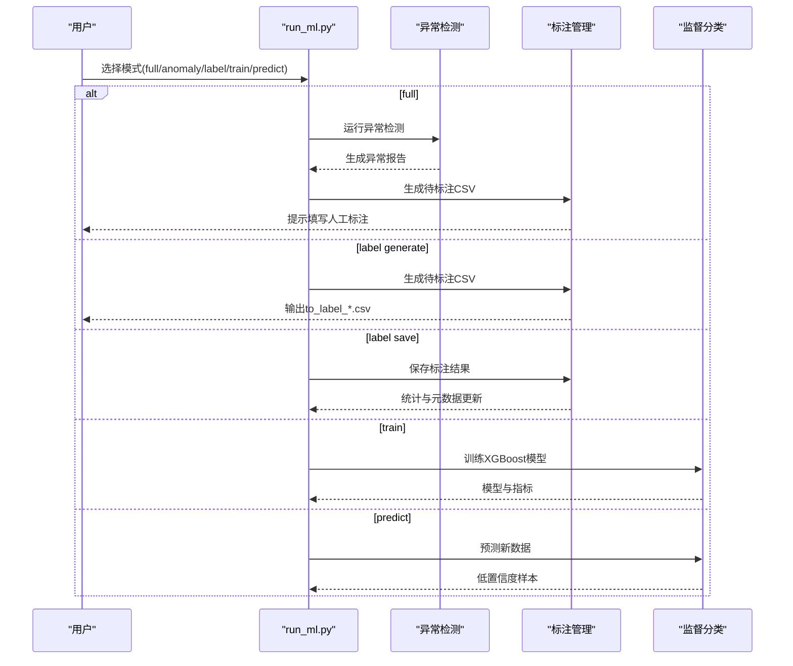
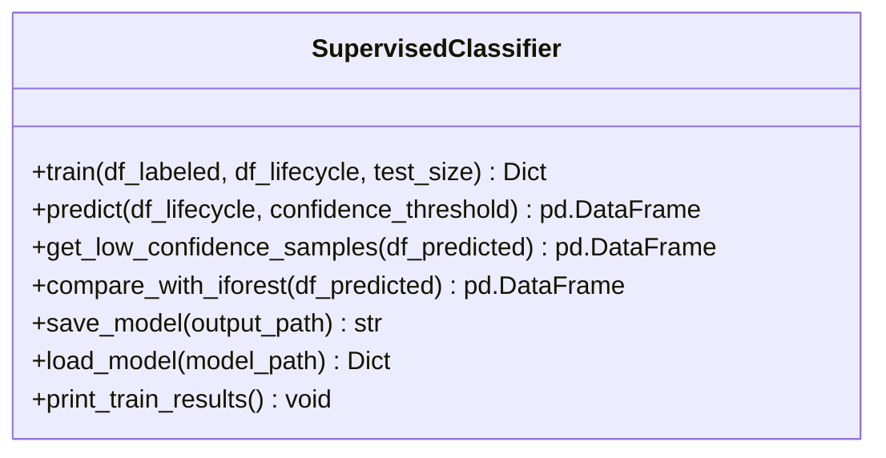
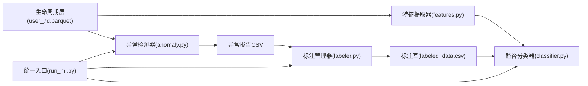

# 人工标注管理系统

<cite>
**本文引用的文件**
- [README.md](file://README.md)
- [ML模型说明.md](file://ML模型说明.md)
- [src/ml/labeler.py](file://src/ml/labeler.py)
- [src/ml/run_ml.py](file://src/ml/run_ml.py)
- [src/ml/anomaly.py](file://src/ml/anomaly.py)
- [src/ml/classifier.py](file://src/ml/classifier.py)
- [src/ml/features.py](file://src/ml/features.py)
- [config/config.py](file://config/config.py)
</cite>

## 目录
1. [简介](#简介)
2. [项目结构](#项目结构)
3. [核心组件](#核心组件)
4. [架构总览](#架构总览)
5. [详细组件分析](#详细组件分析)
6. [依赖关系分析](#依赖关系分析)
7. [性能考量](#性能考量)
8. [故障排查指南](#故障排查指南)
9. [结论](#结论)
10. [附录](#附录)

## 简介
本指南面向两轮车换电用户特征画像系统的“人工标注管理系统”，围绕标注管理工具的完整工作流程进行说明，包括：
- 待标注文件生成：从异常检测报告中筛选需人工审核的用户
- 人工标注收集：在待标注CSV中填写“人工标注”列
- 标注结果保存：追加到标注库，避免覆盖历史
- 标注统计分析：查看标注进度、类别分布与质量评估指标
- 标注标准与分类体系：明确各类异常类型的定义与判断标准
- 质量控制策略：一致性检查、重复标注处理、标注员培训要点
- 统计分析功能：异常类型分布、标注完成度与质量评估
- 最佳实践与常见问题解决方案

## 项目结构
标注管理模块位于ML子系统中，与异常检测、特征提取、监督分类紧密协作，形成“异常发现—人工标注—模型训练—预测应用”的闭环。

**图表来源**
- [src/ml/run_ml.py:106-133](file://src/ml/run_ml.py#L106-L133)
- [src/ml/anomaly.py:95-158](file://src/ml/anomaly.py#L95-L158)
- [src/ml/labeler.py:103-176](file://src/ml/labeler.py#L103-L176)
- [src/ml/classifier.py:109-225](file://src/ml/classifier.py#L109-L225)
- [src/ml/features.py:182-250](file://src/ml/features.py#L182-L250)
- [config/config.py:44-51](file://config/config.py#L44-L51)

**章节来源**
- [README.md:1-120](file://README.md#L1-L120)
- [ML模型说明.md:1-60](file://ML模型说明.md#L1-L60)
- [src/ml/run_ml.py:106-133](file://src/ml/run_ml.py#L106-L133)

## 核心组件
- 标注管理器（LabelManager）：负责生成待标注CSV、保存标注结果、统计标注数据、导出标注数据集
- 异常检测器（AnomalyDetector）：基于孤立森林与DBSCAN双模型生成异常报告，供标注管理器筛选待标注用户
- 统一入口（run_ml.py）：提供命令行模式，串联异常检测、生成待标注、保存标注、统计、训练与预测
- 监督分类器（SupervisedClassifier）：基于人工标注训练XGBoost模型，输出预测类别、置信度与低置信度样本
- 特征提取器（FeatureExtractor）：从生命周期层宽表提取特征，供监督分类器使用

**章节来源**
- [src/ml/labeler.py:87-304](file://src/ml/labeler.py#L87-L304)
- [src/ml/anomaly.py:60-158](file://src/ml/anomaly.py#L60-L158)
- [src/ml/run_ml.py:83-250](file://src/ml/run_ml.py#L83-L250)
- [src/ml/classifier.py:76-225](file://src/ml/classifier.py#L76-L225)
- [src/ml/features.py:165-250](file://src/ml/features.py#L165-L250)

## 架构总览
标注管理模块在系统中的位置与交互如下：

**图表来源**
- [src/ml/run_ml.py:252-275](file://src/ml/run_ml.py#L252-L275)
- [src/ml/anomaly.py:342-380](file://src/ml/anomaly.py#L342-L380)
- [src/ml/labeler.py:103-176](file://src/ml/labeler.py#L103-L176)
- [src/ml/classifier.py:109-225](file://src/ml/classifier.py#L109-L225)
- [src/ml/features.py:182-250](file://src/ml/features.py#L182-L250)

## 详细组件分析

### 标注管理器（LabelManager）
职责与能力：
- 生成待标注CSV：从异常检测报告中筛选模型判异常但规则判正常的用户，去重历史标注，按异常分数排序，输出带解释字段的待标注表
- 保存标注结果：校验“人工标注”列的有效性，自动补全标注时间，合并历史标注，避免重复
- 统计分析：统计总数、各类别分布、标注时间范围、确认异常/正常/不确定数量与准确率（排除不确定）
- 导出标注数据集：输出可用于监督学习训练的标注数据集

关键字段与类别：
- 标注类别：正常、改装/超速、地摊/储能、电池老化、暴力驾驶、其他异常、不确定
- 优先级顺序：便于统计展示与质量评估
- 解释字段：包含速度、电流、SOC、换电、温度、活动范围、行为规律、功率等20余项指标，辅助标注员判断

**图表来源**
- [src/ml/labeler.py:87-304](file://src/ml/labeler.py#L87-L304)

**章节来源**
- [src/ml/labeler.py:103-176](file://src/ml/labeler.py#L103-L176)
- [src/ml/labeler.py:178-240](file://src/ml/labeler.py#L178-L240)
- [src/ml/labeler.py:242-291](file://src/ml/labeler.py#L242-L291)
- [src/ml/labeler.py:293-304](file://src/ml/labeler.py#L293-L304)

### 异常检测器（AnomalyDetector）
职责与能力：
- 双模型异常检测：孤立森林输出异常分数与标签；DBSCAN输出聚类标签与噪声点
- 交叉验证：对比孤立森林与DBSCAN的一致性，识别“双模型一致异常”“仅孤立森林异常”“仅DBSCAN噪声点”“双模型一致正常”
- 新发现用户：筛选“模型判异常但规则判正常”的用户，作为标注重点
- 报告输出：保存异常报告、交叉验证报告、新发现报告

**图表来源**
- [src/ml/anomaly.py:95-158](file://src/ml/anomaly.py#L95-L158)
- [src/ml/anomaly.py:305-339](file://src/ml/anomaly.py#L305-L339)

**章节来源**
- [src/ml/anomaly.py:95-158](file://src/ml/anomaly.py#L95-L158)
- [src/ml/anomaly.py:160-188](file://src/ml/anomaly.py#L160-L188)
- [src/ml/anomaly.py:190-226](file://src/ml/anomaly.py#L190-L226)
- [src/ml/anomaly.py:305-339](file://src/ml/anomaly.py#L305-L339)

### 统一入口（run_ml.py）
职责与能力：
- 模式化执行：提供 full、anomaly、label generate/save/stats、train、predict 等模式
- 自动路径解析：自动查找最新异常报告、标注文件、模型文件，减少手工指定路径
- 步骤串联：一键全流程（异常检测+生成待标注），并提示后续命令

**图表来源**
- [src/ml/run_ml.py:252-275](file://src/ml/run_ml.py#L252-L275)
- [src/ml/run_ml.py:106-133](file://src/ml/run_ml.py#L106-L133)
- [src/ml/run_ml.py:136-152](file://src/ml/run_ml.py#L136-L152)
- [src/ml/run_ml.py:165-205](file://src/ml/run_ml.py#L165-L205)
- [src/ml/run_ml.py:208-249](file://src/ml/run_ml.py#L208-L249)

**章节来源**
- [src/ml/run_ml.py:106-133](file://src/ml/run_ml.py#L106-L133)
- [src/ml/run_ml.py:136-152](file://src/ml/run_ml.py#L136-L152)
- [src/ml/run_ml.py:165-205](file://src/ml/run_ml.py#L165-L205)
- [src/ml/run_ml.py:208-249](file://src/ml/run_ml.py#L208-L249)
- [src/ml/run_ml.py:252-275](file://src/ml/run_ml.py#L252-L275)

### 监督分类器（SupervisedClassifier）
职责与能力：
- 训练：基于标注数据与生命周期特征训练XGBoost多分类器，输出准确率、交叉验证、特征重要性
- 预测：对新数据进行预测，输出类别、置信度、低置信度样本
- 对比：与孤立森林结果对比，评估双模型一致性
- 持久化：保存模型、元数据与标签编码器

**图表来源**
- [src/ml/classifier.py:76-381](file://src/ml/classifier.py#L76-L381)

**章节来源**
- [src/ml/classifier.py:109-225](file://src/ml/classifier.py#L109-L225)
- [src/ml/classifier.py:227-303](file://src/ml/classifier.py#L227-L303)
- [src/ml/classifier.py:304-341](file://src/ml/classifier.py#L304-L341)
- [src/ml/classifier.py:343-421](file://src/ml/classifier.py#L343-L421)

### 特征提取器（FeatureExtractor）
职责与能力：
- 自动列名匹配：兼容不同版本生命周期输出字段名
- 缺失值处理：中位数填充并记录缺失统计
- 特征工程：构造比值类衍生特征，如速度波动比、怠速放电占比、功率电流比等
- 标准化输出：统一返回特征矩阵、特征名列表与元数据

**章节来源**
- [src/ml/features.py:182-250](file://src/ml/features.py#L182-L250)
- [src/ml/features.py:252-286](file://src/ml/features.py#L252-L286)
- [src/ml/features.py:296-308](file://src/ml/features.py#L296-L308)

## 依赖关系分析
- LabelManager依赖异常检测报告与生命周期层数据，输出标注库与统计元数据
- AnomalyDetector依赖生命周期层数据与特征提取器，输出异常报告与交叉验证
- SupervisedClassifier依赖标注库与生命周期层数据，输出模型与预测结果
- run_ml.py作为统一入口，协调上述组件并自动解析最新文件路径

**图表来源**
- [src/ml/features.py:182-250](file://src/ml/features.py#L182-L250)
- [src/ml/classifier.py:109-225](file://src/ml/classifier.py#L109-L225)
- [src/ml/anomaly.py:95-158](file://src/ml/anomaly.py#L95-L158)
- [src/ml/labeler.py:103-176](file://src/ml/labeler.py#L103-L176)
- [src/ml/run_ml.py:83-250](file://src/ml/run_ml.py#L83-L250)

**章节来源**
- [src/ml/run_ml.py:45-81](file://src/ml/run_ml.py#L45-L81)
- [src/ml/run_ml.py:106-133](file://src/ml/run_ml.py#L106-L133)
- [src/ml/run_ml.py:165-205](file://src/ml/run_ml.py#L165-L205)
- [src/ml/run_ml.py:208-249](file://src/ml/run_ml.py#L208-L249)

## 性能考量
- 批量处理：异常检测与特征提取采用向量化与矩阵运算，适合大规模用户数据
- 自动路径解析：减少IO与路径拼接开销，避免重复加载
- 缺失值处理：中位数填充与缺失统计，保证训练稳定性
- 低置信度回标：将不确定性样本回流标注流程，持续优化模型性能

[本节为通用指导，无需特定文件引用]

## 故障排查指南
- 依赖缺失
  - 现象：导入sklearn或xgboost报错
  - 处理：安装所需依赖
  - 参考
    - [ML模型说明.md:13-15](file://ML模型说明.md#L13-L15)
- 文件路径错误
  - 现象：找不到生命周期层或异常报告
  - 处理：确认已运行pipeline生成user_7d.parquet；使用统一入口自动解析最新文件
  - 参考
    - [src/ml/run_ml.py:83-103](file://src/ml/run_ml.py#L83-L103)
    - [src/ml/run_ml.py:165-181](file://src/ml/run_ml.py#L165-L181)
- 标注数据格式错误
  - 现象：保存标注时报错“缺少人工标注列”或“存在无效标注值”
  - 处理：确保CSV包含“人工标注”列，且值在允许范围内；避免重复标注同一用户
  - 参考
    - [src/ml/labeler.py:178-240](file://src/ml/labeler.py#L178-L240)
- 标注数量不足
  - 现象：训练准确率不稳定或不可信
  - 处理：建议标注≥50条后再训练；尽量保持各类别平衡
  - 参考
    - [ML模型说明.md:249-256](file://ML模型说明.md#L249-L256)
- 模型性能退化
  - 现象：预测准确率持续下降
  - 处理：定期运行异常检测发现新异常用户，补充标注以更新模型
  - 参考
    - [ML模型说明.md:247-256](file://ML模型说明.md#L247-L256)

**章节来源**
- [ML模型说明.md:13-15](file://ML模型说明.md#L13-L15)
- [src/ml/run_ml.py:83-103](file://src/ml/run_ml.py#L83-L103)
- [src/ml/run_ml.py:165-181](file://src/ml/run_ml.py#L165-L181)
- [src/ml/labeler.py:178-240](file://src/ml/labeler.py#L178-L240)
- [ML模型说明.md:247-256](file://ML模型说明.md#L247-L256)

## 结论
人工标注管理系统通过“异常检测—生成待标注—人工标注—保存统计—训练预测—低置信度回标”的闭环，实现了标注数据的持续积累与模型性能的稳步提升。遵循标注标准与质量控制策略，结合统计分析与最佳实践，可有效提高标注效率与模型准确性。

[本节为总结性内容，无需特定文件引用]

## 附录

### 标注标准与分类体系
- 正常：模型误判，用户行为正常
- 改装/超速：速度或电流异常，疑似改装车
- 地摊/储能：怠速放电占比高，行驶距离短
- 电池老化：频繁换电、SOC消耗快、续航短
- 暴力驾驶：频繁超100A、高温、高速
- 其他异常：不属于以上类别但确实异常
- 不确定：信息不足无法判断，先跳过

标注增强建议：
- 可参考“用户形态_综合_7d”（专送/众包/地摊）与“车辆形态_7d”（电动自行车/轻便摩托车/摩托车/改装）辅助判断
- 标注原则：宁可少标也不要标错；拿不准就填“不确定”

**章节来源**
- [ML模型说明.md:80-95](file://ML模型说明.md#L80-L95)
- [src/ml/labeler.py:57-69](file://src/ml/labeler.py#L57-L69)

### 标注质量控制策略
- 一致性检查：统一标注口径，定期复核标注结果
- 重复标注处理：系统自动去重，避免同一用户重复标注
- 标注员培训：明确各类别定义与判断标准，强调“不确定”优先策略
- 类别平衡：尽量每种异常类型≥10条标注，避免模型偏向多数类

**章节来源**
- [src/ml/labeler.py:178-240](file://src/ml/labeler.py#L178-L240)
- [ML模型说明.md:247-256](file://ML模型说明.md#L247-L256)

### 统计分析功能
- 类别分布：统计各类异常数量与占比
- 标注完成度：累计标注数、标注时间范围
- 质量评估：确认异常/正常/不确定数量与准确率（排除不确定）

**章节来源**
- [src/ml/labeler.py:242-338](file://src/ml/labeler.py#L242-L338)

### 最佳实践与常见问题
- 最佳实践
  - 标注≥50条再训练
  - 宁缺毋滥：拿不准填“不确定”
  - 定期运行异常检测
  - 低置信度样本回标
  - 关注模型衰退并补充新标注
  - 保持类别平衡
- 常见问题
  - 依赖缺失：安装scikit-learn、xgboost
  - 文件路径错误：确认生命周期层与异常报告存在
  - 标注数据格式错误：确保包含“人工标注”列且值合法
  - 标注数量不足：补充标注后再训练
  - 模型性能退化：补充标注以更新模型

**章节来源**
- [ML模型说明.md:13-15](file://ML模型说明.md#L13-L15)
- [ML模型说明.md:247-256](file://ML模型说明.md#L247-L256)
- [src/ml/run_ml.py:83-103](file://src/ml/run_ml.py#L83-L103)
- [src/ml/labeler.py:178-240](file://src/ml/labeler.py#L178-L240)