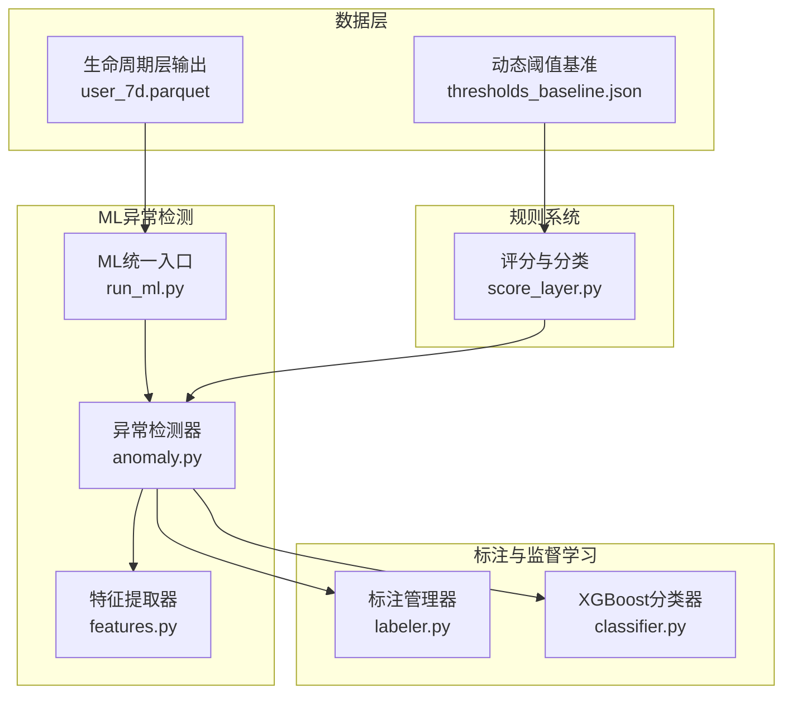
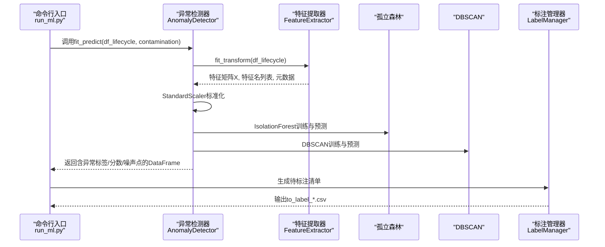
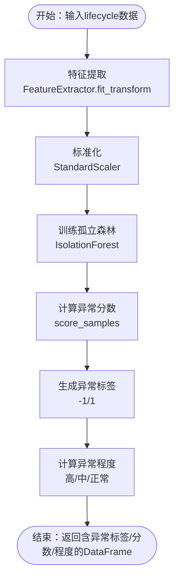
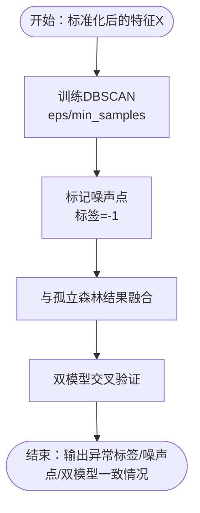
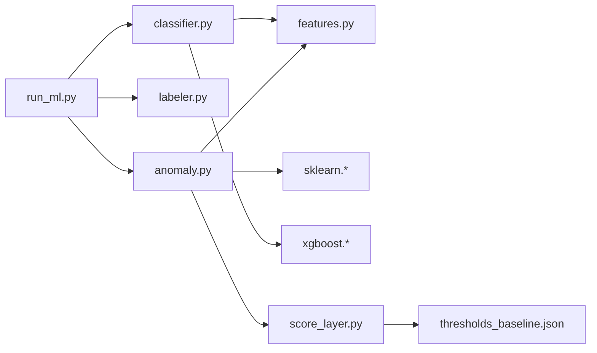

# 异常检测系统

<cite>
**本文引用的文件**
- [src/ml/anomaly.py](file://src/ml/anomaly.py)
- [src/ml/run_ml.py](file://src/ml/run_ml.py)
- [src/ml/features.py](file://src/ml/features.py)
- [src/ml/classifier.py](file://src/ml/classifier.py)
- [src/ml/labeler.py](file://src/ml/labeler.py)
- [config/config.py](file://config/config.py)
- [src/pipeline/score_layer.py](file://src/pipeline/score_layer.py)
- [src/tools/thresholds_baseline.json](file://src/tools/thresholds_baseline.json)
- [各指标参数.md](file://各指标参数.md)
- [ML模型说明.md](file://ML模型说明.md)
- [README.md](file://README.md)
</cite>

## 目录
1. [简介](#简介)
2. [项目结构](#项目结构)
3. [核心组件](#核心组件)
4. [架构总览](#架构总览)
5. [详细组件分析](#详细组件分析)
6. [依赖分析](#依赖分析)
7. [性能考虑](#性能考虑)
8. [故障排查指南](#故障排查指南)
9. [结论](#结论)
10. [附录](#附录)

## 简介
本技术文档面向两轮车换电用户特征画像系统的“异常检测模块”，系统采用“孤立森林 + DBSCAN”双模型无监督异常检测方案，结合规则系统与人工标注，形成“规则初筛 + ML复核 + 人工确认”的闭环。本文将深入解释：
- 孤立森林与DBSCAN的工作原理与实现细节
- 数据预处理、特征选择、模型训练与异常评分计算流程
- 异常比例(contamination)参数的作用机制与调优策略
- 异常检测结果的解读与误报控制
- 在用户行为分析中的典型应用场景
- 代码示例路径与最佳实践建议

## 项目结构
异常检测模块位于ML层，围绕生命周期层(lifecycle)输出进行无监督异常发现，并与监督学习分类器衔接，形成半自动标注与模型迭代闭环。

图表来源
- [src/ml/run_ml.py:83-103](file://src/ml/run_ml.py#L83-L103)
- [src/ml/anomaly.py:95-158](file://src/ml/anomaly.py#L95-L158)
- [src/ml/features.py:182-250](file://src/ml/features.py#L182-L250)
- [src/ml/labeler.py:103-176](file://src/ml/labeler.py#L103-L176)
- [src/ml/classifier.py:109-225](file://src/ml/classifier.py#L109-L225)
- [src/pipeline/score_layer.py:416-468](file://src/pipeline/score_layer.py#L416-L468)
- [src/tools/thresholds_baseline.json:1-141](file://src/tools/thresholds_baseline.json#L1-L141)

章节来源
- [README.md:1-120](file://README.md#L1-L120)
- [config/config.py:44-54](file://config/config.py#L44-L54)

## 核心组件
- 异常检测器(AnomalyDetector)：封装孤立森林与DBSCAN，负责特征标准化、模型拟合、异常评分与报告输出。
- 特征提取器(FeatureExtractor)：从lifecycle层提取120+特征，自动处理缺失值与派生特征，保证模型输入质量。
- 标注管理器(LabelManager)：生成待标注清单、保存标注、统计标注分布，支撑监督学习训练。
- XGBoost分类器(SupervisedClassifier)：基于人工标注训练多分类模型，输出异常类型与置信度。
- ML统一入口(run_ml.py)：提供命令行接口，串联异常检测、标注生成、模型训练与预测。

章节来源
- [src/ml/anomaly.py:60-158](file://src/ml/anomaly.py#L60-L158)
- [src/ml/features.py:165-250](file://src/ml/features.py#L165-L250)
- [src/ml/labeler.py:87-176](file://src/ml/labeler.py#L87-L176)
- [src/ml/classifier.py:76-225](file://src/ml/classifier.py#L76-L225)
- [src/ml/run_ml.py:83-103](file://src/ml/run_ml.py#L83-L103)

## 架构总览
异常检测模块以生命周期层数据为输入，通过特征提取与标准化后，分别运行孤立森林与DBSCAN，得到异常分数与噪声点标签；随后进行双模型交叉验证与新发现用户筛选，并生成异常报告与待标注清单，供人工标注后进入监督学习阶段。

图表来源
- [src/ml/run_ml.py:83-103](file://src/ml/run_ml.py#L83-L103)
- [src/ml/anomaly.py:95-158](file://src/ml/anomaly.py#L95-L158)
- [src/ml/features.py:182-250](file://src/ml/features.py#L182-L250)
- [src/ml/labeler.py:103-176](file://src/ml/labeler.py#L103-L176)

## 详细组件分析

### 孤立森林(Isolation Forest)异常检测
- 工作原理：异常点在特征空间中更容易被“孤立”，通过随机选择特征与分割点快速分离异常样本，输出样本的异常分数（越低越异常），并给出二分类标签（-1异常，1正常）。
- 关键实现要点：
  - 使用StandardScaler对特征进行标准化，确保各维度量纲一致。
  - contamination参数用于估计总体异常比例，决定决策阈值与异常样本数量。
  - score_samples返回每个样本的对数似然估计，作为异常分数。
  - 基于异常分数计算“异常程度”（高/中/正常）。
- 输出字段：
  - ml_异常标签_iforest：-1异常，1正常
  - ml_异常分数_iforest：越低越异常
  - ml_异常程度：高/中/正常

图表来源
- [src/ml/anomaly.py:114-136](file://src/ml/anomaly.py#L114-L136)
- [src/ml/features.py:182-250](file://src/ml/features.py#L182-L250)

章节来源
- [src/ml/anomaly.py:121-136](file://src/ml/anomaly.py#L121-L136)
- [ML模型说明.md:164-171](file://ML模型说明.md#L164-L171)

### DBSCAN密度聚类异常检测
- 工作原理：基于密度的聚类算法，将高密度区域连接为簇，落在低密度区域或边界上的样本被标记为噪声点（异常）。
- 关键实现要点：
  - eps与min_samples为关键超参，eps通常与特征分布尺度相关，min_samples决定核心点的最小邻居数。
  - 将DBSCAN的噪声点(-1)作为异常的另一证据，与孤立森林结果进行交叉验证。
- 输出字段：
  - ml_聚类标签_dbscan：簇标签（噪声点=-1）
  - ml_是否噪声点：1噪声点，0正常点

图表来源
- [src/ml/anomaly.py:138-154](file://src/ml/anomaly.py#L138-L154)

章节来源
- [src/ml/anomaly.py:138-154](file://src/ml/anomaly.py#L138-L154)
- [ML模型说明.md:172-178](file://ML模型说明.md#L172-L178)

### 双模型交叉验证与新发现用户
- 交叉验证统计：统计“双模型一致异常/仅孤立森林异常/仅DBSCAN噪声点/双模型一致正常”的用户数量与占比，评估模型一致性与置信度。
- 新发现用户：筛选“模型判异常但规则判正常”的用户，作为重点人工审核清单，覆盖规则盲区。
- 代码路径参考：
  - 交叉验证：[get_cross_validation:160-188](file://src/ml/anomaly.py#L160-L188)
  - 新发现：[get_new_findings:190-226](file://src/ml/anomaly.py#L190-L226)

章节来源
- [src/ml/anomaly.py:160-226](file://src/ml/anomaly.py#L160-L226)
- [各指标参数.md:1011-1023](file://各指标参数.md#L1011-L1023)

### 数据预处理与特征选择
- 特征提取：
  - 自动列名匹配：兼容不同版本lifecycle输出字段名。
  - 缺失值处理：中位数填充并记录缺失统计。
  - 派生特征：构造比值类特征（如速度波动比、电流波动比、怠速放电占比等），增强异常检测能力。
- 特征组（部分）：
  - 骑行强度、速度特征、电流特征、电耗特征、SOC特征、换电特征、时段分布、温度特征、活动范围、行为规律、功率特征。
- 代码路径参考：
  - 特征提取：[FeatureExtractor.fit_transform:182-250](file://src/ml/features.py#L182-L250)
  - 派生特征：[DERIVED_FEATURES:141-162](file://src/ml/features.py#L141-L162)

章节来源
- [src/ml/features.py:165-250](file://src/ml/features.py#L165-L250)
- [ML模型说明.md:150-162](file://ML模型说明.md#L150-L162)

### 异常比例(contamination)参数
- 作用机制：
  - 孤立森林的contamination参数用于估计总体异常比例，决定异常判定阈值。较小的contamination意味着更严格的异常识别，可能导致更多正常用户被误判为异常。
  - DBSCAN本身不直接使用contamination，但其eps/min_samples与特征尺度相关，间接影响噪声点比例。
- 调优策略：
  - 从默认0.05开始，结合业务目标与规则系统基线，逐步调整（如0.03/0.08）。
  - 通过双模型交叉验证统计与新发现用户数量评估误报与漏报平衡。
  - 与规则系统联动：优先审核“模型判异常但规则判正常”的用户，减少误报。
- 代码路径参考：
  - 参数入口：[run_ml.py:302-305](file://src/ml/run_ml.py#L302-L305)
  - 默认值与实现：[AnomalyDetector.__init__:71-84](file://src/ml/anomaly.py#L71-L84)

章节来源
- [src/ml/run_ml.py:302-305](file://src/ml/run_ml.py#L302-L305)
- [src/ml/anomaly.py:71-84](file://src/ml/anomaly.py#L71-L84)
- [各指标参数.md:948-949](file://各指标参数.md#L948-L949)

### 异常检测流程与解读
- 流程步骤：
  1) 读取生命周期层数据
  2) 特征提取与标准化
  3) 孤立森林异常分数与标签
  4) DBSCAN噪声点标记
  5) 双模型交叉验证与新发现用户筛选
  6) 生成异常报告与待标注清单
- 异常分数阈值设定：
  - 孤立森林异常分数越低越异常，可按分位数设定阈值（如前1%-5%为高风险）。
  - 结合“异常程度”（高/中/正常）进行分层治理。
- 异常类型分类（监督学习阶段）：
  - 改装/超速、地摊/储能、电池老化、暴力驾驶、其他异常、正常、不确定。
  - 由标注管理器生成待标注清单，XGBoost分类器训练后输出预测类别与置信度。
- 误报率控制：
  - 与规则系统联动：仅对“模型判异常但规则判正常”的用户进行人工审核。
  - 交叉验证统计用于评估模型一致性，指导参数与阈值微调。

章节来源
- [src/ml/anomaly.py:342-380](file://src/ml/anomaly.py#L342-L380)
- [src/ml/labeler.py:103-176](file://src/ml/labeler.py#L103-L176)
- [src/ml/classifier.py:109-225](file://src/ml/classifier.py#L109-L225)
- [各指标参数.md:1011-1023](file://各指标参数.md#L1011-L1023)

### 应用场景示例
- 异常充电行为：
  - 急加速/急减速导致的电流尖峰与SOC快速变化
  - 长时间怠速放电（DBSCAN噪声点 + 规则“疑似静态储能”）
- 异常骑行模式：
  - 高峰时段异常骑行、深夜高频骑行、路线异常绕远
  - 速度与功率异常组合（孤立森林高异常分数）
- 电池健康与老化：
  - 频繁换电、SOC消耗快、低电量时长占比高
- 改装/超速风险：
  - 最大电流/峰值功率异常，速度波动比高

章节来源
- [src/pipeline/score_layer.py:146-158](file://src/pipeline/score_layer.py#L146-L158)
- [src/ml/features.py:141-162](file://src/ml/features.py#L141-L162)
- [ML模型说明.md:150-162](file://ML模型说明.md#L150-L162)

### 代码示例与最佳实践
- 命令行运行异常检测：
  - python src/ml/run_ml.py anomaly
  - 调整异常比例：python src/ml/run_ml.py anomaly --contamination 0.03
- 一键全流程（含生成待标注）：
  - python src/ml/run_ml.py full --contamination 0.05 --n-top 100
- 生成待标注清单：
  - python src/ml/labeler.py generate --input ./data/output/ml_anomaly/anomaly_report_xxx.csv --n-top 50
- 保存标注并训练监督模型：
  - python src/ml/labeler.py save --input ./data/output/ml_anomaly/labels/to_label_xxx.csv
  - python src/ml/classifier.py train --labels ./data/output/ml_anomaly/labels/labeled_data.csv --lifecycle ./data/output/lifecycle/user_7d.parquet
- 最佳实践建议：
  - 从默认contamination=0.05起步，结合交叉验证统计与新发现用户数量微调。
  - 优先人工审核“模型判异常但规则判正常”的用户，减少误报。
  - 定期更新动态阈值基准，提升规则与ML的协同效果。
  - 保留PCA降维结果与特征重要性分析，辅助异常解释与模型优化。

章节来源
- [src/ml/run_ml.py:277-395](file://src/ml/run_ml.py#L277-L395)
- [src/ml/labeler.py:340-381](file://src/ml/labeler.py#L340-L381)
- [src/ml/classifier.py:447-517](file://src/ml/classifier.py#L447-L517)
- [各指标参数.md:944-1088](file://各指标参数.md#L944-L1088)

## 依赖分析
- 组件耦合与协作：
  - run_ml.py作为统一入口，协调异常检测、标注与监督学习。
  - anomaly.py依赖features.py进行特征提取，依赖sklearn进行模型训练与预测。
  - labeler.py依赖异常检测报告生成待标注清单，供classifier.py训练使用。
  - score_layer.py提供规则基线与风险标签，与异常检测结果交叉验证。
- 外部依赖：
  - scikit-learn（IsolationForest、DBSCAN、StandardScaler、PCA）
  - xgboost（监督学习分类器）
  - pandas/numpy（数据处理）

图表来源
- [src/ml/run_ml.py:39-42](file://src/ml/run_ml.py#L39-L42)
- [src/ml/anomaly.py:49-57](file://src/ml/anomaly.py#L49-L57)
- [src/ml/classifier.py:51-58](file://src/ml/classifier.py#L51-L58)
- [src/pipeline/score_layer.py:33-45](file://src/pipeline/score_layer.py#L33-L45)

章节来源
- [src/ml/run_ml.py:39-42](file://src/ml/run_ml.py#L39-L42)
- [src/ml/anomaly.py:49-57](file://src/ml/anomaly.py#L49-L57)
- [src/ml/classifier.py:51-58](file://src/ml/classifier.py#L51-L58)
- [src/pipeline/score_layer.py:33-45](file://src/pipeline/score_layer.py#L33-L45)

## 性能考虑
- 特征规模与降维：
  - 使用PCA输出前若干主成分，便于可视化与解释，同时降低维度灾难风险。
- 计算复杂度：
  - 孤立森林训练与预测复杂度与样本数和树数量相关；DBSCAN复杂度与样本数和邻域查询相关。
- 数据规模优化：
  - 对大规模lifecycle数据，建议分批处理或使用采样策略，结合交叉验证评估稳定性。
- I/O与缓存：
  - 异常报告与标注数据持久化，避免重复计算；动态阈值基准文件定期更新。

## 故障排查指南
- 缺少依赖：
  - 若出现scikit-learn或xgboost未安装错误，请按提示安装相应包。
- 输入数据问题：
  - 确认lifecycle层输出路径正确，文件存在且包含用户id列。
  - 特征提取阶段若缺失大量列，检查字段名是否与配置匹配。
- 异常比例过高/过低：
  - contmination设置不当会导致误报或漏报，结合交叉验证统计与新发现用户数量进行调整。
- 标注数据不足：
  - 监督学习阶段标注数量过少会影响模型效果，建议≥50条标注再进行训练。

章节来源
- [src/ml/anomaly.py:78-79](file://src/ml/anomaly.py#L78-L79)
- [src/ml/classifier.py:94-95](file://src/ml/classifier.py#L94-L95)
- [src/ml/run_ml.py:173-177](file://src/ml/run_ml.py#L173-L177)

## 结论
本异常检测模块通过“孤立森林 + DBSCAN”双模型，结合规则系统与人工标注，实现了对用户行为异常的自动发现与分类。通过合理的特征工程、contamination参数调优与交叉验证，系统能够在保证较低误报率的同时，有效识别规则盲区内的异常用户，为后续精细化运营与风险控制提供坚实支撑。

## 附录
- 关键参数与阈值参考：
  - 动态阈值基准：[src/tools/thresholds_baseline.json:1-141](file://src/tools/thresholds_baseline.json#L1-L141)
  - 电流/温度/速度阈值（规则侧）：[src/pipeline/score_layer.py:50-62](file://src/pipeline/score_layer.py#L50-L62)
- 模型技术细节与特征组说明：
  - [ML模型说明.md:148-187](file://ML模型说明.md#L148-L187)
  - [各指标参数.md:922-1088](file://各指标参数.md#L922-L1088)