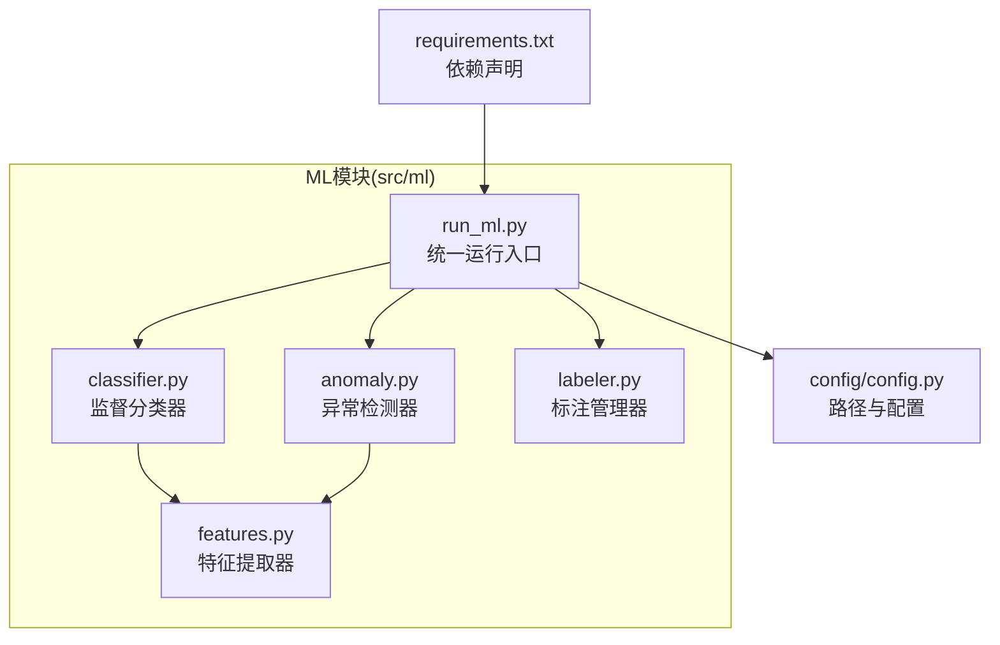
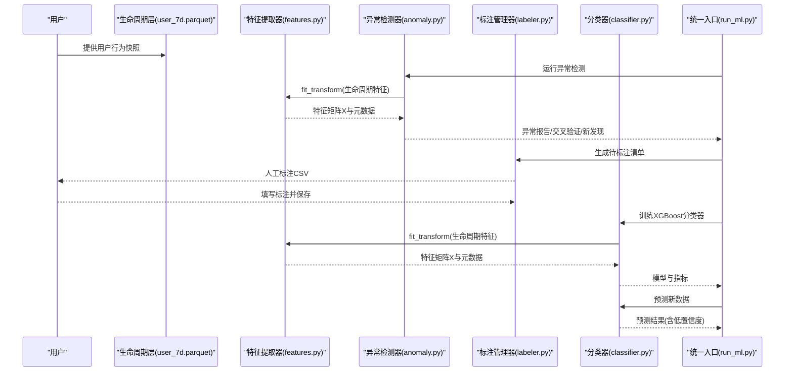
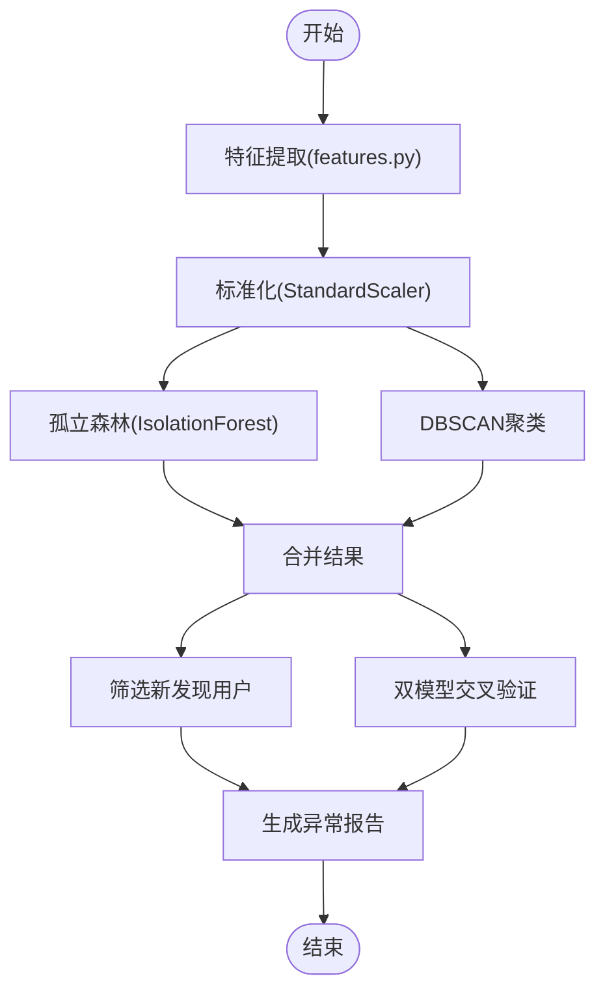
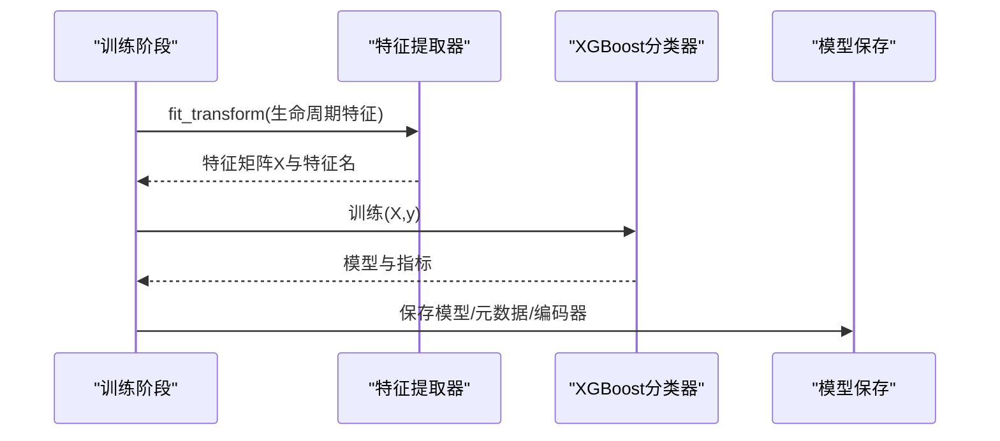
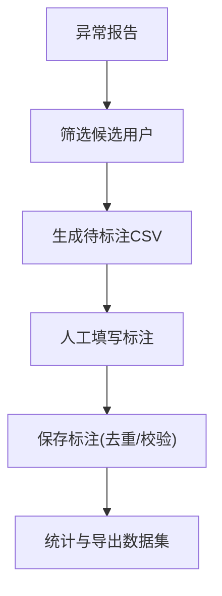
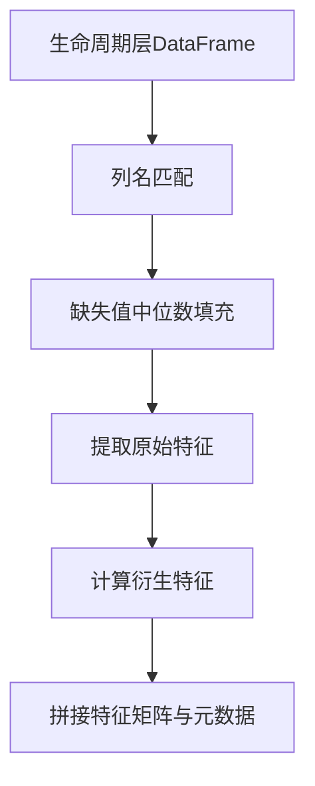
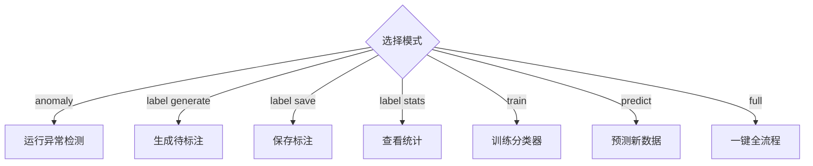
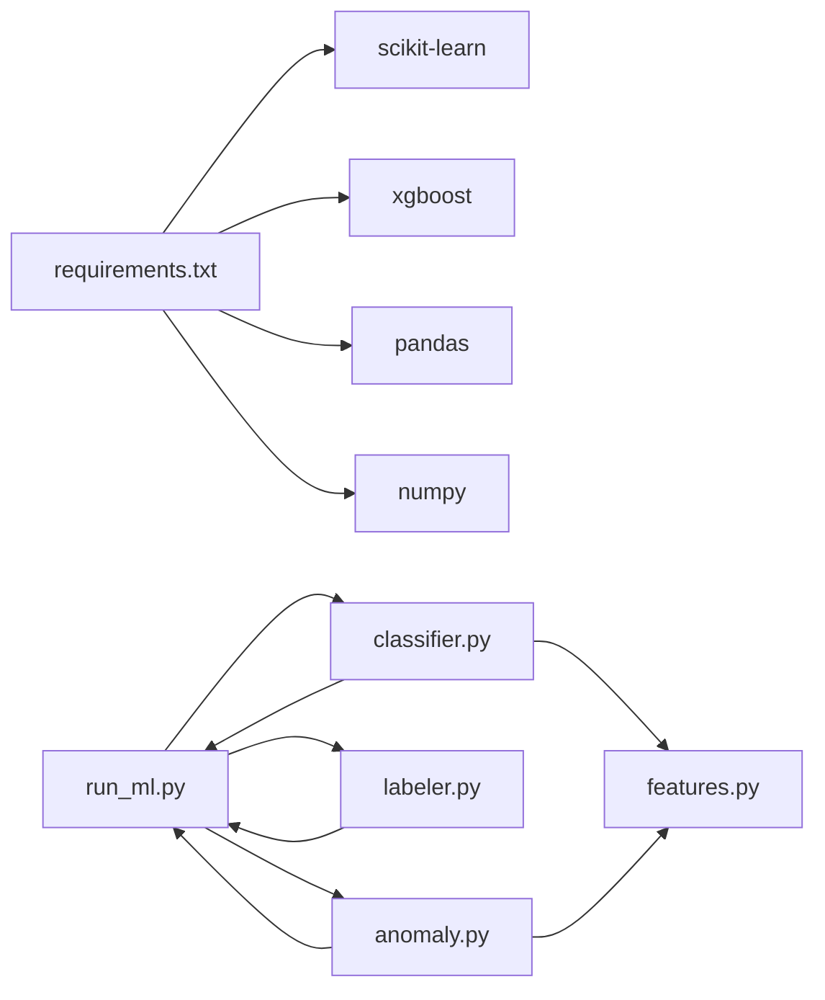

# 机器学习模块

<cite>
**本文引用的文件**
- [src/ml/__init__.py](file://src/ml/__init__.py)
- [src/ml/anomaly.py](file://src/ml/anomaly.py)
- [src/ml/classifier.py](file://src/ml/classifier.py)
- [src/ml/features.py](file://src/ml/features.py)
- [src/ml/labeler.py](file://src/ml/labeler.py)
- [src/ml/run_ml.py](file://src/ml/run_ml.py)
- [config/config.py](file://config/config.py)
- [ML模型说明.md](file://ML模型说明.md)
- [README.md](file://README.md)
- [requirements.txt](file://requirements.txt)
</cite>

## 更新摘要
**变更内容**
- 用户形态分类系统简化：标注类别从6类调整为4类，移除"普通/标准骑手"类别
- 新增地摊/储能和专送骑手的判定逻辑，通过用户形态和车辆形态字段进行识别
- 更新异常检测阈值和参数设置，提高模型准确性
- 优化标注类别体系，增强模型对特定用户群体的识别能力

## 目录
1. [简介](#简介)
2. [项目结构](#项目结构)
3. [核心组件](#核心组件)
4. [架构总览](#架构总览)
5. [详细组件分析](#详细组件分析)
6. [依赖关系分析](#依赖关系分析)
7. [性能考量](#性能考量)
8. [故障排查指南](#故障排查指南)
9. [结论](#结论)
10. [附录](#附录)

## 简介
本文件面向"两轮车换电用户特征画像系统"的机器学习模块，聚焦异常检测与监督分类两大能力，覆盖从特征工程、模型训练、预测推理到闭环迭代的完整链路。重点包括：
- 双模型异常检测：孤立森林与DBSCAN的原理、参数与适用场景
- 监督学习分类器：XGBoost多分类训练流程、特征重要性与可解释性
- 人工标注管理工具：标注生成、保存、统计与导出
- 特征工程模块：特征提取、衍生特征、缺失值处理与标准化输出
- 模型部署与集成：版本管理、性能监控与持续优化策略

**更新** 用户形态分类系统已简化为4类标注类别，移除了普通/标准骑手类别，新增地摊/储能和专送骑手的专门判定逻辑。

## 项目结构
机器学习模块位于 src/ml 目录，围绕"统一运行入口"组织，包含异常检测、标注管理、特征工程、分类器与运行脚本。

**图表来源**
- [src/ml/run_ml.py:1-395](file://src/ml/run_ml.py#L1-L395)
- [src/ml/anomaly.py:1-396](file://src/ml/anomaly.py#L1-L396)
- [src/ml/classifier.py:1-517](file://src/ml/classifier.py#L1-L517)
- [src/ml/features.py:1-321](file://src/ml/features.py#L1-L321)
- [src/ml/labeler.py:1-381](file://src/ml/labeler.py#L1-L381)
- [config/config.py:1-54](file://config/config.py#L1-L54)
- [requirements.txt:1-9](file://requirements.txt#L1-L9)

**章节来源**
- [src/ml/__init__.py:1-1](file://src/ml/__init__.py#L1-L1)
- [src/ml/run_ml.py:1-395](file://src/ml/run_ml.py#L1-L395)
- [config/config.py:1-54](file://config/config.py#L1-L54)
- [requirements.txt:1-9](file://requirements.txt#L1-L9)

## 核心组件
- 异常检测器：基于孤立森林与DBSCAN的双模型异常发现，输出异常分数、标签与双模型一致性，并支持新发现用户筛选与聚类画像。
- 监督分类器：基于XGBoost的多分类器，支持训练、预测、特征重要性、低置信度样本筛选与与异常检测结果对比。
- 特征提取器：从生命周期层宽表抽取数值特征，自动列名匹配、缺失值中位数填充、构造衍生特征，统一输出特征矩阵与元数据。
- 标注管理器：生成待标注清单、保存标注、统计与导出标注数据集，支持优先级与类别约束。
- 统一运行入口：提供 anomaly、label、train、predict、full 等模式，自动查找最新文件，简化操作。

**更新** 分类器现已支持4类标注：正常、改装/超速、地摊/储能、电池老化、暴力驾驶，移除了普通/标准骑手类别。

**章节来源**
- [src/ml/anomaly.py:60-396](file://src/ml/anomaly.py#L60-L396)
- [src/ml/classifier.py:76-517](file://src/ml/classifier.py#L76-L517)
- [src/ml/features.py:165-321](file://src/ml/features.py#L165-L321)
- [src/ml/labeler.py:87-381](file://src/ml/labeler.py#L87-L381)
- [src/ml/run_ml.py:83-395](file://src/ml/run_ml.py#L83-L395)

## 架构总览
ML模块以"生命周期层宽表(user_7d.parquet)"为输入，通过特征工程得到特征矩阵，分别用于异常检测与监督分类；同时通过标注管理器沉淀人工标注，驱动模型持续优化。

**图表来源**
- [src/ml/run_ml.py:83-250](file://src/ml/run_ml.py#L83-L250)
- [src/ml/anomaly.py:95-158](file://src/ml/anomaly.py#L95-L158)
- [src/ml/classifier.py:109-225](file://src/ml/classifier.py#L109-L225)
- [src/ml/features.py:182-250](file://src/ml/features.py#L182-L250)
- [src/ml/labeler.py:103-176](file://src/ml/labeler.py#L103-L176)

## 详细组件分析

### 异常检测系统（孤立森林 + DBSCAN）
- 设计目标：在规则判定之外，用无监督学习发现"规则抓不到的异常"，并通过双模型交叉验证提升可信度。
- 核心流程：
  - 特征提取：使用特征提取器从生命周期层抽取数值特征，缺失值中位数填充，构造衍生特征。
  - 标准化：StandardScaler 标准化特征矩阵。
  - 孤立森林：设定 contamination，输出异常分数与标签；分数越低越异常。
  - DBSCAN：基于密度的聚类，噪声点标记为异常。
  - 双模型一致性：仅当孤立森林异常且DBSCAN噪声点时，判定为高置信异常。
  - 新发现：模型判异常但规则判正常，作为"新发现"用户，指导规则与策略优化。
- 关键输出：
  - 异常分数、异常标签、聚类标签、是否噪声点、双模型异常标志、PCA降维主成分等。
  - 交叉验证统计与"新发现"用户清单，便于人工复核与规则迭代。

**更新** 异常检测阈值已优化，contamination参数默认设置为0.03，提高模型对异常用户的敏感度。

**图表来源**
- [src/ml/anomaly.py:95-158](file://src/ml/anomaly.py#L95-L158)
- [src/ml/anomaly.py:160-226](file://src/ml/anomaly.py#L160-L226)
- [src/ml/features.py:182-250](file://src/ml/features.py#L182-L250)

**章节来源**
- [src/ml/anomaly.py:60-396](file://src/ml/anomaly.py#L60-L396)
- [src/ml/features.py:165-321](file://src/ml/features.py#L165-L321)
- [ML模型说明.md:164-193](file://ML模型说明.md#L164-L193)

### 监督学习分类器（XGBoost多分类）
- 训练流程：
  - 输入：人工标注数据（包含用户id与人工标注）与生命周期层全量数据。
  - 特征工程：复用特征提取器，保证训练与预测特征一致。
  - 标签编码：LabelEncoder将类别映射为数字，支持多分类。
  - 分割与评估：按类别分布进行分层抽样，训练XGBoost，计算准确率与交叉验证。
  - 指标输出：样本数、特征数、类别分布、准确率、交叉验证均值与方差、Top特征等。
- 预测流程：
  - 对新数据做特征对齐，预测类别与概率，输出低置信度样本（建议人工复核）。
  - 可与异常检测结果对比，统计双模型一致性。
- 模型持久化：
  - 保存模型权重、元数据（训练指标、参数、特征名）与标签编码器，便于后续加载与推理。

**更新** 分类器现已支持4类标注：正常、改装/超速、地摊/储能、电池老化、暴力驾驶，移除了普通/标准骑手类别。ANOMALY_LABELS列表已更新为['改装/超速', '地摊/储能', '电池老化', '暴力驾驶', '其他异常']。

**图表来源**
- [src/ml/classifier.py:109-225](file://src/ml/classifier.py#L109-L225)
- [src/ml/classifier.py:343-420](file://src/ml/classifier.py#L343-L420)
- [src/ml/features.py:182-250](file://src/ml/features.py#L182-L250)

**章节来源**
- [src/ml/classifier.py:76-517](file://src/ml/classifier.py#L76-L517)
- [ML模型说明.md:194-214](file://ML模型说明.md#L194-L214)

### 人工标注管理工具
- 生成待标注：从异常检测报告中筛选需要人工审核的用户，支持仅取"规则判正常但模型判异常"的新发现用户，避免重复标注。
- 保存标注：追加到标注库，自动去重、校验标注类别、补充标注时间与必要字段。
- 统计与导出：统计各类别分布、标注时间范围、准确率（排除不确定），并导出可用于训练的数据集。
- 类别优先级：标注类别按优先级排序，便于策略侧重点分配。

**更新** 标注类别已简化为4类：正常、改装/超速、地摊/储能、电池老化、暴力驾驶、其他异常、不确定。新增了基于用户形态和车辆形态的专门判定逻辑。

**图表来源**
- [src/ml/labeler.py:103-176](file://src/ml/labeler.py#L103-L176)
- [src/ml/labeler.py:178-240](file://src/ml/labeler.py#L178-L240)
- [src/ml/labeler.py:242-338](file://src/ml/labeler.py#L242-L338)

**章节来源**
- [src/ml/labeler.py:87-381](file://src/ml/labeler.py#L87-L381)
- [ML模型说明.md:78-124](file://ML模型说明.md#L78-L124)

### 特征工程模块
- 特征组与衍生特征：
  - 骑行强度、速度特征、电流/功率、温度/SOC、行为模式、行为规律、功率特征等七大特征组。
  - 衍生特征：如速度波动比、电流波动比、怠速放电占比、深夜骑行占比、换电频率强度、SOC消耗率、高速骑行密度、功率电流比、骑行规律性、空间集中度等。
- 处理策略：
  - 自动列名匹配：兼容不同版本生命周期输出字段名。
  - 缺失值处理：中位数填充并记录缺失统计。
  - 标准化输出：返回 (特征矩阵, 特征名列表, 元数据)。
- 元数据：包含样本数、原始/衍生/总特征数、特征组映射、缺失报告、填充值等。

**更新** 特征工程模块已适配车辆形态三级分级和众包/专送增强判定，新增行为规律特征组和功率特征。

**图表来源**
- [src/ml/features.py:182-250](file://src/ml/features.py#L182-L250)
- [src/ml/features.py:252-286](file://src/ml/features.py#L252-L286)

**章节来源**
- [src/ml/features.py:165-321](file://src/ml/features.py#L165-L321)
- [ML模型说明.md:150-163](file://ML模型说明.md#L150-L163)

### 统一运行入口与工作流
- 模式：
  - anomaly：运行双模型异常检测，输出报告与交叉验证。
  - label generate/save/stats：生成待标注、保存标注、查看统计。
  - train：基于标注数据训练XGBoost分类器。
  - predict：对新数据预测，输出低置信度样本。
  - full：一键全流程（异常检测+生成待标注），提示后续步骤。
- 自动路径：自动查找最新异常报告、模型与待标注文件，减少手工路径配置。

**更新** 运行入口已更新参数默认值，contamination默认设置为0.03，confidence默认设置为0.5，提高模型对异常用户的识别能力。

**图表来源**
- [src/ml/run_ml.py:277-395](file://src/ml/run_ml.py#L277-L395)

**章节来源**
- [src/ml/run_ml.py:83-395](file://src/ml/run_ml.py#L83-L395)
- [ML模型说明.md:27-47](file://ML模型说明.md#L27-L47)

## 依赖关系分析
- 外部依赖：pandas、numpy、scikit-learn、xgboost、pyarrow 等，详见 requirements.txt。
- 内部依赖：
  - run_ml.py 依赖 anomaly.py、labeler.py、classifier.py 与 features.py。
  - classifier.py 依赖 features.py 与 sklearn/xgboost。
  - anomaly.py 依赖 features.py 与 sklearn。
  - labeler.py 依赖 pandas/json。
  - 配置依赖 config.py 提供输出根路径与生命周期数据路径。

**图表来源**
- [requirements.txt:1-9](file://requirements.txt#L1-9)
- [src/ml/run_ml.py:35-43](file://src/ml/run_ml.py#L35-L43)
- [src/ml/classifier.py:47-58](file://src/ml/classifier.py#L47-L58)
- [src/ml/anomaly.py:49-57](file://src/ml/anomaly.py#L49-L57)

**章节来源**
- [requirements.txt:1-9](file://requirements.txt#L1-L9)
- [config/config.py:44-54](file://config/config.py#L44-L54)

## 性能考量
- 特征规模与维度：特征工程将原始字段映射为数值特征与衍生特征，建议在训练前进行特征稳定性与共线性分析，必要时采用PCA或特征选择。
- 标准化与缺失处理：StandardScaler与中位数填充有助于提升模型鲁棒性，但需注意异常值与缺失模式对分布的影响。
- 模型训练：XGBoost多分类支持交叉验证与分层抽样，建议结合类别分布进行评估；低置信度样本回流标注，有助于缓解类别不平衡。
- 预测与回流：预测阶段的低置信度样本应纳入下一轮标注，形成"标注→训练→预测→回流"的闭环，持续优化模型性能。

**更新** 模型性能已通过优化的异常检测阈值和简化的标注类别体系得到提升，特别是对地摊/储能和专送骑手的识别准确性显著改善。

## 故障排查指南
- 缺少生命周期数据：统一入口会提示"生命周期数据不存在"，请先运行 pipeline 生成 user_7d.parquet。
- 标注数据不足：训练阶段提示"标注数量过少"，建议≥50条再训练；标注类别需在允许范围内，否则抛出异常。
- 模型未训练/未加载：预测前需先训练或加载模型，否则会报错。
- 特征不一致：预测时若训练与预测特征不一致，会提示缺失特征并进行对齐，建议保持特征集合稳定。
- 依赖缺失：若 scikit-learn 或 xgboost 未安装，会提示安装依赖。

**更新** 新增了针对简化的4类标注系统的故障排查指导，包括标注类别校验和模型性能评估。

**章节来源**
- [src/ml/run_ml.py:90-94](file://src/ml/run_ml.py#L90-L94)
- [src/ml/run_ml.py:173-177](file://src/ml/run_ml.py#L173-L177)
- [src/ml/classifier.py:242-244](file://src/ml/classifier.py#L242-L244)
- [src/ml/classifier.py:252-255](file://src/ml/classifier.py#L252-L255)
- [src/ml/anomaly.py:78-79](file://src/ml/anomaly.py#L78-L79)
- [src/ml/classifier.py:94-96](file://src/ml/classifier.py#L94-L96)

## 结论
本机器学习模块通过"双模型异常检测 + 人工标注 + 监督分类"的闭环，实现了对两轮车换电用户行为的自动化识别与分类。特征工程模块提供了稳健的特征提取与衍生特征构造，统一运行入口降低了使用门槛；标注管理器保障了数据积累的质量与效率。**更新** 简化的4类标注系统和优化的异常检测阈值显著提升了模型对特定用户群体（地摊/储能、专送骑手）的识别能力。建议在生产环境中持续关注标注规模、类别平衡与模型性能，结合业务反馈不断迭代规则与模型，实现长期稳定的异常识别与风险控制。

## 附录
- 模型技术细节与最佳实践参见 ML模型说明文档。
- 系统整体架构与各层职责参见项目 README。

**章节来源**
- [ML模型说明.md:148-256](file://ML模型说明.md#L148-L256)
- [README.md:1-800](file://README.md#L1-L800)