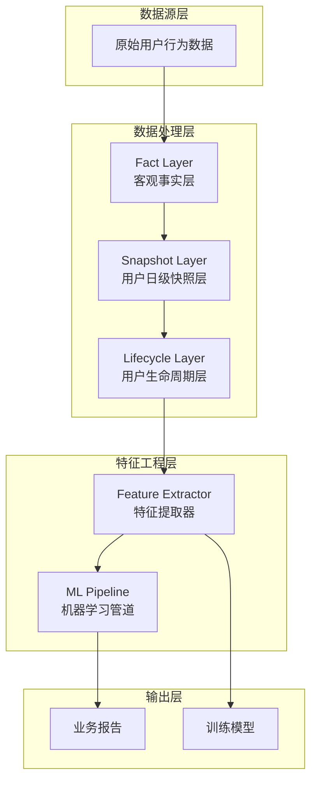
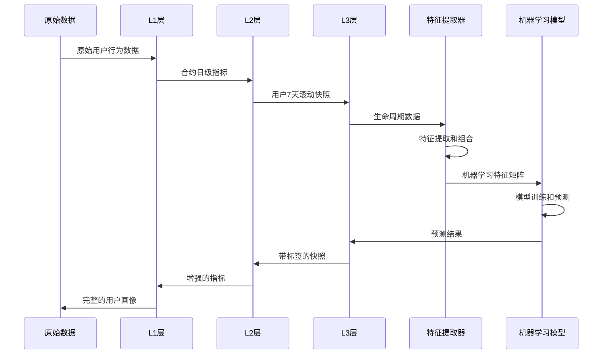
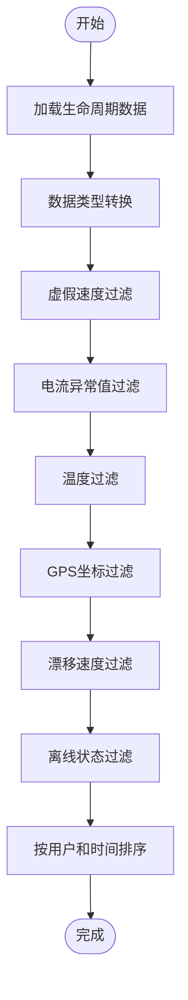
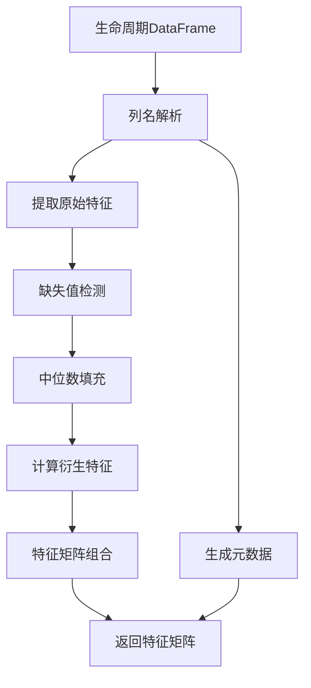
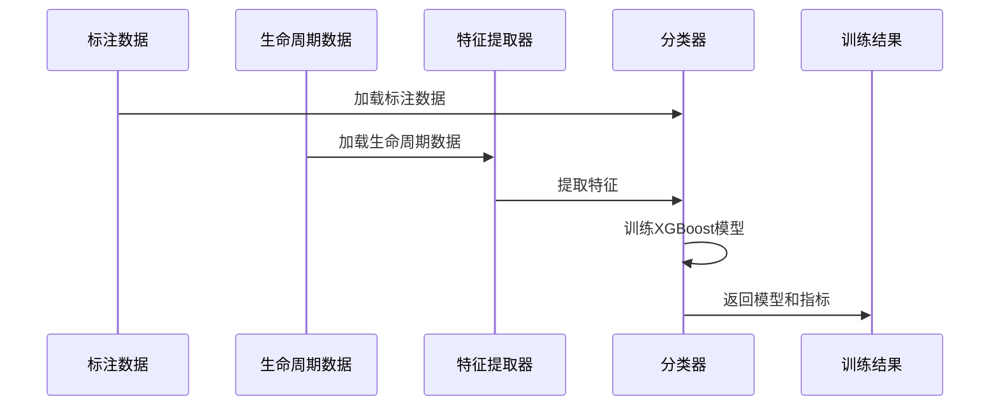
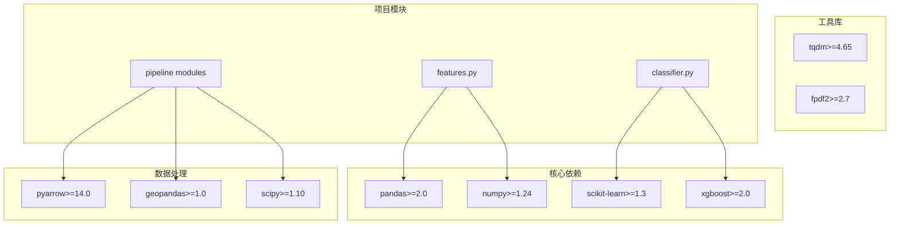

# 特征工程模块

<cite>
**本文档引用的文件**
- [features.py](file://src/ml/features.py)
- [classifier.py](file://src/ml/classifier.py)
- [fact_layer.py](file://src/pipeline/fact_layer.py)
- [snapshot_layer.py](file://src/pipeline/snapshot_layer.py)
- [lifecycle_layer.py](file://src/pipeline/lifecycle_layer.py)
- [dynamic_thresholds.py](file://src/pipeline/dynamic_thresholds.py)
- [score_common.py](file://src/pipeline/score_common.py)
- [run_ml.py](file://src/ml/run_ml.py)
- [config.py](file://config/config.py)
- [README.md](file://README.md)
- [requirements.txt](file://requirements.txt)
</cite>

## 目录
1. [简介](#简介)
2. [项目结构](#项目结构)
3. [核心组件](#核心组件)
4. [架构概览](#架构概览)
5. [详细组件分析](#详细组件分析)
6. [依赖关系分析](#依赖关系分析)
7. [性能考虑](#性能考虑)
8. [故障排除指南](#故障排除指南)
9. [结论](#结论)
10. [附录](#附录)

## 简介

两轮车换电用户特征画像系统的特征工程模块是一个完整的机器学习特征提取和处理管道，专门针对换电用户的复杂行为模式进行特征构建。该模块实现了从原始用户行为数据到机器学习可用特征矩阵的完整转换流程。

### 主要特性

- **多维度特征提取**：涵盖骑行强度、速度特征、电流特征、电耗特征、SOC特征、换电特征、时段分布、温度特征、活动范围、行为规律、功率特征等多个维度
- **智能特征组合**：自动构建比值类衍生特征，如速度波动比、电流波动比、怠速放电占比等
- **动态阈值适配**：与动态阈值系统无缝集成，支持自适应特征筛选
- **异常检测集成**：支持无监督异常检测和监督学习分类的特征工程需求
- **企业级稳定性**：具备完善的错误处理、数据验证和性能优化机制

## 项目结构

系统采用分层架构设计，特征工程模块位于ML层，与数据处理流水线紧密集成：

**图表来源**
- [README.md:81-134](file://README.md#L81-L134)
- [config.py:44-54](file://config/config.py#L44-L54)

**章节来源**
- [README.md:158-700](file://README.md#L158-L700)
- [config.py:1-54](file://config.py#L1-L54)

## 核心组件

### 特征提取器 (FeatureExtractor)

特征提取器是整个特征工程模块的核心组件，负责将生命周期层的数据转换为机器学习可用的特征矩阵。

#### 主要功能

1. **自动列名匹配**：兼容不同版本的生命周期输出字段名
2. **缺失值处理**：使用中位数填充并标记缺失值
3. **特征工程**：自动构造比值/衍生特征
4. **标准化输出**：统一返回特征矩阵、特征名列表和元数据

#### 特征分组体系

系统定义了13个特征组，涵盖用户行为的各个方面：

| 特征组 | 描述 | 包含特征数量 |
|--------|------|-------------|
| 骑行强度 | 反映用户骑行活跃程度 | 6个特征 |
| 速度特征 | 反映骑行速度水平和极端值 | 5个特征 |
| 电流特征 | 反映电流使用强度和异常程度 | 6个特征 |
| 电耗特征 | 反映用电效率和消耗水平 | 4个特征 |
| SOC特征 | 反映电池使用习惯和深度放电程度 | 7个特征 |
| 换电特征 | 反映换电频率和时段偏好 | 3个特征 |
| 时段分布 | 反映骑行时段偏好 | 5个特征 |
| 温度特征 | 反映电池工作温度 | 1个特征 |
| 活动范围 | 反映用户活动半径和空间分布 | 4个特征 |
| 行为规律 | 反映用户骑行行为的规律性和模式 | 6个特征 |
| 功率特征 | 反映电池输出功率和改装风险 | 1个特征 |

**章节来源**
- [features.py:35-139](file://src/ml/features.py#L35-L139)
- [features.py:165-321](file://src/ml/features.py#L165-L321)

### 衍生特征构造

系统内置了27个精心设计的衍生特征，这些特征通过组合原始特征来揭示更深层次的用户行为模式：

#### 比值类衍生特征示例

| 特征名称 | 计算公式 | 业务含义 | 阈值参考 |
|----------|----------|----------|----------|
| 速度波动比 | P90速度/P50速度 | 速度波动程度，>2.0说明速度波动大，疑似改装 | >2.0 |
| 电流波动比 | 最大电流/平均电流 | 电流波动程度，>3.0说明电流波动大 | >3.0 |
| 怠速放电占比 | 怠速放电时长/总放电时长 | 地摊/储能场景识别，>0.5疑似地摊/储能 | >0.5 |
| 深夜骑行占比 | 夜间长时骑行次数/总骑行次数 | 夜猫子型用户识别，>0.5为夜猫子型 | >0.5 |
| 换电频率强度 | 换电次数/用电量 | 频繁换电但用电少，疑似电池老化 | >2 |
| SOC消耗率 | 单次换电SOC消耗/骑行时长 | 耗电异常快，>20说明耗电异常快 | >20 |
| 高速骑行密度 | 高速点数/骑行次数 | 频繁高速，>0.3说明频繁高速 | >0.3 |
| 功率电流比 | 峰值功率/平均电流 | 高压改装车识别，>200疑似高压改装车 | >200 |
| 骑行规律性 | 出勤率/时间熵值 | 值越高越规律，专送骑手通常更高 | 越高越好 |
| 空间集中度 | R90/凸包面积 | 值越低越集中，专送骑手活动范围小且固定 | 越低越好 |

**章节来源**
- [features.py:141-162](file://src/ml/features.py#L141-L162)
- [features.py:252-286](file://src/ml/features.py#L252-L286)

### 机器学习分类器

监督学习分类器基于人工标注数据训练，实现异常类型自动分类：

#### 异常类型体系

| 类别 | 代码 | 描述 | 业务价值 |
|------|------|------|----------|
| 正常 | 0 | 标准用户行为 | 常规运营 |
| 改装/超速 | 1 | 改装或超速行为 | 风险预警 |
| 地摊/储能 | 2 | 地摊供电或储能场景 | 特殊场景识别 |
| 电池老化 | 3 | 电池健康问题 | 维护提醒 |
| 暴力驾驶 | 4 | 严重违规行为 | 清退处理 |
| 其他异常 | 5 | 未明确分类的异常 | 进一步分析 |

**章节来源**
- [classifier.py:62-73](file://src/ml/classifier.py#L62-L73)
- [classifier.py:76-420](file://src/ml/classifier.py#L76-L420)

## 架构概览

特征工程模块在整个系统架构中的位置和作用：

**图表来源**
- [README.md:138-143](file://README.md#L138-L143)
- [features.py:182-250](file://src/ml/features.py#L182-L250)

**章节来源**
- [README.md:79-156](file://README.md#L79-L156)
- [run_ml.py:83-250](file://src/ml/run_ml.py#L83-L250)

## 详细组件分析

### 数据预处理和清洗

特征工程模块在数据预处理阶段实施了多层次的数据质量控制：

#### 预处理流程

**图表来源**
- [fact_layer.py:135-215](file://src/pipeline/fact_layer.py#L135-L215)

#### 关键预处理技术

1. **虚假速度识别**：通过电流-速度关联性检测异常速度值
2. **电流异常检测**：使用前后点中位数平滑技术识别异常电流值
3. **GPS坐标验证**：过滤超出合理地理范围的坐标点
4. **漂移速度限制**：防止GPS坐标跳跃造成的异常分析

**章节来源**
- [fact_layer.py:144-201](file://src/pipeline/fact_layer.py#L144-L201)

### 特征提取算法

特征提取器采用模块化设计，支持动态特征组合和扩展：

#### 特征提取流程

**图表来源**
- [features.py:182-250](file://src/ml/features.py#L182-L250)

#### 特征工程策略

1. **自动列名匹配**：支持多版本字段名兼容
2. **缺失值处理**：中位数填充 + 标记缺失
3. **特征组合**：比值类特征自动构建
4. **特征验证**：确保数值有效性

**章节来源**
- [features.py:168-250](file://src/ml/features.py#L168-L250)

### 机器学习集成

特征工程模块与机器学习管道的深度集成：

#### 训练流程

**图表来源**
- [classifier.py:109-225](file://src/ml/classifier.py#L109-L225)

#### 模型评估指标

| 指标 | 用途 | 计算方法 |
|------|------|----------|
| 准确率 | 整体预测性能 | 正确预测样本数/总样本数 |
| 交叉验证准确率 | 模型稳定性评估 | K折交叉验证平均准确率 |
| 特征重要性 | 特征贡献度排序 | XGBoost特征重要性得分 |
| 置信度 | 预测可靠性 | 模型预测概率的最大值 |

**章节来源**
- [classifier.py:203-225](file://src/ml/classifier.py#L203-L225)

## 依赖关系分析

特征工程模块的依赖关系和外部接口：

**图表来源**
- [requirements.txt:1-9](file://requirements.txt#L1-L9)

**章节来源**
- [requirements.txt:1-9](file://requirements.txt#L1-L9)

### 外部依赖管理

系统对外部依赖进行了严格的版本控制和兼容性管理：

#### 核心依赖要求

| 依赖包 | 最低版本 | 用途 | 关键功能 |
|--------|----------|------|----------|
| pandas | 2.0 | 数据处理 | DataFrame操作、数据清洗 |
| numpy | 1.24 | 数值计算 | 数组运算、统计分析 |
| scikit-learn | 1.3 | 机器学习 | 模型训练、评估 |
| xgboost | 2.0 | 梯度提升 | XGBoost分类器 |
| pyarrow | 14.0 | 数据序列化 | Parquet文件读写 |
| geopandas | 1.0 | 空间数据分析 | 地理围栏匹配 |
| scipy | 1.10 | 科学计算 | 凸包计算、统计检验 |

**章节来源**
- [requirements.txt:1-9](file://requirements.txt#L1-L9)

## 性能考虑

特征工程模块在性能优化方面采用了多项策略：

### 内存优化策略

1. **延迟计算**：特征提取采用惰性求值，只在需要时计算
2. **内存映射**：大文件使用内存映射减少内存占用
3. **批处理**：支持大数据集的分批处理

### 计算效率优化

1. **向量化操作**：充分利用NumPy的向量化特性
2. **并行处理**：支持多进程并行计算
3. **缓存机制**：中间结果缓存避免重复计算

### 扩展性设计

1. **插件化架构**：支持新的特征类型扩展
2. **配置驱动**：通过配置文件管理特征参数
3. **模块化设计**：各组件职责清晰，易于维护

## 故障排除指南

### 常见问题及解决方案

#### 特征提取错误

**问题**：特征提取过程中出现NaN值
**原因**：原始数据中存在缺失值或异常值
**解决方案**：
1. 检查数据完整性
2. 验证字段名匹配
3. 调整缺失值处理策略

#### 模型训练失败

**问题**：XGBoost模型训练报错
**原因**：特征矩阵包含无穷大值或空特征
**解决方案**：
1. 检查特征矩阵的数值有效性
2. 验证特征组合的合理性
3. 调整模型参数设置

#### 性能问题

**问题**：特征提取过程耗时过长
**原因**：数据量过大或算法复杂度高
**解决方案**：
1. 优化数据加载和预处理
2. 调整批处理大小
3. 启用并行计算

**章节来源**
- [features.py:220-230](file://src/ml/features.py#L220-L230)
- [classifier.py:165-168](file://src/ml/classifier.py#L165-L168)

## 结论

两轮车换电用户特征画像系统的特征工程模块是一个功能完整、设计精良的机器学习特征处理系统。其主要优势包括：

1. **全面的特征覆盖**：涵盖用户行为的各个维度，提供丰富的特征组合
2. **智能化处理**：自动特征提取、缺失值处理和特征组合
3. **企业级稳定性**：完善的错误处理和性能优化机制
4. **灵活的扩展性**：支持新特征类型的添加和现有特征的改进
5. **深度集成**：与整个数据处理流水线无缝衔接

该模块为两轮车换电业务提供了强大的特征工程能力，能够有效支持用户行为分析、异常检测和用户分类等核心业务场景。

## 附录

### 特征工程最佳实践

1. **特征质量保证**：定期验证特征的有效性和相关性
2. **模型性能监控**：跟踪特征对模型性能的影响
3. **数据漂移检测**：监控特征分布的变化趋势
4. **特征版本管理**：建立特征变更的版本控制机制

### 业务应用场景

1. **用户行为模式识别**：通过特征组合识别不同类型用户的行为特征
2. **异常检测特征构建**：利用衍生特征提高异常检测的准确性
3. **用户分类特征设计**：针对不同业务目标设计专门的特征组合
4. **风险评估特征工程**：构建风险相关的特征体系支持风控决策