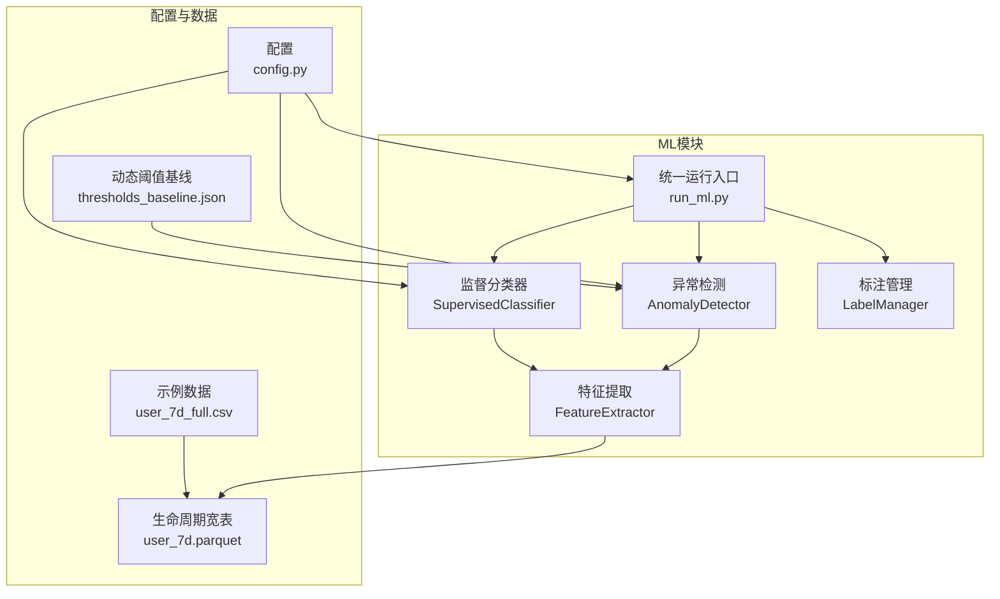
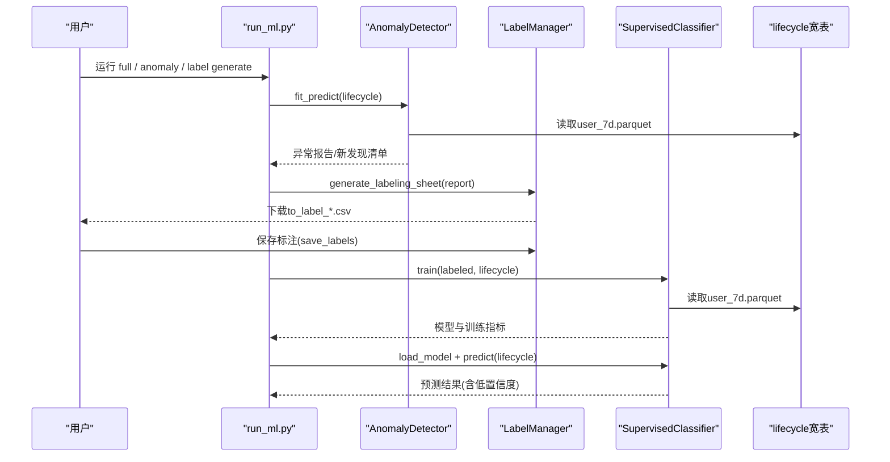
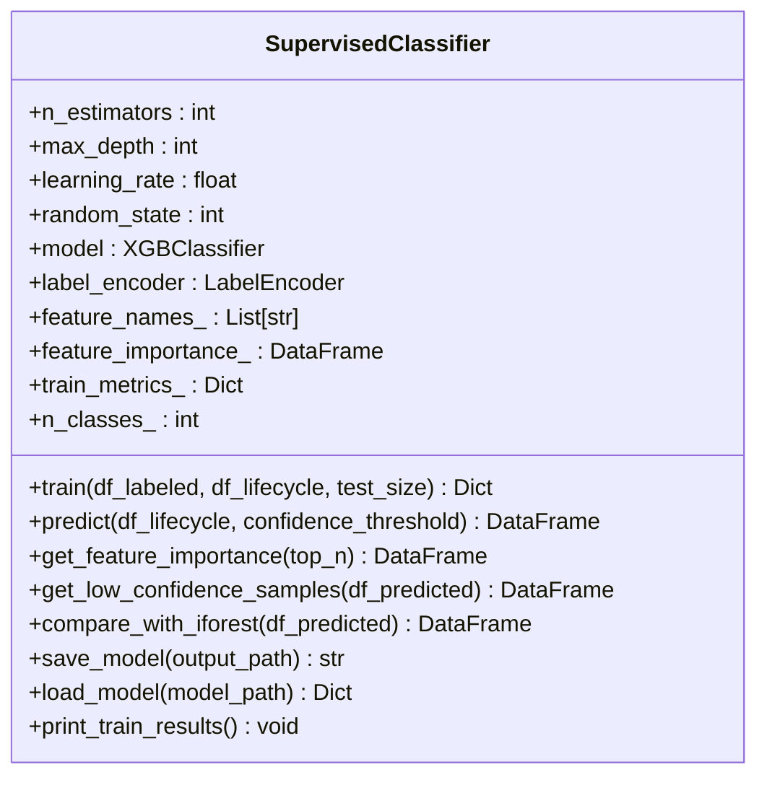
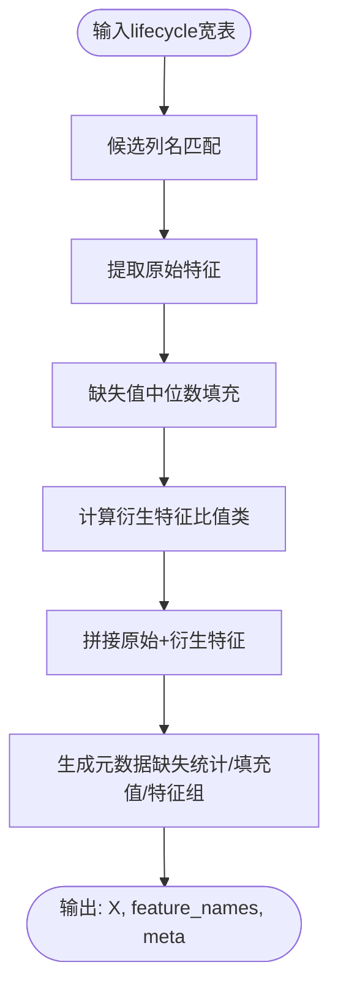
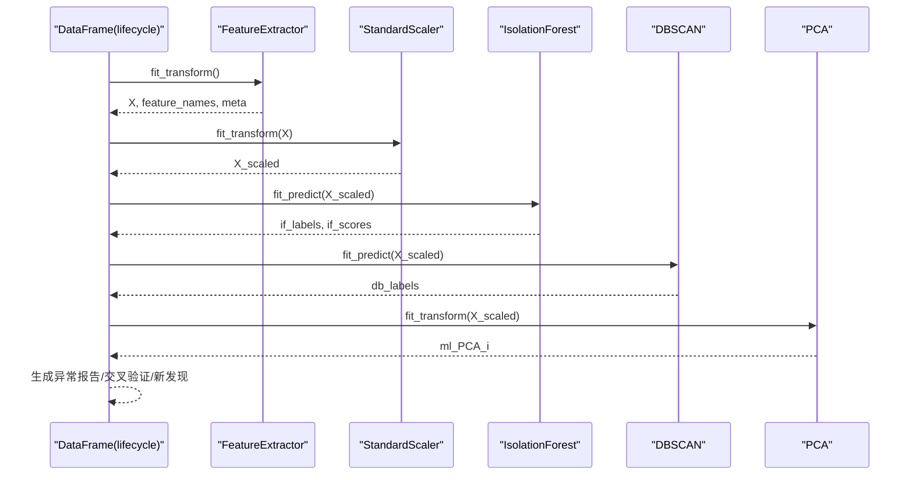
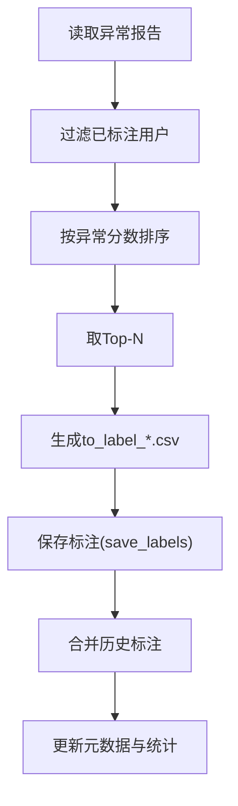
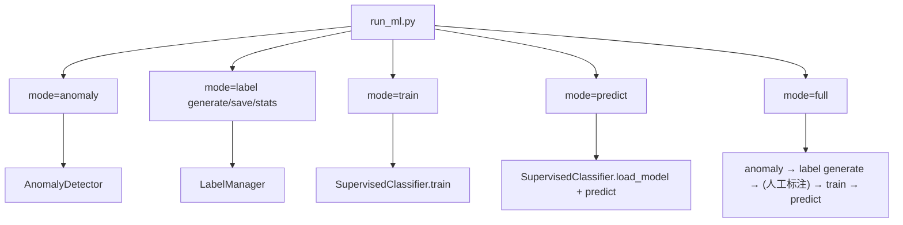
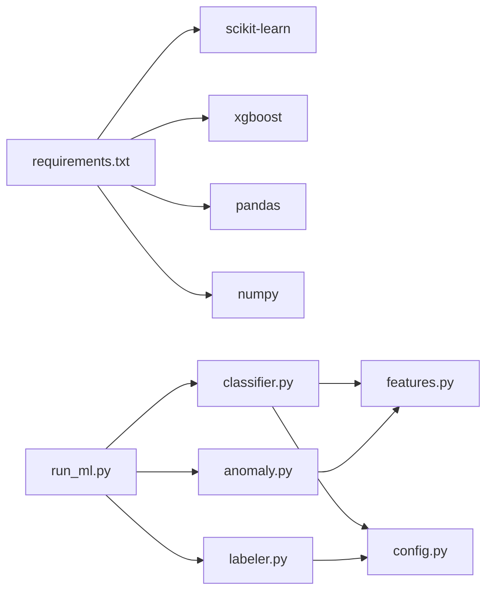

# 监督学习分类器

<cite>
**本文引用的文件**
- [src/ml/classifier.py](file://src/ml/classifier.py)
- [src/ml/features.py](file://src/ml/features.py)
- [src/ml/run_ml.py](file://src/ml/run_ml.py)
- [src/ml/anomaly.py](file://src/ml/anomaly.py)
- [src/ml/labeler.py](file://src/ml/labeler.py)
- [config/config.py](file://config/config.py)
- [ML模型说明.md](file://ML模型说明.md)
- [requirements.txt](file://requirements.txt)
- [src/tools/thresholds_baseline.json](file://src/tools/thresholds_baseline.json)
- [docs/user_7d_full.csv](file://docs/user_7d_full.csv)
</cite>

## 目录
1. [简介](#简介)
2. [项目结构](#项目结构)
3. [核心组件](#核心组件)
4. [架构总览](#架构总览)
5. [详细组件分析](#详细组件分析)
6. [依赖关系分析](#依赖关系分析)
7. [性能考量](#性能考量)
8. [故障排查指南](#故障排查指南)
9. [结论](#结论)
10. [附录](#附录)

## 简介
本文件面向“两轮车换电用户特征画像系统”的监督学习分类器模块，围绕XGBoost多分类器的训练流程、数据准备、特征工程、模型训练、参数调优、性能评估、部署与集成、置信度阈值与低置信度样本处理、模型版本管理与持续优化等方面，提供系统化、可操作的技术文档。文档同时结合项目中的统一运行入口与异常检测流程，给出端到端的实践指导。

## 项目结构
监督学习分类器模块位于 src/ml 目录，主要文件包括：
- 分类器主体：SupervisedClassifier（XGBoost多分类 + 特征重要性 + 模型持久化）
- 特征提取：FeatureExtractor（从lifecycle层提取特征矩阵）
- 统一运行入口：run_ml.py（支持 anomaly → label → train → predict 的完整流程）
- 异常检测：AnomalyDetector（孤立森林 + DBSCAN，为监督学习提供待标注样本）
- 标注管理：LabelManager（生成待标注、保存标注、统计标注）

图表来源
- [src/ml/run_ml.py:165-250](file://src/ml/run_ml.py#L165-L250)
- [src/ml/anomaly.py:95-158](file://src/ml/anomaly.py#L95-L158)
- [src/ml/classifier.py:109-225](file://src/ml/classifier.py#L109-L225)
- [src/ml/features.py:182-250](file://src/ml/features.py#L182-L250)
- [config/config.py:44-51](file://config/config.py#L44-L51)
- [src/tools/thresholds_baseline.json:1-141](file://src/tools/thresholds_baseline.json#L1-L141)
- [docs/user_7d_full.csv:1-200](file://docs/user_7d_full.csv#L1-L200)

章节来源
- [src/ml/run_ml.py:1-395](file://src/ml/run_ml.py#L1-L395)
- [config/config.py:1-54](file://config/config.py#L1-L54)

## 核心组件
- SupervisedClassifier：封装XGBoost多分类训练、预测、特征重要性、模型保存/加载、低置信度样本筛选、与孤立森林结果对比等功能。
- FeatureExtractor：从lifecycle层宽表抽取120+字段，自动匹配候选列名，缺失值中位数填充，构造衍生特征（比值类），标准化输出特征矩阵与元数据。
- AnomalyDetector：基于IsolationForest与DBSCAN的双模型异常检测，生成异常报告、交叉验证、新发现用户清单。
- LabelManager：生成待标注CSV、保存标注、统计标注分布与质量。
- run_ml.py：统一入口，串联异常检测、标注、训练、预测的完整流程。

章节来源
- [src/ml/classifier.py:76-517](file://src/ml/classifier.py#L76-L517)
- [src/ml/features.py:165-321](file://src/ml/features.py#L165-L321)
- [src/ml/anomaly.py:60-396](file://src/ml/anomaly.py#L60-L396)
- [src/ml/labeler.py:87-381](file://src/ml/labeler.py#L87-L381)
- [src/ml/run_ml.py:1-395](file://src/ml/run_ml.py#L1-L395)

## 架构总览
监督学习分类器以“异常检测-人工标注-模型训练-批量预测”为主线，形成闭环迭代：
- 异常检测阶段：AnomalyDetector从lifecycle层提取特征，用IsolationForest与DBSCAN识别异常用户，生成异常报告与“新发现”清单。
- 标注阶段：LabelManager从异常报告中抽取Top-N用户生成待标注CSV，人工标注后保存至标注库。
- 训练阶段：SupervisedClassifier读取标注数据与lifecycle层数据，提取特征，训练XGBoost多分类器，输出模型与训练指标。
- 预测阶段：SupervisedClassifier对新lifecycle数据进行预测，输出类别、置信度、低置信度标记，并可与孤立森林结果对比。

图表来源
- [src/ml/run_ml.py:252-295](file://src/ml/run_ml.py#L252-L295)
- [src/ml/anomaly.py:342-381](file://src/ml/anomaly.py#L342-L381)
- [src/ml/labeler.py:103-177](file://src/ml/labeler.py#L103-L177)
- [src/ml/classifier.py:109-225](file://src/ml/classifier.py#L109-L225)
- [src/ml/classifier.py:227-271](file://src/ml/classifier.py#L227-L271)

## 详细组件分析

### SupervisedClassifier（XGBoost多分类器）
- 训练流程
  - 输入：标注数据（含用户id与人工标注）与lifecycle层全量数据。
  - 特征提取：通过FeatureExtractor提取原始特征与衍生特征，缺失值中位数填充，对齐特征列。
  - 标签编码：LabelEncoder将类别映射为数字，支持多分类。
  - 分割：若最少类别样本数≥2则分层抽样，否则随机划分。
  - 训练：XGBClassifier（multi:softprob），评估指标mlogloss，输出准确率与5折交叉验证。
  - 评估：输出样本数、特征数、类别数、类别分布、准确率、交叉验证均值与方差、Top-10特征重要性。
- 预测流程
  - 对新lifecycle数据提取特征，对齐训练特征列，预测类别与概率，计算置信度（最大概率）。
  - 低置信度标记：置信度低于阈值（默认0.6）标记为1，便于回标。
  - 输出：ml_xgb_预测类别、ml_xgb_置信度、ml_xgb_低置信度、ml_xgb_概率_类别。
- 模型持久化
  - 保存XGBoost模型、特征名、训练指标、参数、标签编码器与元数据文件。
  - 加载：恢复模型、特征名、训练指标、标签编码器，重建特征重要性。
- 与其他模块对比
  - compare_with_iforest：对比XGBoost与孤立森林结果，统计一致/分歧情况。

图表来源
- [src/ml/classifier.py:76-517](file://src/ml/classifier.py#L76-L517)

章节来源
- [src/ml/classifier.py:76-517](file://src/ml/classifier.py#L76-L517)

### FeatureExtractor（特征提取器）
- 自动列名匹配：针对同一特征在不同版本输出中可能存在差异，通过候选列名映射保证兼容性。
- 缺失值处理：对数值列缺失值采用中位数填充，并记录填充值。
- 特征分组：7大特征组（骑行强度、速度特征、电流/功率、温度/SOC、行为模式、行为规律、功率特征）。
- 衍生特征：构造比值类特征（如速度波动比、电流波动比、怠速放电占比、换电频率强度、SOC消耗率、高速骑行密度、功率电流比、骑行规律性、空间集中度），提升判别能力。
- 输出：特征矩阵X、特征名列表、元数据（样本数、原始/衍生/总数、特征组、缺失统计、填充值）。

图表来源
- [src/ml/features.py:182-250](file://src/ml/features.py#L182-L250)

章节来源
- [src/ml/features.py:165-321](file://src/ml/features.py#L165-L321)

### AnomalyDetector（异常检测器）
- 双模型异常检测：IsolationForest（异常分数与标签）+ DBSCAN（噪声点标签）。
- 标准化与降维：StandardScaler + PCA，输出ml_PCA_i列。
- 交叉验证：统计双模型一致异常/仅孤立森林异常/仅DBSCAN噪声点/一致正常。
- 新发现：模型判异常但规则判正常（结合风险标签、用户形态、车辆形态）。
- 报告：保存异常报告、交叉验证报告、新发现清单。

图表来源
- [src/ml/anomaly.py:95-158](file://src/ml/anomaly.py#L95-L158)
- [src/ml/anomaly.py:305-339](file://src/ml/anomaly.py#L305-L339)

章节来源
- [src/ml/anomaly.py:60-396](file://src/ml/anomaly.py#L60-L396)

### LabelManager（标注管理器）
- 生成待标注：从异常报告中抽取Top-N用户，过滤已标注用户，输出to_label_*.csv，包含解释性特征列。
- 保存标注：校验标注类别合法性，去重合并历史标注，更新元数据。
- 统计：输出累计标注数、类别分布、标注时间跨度、排除“不确定”后的准确率估算。

图表来源
- [src/ml/labeler.py:103-177](file://src/ml/labeler.py#L103-L177)
- [src/ml/labeler.py:178-241](file://src/ml/labeler.py#L178-L241)
- [src/ml/labeler.py:242-338](file://src/ml/labeler.py#L242-L338)

章节来源
- [src/ml/labeler.py:87-381](file://src/ml/labeler.py#L87-L381)

### 统一运行入口 run_ml.py
- 模式：anomaly、label generate/save/stats、train、predict、full。
- 自动路径解析：从config.py读取lifecycle路径与输出根目录，自动查找最新模型/标注/异常报告。
- 流程编排：一键全流程（异常检测+生成待标注），训练后自动提示下一步。

图表来源
- [src/ml/run_ml.py:277-391](file://src/ml/run_ml.py#L277-L391)

章节来源
- [src/ml/run_ml.py:1-395](file://src/ml/run_ml.py#L1-L395)

## 依赖关系分析
- 外部依赖：pandas、numpy、scikit-learn、xgboost、pyarrow等。
- 内部依赖：classifier依赖features、config；run_ml依赖anomaly、labeler、classifier；anomaly依赖features；labeler依赖config。
- 配置依赖：config.py提供数据输出根目录、lifecycle路径等。

图表来源
- [requirements.txt:1-9](file://requirements.txt#L1-L9)
- [src/ml/classifier.py:47-58](file://src/ml/classifier.py#L47-L58)
- [src/ml/run_ml.py:39-42](file://src/ml/run_ml.py#L39-L42)

章节来源
- [requirements.txt:1-9](file://requirements.txt#L1-L9)
- [config/config.py:44-51](file://config/config.py#L44-L51)

## 性能考量
- 特征规模与稳定性：特征组与衍生特征丰富，建议在训练前检查缺失率与方差，必要时进行特征选择或降维。
- 分类不平衡：类别分布需关注，建议在训练时使用分层抽样（当最少类别样本≥2时），并结合类别权重或采样策略。
- 交叉验证：使用StratifiedKFold进行5折交叉验证，评估模型稳定性与泛化能力。
- 置信度阈值：默认0.6，可根据业务目标调整，低置信度样本应进入人工复核闭环。
- 模型保存与版本：每次训练生成带时间戳的模型文件与元数据，便于追踪版本与回滚。

## 故障排查指南
- 依赖缺失
  - 现象：ImportError或模块不可用。
  - 排查：确认requirements.txt中依赖已安装，尤其是xgboost、scikit-learn、pandas、numpy。
- 数据路径问题
  - 现象：找不到user_7d.parquet或labeled_data.csv。
  - 排查：检查config.py中的DATA_OUTPUT_ROOT与EXPORT_PATH_LIFECYCLE_7D；确认run_ml.py自动查找逻辑是否能找到最新文件。
- 标注数据不合法
  - 现象：保存标注时报错“存在无效标注值”。
  - 排查：确认人工标注列仅包含允许类别（正常、改装/超速、地摊/储能、电池老化、暴力驾驶、其他异常、不确定）。
- 模型未训练/未加载
  - 现象：预测时报错“模型未训练或未加载”。
  - 排查：先执行train，再执行predict；或显式指定模型路径。
- 特征不匹配
  - 现象：预测时报错“训练时有但当前数据缺失的特征”。
  - 排查：确认lifecycle层字段与训练时一致；缺失特征可通过填充或特征工程补齐。

章节来源
- [src/ml/classifier.py:342-421](file://src/ml/classifier.py#L342-L421)
- [src/ml/labeler.py:178-201](file://src/ml/labeler.py#L178-L201)
- [src/ml/run_ml.py:173-182](file://src/ml/run_ml.py#L173-L182)

## 结论
该监督学习分类器模块以XGBoost为核心，结合特征工程、异常检测与人工标注，构建了可闭环迭代的用户异常类型自动分类系统。通过统一运行入口与完善的模型持久化机制，实现了从数据准备、模型训练、性能评估到批量预测与低置信度样本处理的全链路自动化。建议在实际落地中持续关注类别平衡、特征稳定性与置信度阈值调优，并建立版本管理与性能监控机制，以保障模型长期有效性。

## 附录

### 输入输出格式与数据要求
- 训练数据要求
  - 标注数据：包含用户id与人工标注列，标注类别为“正常/改装/超速/地摊/储能/电池老化/暴力驾驶/其他异常”，支持“不确定”标注。
  - lifecycle层数据：user_7d.parquet，包含大量骑行与电池相关特征列。
- 特征向量表示
  - 原始特征：来自7大特征组（骑行强度、速度特征、电流/功率、温度/SOC、行为模式、行为规律、功率特征）。
  - 衍生特征：比值类特征（速度波动比、电流波动比、怠速放电占比、换电频率强度、SOC消耗率、高速骑行密度、功率电流比、骑行规律性、空间集中度）。
  - 缺失值：中位数填充；缺失统计与填充值随元数据输出。
- 预测结果格式
  - 新增列：ml_xgb_预测类别、ml_xgb_置信度、ml_xgb_低置信度、ml_xgb_概率_各类别。
  - 低置信度样本：ml_xgb_低置信度=1，建议回标。

章节来源
- [src/ml/classifier.py:109-271](file://src/ml/classifier.py#L109-L271)
- [src/ml/features.py:182-250](file://src/ml/features.py#L182-L250)
- [ML模型说明.md:114-123](file://ML模型说明.md#L114-L123)

### 模型性能评估指标
- 准确率：整体预测正确率。
- 交叉验证：5折分层交叉验证，输出均值与标准差。
- 分类报告：包含各类别的精确率、召回率、F1分数与支持数。
- 特征重要性：Top-N特征及其重要性排序。

章节来源
- [src/ml/classifier.py:186-225](file://src/ml/classifier.py#L186-L225)

### 模型部署与集成策略
- 模型保存与加载
  - 保存：模型文件（.json）、元数据（_meta.json）、标签编码器（_encoder.pkl）。
  - 加载：恢复模型、特征名、训练指标、标签编码器。
- 批量预测
  - 通过run_ml.py predict或直接调用SupervisedClassifier.load_model + predict。
- 实时推理
  - 建议将FeatureExtractor与模型封装为服务接口，接收lifecycle层数据，返回预测结果与低置信度标记。
- 与孤立森林对比
  - compare_with_iforest用于统计双模型一致/分歧，辅助人工复核与模型校准。

章节来源
- [src/ml/classifier.py:343-421](file://src/ml/classifier.py#L343-L421)
- [src/ml/classifier.py:304-342](file://src/ml/classifier.py#L304-L342)

### 置信度阈值与低置信度样本处理
- 置信度阈值
  - 默认0.6，可通过predict参数调整。
  - 置信度=max(概率)，低于阈值标记为低置信度。
- 低置信度样本
  - get_low_confidence_samples筛选ml_xgb_低置信度=1的用户，输出用户id、预测类别、置信度与概率列。
  - 建议回标流程：将低置信度样本回标注库，纳入下一轮训练，形成闭环。

章节来源
- [src/ml/classifier.py:227-303](file://src/ml/classifier.py#L227-L303)
- [src/ml/run_ml.py:208-249](file://src/ml/run_ml.py#L208-L249)

### 模型版本管理与持续优化
- 版本管理
  - 每次训练生成带时间戳的模型文件与元数据，便于追踪与回滚。
- 持续优化
  - 建议定期运行异常检测（即使无新标注）以发现新异常用户。
  - 关注模型准确率与类别分布变化，若出现显著下降，补充新标注并重新训练。
  - 类别平衡：尽量每类≥10条标注，避免模型偏向多数类。

章节来源
- [ML模型说明.md:217-256](file://ML模型说明.md#L217-L256)
- [src/ml/run_ml.py:83-104](file://src/ml/run_ml.py#L83-L104)