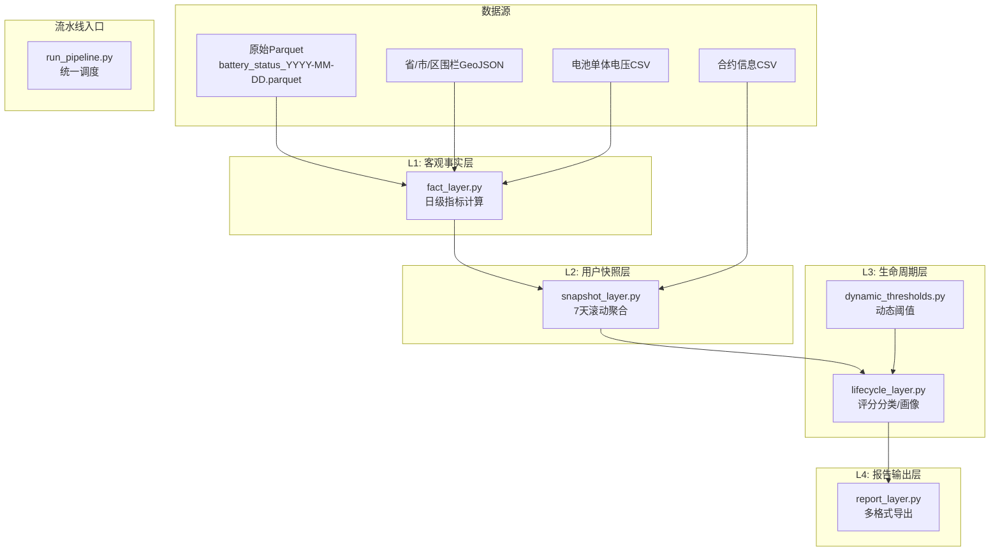
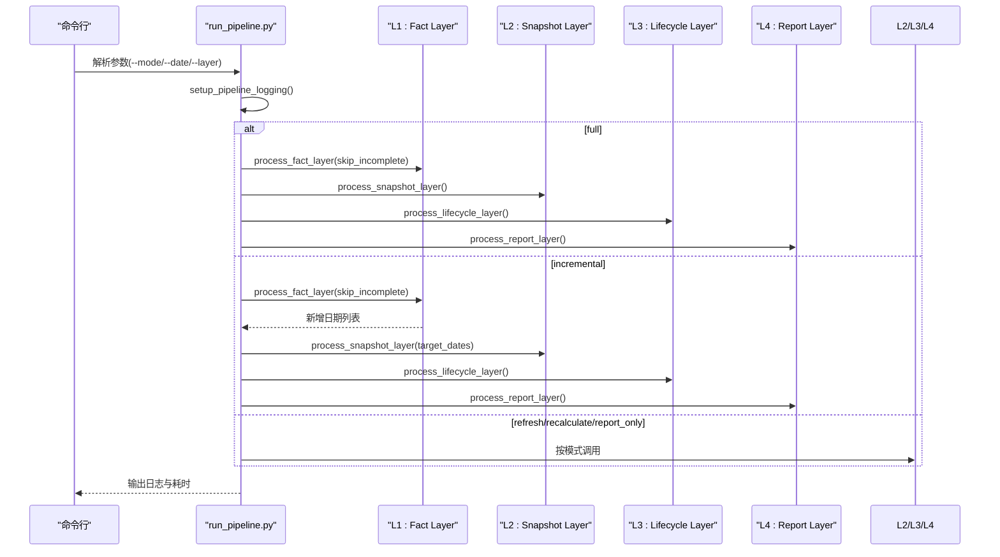
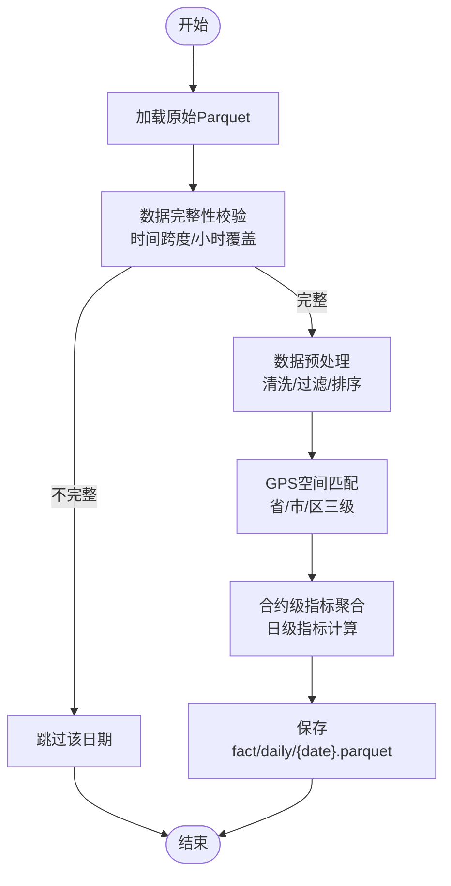
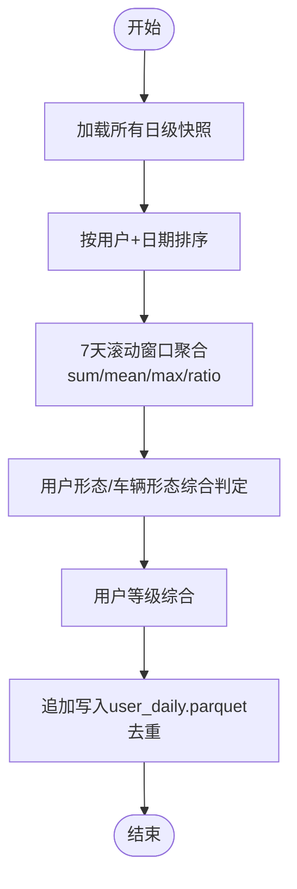
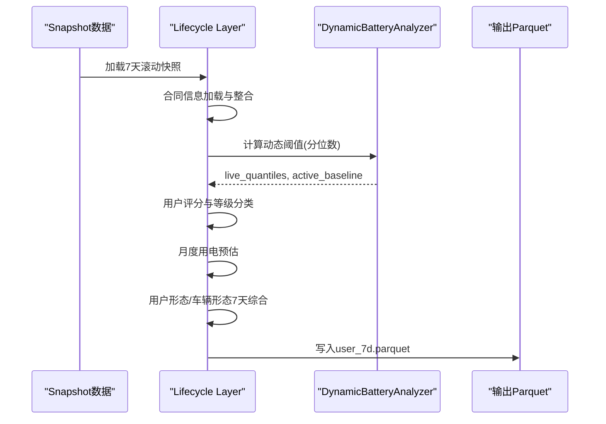
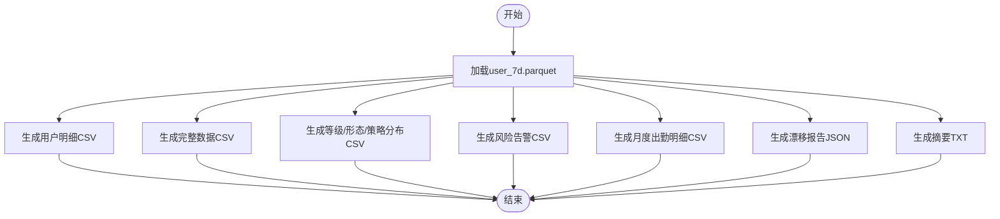
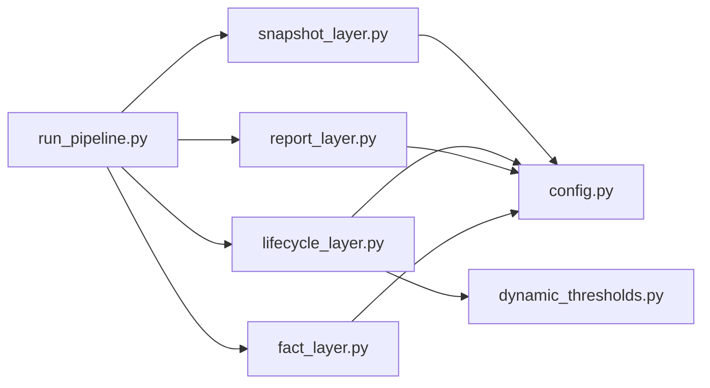

# 核心模块详解

<cite>
**本文引用的文件**
- [run_pipeline.py](file://src/pipeline/run_pipeline.py)
- [fact_layer.py](file://src/pipeline/fact_layer.py)
- [snapshot_layer.py](file://src/pipeline/snapshot_layer.py)
- [lifecycle_layer.py](file://src/pipeline/lifecycle_layer.py)
- [report_layer.py](file://src/pipeline/report_layer.py)
- [dynamic_thresholds.py](file://src/pipeline/dynamic_thresholds.py)
- [score_common.py](file://src/pipeline/score_common.py)
- [config.py](file://config/config.py)
- [README.md](file://README.md)
</cite>

## 目录
1. [引言](#引言)
2. [项目结构](#项目结构)
3. [核心组件](#核心组件)
4. [架构总览](#架构总览)
5. [详细组件分析](#详细组件分析)
6. [依赖分析](#依赖分析)
7. [性能考虑](#性能考虑)
8. [故障排查指南](#故障排查指南)
9. [结论](#结论)
10. [附录](#附录)

## 引言
本技术文档围绕两轮车换电用户特征画像系统的核心模块，深入解析L1-L4四层数据处理架构的实现细节。文档覆盖每层的数据输入、处理逻辑、算法原理与输出格式，重点阐述：
- L1客观事实层的日级指标计算
- L2用户快照层的7天滚动聚合
- L3生命周期层的用户评分分类与画像生成
- L4报告输出层的多格式导出

同时，文档提供每个模块的核心函数说明、参数配置、返回值格式与使用示例，解释模块间的依赖关系与数据传递机制，包含错误处理与异常情况的处理策略，并给出性能优化建议与调试技巧。

## 项目结构
系统采用分层流水线架构，统一入口负责调度各层执行，支持多种执行模式（全量重建、增量处理、刷新聚合、重新评级、仅报告）。

**图表来源**
- [run_pipeline.py:1-381](file://src/pipeline/run_pipeline.py#L1-L381)
- [fact_layer.py:1-800](file://src/pipeline/fact_layer.py#L1-L800)
- [snapshot_layer.py:1-452](file://src/pipeline/snapshot_layer.py#L1-L452)
- [lifecycle_layer.py:1-800](file://src/pipeline/lifecycle_layer.py#L1-L800)
- [report_layer.py:1-235](file://src/pipeline/report_layer.py#L1-L235)
- [dynamic_thresholds.py:1-580](file://src/pipeline/dynamic_thresholds.py#L1-L580)

**章节来源**
- [README.md:79-156](file://README.md#L79-L156)
- [config.py:1-54](file://config/config.py#L1-L54)

## 核心组件
- L1 客观事实层（Fact Layer）
  - 职责：从原始Parquet数据计算可观测的物理事实，不含业务推断。
  - 输入：raw/{date}.parquet
  - 输出：fact/daily/{date}.parquet
  - 关键函数：process_fact_layer、preprocess_raw_data、calc_contract_metrics
- L2 用户快照层（Snapshot Layer）
  - 职责：将合约日级事实聚合为用户日级快照，并做日级评分与用户形态判定。
  - 输入：fact/daily/*.parquet
  - 输出：snapshot/user_daily.parquet（追加写入）
  - 关键函数：process_snapshot_layer、append_to_snapshot
- L3 生命周期层（Lifecycle Layer）
  - 职责：7天滚动聚合 + 动态阈值计算 + 用户等级/风险标签/策略建议。
  - 输入：snapshot/user_daily.parquet
  - 输出：lifecycle/user_7d.parquet
  - 关键函数：process_lifecycle_layer、calc_rolling_7d_metrics、calc_user_monthly_attendance
- L4 报告输出层（Report Layer）
  - 职责：从生命周期Parquet生成各类业务报告文件。
  - 输入：lifecycle/user_7d.parquet
  - 输出：reports/ 目录下的多格式文件
  - 关键函数：process_report_layer、generate_* 报告生成函数

**章节来源**
- [fact_layer.py:1-800](file://src/pipeline/fact_layer.py#L1-L800)
- [snapshot_layer.py:1-452](file://src/pipeline/snapshot_layer.py#L1-L452)
- [lifecycle_layer.py:1-800](file://src/pipeline/lifecycle_layer.py#L1-L800)
- [report_layer.py:1-235](file://src/pipeline/report_layer.py#L1-L235)

## 架构总览
L1-L4四层严格解耦，每层职责单一，支持独立重跑与增量处理。统一入口run_pipeline.py负责：
- 模式选择：full/incremental/refresh/recalculate/report_only
- 目录清理与日志输出
- 各层函数的顺序调用与异常捕获

**图表来源**
- [run_pipeline.py:104-381](file://src/pipeline/run_pipeline.py#L104-L381)

**章节来源**
- [run_pipeline.py:1-381](file://src/pipeline/run_pipeline.py#L1-L381)

## 详细组件分析

### L1 客观事实层（Fact Layer）
- 数据输入
  - 每日一个Parquet文件，命名规则：battery_status_YYYY-MM-DD.parquet
  - 字段包含时间戳、用户id、合约id、电池id、电压/电流/SOC/温度、GPS、速度等
- 数据完整性校验（v2.3）
  - 时间跨度≥20小时、小时覆盖≥20个/24小时，不满足则跳过该日期
  - 跳过的日期不参与出勤率与月度预估
- 处理流程
  - 预处理：清洗无效记录、异常电流/速度过滤、离线状态过滤、GPS漂移过滤
  - 空间匹配：将GPS坐标匹配到省/市/区三级行政区
  - 合约级指标聚合：计算日级指标（电量、里程、速度、电流、SOC、活动半径、换电画像等）
- 核心算法
  - 电池电压映射：电池id→标准电压（默认60V）
  - 用电量计算（SOC差法）：基于每段电池的最早/最晚SOC差值与满容量计算耗电量
- 输出
  - Parquet文件，按日期分区，字段丰富，包含120+指标

**图表来源**
- [fact_layer.py:135-800](file://src/pipeline/fact_layer.py#L135-L800)

**章节来源**
- [fact_layer.py:1-800](file://src/pipeline/fact_layer.py#L1-L800)
- [README.md:160-387](file://README.md#L160-L387)

### L2 用户快照层（Snapshot Layer）
- 数据输入
  - 加载所有fact/daily/*.parquet
  - 按用户+日期排序，确保时间连续性
- 处理流程
  - 7天滚动窗口聚合：sum/mean/max/ratio等
  - 用户形态/车辆形态综合判定：基于日级众数与优先级规则
  - 用户等级综合：基于日级等级优先级
  - 追加写入：按[用户id, 统计日期]去重
- 输出
  - snapshot/user_daily.parquet（全量用户7天滚动快照）

**图表来源**
- [snapshot_layer.py:212-452](file://src/pipeline/snapshot_layer.py#L212-L452)

**章节来源**
- [snapshot_layer.py:1-452](file://src/pipeline/snapshot_layer.py#L1-L452)
- [README.md:389-499](file://README.md#L389-L499)

### L3 生命周期层（Lifecycle Layer）
- 数据输入
  - snapshot/user_daily.parquet
  - 合约信息：首次入网日期、合约到期时间
  - 动态阈值：thresholds_baseline.json
- 处理流程
  - 合同信息加载与整合（全局缓存）
  - 7天滚动指标计算（加权聚合）
  - 动态阈值计算与评分分类（DynamicBatteryAnalyzer）
  - 月度用电量预估（基于出勤率）
  - 用户形态/车辆形态7天综合判定（空间+行为特征）
  - 设备状态监控（离线天数）
  - 生成完整用户画像文本
- 输出
  - lifecycle/user_7d.parquet（120+字段）

**图表来源**
- [lifecycle_layer.py:575-703](file://src/pipeline/lifecycle_layer.py#L575-L703)
- [dynamic_thresholds.py:349-580](file://src/pipeline/dynamic_thresholds.py#L349-L580)

**章节来源**
- [lifecycle_layer.py:1-800](file://src/pipeline/lifecycle_layer.py#L1-L800)
- [dynamic_thresholds.py:1-580](file://src/pipeline/dynamic_thresholds.py#L1-L580)
- [README.md:501-700](file://README.md#L501-L700)

### L4 报告输出层（Report Layer）
- 数据输入
  - lifecycle/user_7d.parquet
- 输出报告
  - user_detail.csv：关键指标明细
  - user_7d_full.csv：完整字段
  - level_distribution.csv：等级/形态/策略分布
  - risk_alerts.csv：风险用户告警
  - user_monthly_attendance_detail.csv：月度出勤预估明细
  - shift_report.json：分布漂移检测报告
  - summary.txt：文本摘要
- 输出路径
  - reports/（固定目录，每次覆盖最新）

**图表来源**
- [report_layer.py:192-235](file://src/pipeline/report_layer.py#L192-L235)

**章节来源**
- [report_layer.py:1-235](file://src/pipeline/report_layer.py#L1-L235)
- [README.md:702-722](file://README.md#L702-L722)

## 依赖分析
- 模块耦合与协作
  - run_pipeline.py 作为统一入口，按模式调度各层函数
  - L1→L2→L3→L4 顺序依赖，L4不反向依赖
  - L3 依赖动态阈值系统（dynamic_thresholds.py）与合约信息
  - L2 依赖 L1 的日级输出
- 外部依赖
  - 配置：config.py 提供路径与基准文件位置
  - 地理围栏：GeoJSON 文件用于GPS匹配
  - 电池电压：电池单体电压CSV用于SOC差法计算
- 关键接口契约
  - L1 输出：按日期分区的fact/daily/{date}.parquet
  - L2 输入：fact/daily/*.parquet；输出：snapshot/user_daily.parquet
  - L3 输入：snapshot/user_daily.parquet；输出：lifecycle/user_7d.parquet
  - L4 输入：lifecycle/user_7d.parquet；输出：reports/*.csv/json/txt

**图表来源**
- [run_pipeline.py:96-101](file://src/pipeline/run_pipeline.py#L96-L101)
- [config.py:44-54](file://config/config.py#L44-L54)

**章节来源**
- [run_pipeline.py:1-381](file://src/pipeline/run_pipeline.py#L1-L381)
- [config.py:1-54](file://config/config.py#L1-L54)

## 性能考虑
- 存储与I/O
  - 使用Parquet列式存储，Snappy压缩，减少I/O与内存占用
  - L2 追加写入时进行列对齐与类型修复，避免重复读写
- 计算优化
  - L1 合约级聚合使用分组与向量化操作，减少循环
  - L3 7天滚动聚合采用加权平均与极值聚合，避免逐行扫描
  - 动态阈值使用分位数计算与EMA平滑，避免频繁重算
- 并行与批处理
  - tqdm进度条显示处理进度，便于监控
  - 增量模式仅处理新增日期，避免全量重算
- 内存与稳定性
  - 数据完整性校验跳过不完整日期，防止异常数据影响整体
  - 日志系统自动保存stdout到文件，便于问题定位

[本节为通用性能指导，无需特定文件引用]

## 故障排查指南
- 常见问题与处理
  - L1 无数据：检查原始数据目录与文件命名；确认数据完整性校验通过
  - L2 无快照：确认L1已成功生成；检查fact/daily目录是否存在
  - L3 无生命周期：确认L2输出存在；检查合约信息文件路径与编码
  - L4 无报告：确认L3输出存在；检查输出目录权限
- 错误处理策略
  - run_pipeline.py 捕获异常并打印traceback，日志文件保存完整堆栈
  - L2 追加写入时兼容旧schema，自动修复类型差异
  - 动态阈值模块导入失败时，跳过动态分析但仍输出静态结果
- 调试技巧
  - 使用 --mode incremental 并忽略 --date 参数，自动检测缺失日期
  - 使用 --skip-incomplete false 关闭数据完整性检查（仅在调试时）
  - 查看 logs/ 下的 pipeline_*.log 文件定位问题
  - 逐步运行各层函数，缩小问题范围

**章节来源**
- [run_pipeline.py:222-260](file://src/pipeline/run_pipeline.py#L222-L260)
- [snapshot_layer.py:157-210](file://src/pipeline/snapshot_layer.py#L157-L210)
- [dynamic_thresholds.py:34-46](file://src/pipeline/dynamic_thresholds.py#L34-L46)

## 结论
本系统通过L1-L4分层架构实现了从原始数据到用户画像与业务报告的完整链路。L1提供严谨的客观事实，L2进行7天滚动聚合，L3引入动态阈值与评分分类，L4输出多格式报告。模块间职责清晰、可独立重跑、支持增量处理与日志记录，具备良好的可维护性与扩展性。建议在生产环境中启用EMA自动更新与数据完整性校验，并定期检查动态阈值基准线与报告输出。

[本节为总结性内容，无需特定文件引用]

## 附录
- 关键参数与阈值
  - 数据完整性阈值：时间跨度≥20小时、小时覆盖≥20个/24小时
  - 电流/速度/温度阈值：详见各层实现文件中的全局常量
  - 动态阈值：基于7天滚动窗口分位数，EMA平滑更新
- 使用示例
  - 增量处理：python src/pipeline/run_pipeline.py
  - 全量重建：python src/pipeline/run_pipeline.py --mode full
  - 仅生成报告：python src/pipeline/run_pipeline.py --mode report_only
  - 从某层重建：python src/pipeline/run_pipeline.py --layer L2

**章节来源**
- [README.md:79-156](file://README.md#L79-L156)
- [run_pipeline.py:13-41](file://src/pipeline/run_pipeline.py#L13-L41)