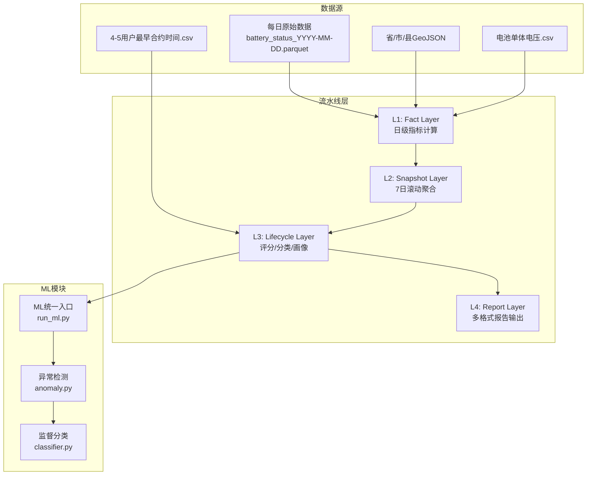
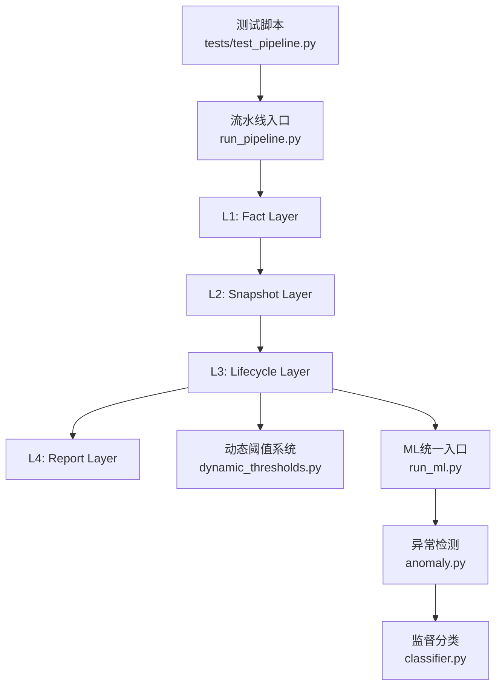
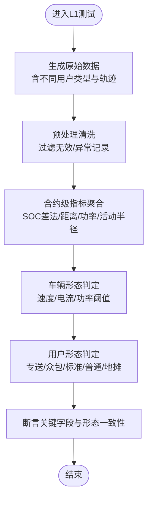
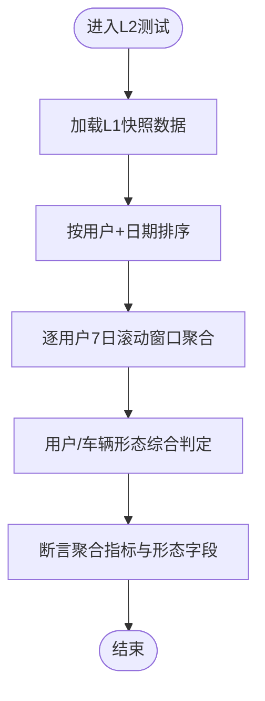
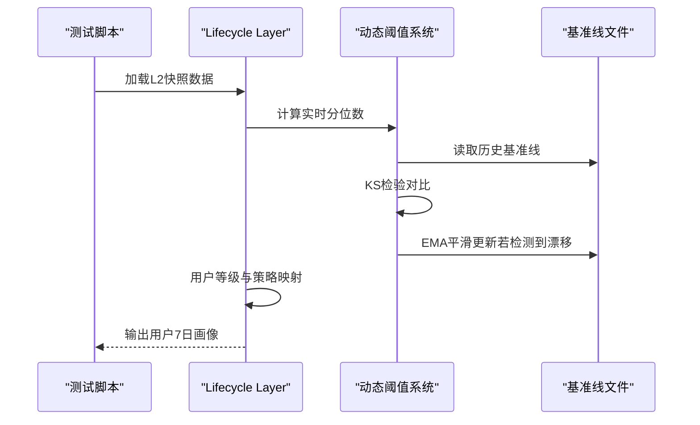
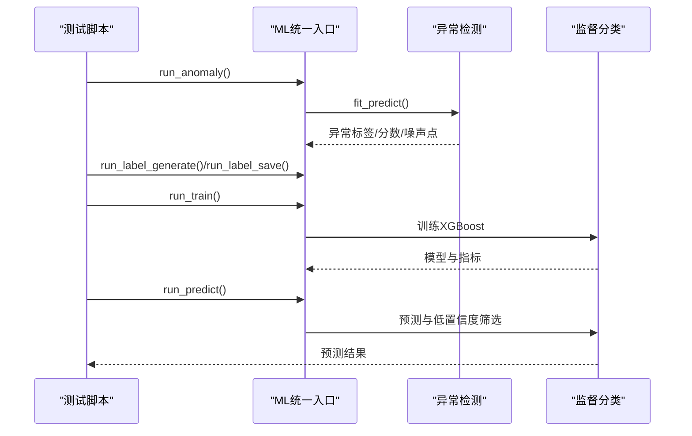
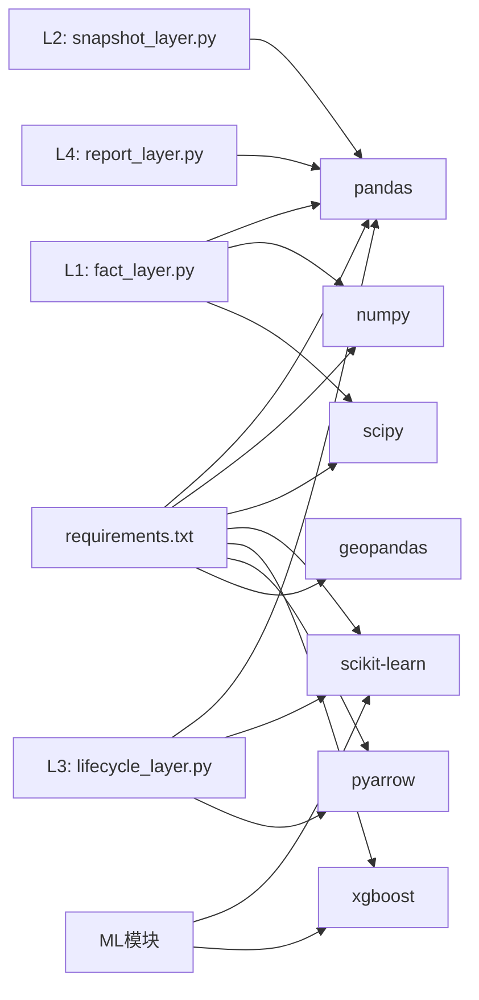

# 测试和质量保证

<cite>
**本文引用的文件**
- [README.md](file://README.md)
- [requirements.txt](file://requirements.txt)
- [config/config.py](file://config/config.py)
- [src/pipeline/run_pipeline.py](file://src/pipeline/run_pipeline.py)
- [src/pipeline/fact_layer.py](file://src/pipeline/fact_layer.py)
- [src/pipeline/snapshot_layer.py](file://src/pipeline/snapshot_layer.py)
- [src/pipeline/lifecycle_layer.py](file://src/pipeline/lifecycle_layer.py)
- [src/pipeline/dynamic_thresholds.py](file://src/pipeline/dynamic_thresholds.py)
- [src/ml/run_ml.py](file://src/ml/run_ml.py)
- [src/ml/anomaly.py](file://src/ml/anomaly.py)
- [src/ml/classifier.py](file://src/ml/classifier.py)
- [tests/test_pipeline.py](file://tests/test_pipeline.py)
</cite>

## 目录
1. [引言](#引言)
2. [项目结构](#项目结构)
3. [核心组件](#核心组件)
4. [架构总览](#架构总览)
5. [详细组件分析](#详细组件分析)
6. [依赖分析](#依赖分析)
7. [性能考虑](#性能考虑)
8. [故障排除指南](#故障排除指南)
9. [结论](#结论)
10. [附录](#附录)

## 引言
本测试与质量保证文档面向“两轮车换电用户特征画像系统”，聚焦于测试框架设计、测试用例组织、集成测试覆盖、测试数据管理、代码质量保障、测试环境搭建与维护、以及调试与故障排除。文档以现有代码库为基础，结合端到端测试脚本与各层模块实现，给出可操作的测试策略与质量控制手段。

## 项目结构
项目采用分层流水线架构，包含数据源、L1-Fact层、L2-Snapshot层、L3-Lifecycle层、L4-Report层，以及ML异常检测与监督分类模块。测试覆盖从单层函数到端到端流水线，确保数据完整性、阈值自适应、用户画像与报告输出的正确性与鲁棒性。

图表来源
- [README.md](file://README.md)
- [src/pipeline/run_pipeline.py](file://src/pipeline/run_pipeline.py)
- [src/ml/run_ml.py](file://src/ml/run_ml.py)

章节来源
- [README.md](file://README.md)
- [config/config.py](file://config/config.py)

## 核心组件
- 测试框架与组织
  - 使用Python内置unittest风格与pytest缓存目录，测试脚本位于tests目录，当前主要端到端测试脚本为tests/test_pipeline.py。
  - 测试数据生成采用临时目录与mock数据，覆盖不同用户形态与行为模式，验证L1-L3关键指标与形态判定。
- 单元测试策略
  - 针对L1数据预处理、合约指标聚合、L2滚动聚合、L3阈值与评分、L4报告输出的关键函数进行断言与回归验证。
  - 对动态阈值系统与ML模块分别进行功能与边界条件测试。
- 集成测试策略
  - 端到端流水线测试：从原始数据生成、L1处理、L2聚合、L3评分、到L4报告生成，全程断言关键字段与形态一致性。
  - 异常与边界条件：空数据、缺失字段、异常电流/速度、GPS漂移、阈值漂移检测、模型输入缺失等。
- 测试数据管理
  - 临时目录隔离：每次测试在临时目录下生成输入与输出，避免污染正式数据。
  - 模拟数据：按用户类型构造轨迹、速度、电流、SOC等，覆盖改装/超速、地摊/储能、专送/众包等典型场景。
  - 基线与阈值：动态阈值基准文件在测试中可被覆盖或模拟更新，确保阈值漂移检测与EMA更新逻辑可验证。

章节来源
- [tests/test_pipeline.py](file://tests/test_pipeline.py)
- [src/pipeline/fact_layer.py](file://src/pipeline/fact_layer.py)
- [src/pipeline/snapshot_layer.py](file://src/pipeline/snapshot_layer.py)
- [src/pipeline/lifecycle_layer.py](file://src/pipeline/lifecycle_layer.py)
- [src/pipeline/dynamic_thresholds.py](file://src/pipeline/dynamic_thresholds.py)
- [src/ml/anomaly.py](file://src/ml/anomaly.py)
- [src/ml/classifier.py](file://src/ml/classifier.py)

## 架构总览
下图展示测试与质量保证在系统中的位置：测试驱动端到端流水线，覆盖数据处理、阈值自适应、用户画像与报告输出；ML模块通过异常检测与监督分类形成闭环。

图表来源
- [src/pipeline/run_pipeline.py](file://src/pipeline/run_pipeline.py)
- [src/pipeline/dynamic_thresholds.py](file://src/pipeline/dynamic_thresholds.py)
- [src/ml/run_ml.py](file://src/ml/run_ml.py)
- [src/ml/anomaly.py](file://src/ml/anomaly.py)
- [src/ml/classifier.py](file://src/ml/classifier.py)

## 详细组件分析

### L1: Fact Layer 单元测试与边界条件
- 关键函数与测试关注点
  - 数据预处理：过滤无效电流/速度、异常漂移、GPS范围、温度异常；验证字段类型转换与缺失值处理。
  - 合约级指标聚合：SOC差法计算用电量、骑行距离估算、平均/最大功率、活动半径与中心经纬度、GPS空间匹配。
  - 车辆形态与用户形态判定：基于速度阈值、电流阈值、功率阈值与新特征（熵值、曲线系数、速度变异系数等）。
- 测试策略
  - 模拟异常电流/速度组合，验证清洗后数据的合理性与稳定性。
  - 构造不同轨迹模式（通勤、环线、宽幅移动、专送高峰集中），验证形态判定一致性。
  - 边界条件：SOC为0、电流为0、GPS漂移速度超限、空数据、缺失关键字段。
- 断言要点
  - 合约指标字段完整性与数值范围。
  - 形态字段与预期场景一致（如“改装/超速车”、“地摊/储能”等）。

图表来源
- [tests/test_pipeline.py](file://tests/test_pipeline.py)
- [src/pipeline/fact_layer.py](file://src/pipeline/fact_layer.py)

章节来源
- [tests/test_pipeline.py](file://tests/test_pipeline.py)
- [src/pipeline/fact_layer.py](file://src/pipeline/fact_layer.py)

### L2: Snapshot Layer 滚动聚合与用户类型判定
- 关键函数与测试关注点
  - 7日滚动窗口聚合：对数值型指标求和/均值/最大值，占比型指标为比率的加权均值，计数型指标为计数。
  - 用户类型与车辆类型综合：按优先级与时长占比综合判定。
- 测试策略
  - 构造多日数据，验证滚动聚合逻辑与边界（不足7日、空数据、异常值）。
  - 验证用户形态综合结果与预期一致（如专送/众包/标准/普通/地摊）。
- 断言要点
  - 聚合指标的数值与单位一致性。
  - 综合形态字段与优先级规则一致。

图表来源
- [tests/test_pipeline.py](file://tests/test_pipeline.py)
- [src/pipeline/snapshot_layer.py](file://src/pipeline/snapshot_layer.py)

章节来源
- [tests/test_pipeline.py](file://tests/test_pipeline.py)
- [src/pipeline/snapshot_layer.py](file://src/pipeline/snapshot_layer.py)

### L3: Lifecycle Layer 阈值系统与评分分类
- 关键函数与测试关注点
  - 合约信息加载与缓存：首次入网/到期时间、用户年龄。
  - 动态阈值计算：实时分位数、基准线对比、KS检验、EMA平滑更新。
  - 用户等级与策略映射：优质/良好/普通/高损耗/暴力/观察期/沉默用户。
  - 月度用电量预估：基于出勤率与日均用电。
- 测试策略
  - 基线文件存在/缺失、编码问题、缓存命中与失效。
  - 分布漂移检测：构造实时分位数与基准线差异，验证EMA更新触发与阈值平滑。
  - 评分与分类：构造不同指标组合，验证等级与策略映射。
- 断言要点
  - 基线文件保存与更新日志。
  - 用户等级与画像文本字段完整性。

图表来源
- [src/pipeline/lifecycle_layer.py](file://src/pipeline/lifecycle_layer.py)
- [src/pipeline/dynamic_thresholds.py](file://src/pipeline/dynamic_thresholds.py)

章节来源
- [src/pipeline/lifecycle_layer.py](file://src/pipeline/lifecycle_layer.py)
- [src/pipeline/dynamic_thresholds.py](file://src/pipeline/dynamic_thresholds.py)

### L4: Report Layer 报告输出与格式校验
- 关键函数与测试关注点
  - 多格式报告生成：CSV/JSON/TXT，字段完整性与编码（UTF-8 with BOM）。
  - 摘要统计：生命周期等级分布等。
- 测试策略
  - 读取输出文件，验证字段数量与类型、编码格式、摘要统计一致性。
- 断言要点
  - 输出文件存在且可读。
  - 报告字段与生命周期层一致。

章节来源
- [README.md](file://README.md)

### ML模块：异常检测与监督分类
- 异常检测（无监督）
  - 孤立森林与DBSCAN双模型，生成异常分数、异常标签、噪声点标签与PCA降维结果。
  - 交叉验证：双模型一致/仅孤立森林/仅DBSCAN/一致正常。
- 监督分类（XGBoost）
  - 特征提取、标签编码、训练与交叉验证、模型保存与加载、预测与低置信度样本筛选。
- 测试策略
  - 异常检测：构造不同用户画像，验证异常标签与分数分布。
  - 监督分类：标注数据与生命周期数据对齐，验证训练指标与特征重要性。
- 断言要点
  - 模型输出字段与预期标签一致。
  - 低置信度样本数量与阈值设置一致。

图表来源
- [src/ml/run_ml.py](file://src/ml/run_ml.py)
- [src/ml/anomaly.py](file://src/ml/anomaly.py)
- [src/ml/classifier.py](file://src/ml/classifier.py)

章节来源
- [src/ml/run_ml.py](file://src/ml/run_ml.py)
- [src/ml/anomaly.py](file://src/ml/anomaly.py)
- [src/ml/classifier.py](file://src/ml/classifier.py)

## 依赖分析
- 运行时依赖
  - pandas、numpy、scipy、scikit-learn、tqdm、fpdf2、pyarrow、xgboost、geopandas。
- 模块间依赖
  - L1依赖地理工具与通用评分模块；L2依赖评分通用模块；L3依赖动态阈值系统；L4依赖L3输出；ML模块依赖L3生命周期数据。
- 外部数据依赖
  - GeoJSON围栏、合约信息CSV、电池单体电压CSV、每日原始Parquet。

图表来源
- [requirements.txt](file://requirements.txt)
- [src/pipeline/fact_layer.py](file://src/pipeline/fact_layer.py)
- [src/pipeline/snapshot_layer.py](file://src/pipeline/snapshot_layer.py)
- [src/pipeline/lifecycle_layer.py](file://src/pipeline/lifecycle_layer.py)
- [src/ml/anomaly.py](file://src/ml/anomaly.py)
- [src/ml/classifier.py](file://src/ml/classifier.py)

章节来源
- [requirements.txt](file://requirements.txt)
- [src/pipeline/fact_layer.py](file://src/pipeline/fact_layer.py)
- [src/pipeline/snapshot_layer.py](file://src/pipeline/snapshot_layer.py)
- [src/pipeline/lifecycle_layer.py](file://src/pipeline/lifecycle_layer.py)
- [src/ml/anomaly.py](file://src/ml/anomaly.py)
- [src/ml/classifier.py](file://src/ml/classifier.py)

## 性能考虑
- 批量处理与列式存储：Parquet列式存储与pandas批处理提升I/O与内存效率。
- 进度显示：tqdm提供处理进度，便于长流程监控。
- 并行与向量化：pandas/numpy向量化与scipy/DBSCAN等库的高效实现。
- 优化建议
  - 对大规模数据分片处理，避免单进程内存压力。
  - 对地理匹配与凸包计算使用索引或空间索引加速。
  - 对动态阈值与EMA更新采用增量计算，减少全量重算。

## 故障排除指南
- 常见错误与定位
  - 文件路径与权限：确认输出根目录存在且可写，OneDrive锁定问题通过覆盖写入处理。
  - 编码问题：合约信息CSV可能为GBK编码，需自动回退。
  - 缺失依赖：安装requirements.txt中缺失的包。
  - 基线文件损坏：动态阈值系统读取失败时，检查JSON格式与字段完整性。
- 调试步骤
  - 启用日志：流水线入口自动将stdout写入日志文件，便于定位异常堆栈。
  - 临时数据隔离：测试在临时目录生成输入/输出，便于复现与清理。
  - 分层调试：先验证L1清洗与聚合，再逐步推进到L2-L3-L4。
- 回滚与恢复
  - 使用增量模式仅处理新日期，避免全量重跑。
  - 从指定层重建（FROM_L2/L3/L4）清理下游数据后重算。

章节来源
- [src/pipeline/run_pipeline.py](file://src/pipeline/run_pipeline.py)
- [src/pipeline/lifecycle_layer.py](file://src/pipeline/lifecycle_layer.py)
- [src/pipeline/dynamic_thresholds.py](file://src/pipeline/dynamic_thresholds.py)

## 结论
本测试与质量保证文档基于现有端到端测试脚本与各层模块实现，给出了覆盖数据处理、阈值系统、用户画像与报告输出的测试策略与质量控制手段。通过模拟多样化用户行为、边界条件与异常场景，结合日志与临时数据隔离，能够有效保障系统在生产环境中的稳定性与准确性。

## 附录
- 测试执行
  - 端到端测试：python tests/test_pipeline.py
  - 流水线模式：python src/pipeline/run_pipeline.py --mode incremental
  - ML模块：python src/ml/run_ml.py anomaly / label generate / train / predict
- 配置与路径
  - 基础路径与输出路径由config/config.py统一管理，支持测试模式切换。

章节来源
- [tests/test_pipeline.py](file://tests/test_pipeline.py)
- [src/pipeline/run_pipeline.py](file://src/pipeline/run_pipeline.py)
- [src/ml/run_ml.py](file://src/ml/run_ml.py)
- [config/config.py](file://config/config.py)