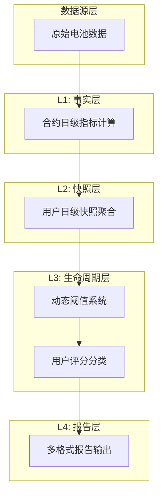
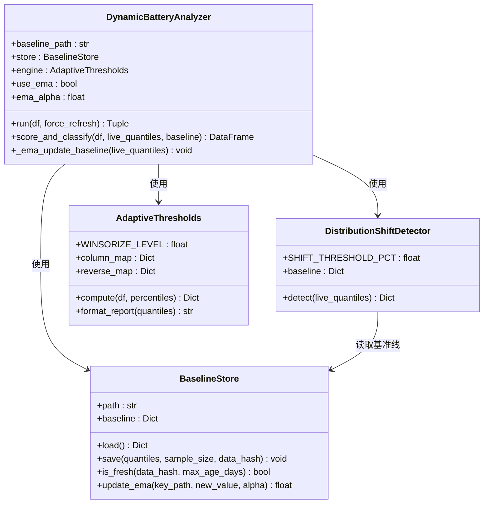
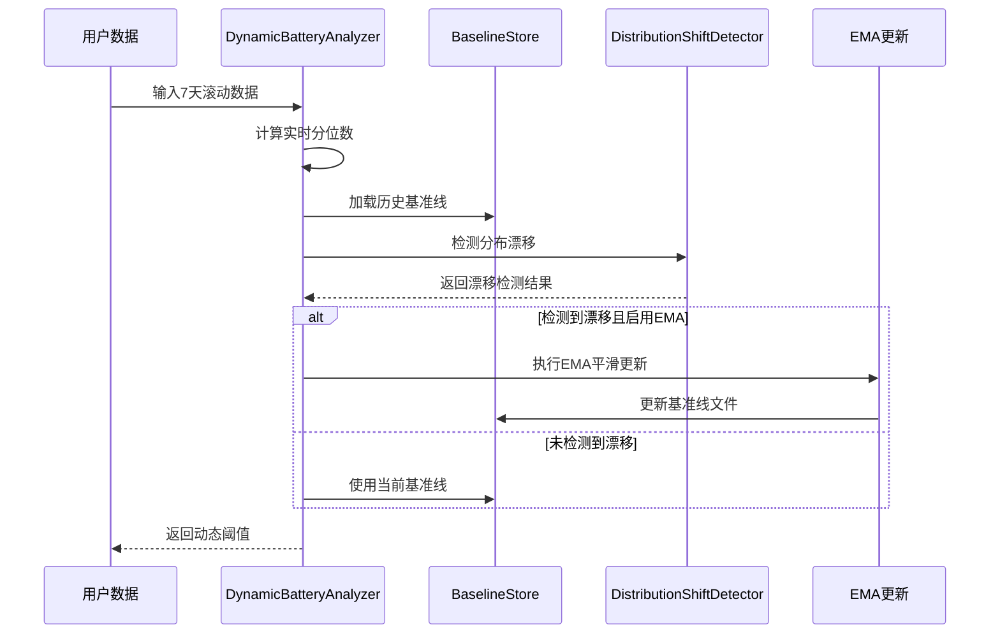
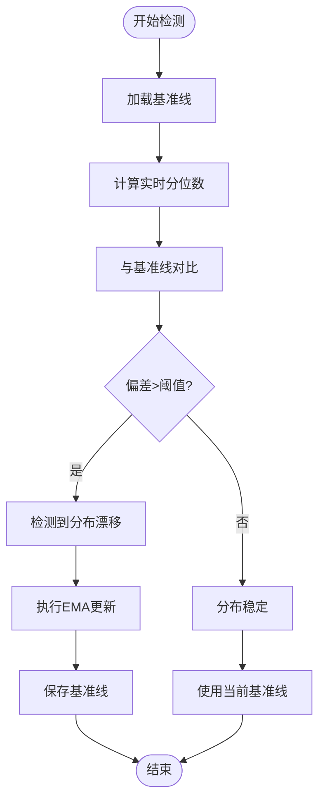
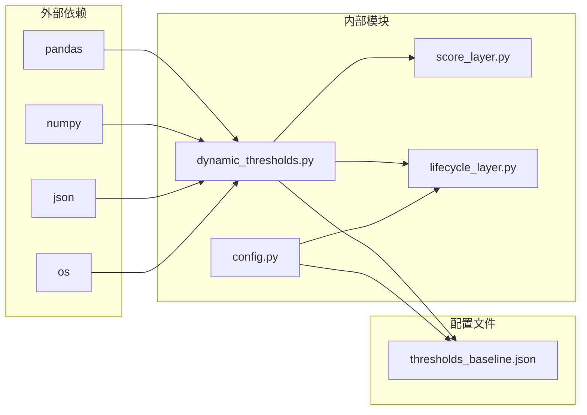

# 动态阈值系统

<cite>
**本文档引用的文件**
- [dynamic_thresholds.py](file://src/pipeline/dynamic_thresholds.py)
- [thresholds_baseline.json](file://src/tools/thresholds_baseline.json)
- [score_layer.py](file://src/pipeline/score_layer.py)
- [lifecycle_layer.py](file://src/pipeline/lifecycle_layer.py)
- [config.py](file://config/config.py)
- [README.md](file://README.md)
- [报告逻辑及计算方法.md](file://docs/报告逻辑及计算方法.md)
</cite>

## 目录
1. [引言](#引言)
2. [项目结构](#项目结构)
3. [核心组件](#核心组件)
4. [架构概览](#架构概览)
5. [详细组件分析](#详细组件分析)
6. [依赖关系分析](#依赖关系分析)
7. [性能考虑](#性能考虑)
8. [故障排除指南](#故障排除指南)
9. [结论](#结论)
10. [附录](#附录)

## 引言

两轮车换电用户特征画像系统采用动态阈值系统来适应数据分布的变化，通过EMA指数移动平均算法实现阈值的自适应调整。该系统解决了传统静态阈值无法适应业务变化的问题，能够自动响应用户行为模式的演进。

## 项目结构

系统采用四层流水线架构，动态阈值系统作为L3层的核心组件：



**图表来源**
- [README.md:139-143](file://README.md#L139-L143)
- [dynamic_thresholds.py:1-580](file://src/pipeline/dynamic_thresholds.py#L1-L580)

**章节来源**
- [README.md:79-156](file://README.md#L79-L156)

## 核心组件

动态阈值系统包含四个核心组件：

### 1. BaselineStore - 基准线存储管理
负责阈值基准线的持久化、版本追踪和读取功能。

### 2. DistributionShiftDetector - 分布漂移检测
检测实时数据与基准线之间的显著分布变化。

### 3. AdaptiveThresholds - 自适应阈值计算引擎
基于当前用户群体动态计算分位数阈值。

### 4. DynamicBatteryAnalyzer - 综合分析器
整合所有组件，提供统一的阈值计算接口。

**章节来源**
- [dynamic_thresholds.py:33-145](file://src/pipeline/dynamic_thresholds.py#L33-L145)
- [dynamic_thresholds.py:151-234](file://src/pipeline/dynamic_thresholds.py#L151-L234)
- [dynamic_thresholds.py:241-343](file://src/pipeline/dynamic_thresholds.py#L241-L343)
- [dynamic_thresholds.py:349-511](file://src/pipeline/dynamic_thresholds.py#L349-L511)

## 架构概览



**图表来源**
- [dynamic_thresholds.py:33-511](file://src/pipeline/dynamic_thresholds.py#L33-L511)

## 详细组件分析

### EMA指数移动平均算法实现

EMA算法通过以下公式实现阈值的平滑更新：

```
new_value = α × new_observation + (1 - α) × old_value
```

其中α为平滑系数（0-1之间），控制新数据和历史数据的权重分配。



**图表来源**
- [dynamic_thresholds.py:373-456](file://src/pipeline/dynamic_thresholds.py#L373-L456)
- [dynamic_thresholds.py:489-497](file://src/pipeline/dynamic_thresholds.py#L489-L497)

### 阈值基准线管理机制

基准线文件采用JSON格式存储，包含以下结构：

```json
{
  "version": "v1.0",
  "updated_at": "2026-04-20T09:48:20.737284",
  "data_hash": "61368bfe768c82a1",
  "sample_size": 21526,
  "quantiles": {
    "avg_current": {
      "P10": 8.105,
      "P25": 11.71,
      "P50": 16.324,
      "P75": 22.155,
      "P90": 28.346,
      "P99": 41.284,
      "_mean": 17.612,
      "_median": 16.79,
      "_std": 8.169,
      "_n": 20288
    }
  },
  "user_level_thresholds": {
    "excellent": 21.6,
    "good": 15.9,
    "normal": 10.6
  }
}
```

**章节来源**
- [dynamic_thresholds.py:37-60](file://src/pipeline/dynamic_thresholds.py#L37-L60)
- [thresholds_baseline.json:1-141](file://src/tools/thresholds_baseline.json#L1-L141)

### 动态阈值与静态阈值的区别

| 特性 | 静态阈值 | 动态阈值 |
|------|----------|----------|
| **适应性** | 固定不变 | 自适应调整 |
| **数据要求** | 无需历史数据 | 需要历史基准线 |
| **计算复杂度** | O(1) | O(n) |
| **响应速度** | 无法响应变化 | 实时响应分布变化 |
| **维护成本** | 低 | 中等 |
| **准确性** | 可能过时 | 始终反映最新分布 |

### 分布漂移检测机制

系统使用相对偏差检测算法：

```
relative_deviation = (live_value - baseline_value) / baseline_value
```

当相对偏差超过15%时，系统认为发生了分布漂移。

**章节来源**
- [dynamic_thresholds.py:166-234](file://src/pipeline/dynamic_thresholds.py#L166-L234)

### 阈值计算公式和参数调优

#### 核心计算公式

1. **分位数计算**：
   ```
   P_x = value_at_quantile(data, x/100)
   ```

2. **Winsorize截断**：
   ```
   clipped_data = clip(data, Q_{α/2}, Q_{1-α/2})
   ```

3. **EMA平滑**：
   ```
   smoothed_value = α × new_value + (1 - α) × old_value
   ```

#### 参数调优指南

| 参数 | 默认值 | 调优建议 | 影响范围 |
|------|--------|----------|----------|
| **EMA平滑系数(α)** | 0.3 | 0.1-0.5 | 响应速度vs稳定性 |
| **分布漂移阈值** | 15% | 10%-20% | 检测敏感度 |
| **Winsorize截断** | 0.5% | 0.1%-1.0% | 极端值影响 |
| **分位数范围** | P10-P99 | 根据业务调整 | 阈值粒度 |

**章节来源**
- [dynamic_thresholds.py:251-323](file://src/pipeline/dynamic_thresholds.py#L251-L323)
- [dynamic_thresholds.py:167-210](file://src/pipeline/dynamic_thresholds.py#L167-L210)

### 异常阈值检测实现逻辑



**图表来源**
- [dynamic_thresholds.py:373-456](file://src/pipeline/dynamic_thresholds.py#L373-L456)

**章节来源**
- [dynamic_thresholds.py:373-456](file://src/pipeline/dynamic_thresholds.py#L373-L456)

## 依赖关系分析



**图表来源**
- [dynamic_thresholds.py:23-28](file://src/pipeline/dynamic_thresholds.py#L23-L28)
- [lifecycle_layer.py:29-30](file://src/pipeline/lifecycle_layer.py#L29-L30)
- [config.py](file://config/config.py#L53)

**章节来源**
- [dynamic_thresholds.py:23-28](file://src/pipeline/dynamic_thresholds.py#L23-L28)
- [lifecycle_layer.py:29-30](file://src/pipeline/lifecycle_layer.py#L29-L30)
- [config.py](file://config/config.py#L53)

## 性能考虑

### 计算复杂度分析

1. **阈值计算复杂度**：O(n log n)，主要由分位数计算决定
2. **EMA更新复杂度**：O(k)，k为需要更新的阈值数量
3. **内存使用**：与用户数量和指标维度成正比

### 优化策略

1. **向量化操作**：使用pandas/numpy进行批量计算
2. **增量更新**：仅在检测到分布漂移时更新基准线
3. **缓存机制**：基准线文件缓存减少I/O操作
4. **并行处理**：支持多进程并行计算不同指标

## 故障排除指南

### 常见问题及解决方案

| 问题类型 | 症状 | 原因 | 解决方案 |
|----------|------|------|----------|
| **基准线过期** | 阈值计算失败 | updated_at超过30天 | 手动强制刷新或检查系统时间 |
| **数据指纹不匹配** | 频繁重新计算阈值 | 数据源结构变更 | 检查数据字段一致性 |
| **EMA更新失败** | 基准线文件损坏 | 文件权限或磁盘空间不足 | 检查文件权限和磁盘空间 |
| **阈值异常波动** | 阈值频繁变化 | alpha系数过大 | 调整alpha至0.1-0.3范围 |

### 调试建议

1. **启用详细日志**：检查EMA更新和分布检测日志
2. **验证数据质量**：确保输入数据的完整性和一致性
3. **监控系统资源**：关注内存和CPU使用情况
4. **定期备份基准线**：防止数据丢失造成系统失效

**章节来源**
- [dynamic_thresholds.py:395-412](file://src/pipeline/dynamic_thresholds.py#L395-L412)
- [dynamic_thresholds.py:434-446](file://src/pipeline/dynamic_thresholds.py#L434-L446)

## 结论

动态阈值系统通过EMA指数移动平均算法实现了阈值的自适应调整，有效解决了静态阈值无法适应业务变化的问题。系统具备以下优势：

1. **自适应性强**：能够自动响应用户行为模式的变化
2. **稳定性好**：通过EMA算法避免阈值剧烈波动
3. **可维护性高**：零人工干预，自动化程度高
4. **扩展性强**：支持新的指标和业务场景

该系统为两轮车换电用户特征画像提供了可靠的阈值基础，为用户等级分类和风险评估提供了准确的量化标准。

## 附录

### 配置参数说明

| 参数名称 | 类型 | 默认值 | 说明 |
|----------|------|--------|------|
| **use_ema_update** | bool | True | 是否启用EMA自动更新 |
| **ema_alpha** | float | 0.3 | EMA平滑系数 |
| **SHIFT_THRESHOLD_PCT** | float | 0.15 | 分布漂移检测阈值 |
| **WINSORIZE_LEVEL** | float | 0.005 | Winsorize截断比例 |

### 输出文件说明

| 文件名 | 用途 | 更新频率 |
|--------|------|----------|
| **thresholds_baseline.json** | 阈值基准线 | 每次检测到分布漂移时更新 |
| **动态阈值分析_用户明细.csv** | 用户等级分类结果 | 每次运行生成 |
| **动态阈值计算报告** | 阈值计算详情 | 独立运行时生成 |

**章节来源**
- [dynamic_thresholds.py:360-370](file://src/pipeline/dynamic_thresholds.py#L360-L370)
- [README.md:780-800](file://README.md#L780-L800)