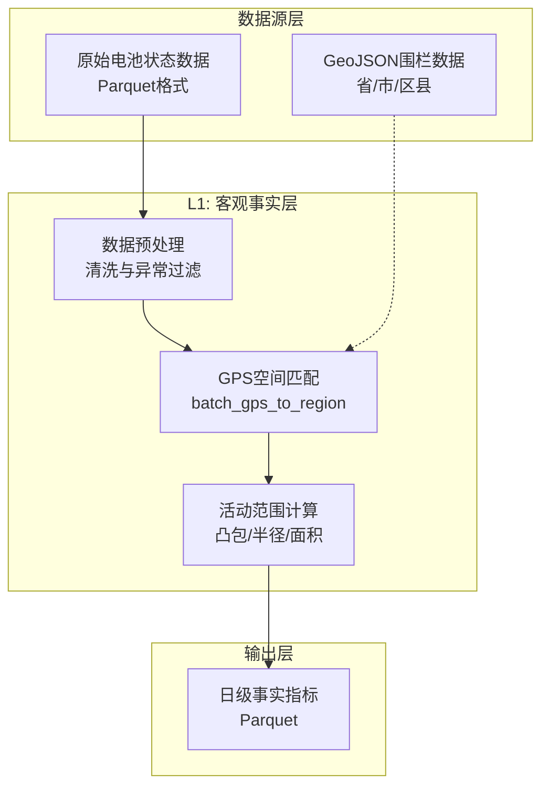
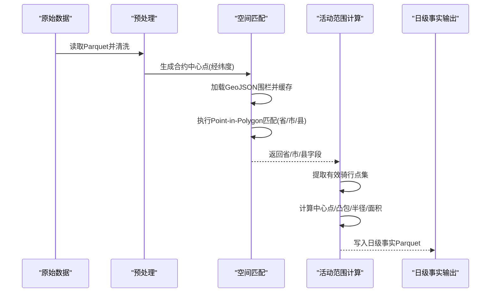
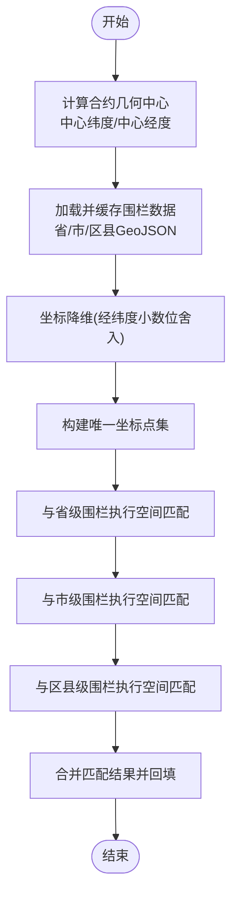
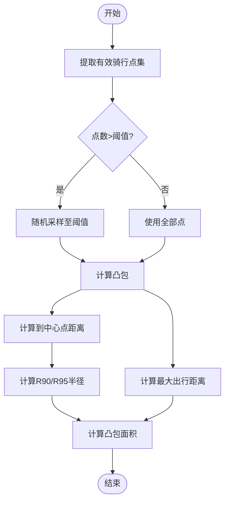
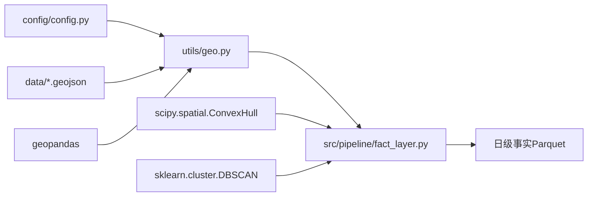

# 地理空间分析架构

<cite>
**本文引用的文件**
- [utils/geo.py](file://utils/geo.py)
- [src/pipeline/fact_layer.py](file://src/pipeline/fact_layer.py)
- [config/config.py](file://config/config.py)
- [requirements.txt](file://requirements.txt)
- [README.md](file://README.md)
- [src/pipeline/score_common.py](file://src/pipeline/score_common.py)
</cite>

## 目录
1. [简介](#简介)
2. [项目结构](#项目结构)
3. [核心组件](#核心组件)
4. [架构概览](#架构概览)
5. [详细组件分析](#详细组件分析)
6. [依赖关系分析](#依赖关系分析)
7. [性能考量](#性能考量)
8. [故障排查指南](#故障排查指南)
9. [结论](#结论)

## 简介
本文件面向两轮车换电用户特征画像系统的地理空间分析架构，重点阐述以下内容：
- GPS坐标匹配算法的实现原理与性能优化
- GeoJSON围栏数据的加载与解析流程
- 空间匹配算法如何将用户GPS轨迹与地理围栏进行关联
- 活动范围与区域停留时间的计算方法
- 地理空间索引优化策略与大规模轨迹数据的空间查询效率
- 地理围栏管理的增删改查与动态更新机制
- 活动范围计算中的聚类分析与密度估计方法
- 与外部GIS系统的集成接口与数据交换格式

## 项目结构
系统采用分层流水线架构，地理空间分析位于L1客观事实层，围绕GPS数据与行政区划围栏进行空间匹配与活动范围计算，并为上层提供用户画像所需的地理维度特征。

图表来源
- [README.md: L1数据流:194-211](file://README.md#L194-L211)
- [utils/geo.py: 围栏加载与匹配:52-91](file://utils/geo.py#L52-L91)
- [src/pipeline/fact_layer.py: 活动范围计算:401-470](file://src/pipeline/fact_layer.py#L401-L470)

章节来源
- [README.md: L1数据流:194-211](file://README.md#L194-L211)
- [README.md: 整体架构:81-134](file://README.md#L81-L134)

## 核心组件
- 围栏数据加载与缓存：负责从本地GeoJSON文件读取省/市/区县边界，统一坐标系并缓存，避免重复I/O。
- GPS空间匹配：对每个合约的几何中心点执行Point-in-Polygon匹配，按省→市→县顺序细化。
- 活动范围计算：基于有效骑行点集计算凸包、半径与覆盖面积，同时计算中心点与最大出行距离。
- 聚类与密度估计：在更高层（如ML模块）使用DBSCAN进行位置聚类，识别高频停留区域与异常模式。

章节来源
- [utils/geo.py: load_fence_data/batch_gps_to_region:52-161](file://utils/geo.py#L52-L161)
- [src/pipeline/fact_layer.py: get_real_center/ConvexHull计算:111-129](file://src/pipeline/fact_layer.py#L111-L129)
- [src/pipeline/fact_layer.py: 活动范围计算:401-470](file://src/pipeline/fact_layer.py#L401-L470)

## 架构概览
地理空间分析在L1层完成，核心流程如下：
- 预处理阶段：清洗无效GPS点、过滤异常漂移速度、去除异常电流/温度等。
- 空间匹配阶段：对每个合约计算几何中心，使用GeoPandas进行批量空间连接，匹配省/市/区县。
- 活动范围阶段：提取有效骑行点，计算中心点、凸包、半径与覆盖面积，生成活动范围指标。

图表来源
- [src/pipeline/fact_layer.py: 预处理与活动范围计算:135-569](file://src/pipeline/fact_layer.py#L135-L569)
- [utils/geo.py: 围栏加载与匹配:52-161](file://utils/geo.py#L52-L161)

## 详细组件分析

### GPS坐标匹配算法
- 匹配对象：每个合约的几何中心点（中心纬度/中心经度），而非原始采样点。
- 匹配策略：使用GeoPandas的空间连接（sjoin）与shapely的within判断，按省→市→县顺序逐级细化。
- 性能优化：
  - 坐标降维：对经纬度进行小数位舍入，减少唯一坐标数量。
  - 批量处理：将唯一坐标封装为GeoDataFrame，一次性执行空间匹配。
  - 缓存机制：围栏数据仅加载一次并缓存，避免重复I/O。
  - 错误处理：对单个层级匹配失败进行降级处理，保证整体流程稳定。

图表来源
- [utils/geo.py: batch_gps_to_region:93-161](file://utils/geo.py#L93-L161)

章节来源
- [utils/geo.py: load_fence_data:52-91](file://utils/geo.py#L52-L91)
- [utils/geo.py: batch_gps_to_region:93-161](file://utils/geo.py#L93-L161)
- [README.md: GPS空间匹配算法:1041-1061](file://README.md#L1041-L1061)

### GeoJSON围栏数据加载与解析
- 数据来源：项目内data目录下的中国_省.geojson、中国_市.geojson、中国_县.geojson。
- 解析流程：
  - 读取文件并统一坐标系为EPSG:4326。
  - 自动识别名称字段（优先英文name，其次中文名称/省/市/县）。
  - 仅保留名称列与geometry列，重命名为“核心活动省份/城市/区县”。
- 缓存策略：全局缓存加载结果，首次访问后直接复用。

章节来源
- [config/config.py: GeoJSON路径配置:29-33](file://config/config.py#L29-L33)
- [utils/geo.py: load_fence_data:52-91](file://utils/geo.py#L52-L91)

### 活动范围计算与区域停留时间
- 中心点计算：对有效骑行点进行去异常值的中心点估计，避免极端GPS漂移影响。
- 凸包与半径：
  - 提取有效骑行点集合，若点数超过阈值则进行随机采样，防止凸包计算复杂度过高。
  - 计算凸包顶点集，进一步计算到中心点的距离分布，得到R90/R95活动半径。
  - 若点集呈现极长宽比，采用距离矩阵上三角的最大值作为最大出行距离。
- 覆盖面积：将经纬度投影到局部平面坐标系，计算凸包面积并转换为等效圆半径。
- 区域停留时间：当前L1层未直接计算停留时长，但活动范围指标（半径、面积、中心点）为后续停留时间分析提供基础。

图表来源
- [src/pipeline/fact_layer.py: 活动范围计算:401-470](file://src/pipeline/fact_layer.py#L401-L470)

章节来源
- [src/pipeline/fact_layer.py: get_real_center:111-129](file://src/pipeline/fact_layer.py#L111-L129)
- [src/pipeline/fact_layer.py: 活动范围计算:401-470](file://src/pipeline/fact_layer.py#L401-L470)

### 聚类分析与密度估计
- 在更高层（如ML模块）使用DBSCAN对位置点进行聚类，识别高频停留区域与异常模式。
- 参数选择：邻域半径eps采用特征标准差中位数，min_samples为5，噪声点label=-1。
- 应用价值：为用户行为规律性、区域转移次数等特征提供聚类基础。

章节来源
- [src/pipeline/fact_layer.py: 导入库:20-22](file://src/pipeline/fact_layer.py#L20-L22)
- [ML模型说明.md: DBSCAN参数:172-178](file://ML模型说明.md#L172-L178)

### 地理空间索引优化策略
- 围栏数据缓存：仅加载一次并全局缓存，避免重复I/O。
- 坐标降维：对经纬度进行小数位舍入，减少唯一坐标数量，显著降低空间匹配成本。
- 批量处理：将唯一坐标封装为GeoDataFrame，一次性执行空间连接，减少循环开销。
- 凸包采样：对大量点集进行随机采样，控制凸包计算复杂度。
- 错误降级：单层级匹配失败时进行降级处理，保证整体流程稳定。

章节来源
- [utils/geo.py: 缓存与批量处理:48-161](file://utils/geo.py#L48-L161)
- [src/pipeline/fact_layer.py: 凸包采样与异常处理:410-465](file://src/pipeline/fact_layer.py#L410-L465)

### 地理围栏管理与动态更新机制
- 增删改查：通过替换data目录下的GeoJSON文件实现增删改；解析逻辑自动识别名称字段并重命名。
- 动态更新：当前系统通过缓存机制避免重复加载；若需热更新，可在重新加载时清空缓存并重新读取。
- 配置管理：围栏文件路径在配置模块中集中管理，便于维护与切换。

章节来源
- [config/config.py: GeoJSON路径配置:29-33](file://config/config.py#L29-L33)
- [utils/geo.py: 围栏加载与缓存:52-91](file://utils/geo.py#L52-L91)

### 与外部GIS系统的集成接口与数据交换格式
- 数据交换格式：系统内部使用Parquet进行高效存储与传输；对外报告输出支持CSV/JSON/TXT。
- GIS集成：系统通过GeoPandas读取GeoJSON围栏数据，实现与主流GIS数据格式的对接。
- 外部系统对接：可将L1日级事实输出作为外部GIS系统的基础数据源，结合业务规则进行二次加工。

章节来源
- [README.md: 输出格式:381-385](file://README.md#L381-L385)
- [README.md: 报告输出层:702-722](file://README.md#L702-L722)
- [requirements.txt: GeoPandas依赖](file://requirements.txt#L9)

## 依赖关系分析

图表来源
- [config/config.py: GeoJSON路径:29-33](file://config/config.py#L29-L33)
- [utils/geo.py: 依赖声明:10-12](file://utils/geo.py#L10-L12)
- [src/pipeline/fact_layer.py: 依赖声明:18-22](file://src/pipeline/fact_layer.py#L18-L22)

章节来源
- [requirements.txt: 依赖列表:1-9](file://requirements.txt#L1-L9)
- [config/config.py: GeoJSON路径配置:29-33](file://config/config.py#L29-L33)

## 性能考量
- I/O优化：围栏数据缓存与路径集中配置，减少重复读取。
- 计算优化：坐标降维与批量空间匹配，显著降低匹配成本。
- 算法优化：凸包采样与异常值剔除，提升几何计算稳定性与效率。
- 并行与批处理：利用pandas与GeoPandas的向量化操作，配合tqdm进度显示，提升吞吐量。

## 故障排查指南
- 围栏文件未找到名称字段：解析逻辑会抛出错误，需确认GeoJSON中存在名称字段（优先英文name，其次中文名称/省/市/县）。
- 空间匹配失败：单层级匹配失败会降级返回空字符串，检查坐标系是否为EPSG:4326以及围栏数据是否完整。
- 凸包计算异常：当点集极长宽比或样本不足时，系统会进行异常分支处理，必要时增加有效骑行点数量或调整采样阈值。
- 性能问题：若匹配耗时较长，检查坐标降维粒度与批量大小，适当调整采样阈值与缓存策略。

章节来源
- [utils/geo.py: 名称字段查找与错误处理:65-79](file://utils/geo.py#L65-L79)
- [utils/geo.py: 空间匹配失败降级:139-140](file://utils/geo.py#L139-L140)
- [src/pipeline/fact_layer.py: 凸包异常处理:464-465](file://src/pipeline/fact_layer.py#L464-L465)

## 结论
本地理空间分析架构以L1层为核心，围绕GPS数据与GeoJSON围栏实现了高效的坐标匹配与活动范围计算。通过缓存、降维、批量处理与异常降级等策略，系统在保证准确性的同时兼顾了大规模轨迹数据的处理效率。未来可在L2/L3层引入更精细的停留时间分析与聚类特征，进一步丰富用户地理画像维度。