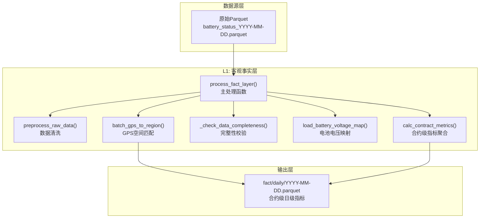
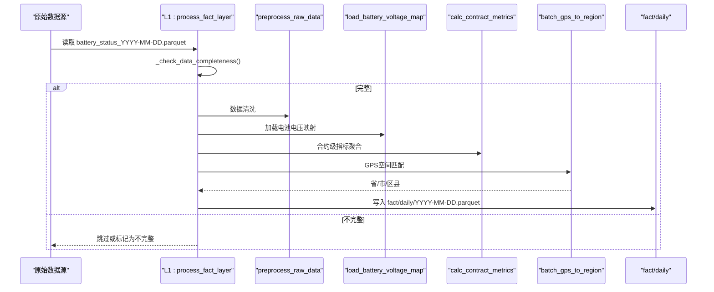
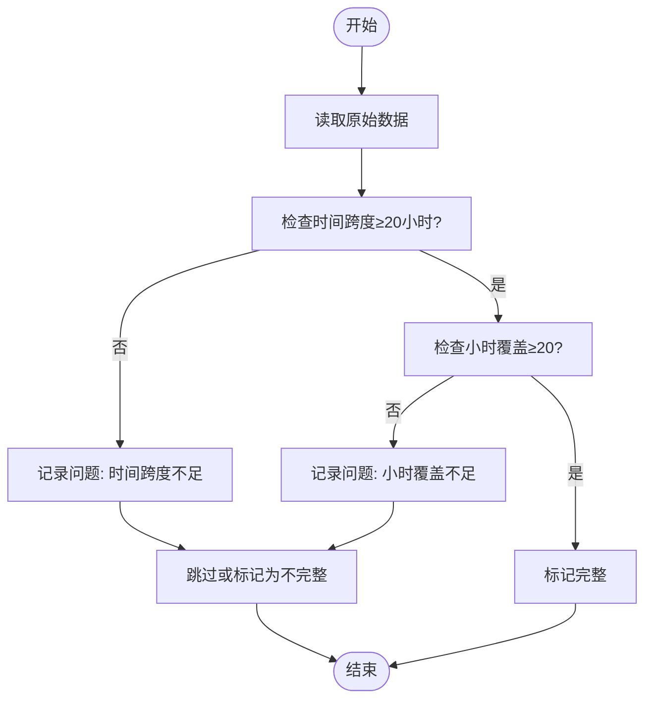
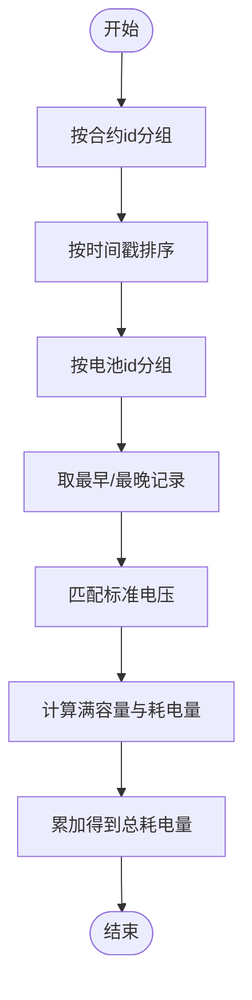
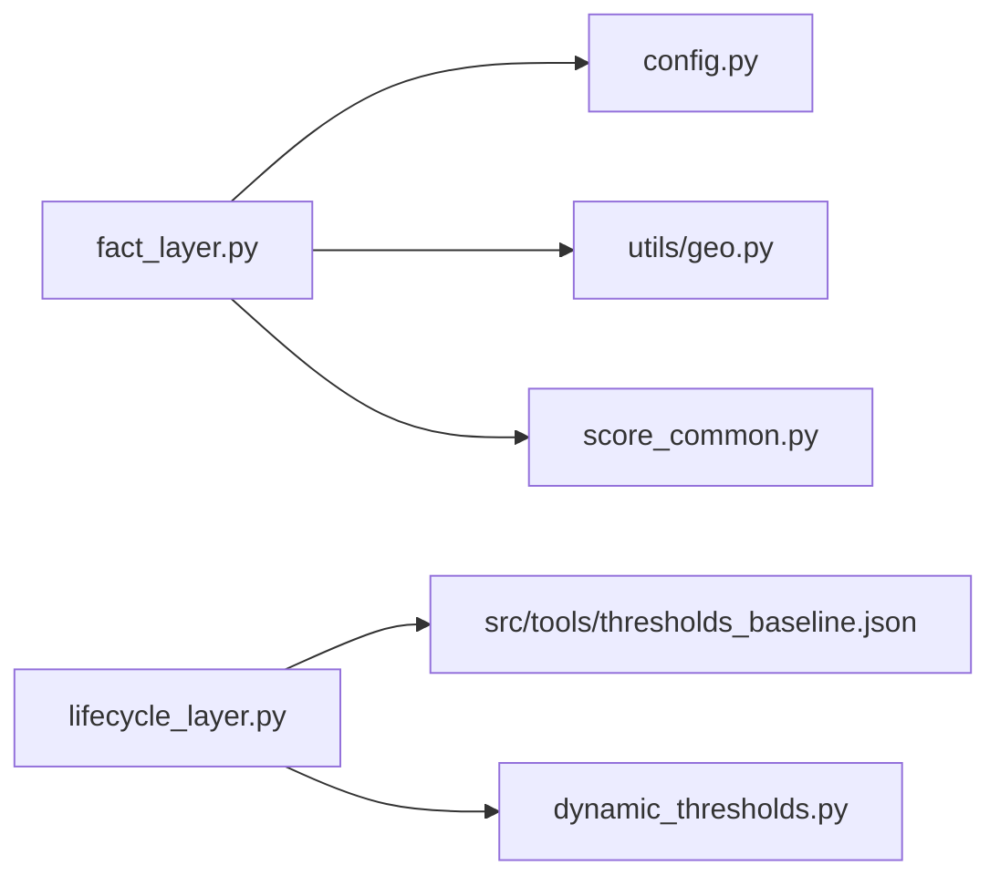

# L1客观事实层

<cite>
**本文引用的文件**
- [src/pipeline/fact_layer.py](file://src/pipeline/fact_layer.py)
- [src/pipeline/run_pipeline.py](file://src/pipeline/run_pipeline.py)
- [config/config.py](file://config/config.py)
- [README.md](file://README.md)
- [src/pipeline/score_common.py](file://src/pipeline/score_common.py)
- [src/pipeline/dynamic_thresholds.py](file://src/pipeline/dynamic_thresholds.py)
- [src/tools/thresholds_baseline.json](file://src/tools/thresholds_baseline.json)
- [utils/geo.py](file://utils/geo.py)
</cite>

## 目录
1. [简介](#简介)
2. [项目结构](#项目结构)
3. [核心组件](#核心组件)
4. [架构概览](#架构概览)
5. [详细组件分析](#详细组件分析)
6. [依赖关系分析](#依赖关系分析)
7. [性能考量](#性能考量)
8. [故障排查指南](#故障排查指南)
9. [结论](#结论)
10. [附录](#附录)

## 简介
L1客观事实层负责将每日原始电池状态数据转换为结构化的合约日级指标，严格遵循“可观测物理事实”原则，不包含任何业务推断。其核心职责包括：
- 数据完整性校验与缺失/异常值处理
- 原始数据清洗与预处理
- 基于SOC差法的电量计算
- 骑行距离、速度、电流、温度等指标统计
- GPS空间匹配与活动范围计算
- 车辆形态与用户形态判定
- 包月友好评分与用户等级计算
- 增量处理与日期过滤机制

## 项目结构
L1位于数据流水线的起始层，输入为每日Parquet文件，输出为按日期分区的合约级日级事实表。

**图表来源**
- [src/pipeline/fact_layer.py:1101-1227](file://src/pipeline/fact_layer.py#L1101-L1227)
- [src/pipeline/fact_layer.py:1064-1096](file://src/pipeline/fact_layer.py#L1064-L1096)
- [src/pipeline/fact_layer.py:135-216](file://src/pipeline/fact_layer.py#L135-L216)
- [src/pipeline/fact_layer.py:238-1058](file://src/pipeline/fact_layer.py#L238-L1058)
- [utils/geo.py:93-140](file://utils/geo.py#L93-L140)

**章节来源**
- [README.md:160-211](file://README.md#L160-L211)
- [config/config.py:47-51](file://config/config.py#L47-L51)

## 核心组件
- process_fact_layer：L1主入口，负责扫描原始文件、完整性校验、数据清洗、指标计算、GPS匹配与输出。
- preprocess_raw_data：清洗原始数据，过滤无效记录与异常值。
- calc_contract_metrics：按合约维度聚合日级指标，包含电量、骑行、电流、温度、空间活动、车辆/用户形态、评分与等级等。
- _check_data_completeness：数据完整性校验，确保时间跨度与小时覆盖满足阈值。
- load_battery_voltage_map：加载电池标准电压映射，用于SOC差法电量计算。
- batch_gps_to_region：将中心经纬度匹配到省/市/区县三级地理围栏。

**章节来源**
- [src/pipeline/fact_layer.py:1101-1227](file://src/pipeline/fact_layer.py#L1101-L1227)
- [src/pipeline/fact_layer.py:135-216](file://src/pipeline/fact_layer.py#L135-L216)
- [src/pipeline/fact_layer.py:238-1058](file://src/pipeline/fact_layer.py#L238-L1058)
- [src/pipeline/fact_layer.py:1064-1096](file://src/pipeline/fact_layer.py#L1064-L1096)
- [src/pipeline/fact_layer.py:221-232](file://src/pipeline/fact_layer.py#L221-L232)
- [utils/geo.py:93-140](file://utils/geo.py#L93-L140)

## 架构概览
L1在流水线中作为“事件层”的落地层，将原始事件转换为可聚合的事实表，为L2快照层提供稳定的输入。

**图表来源**
- [src/pipeline/fact_layer.py:1101-1227](file://src/pipeline/fact_layer.py#L1101-L1227)
- [src/pipeline/fact_layer.py:1064-1096](file://src/pipeline/fact_layer.py#L1064-L1096)
- [src/pipeline/fact_layer.py:135-216](file://src/pipeline/fact_layer.py#L135-L216)
- [src/pipeline/fact_layer.py:238-1058](file://src/pipeline/fact_layer.py#L238-L1058)
- [utils/geo.py:93-140](file://utils/geo.py#L93-L140)

## 详细组件分析

### 数据输入与输出格式
- 输入：每日Parquet文件，命名规则 battery_status_YYYY-MM-DD.parquet，存储于配置的电池状态目录。
- 输出：按日期分区的Parquet文件，fact/daily/YYYY-MM-DD.parquet，包含合约级日级指标。
- 字段清单（节选）：统计日期、用户id、合约id、电池id、代理id、时间戳、电压、电流、容量、电池SOC、温度、是否在线、纬度、经度、速度等。

**章节来源**
- [README.md:166-191](file://README.md#L166-L191)
- [config/config.py:25-27](file://config/config.py#L25-L27)
- [config/config.py:48](file://config/config.py#L48)

### 数据完整性检查机制
- 时间跨度阈值：至少20小时。
- 小时覆盖阈值：至少20/24小时。
- 不满足任一条件则标记为“不完整”，可选择跳过或继续处理（通过命令行参数控制）。

**图表来源**
- [src/pipeline/fact_layer.py:1064-1096](file://src/pipeline/fact_layer.py#L1064-L1096)

**章节来源**
- [README.md:213-223](file://README.md#L213-L223)
- [src/pipeline/fact_layer.py:1064-1096](file://src/pipeline/fact_layer.py#L1064-L1096)

### 数据预处理与异常值处理
- 字段类型转换与缺失值处理。
- 速度与电流的虚假值过滤。
- 电流异常值清洗（中位数平滑）。
- 温度过滤（剔除异常高温）。
- GPS过滤（按经纬度范围过滤）。
- 漂移速度过滤（基于相邻点Haversine距离与时间差）。
- 在线状态过滤（剔除离线状态）。

**章节来源**
- [src/pipeline/fact_layer.py:135-216](file://src/pipeline/fact_layer.py#L135-L216)

### 电量计算：SOC差法
- 数学原理：基于电池SOC变化量计算实际消耗电量，避免电流噪声影响。
- 公式：E_kWh = Σ 标准电压_V × (容量_最早 / SOC_最早) / 1000 × (SOC_最早 - SOC_最晚) / 100
- 实现要点：按合约id分组，按时间戳排序；对每段电池id分组取最早与最晚记录；匹配标准电压；累加得到当日总耗电量。
- 优势：不受电流噪声影响，精度更高。

**图表来源**
- [src/pipeline/fact_layer.py:348-384](file://src/pipeline/fact_layer.py#L348-L384)

**章节来源**
- [README.md:262-337](file://README.md#L262-L337)
- [src/pipeline/fact_layer.py:348-384](file://src/pipeline/fact_layer.py#L348-L384)

### 骑行距离统计与速度指标
- 骑行状态判定：基于相邻GPS点的有效位移与时间间隔，使用滚动窗口平滑。
- 有效里程：仅在骑行状态下累加。
- 速度指标：最大速度、平均骑行速度、P50/P90速度、夜间均速、高速点数等。
- 骑行时刻：最早/最晚骑行时刻、主要骑行时段（午间高峰/晚间高峰/平峰/夜间）。

**章节来源**
- [src/pipeline/fact_layer.py:310-570](file://src/pipeline/fact_layer.py#L310-L570)

### 电流与功率指标
- 放电时长：基于电流>0或骑行状态的连续块统计。
- 电流指标：最大电流、骑行放电平均电流、全周期平均电流、电流标准差与变异系数、高峰/平峰电流统计、单行程最大电流统计。
- 功率指标：骑行平均功率、峰值功率、估算车辆功率。
- 超流判定：超过阈值的次数与时长统计。

**章节来源**
- [src/pipeline/fact_layer.py:571-707](file://src/pipeline/fact_layer.py#L571-L707)

### 温度与电池健康度评估
- 最高/最低温度与平均温度。
- SOC健康：平均骑行SOC、最低SOC、SOC低于10%/20%时长占比。
- 电池健康画像：取电/还电SOC统计。

**章节来源**
- [src/pipeline/fact_layer.py:708-801](file://src/pipeline/fact_layer.py#L708-L801)

### 空间活动与地理匹配
- 中心经纬度：基于有效GPS点的稳健中心估计。
- 活动范围：凸包覆盖面积、R90/R95活动半径、最大出行距离。
- 地理匹配：省/市/区县三级围栏匹配，使用GeoPandas空间连接。

**章节来源**
- [src/pipeline/fact_layer.py:401-471](file://src/pipeline/fact_layer.py#L401-L471)
- [utils/geo.py:93-140](file://utils/geo.py#L93-L140)

### 车辆形态与用户形态判定
- 车辆形态：基于最高速度的国标分级，结合峰值功率与持续大电流进行改装/超速检测。
- 用户形态：基于骑行时长、高峰占比、活动范围等特征，区分专送/众包/标准/普通/地摊/储能/数据不足。

**章节来源**
- [src/pipeline/fact_layer.py:882-949](file://src/pipeline/fact_layer.py#L882-L949)

### 包月友好评分与用户等级
- 包月友好分：综合速度、温度、电流、SOC、电耗、换电次数等维度的扣分模型。
- 用户等级：基于评分与风险特征的等级判定（优质/良好/普通/高损耗/暴力/沉默/观察期）。

**章节来源**
- [src/pipeline/fact_layer.py:950-995](file://src/pipeline/fact_layer.py#L950-L995)
- [src/pipeline/score_common.py:30-137](file://src/pipeline/score_common.py#L30-L137)
- [src/pipeline/score_common.py:140-194](file://src/pipeline/score_common.py#L140-L194)

### 增量处理与日期过滤
- process_fact_layer支持target_date参数，仅处理指定日期；若为None，则自动扫描所有未处理的历史日期。
- 自动跳过已存在的输出文件与当天数据。
- 增量模式由顶层run_pipeline统一调度，返回新增日期集合供后续层使用。

**章节来源**
- [src/pipeline/fact_layer.py:1101-1153](file://src/pipeline/fact_layer.py#L1101-L1153)
- [src/pipeline/run_pipeline.py:135-166](file://src/pipeline/run_pipeline.py#L135-L166)

## 依赖关系分析
- 外部依赖：pandas、numpy、pyarrow（Parquet）、scipy（凸包）、sklearn（DBSCAN）、geopandas（空间匹配）。
- 内部依赖：config配置、utils.geo地理匹配、score_common评分与等级逻辑。
- 动态阈值：L3层使用DynamicBatteryAnalyzer与阈值基准文件进行自适应阈值计算。

**图表来源**
- [src/pipeline/fact_layer.py:30-36](file://src/pipeline/fact_layer.py#L30-L36)
- [src/pipeline/score_common.py:1-6](file://src/pipeline/score_common.py#L1-L6)
- [src/pipeline/dynamic_thresholds.py:253-277](file://src/pipeline/dynamic_thresholds.py#L253-L277)
- [src/tools/thresholds_baseline.json:1-141](file://src/tools/thresholds_baseline.json#L1-L141)

**章节来源**
- [src/pipeline/fact_layer.py:30-36](file://src/pipeline/fact_layer.py#L30-L36)
- [src/pipeline/dynamic_thresholds.py:253-277](file://src/pipeline/dynamic_thresholds.py#L253-L277)
- [src/tools/thresholds_baseline.json:1-141](file://src/tools/thresholds_baseline.json#L1-L141)

## 性能考量
- Parquet列式存储：高效压缩与查询，适合大规模日级事实表。
- 批量处理与分组：按合约id分组聚合，减少重复计算。
- 空间匹配优化：坐标降维与缓存，提升GeoPandas空间连接性能。
- 增量处理：自动跳过已处理日期，避免重复计算。

[本节为通用性能讨论，无需特定文件引用]

## 故障排查指南
- 未找到原始数据文件：检查原始目录是否存在且命名规范。
- 数据不完整：查看跳过日期日志，确认时间跨度与小时覆盖是否达标。
- GPS匹配失败：确认地理围栏文件存在且投影一致。
- 电池电压映射缺失：系统将使用默认电压，建议尽快补齐映射表。
- 温度异常：特定日期温度数据已被替换为默认值，需检查数据源。

**章节来源**
- [src/pipeline/fact_layer.py:1126-1135](file://src/pipeline/fact_layer.py#L1126-L1135)
- [src/pipeline/fact_layer.py:1171-1180](file://src/pipeline/fact_layer.py#L1171-L1180)
- [src/pipeline/fact_layer.py:1166-1170](file://src/pipeline/fact_layer.py#L1166-L1170)
- [src/pipeline/fact_layer.py:221-232](file://src/pipeline/fact_layer.py#L221-L232)

## 结论
L1客观事实层通过严格的完整性校验、稳健的数据清洗与SOC差法电量计算，构建了高质量的合约日级事实表，为后续L2/L3/L4层提供了可靠的数据基础。其Parquet列式存储与增量处理机制确保了系统的可扩展性与运行效率。

[本节为总结性内容，无需特定文件引用]

## 附录

### 关键函数与参数说明
- process_fact_layer(target_date=None, skip_incomplete=True)
  - 参数：target_date（目标日期）、skip_incomplete（是否跳过不完整日期）
  - 返回：(processed, new_dates, skipped_dates) 三元组
- preprocess_raw_data(df_raw)
  - 输入：原始DataFrame
  - 输出：清洗后的DataFrame
- calc_contract_metrics(df_sorted, battery_voltage_map=None)
  - 输入：清洗后的DataFrame与电池电压映射
  - 输出：合约级日级指标DataFrame
- _check_data_completeness(df_raw, date_str)
  - 输入：原始DataFrame与日期字符串
  - 输出：(is_complete, reason) 元组
- load_battery_voltage_map(battery_csv_path)
  - 输入：电池电压映射文件路径
  - 输出：电池id→标准电压映射字典
- batch_gps_to_region(df, lat_col, lon_col)
  - 输入：包含中心经纬度的DataFrame
  - 输出：省/市/区县匹配结果

**章节来源**
- [src/pipeline/fact_layer.py:1101-1227](file://src/pipeline/fact_layer.py#L1101-L1227)
- [src/pipeline/fact_layer.py:135-216](file://src/pipeline/fact_layer.py#L135-L216)
- [src/pipeline/fact_layer.py:238-1058](file://src/pipeline/fact_layer.py#L238-L1058)
- [src/pipeline/fact_layer.py:1064-1096](file://src/pipeline/fact_layer.py#L1064-L1096)
- [src/pipeline/fact_layer.py:221-232](file://src/pipeline/fact_layer.py#L221-L232)
- [utils/geo.py:93-140](file://utils/geo.py#L93-L140)