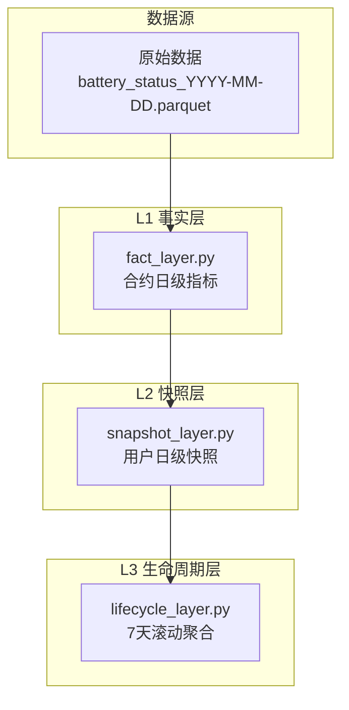
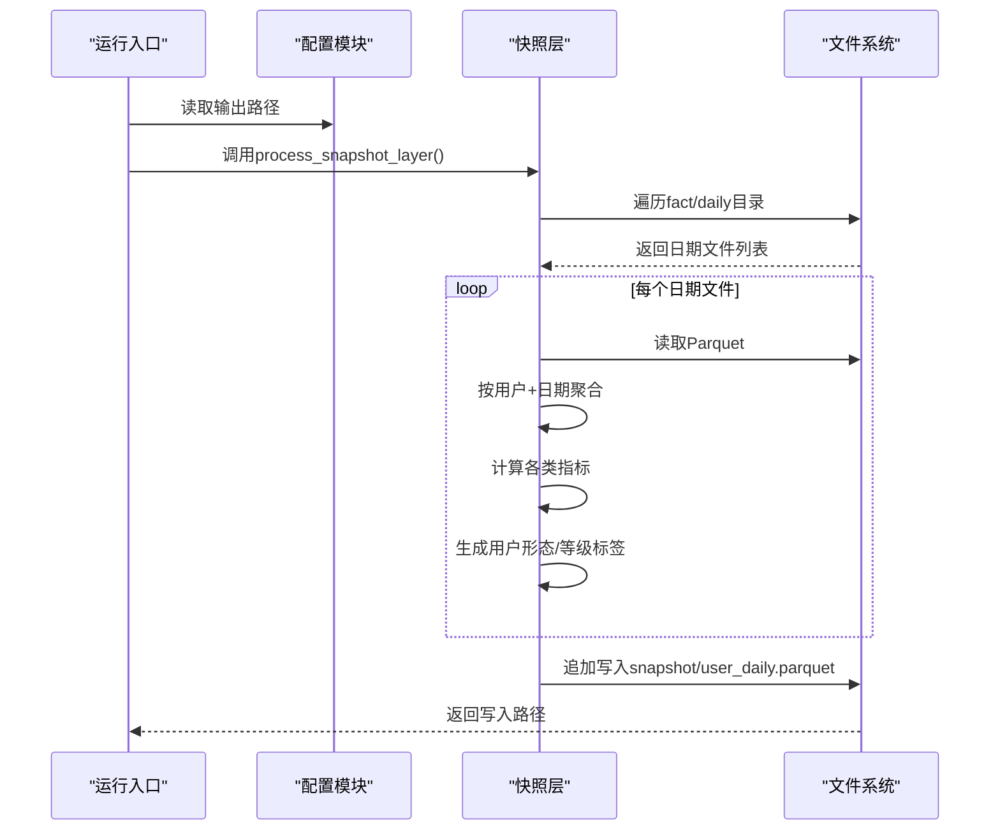
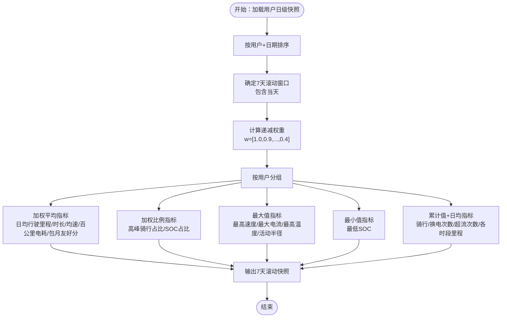
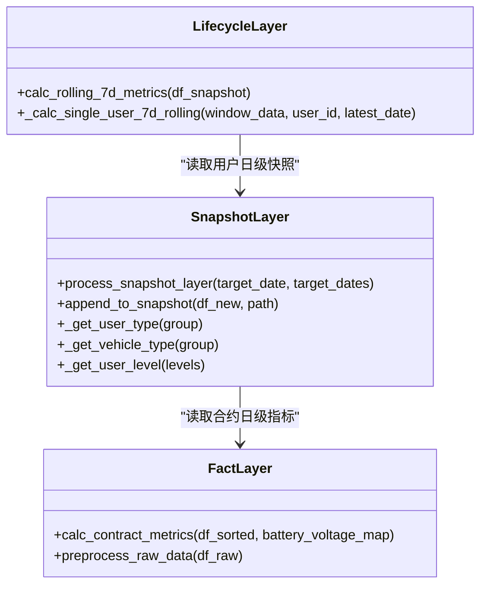
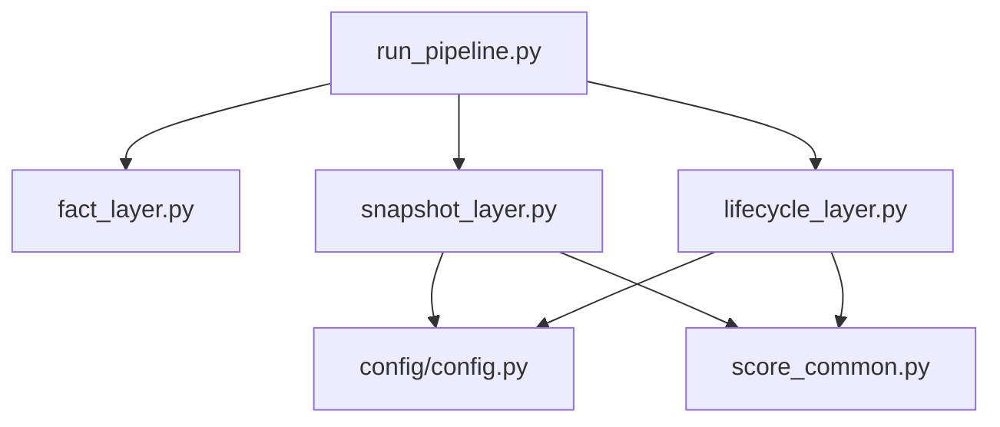

# L2用户快照层

<cite>
**本文引用的文件**
- [README.md](file://README.md)
- [config/config.py](file://config/config.py)
- [src/pipeline/snapshot_layer.py](file://src/pipeline/snapshot_layer.py)
- [src/pipeline/fact_layer.py](file://src/pipeline/fact_layer.py)
- [src/pipeline/lifecycle_layer.py](file://src/pipeline/lifecycle_layer.py)
- [src/pipeline/run_pipeline.py](file://src/pipeline/run_pipeline.py)
- [src/pipeline/score_common.py](file://src/pipeline/score_common.py)
- [docs/报告逻辑及计算方法.md](file://docs/报告逻辑及计算方法.md)
- [docs/用户运营分析报告.md](file://docs/用户运营分析报告.md)
- [tests/test_pipeline.py](file://tests/test_pipeline.py)
</cite>

## 目录
1. [简介](#简介)
2. [项目结构](#项目结构)
3. [核心组件](#核心组件)
4. [架构概览](#架构概览)
5. [详细组件分析](#详细组件分析)
6. [依赖分析](#依赖分析)
7. [性能考虑](#性能考虑)
8. [故障排查指南](#故障排查指南)
9. [结论](#结论)
10. [附录](#附录)

## 简介
L2用户快照层负责将L1层产生的合约日级事实数据聚合为用户维度的7天滚动窗口快照，形成稳定的用户级指标数据集，供L3生命周期层进一步评分、分类与画像。本层的关键职责包括：
- 从L1输出的fact/daily目录读取历史Parquet文件
- 按用户+日期进行聚合，生成用户日级快照
- 追加写入snapshot/user_daily.parquet，保留历史并支持增量更新
- 为L3层7天滚动聚合提供输入数据

## 项目结构
L2快照层位于数据流水线的第二层，上游依赖L1的事实层，下游服务于L3的生命周期层。其核心文件与职责如下：
- 配置层：config/config.py 定义输入输出路径与全局常量
- L1事实层：src/pipeline/fact_layer.py 产出合约日级指标
- L2快照层：src/pipeline/snapshot_layer.py 聚合用户日级快照
- L3生命周期层：src/pipeline/lifecycle_layer.py 读取L2输出进行7天滚动聚合
- 运行入口：src/pipeline/run_pipeline.py 统一调度各层执行

**图表来源**
- [README.md: 138-143:138-143](file://README.md#L138-L143)
- [config/config.py: 47-50:47-50](file://config/config.py#L47-L50)
- [src/pipeline/snapshot_layer.py: 1-10:1-10](file://src/pipeline/snapshot_layer.py#L1-L10)
- [src/pipeline/fact_layer.py: 1-10:1-10](file://src/pipeline/fact_layer.py#L1-L10)
- [src/pipeline/lifecycle_layer.py: 1-10:1-10](file://src/pipeline/lifecycle_layer.py#L1-L10)

**章节来源**
- [README.md: 138-143:138-143](file://README.md#L138-L143)
- [config/config.py: 47-50:47-50](file://config/config.py#L47-L50)

## 核心组件
- 配置模块：提供输入输出路径、测试模式开关与基础路径拼接函数
- 快照聚合函数：process_snapshot_layer，负责读取L1输出、按用户聚合、生成用户日级指标
- 追加写入函数：append_to_snapshot，支持历史数据合并、Schema对齐与去重
- 用户形态与等级判定：提供用户形态与等级的综合判定逻辑，用于快照层的定制化聚合
- 评分与阈值：score_common.py 提供包月友好分与用户等级判定的阈值常量

**章节来源**
- [config/config.py: 17-54:17-54](file://config/config.py#L17-L54)
- [src/pipeline/snapshot_layer.py: 212-447:212-447](file://src/pipeline/snapshot_layer.py#L212-L447)
- [src/pipeline/score_common.py: 8-28:8-28](file://src/pipeline/score_common.py#L8-L28)

## 架构概览
L2快照层的处理流程如下：
- 读取L1输出目录下的所有Parquet文件
- 按统计日期与用户id进行分组聚合
- 计算各类指标（求和、均值、最大值、占比等）
- 生成用户形态与等级的综合标签
- 追加写入用户日级快照文件

**图表来源**
- [src/pipeline/run_pipeline.py: 135-165:135-165](file://src/pipeline/run_pipeline.py#L135-L165)
- [src/pipeline/snapshot_layer.py: 212-447:212-447](file://src/pipeline/snapshot_layer.py#L212-L447)
- [config/config.py: 47-50:47-50](file://config/config.py#L47-L50)

## 详细组件分析

### 7天滚动窗口聚合实现原理
- 时间窗口：以“最近7天（含当天）”为窗口，按用户维度进行滚动聚合
- 权重设计：采用递减权重序列，最近一天权重最高，7天前权重最低
- 聚合方式：
  - 加权平均：日均行驶里程、骑行时长、均速、百公里电耗、包月友好分等
  - 加权比例：高峰骑行占比、SOC低于20%/10%占比等
  - 最大值：最高速度、最大电流、最高温度、活动半径等
  - 最小值：最低SOC
  - 累计值与日均：骑行次数、换电次数、超流次数、各时段里程等

**图表来源**
- [src/pipeline/lifecycle_layer.py: 186-447:186-447](file://src/pipeline/lifecycle_layer.py#L186-L447)
- [docs/报告逻辑及计算方法.md: 372-416:372-416](file://docs/报告逻辑及计算方法.md#L372-L416)

**章节来源**
- [src/pipeline/lifecycle_layer.py: 186-447:186-447](file://src/pipeline/lifecycle_layer.py#L186-L447)
- [docs/报告逻辑及计算方法.md: 372-416:372-416](file://docs/报告逻辑及计算方法.md#L372-L416)

### 数据对齐与聚合计算过程
- 数据对齐：读取L1输出的合约日级指标，按“统计日期+用户id”进行分组
- 聚合计算：对数值型、占比型、计数型指标分别采用sum、mean、max、min等聚合方式
- 加权聚合：对涉及时间权重的指标（如日均、占比）使用加权平均/加权比例
- 用户形态与等级：基于日级标签进行综合判定，优先级考虑“改装/超速车”“地摊/储能”等特殊形态

**图表来源**
- [src/pipeline/snapshot_layer.py: 212-447:212-447](file://src/pipeline/snapshot_layer.py#L212-L447)
- [src/pipeline/fact_layer.py: 238-800:238-800](file://src/pipeline/fact_layer.py#L238-L800)
- [src/pipeline/lifecycle_layer.py: 186-596:186-596](file://src/pipeline/lifecycle_layer.py#L186-L596)

**章节来源**
- [src/pipeline/snapshot_layer.py: 212-447:212-447](file://src/pipeline/snapshot_layer.py#L212-L447)
- [src/pipeline/fact_layer.py: 238-800:238-800](file://src/pipeline/fact_layer.py#L238-L800)
- [src/pipeline/lifecycle_layer.py: 186-596:186-596](file://src/pipeline/lifecycle_layer.py#L186-L596)

### 用户级指标计算方法
- 7日均值：对日指标进行加权平均，权重随距今天数递减
- 峰值：取最近7天内的最大值
- 波动率：通过电流变异系数、速度变异系数等指标衡量
- 占比类指标：以骑行时长为分母的加权比例，如高峰骑行占比、SOC低于20%/10%占比
- 累计与日均：总骑行次数、总换电次数、超流次数等累计值除以有效天数得到日均

**章节来源**
- [docs/报告逻辑及计算方法.md: 372-416:372-416](file://docs/报告逻辑及计算方法.md#L372-L416)
- [src/pipeline/lifecycle_layer.py: 165-184:165-184](file://src/pipeline/lifecycle_layer.py#L165-L184)

### 快照数据存储格式与索引设计
- 存储格式：Parquet（列式存储，压缩比高，适合大规模数据分析）
- 写入策略：追加写入，按“用户id+统计日期”去重，保留历史记录
- Schema对齐：自动对齐新旧表的列结构，处理类型差异（如string/large_string），缺失列自动补齐
- 查询与更新：支持按日期增量模式（target_dates）与单日期模式（target_date），便于局部重跑与修复

**章节来源**
- [src/pipeline/snapshot_layer.py: 157-209:157-209](file://src/pipeline/snapshot_layer.py#L157-L209)
- [src/pipeline/run_pipeline.py: 168-186:168-186](file://src/pipeline/run_pipeline.py#L168-L186)

### 聚合逻辑配置选项
- 时间粒度：支持按日聚合，7天滚动窗口通过L3层实现
- 统计维度：涵盖电量、骑行、电流、SOC、换电、速度、空间活动等维度
- 配置参数：权重序列、阈值常量（来自score_common.py）等
- 执行模式：全量重建、增量处理、刷新聚合、重新评级、仅报告等

**章节来源**
- [src/pipeline/lifecycle_layer.py: 32-33:32-33](file://src/pipeline/lifecycle_layer.py#L32-L33)
- [src/pipeline/score_common.py: 8-28:8-28](file://src/pipeline/score_common.py#L8-L28)
- [src/pipeline/run_pipeline.py: 104-165:104-165](file://src/pipeline/run_pipeline.py#L104-L165)

### process_snapshot_layer函数使用示例
- 基本用法：process_snapshot_layer(target_date=None) 处理所有可用日期
- 增量模式：process_snapshot_layer(target_dates={...}) 指定新增日期集合
- 单日期模式：process_snapshot_layer(target_date="YYYY-MM-DD") 处理指定日期
- 批量处理机制：遍历fact/daily目录，按日期筛选并聚合，最终追加写入快照文件

**章节来源**
- [src/pipeline/snapshot_layer.py: 212-447:212-447](file://src/pipeline/snapshot_layer.py#L212-L447)
- [src/pipeline/run_pipeline.py: 135-165:135-165](file://src/pipeline/run_pipeline.py#L135-L165)

### 与L1层的数据依赖关系
- 输入依赖：必须存在fact/daily目录且包含至少一个Parquet文件
- 字段兼容：兼容“骑行放电平均电流”与“平均骑行电流”两种字段名
- 数据完整性：依赖L1层的数据完整性校验，不完整日期会被跳过
- 缺失日期与不一致处理：L2层通过追加写入与去重保证幂等；不完整日期在L3层7天滚动时被剔除

**章节来源**
- [src/pipeline/snapshot_layer.py: 227-267:227-267](file://src/pipeline/snapshot_layer.py#L227-L267)
- [src/pipeline/fact_layer.py: 213-222:213-222](file://src/pipeline/fact_layer.py#L213-L222)

## 依赖分析
- 外部依赖：pandas、numpy、pyarrow（Parquet读写）、scipy（凸包计算）、sklearn（聚类）
- 内部依赖：config/config.py 提供路径配置；score_common.py 提供阈值常量；lifecycle_layer.py 提供7天滚动聚合逻辑
- 耦合关系：L2与L1通过Parquet文件耦合；L3依赖L2输出；各层通过run_pipeline.py统一调度

**图表来源**
- [config/config.py: 17-54:17-54](file://config/config.py#L17-L54)
- [src/pipeline/score_common.py: 1-194:1-194](file://src/pipeline/score_common.py#L1-L194)
- [src/pipeline/run_pipeline.py: 98-101:98-101](file://src/pipeline/run_pipeline.py#L98-L101)

**章节来源**
- [config/config.py: 17-54:17-54](file://config/config.py#L17-L54)
- [src/pipeline/score_common.py: 1-194:1-194](file://src/pipeline/score_common.py#L1-L194)
- [src/pipeline/run_pipeline.py: 98-101:98-101](file://src/pipeline/run_pipeline.py#L98-L101)

## 性能考虑
- 列式存储：Parquet列式布局提升聚合与筛选性能
- 批量处理：按日期批量读取与聚合，减少I/O开销
- 增量模式：通过target_dates实现局部重跑，避免全量重算
- 内存管理：分步聚合与中间结果拼接，避免一次性加载全部历史数据

## 故障排查指南
- 无L1数据：检查fact/daily目录是否存在且包含Parquet文件
- 缺少用户id字段：确保L1输出包含用户id字段并进行类型转换
- Schema不一致：append_to_snapshot会自动对齐列结构，若仍报错需检查字段类型
- 日期缺失：确认目标日期是否在L1输出中存在，或使用增量模式指定新增日期
- 权重与阈值：核对7天滚动权重与评分阈值是否符合预期

**章节来源**
- [src/pipeline/snapshot_layer.py: 227-267:227-267](file://src/pipeline/snapshot_layer.py#L227-L267)
- [src/pipeline/snapshot_layer.py: 157-209:157-209](file://src/pipeline/snapshot_layer.py#L157-L209)
- [src/pipeline/run_pipeline.py: 135-165:135-165](file://src/pipeline/run_pipeline.py#L135-L165)

## 结论
L2用户快照层通过稳健的聚合逻辑与可靠的存储策略，为L3层7天滚动聚合提供了高质量的用户级指标数据。其支持增量处理、Schema自动对齐与幂等写入，能够适应生产环境的复杂数据场景。配合L1层的严格数据完整性校验与L3层的动态阈值评分，形成了完整的用户特征画像流水线。

## 附录
- 示例测试：tests/test_pipeline.py 提供了端到端的Mock数据与流程验证，可用于理解各层输出与聚合逻辑
- 报告与文档：docs/报告逻辑及计算方法.md 与 docs/用户运营分析报告.md 提供了详细的指标定义与业务解读

**章节来源**
- [tests/test_pipeline.py: 358-483:358-483](file://tests/test_pipeline.py#L358-L483)
- [docs/报告逻辑及计算方法.md: 1-571:1-571](file://docs/报告逻辑及计算方法.md#L1-L571)
- [docs/用户运营分析报告.md: 1-278:1-278](file://docs/用户运营分析报告.md#L1-L278)