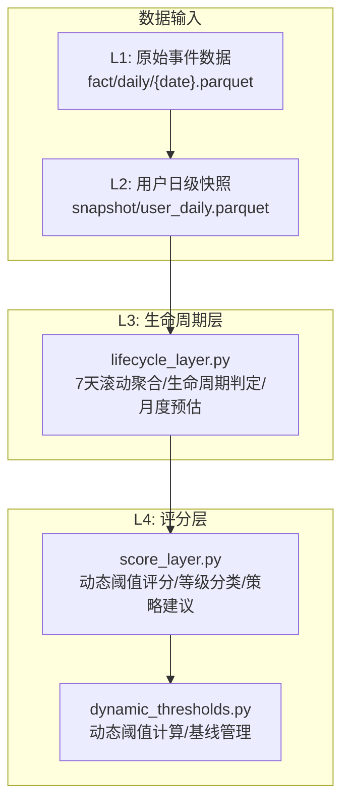
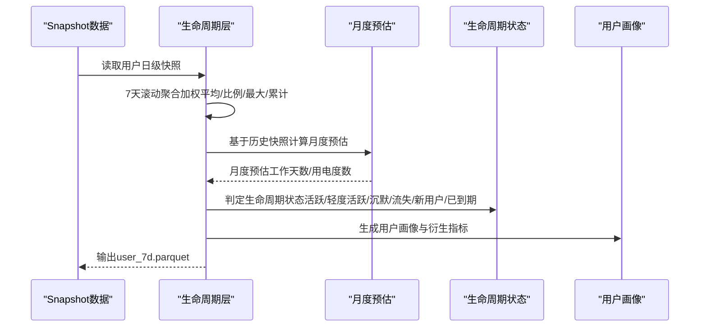
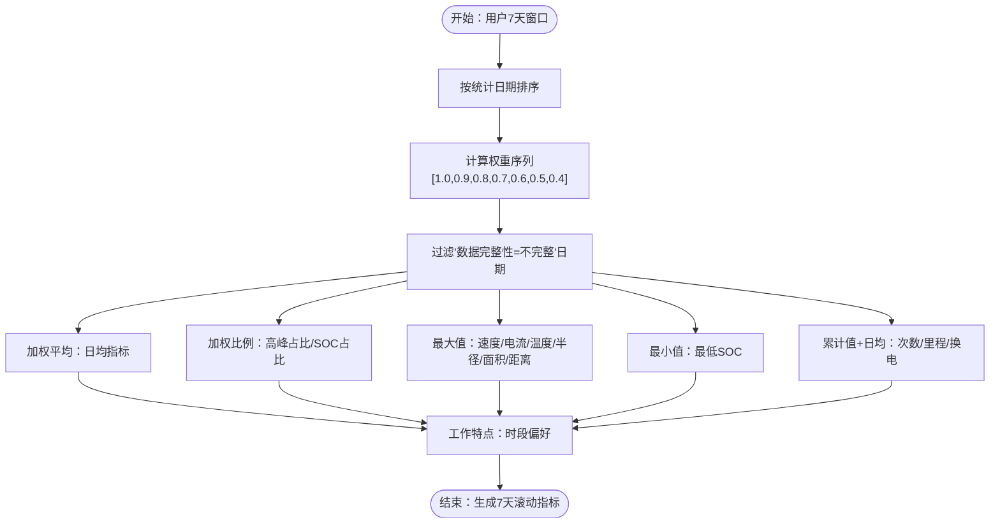
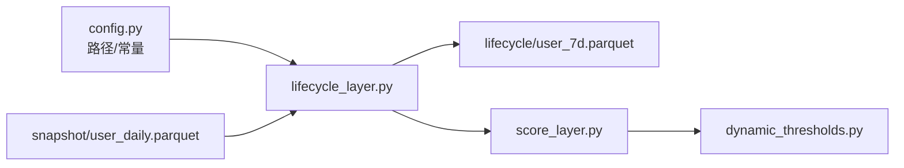

# L3生命周期层

<cite>
**本文引用的文件**
- [lifecycle_layer.py](file://src/pipeline/lifecycle_layer.py)
- [score_layer.py](file://src/pipeline/score_layer.py)
- [dynamic_thresholds.py](file://src/pipeline/dynamic_thresholds.py)
- [fact_layer.py](file://src/pipeline/fact_layer.py)
- [config.py](file://config/config.py)
- [run_pipeline.py](file://src/pipeline/run_pipeline.py)
- [报告逻辑及计算方法.md](file://docs/报告逻辑及计算方法.md)
- [用户运营分析报告.md](file://docs/用户运营分析报告.md)
- [test_pipeline.py](file://tests/test_pipeline.py)
</cite>

## 目录
1. [简介](#简介)
2. [项目结构](#项目结构)
3. [核心组件](#核心组件)
4. [架构概览](#架构概览)
5. [详细组件分析](#详细组件分析)
6. [依赖关系分析](#依赖关系分析)
7. [性能考虑](#性能考虑)
8. [故障排查指南](#故障排查指南)
9. [结论](#结论)
10. [附录](#附录)

## 简介
L3生命周期层负责将L2层的用户日级快照数据转换为7天滚动窗口的用户生命周期档案，包括：
- 7天滚动聚合指标（加权平均、加权比例、最大值、累计值等）
- 月度用电预估
- 生命周期状态识别（活跃/轻度活跃/沉默/流失/新用户/已到期）
- 用户画像（用户形态、工作特点、设备状态监控等）
- 与L2层数据的依赖关系与7日滚动窗口的准确识别
- 异常数据处理与容错设计

## 项目结构
L3生命周期层位于src/pipeline/lifecycle_layer.py，围绕以下核心文件协作：
- 配置文件：config/config.py（路径与常量）
- L2层快照：snapshot/user_daily.parquet（7天滚动窗口所需）
- 动态阈值：src/pipeline/dynamic_thresholds.py（L4层评分依赖）
- L1层事实：fact/daily/{date}.parquet（L2层输入）

图表来源
- [lifecycle_layer.py:1-990](file://src/pipeline/lifecycle_layer.py#L1-L990)
- [score_layer.py:1-524](file://src/pipeline/score_layer.py#L1-L524)
- [dynamic_thresholds.py:1-580](file://src/pipeline/dynamic_thresholds.py#L1-L580)
- [fact_layer.py:1-1227](file://src/pipeline/fact_layer.py#L1-L1227)
- [config.py:1-54](file://config/config.py#L1-L54)

章节来源
- [lifecycle_layer.py:1-990](file://src/pipeline/lifecycle_layer.py#L1-L990)
- [config.py:1-54](file://config/config.py#L1-L54)

## 核心组件
- 7天滚动聚合引擎：对每个用户在最近7天窗口内的指标进行加权平均、加权比例、最大/最小/累计值等聚合。
- 月度用电预估：基于历史全量快照数据，按“有效日”和“出勤率”估算月度工作天数与用电度数。
- 生命周期状态识别：根据出勤天数、数据天数、合约状态、入网时间等综合判定。
- 用户画像生成：用户形态、工作特点、设备状态监控、衍生指标等。
- 合约信息加载：首次入网日期、合约到期时间等，用于生命周期判定与月度预估。

章节来源
- [lifecycle_layer.py:186-596](file://src/pipeline/lifecycle_layer.py#L186-L596)
- [lifecycle_layer.py:627-703](file://src/pipeline/lifecycle_layer.py#L627-L703)
- [lifecycle_layer.py:706-737](file://src/pipeline/lifecycle_layer.py#L706-L737)
- [lifecycle_layer.py:780-804](file://src/pipeline/lifecycle_layer.py#L780-L804)
- [lifecycle_layer.py:58-114](file://src/pipeline/lifecycle_layer.py#L58-L114)

## 架构概览
L3生命周期层的处理流程：
1. 读取L2层用户日级快照（最近30天窗口）
2. 对每个用户按7天滚动窗口进行指标聚合
3. 计算月度用电预估
4. 判定生命周期状态
5. 生成用户画像与衍生指标
6. 输出lifecycle/user_7d.parquet

图表来源
- [lifecycle_layer.py:186-216](file://src/pipeline/lifecycle_layer.py#L186-L216)
- [lifecycle_layer.py:627-703](file://src/pipeline/lifecycle_layer.py#L627-L703)
- [lifecycle_layer.py:706-737](file://src/pipeline/lifecycle_layer.py#L706-L737)
- [lifecycle_layer.py:780-804](file://src/pipeline/lifecycle_layer.py#L780-L804)

## 详细组件分析

### 7天滚动聚合引擎
- 时间窗与权重：最近7天，权重序列[1.0, 0.9, 0.8, 0.7, 0.6, 0.5, 0.4]，越接近今天权重越高。
- 聚合类型：
  - 加权平均：单合约日均行驶里程、骑行时长、放电时长、怠速放电、用电量、包月友好分、SOC、速度、电流、百公里电耗、分位速度、夜间均速、SOC相关等。
  - 加权比例：高峰骑行占比、SOC低于20%/10%占比（以当日总骑行时长为分母）。
  - 最大值：最高速度、最大电流、最高温度、活动半径、覆盖面积、最远出行距离、跨区域转移次数等。
  - 最小值：最低SOC。
  - 累计值+日均：骑行次数、换电次数、超流次数、各时段里程/骑行/换电等。
- 数据完整性：过滤“数据完整性=不完整”的日期，仅使用有效天数进行日均计算。
- 工作特点：基于长时骑行次数或里程主导的时段偏好判定（午间高峰/晚间高峰/平峰/夜间/全天）。

图表来源
- [lifecycle_layer.py:186-216](file://src/pipeline/lifecycle_layer.py#L186-L216)
- [lifecycle_layer.py:219-596](file://src/pipeline/lifecycle_layer.py#L219-L596)
- [lifecycle_layer.py:117-163](file://src/pipeline/lifecycle_layer.py#L117-L163)

章节来源
- [lifecycle_layer.py:186-216](file://src/pipeline/lifecycle_layer.py#L186-L216)
- [lifecycle_layer.py:219-596](file://src/pipeline/lifecycle_layer.py#L219-L596)
- [lifecycle_layer.py:117-163](file://src/pipeline/lifecycle_layer.py#L117-L163)

### 月度用电预估
- 有效日判定：用电量>0即算出勤，排除“数据完整性=不完整”的日期。
- 三档估算：
  - 完整记录天数<7：兜底值26天
  - 7≤完整记录天数<30：出勤率×30天
  - 完整记录天数≥30：出勤率×30天
- 月度用电度数=历史单合约日均用电量×月度预估工作天数
- 输出：合并到7天滚动数据，生成明细表

章节来源
- [lifecycle_layer.py:627-703](file://src/pipeline/lifecycle_layer.py#L627-L703)

### 生命周期状态识别
- 优先级判定：
  1) 合约到期：到期时间<当前日期→“已到期”
  2) 新用户：入网距今天数≤3天→“新用户”
  3) 沉默/流失：近7d出勤天数=0
     - 近7天有效数据天数≤1→“流失”
     - 否则→“沉默”
  4) 活跃程度：近7d出勤天数≥5→“活跃”，1-4→“轻度活跃”

章节来源
- [lifecycle_layer.py:706-737](file://src/pipeline/lifecycle_layer.py#L706-L737)

### 用户画像与衍生指标
- 用户形态_7d：基于7天滚动聚合的用户形态日级众数，结合空间集中度与行为特征（上线时间熵、路线曲折系数、速度变异系数、跨区域转移、静止时长占比）进行升级/降级判定。
- 工作特点：长时骑行次数或里程主导的时段偏好（午间高峰/晚间高峰/平峰/夜间/全天）。
- 设备状态监控：以数据窗口最新统计日期为基准，距该日期的间隔天数判定“正常在线/暂离线/异常离线”。

章节来源
- [lifecycle_layer.py:433-581](file://src/pipeline/lifecycle_layer.py#L433-L581)
- [lifecycle_layer.py:117-163](file://src/pipeline/lifecycle_layer.py#L117-L163)
- [lifecycle_layer.py:582-596](file://src/pipeline/lifecycle_layer.py#L582-L596)

### 评分算法与动态阈值（与L4层衔接）
- L3层本身不直接评分，但其输出的7天滚动指标（如平均/最大电流、百公里电耗、SOC占比、包月友好分等）是L4层动态阈值评分的基础。
- L4层使用DynamicBatteryAnalyzer基于当前用户群体动态计算分位数阈值，避免阈值僵化。
- L3层输出的“月度预估工作天数/用电度数”用于L4层的风险标签与策略建议。

章节来源
- [lifecycle_layer.py:627-703](file://src/pipeline/lifecycle_layer.py#L627-L703)
- [score_layer.py:80-410](file://src/pipeline/score_layer.py#L80-L410)
- [dynamic_thresholds.py:349-456](file://src/pipeline/dynamic_thresholds.py#L349-L456)

### 与L2层数据的依赖关系
- 输入：snapshot/user_daily.parquet（最近30天窗口）
- 输出：lifecycle/user_7d.parquet
- 7日滚动窗口要求：对每个用户按“统计日期”升序取最近7天（含当天），并使用时间衰减权重进行聚合。
- 数据完整性：过滤“数据完整性=不完整”的日期，仅使用有效天数进行日均计算。

章节来源
- [lifecycle_layer.py:186-216](file://src/pipeline/lifecycle_layer.py#L186-L216)
- [config.py:49-50](file://config/config.py#L49-L50)

### 异常数据处理与容错设计
- 合同信息缺失：当合约信息文件不存在或缺少必要列时，使用空映射并打印警告，不影响生命周期层运行。
- 数据编码：合约信息表尝试UTF-8与GBK两种编码读取，避免读取失败。
- 空值与边界：对空值进行填充（如最低SOC=100、最晚骑行时刻=-1），对0权重/分母为0的情况进行保护（返回0或跳过）。
- 设备状态：离线天数≥7天标记为“异常离线”，1-6天为“暂离线”，0天为“正常在线”。

章节来源
- [lifecycle_layer.py:58-114](file://src/pipeline/lifecycle_layer.py#L58-L114)
- [lifecycle_layer.py:165-183](file://src/pipeline/lifecycle_layer.py#L165-L183)
- [lifecycle_layer.py:582-596](file://src/pipeline/lifecycle_layer.py#L582-L596)

## 依赖关系分析
- 直接依赖：
  - config/config.py：输出路径、输入路径、合约信息文件路径
  - snapshot/user_daily.parquet：7天滚动窗口输入
  - src/pipeline/dynamic_thresholds.py：L4层评分依赖的动态阈值
- 间接依赖：
  - L1层fact/daily/{date}.parquet：L2层输入
  - L4层score_layer.py：生命周期层输出作为其输入的一部分

图表来源
- [config.py:1-54](file://config/config.py#L1-L54)
- [lifecycle_layer.py:29-30](file://src/pipeline/lifecycle_layer.py#L29-L30)
- [score_layer.py:32-45](file://src/pipeline/score_layer.py#L32-L45)

章节来源
- [config.py:1-54](file://config/config.py#L1-L54)
- [lifecycle_layer.py:29-30](file://src/pipeline/lifecycle_layer.py#L29-L30)
- [score_layer.py:32-45](file://src/pipeline/score_layer.py#L32-L45)

## 性能考虑
- 向量化与批处理：7天滚动聚合采用pandas向量化操作，减少循环开销。
- 权重计算：使用numpy数组与广播计算，避免逐行循环。
- 日志与调试：提供详细的日志输出与分布统计，便于定位性能瓶颈。
- 数据完整性过滤：在聚合前过滤不完整日期，减少无效计算。

章节来源
- [lifecycle_layer.py:165-183](file://src/pipeline/lifecycle_layer.py#L165-L183)
- [lifecycle_layer.py:186-216](file://src/pipeline/lifecycle_layer.py#L186-L216)

## 故障排查指南
- 合约信息文件缺失或列不全：检查EXPORT_FILE_CONTRACT_EARLY路径与列名，确保包含user_id、入网时间、退网时间。
- 7天滚动窗口为空：确认snapshot/user_daily.parquet中是否存在用户在最近7天的有效数据。
- 月度预估异常：检查历史快照数据的“数据完整性”列与“当日是否出勤”列，确保有效日判定正确。
- 生命周期状态异常：核对入网日期、合约到期时间、近7d出勤天数与有效数据天数。
- 设备状态异常离线：检查统计日期与当前日期的时间差，确认是否为长期离线。

章节来源
- [lifecycle_layer.py:58-114](file://src/pipeline/lifecycle_layer.py#L58-L114)
- [lifecycle_layer.py:627-703](file://src/pipeline/lifecycle_layer.py#L627-L703)
- [lifecycle_layer.py:706-737](file://src/pipeline/lifecycle_layer.py#L706-L737)
- [lifecycle_layer.py:582-596](file://src/pipeline/lifecycle_layer.py#L582-L596)

## 结论
L3生命周期层通过7天滚动聚合、月度用电预估、生命周期状态识别与用户画像生成，为L4层的动态阈值评分提供了高质量的事实表。其设计强调：
- 以时间衰减权重反映近期行为的重要性
- 基于空间与行为特征的用户形态升级/降级
- 严格的异常数据处理与容错机制
- 与L2/L4层的清晰接口与依赖关系

## 附录

### process_lifecycle_layer函数使用示例（代码路径）
- 入口函数：process_lifecycle_layer（由run_pipeline.py调用）
- 关键步骤：
  1) 读取snapshot/user_daily.parquet（最近30天窗口）
  2) 计算7天滚动指标（calc_rolling_7d_metrics）
  3) 计算月度用电预估（calc_user_monthly_attendance）
  4) 判定生命周期状态（determine_lifecycle_state）
  5) 生成用户画像与衍生指标（_add_derived_portrait_metrics/_generate_full_portrait）
  6) 输出lifecycle/user_7d.parquet

章节来源
- [run_pipeline.py:98-101](file://src/pipeline/run_pipeline.py#L98-L101)
- [lifecycle_layer.py:186-216](file://src/pipeline/lifecycle_layer.py#L186-L216)
- [lifecycle_layer.py:627-703](file://src/pipeline/lifecycle_layer.py#L627-L703)
- [lifecycle_layer.py:706-737](file://src/pipeline/lifecycle_layer.py#L706-L737)
- [lifecycle_layer.py:780-804](file://src/pipeline/lifecycle_layer.py#L780-L804)

### 生命周期阶段定义与转换条件
- 已到期：合约到期时间<当前日期
- 新用户：入网距今天数≤3天
- 流失：近7d出勤天数=0且近7天有效数据天数≤1
- 沉默：近7d出勤天数=0且近7天有效数据天数>1
- 轻度活跃：近7d出勤天数1-4
- 活跃：近7d出勤天数≥5

章节来源
- [lifecycle_layer.py:706-737](file://src/pipeline/lifecycle_layer.py#L706-L737)
- [报告逻辑及计算方法.md:279-318](file://docs/报告逻辑及计算方法.md#L279-L318)

### 评分算法的数学模型（L4层）
- 重评分数由6个维度打分与3类惩罚/奖励组成，满分110分（最终clip到100）。
- 维度打分：基于动态分位数（P25/P50/P75/P90/P95/P99）的线性/递减评分。
- 惩罚项：怠速放电惩罚、温度惩罚、速度惩罚、换电频次惩罚。
- 奖励项：SOC黄金区间奖励。
- 暴力度折扣：对超100A连续次数≥2次或累计≥0.5h的用户进行分数折扣。
- 沉默用户固定分：avg_cur=max_cur=monthly_energy=ride_hours=0时固定20分。

章节来源
- [score_layer.py:80-410](file://src/pipeline/score_layer.py#L80-L410)
- [报告逻辑及计算方法.md:84-171](file://docs/报告逻辑及计算方法.md#L84-L171)

### 与L2层数据的依赖关系与7日滚动窗口
- 输入：snapshot/user_daily.parquet（最近30天窗口）
- 7日滚动窗口：对每个用户按“统计日期”升序取最近7天（含当天），使用权重[1.0, 0.9, 0.8, 0.7, 0.6, 0.5, 0.4]进行加权聚合。
- 数据完整性：过滤“数据完整性=不完整”的日期，仅使用有效天数进行日均计算。

章节来源
- [lifecycle_layer.py:186-216](file://src/pipeline/lifecycle_layer.py#L186-L216)
- [lifecycle_layer.py:219-596](file://src/pipeline/lifecycle_layer.py#L219-L596)
- [config.py:49-50](file://config/config.py#L49-L50)

### 异常数据处理机制与容错设计
- 合同信息：缺失或列不全时使用空映射并打印警告
- 编码：尝试UTF-8与GBK两种编码读取
- 空值：对最低SOC=100、最晚骑行时刻=-1等进行填充
- 分母为0：对权重/比例/日均等进行保护（返回0或跳过）
- 设备状态：离线天数≥7天标记为“异常离线”，1-6天为“暂离线”，0天为“正常在线”

章节来源
- [lifecycle_layer.py:58-114](file://src/pipeline/lifecycle_layer.py#L58-L114)
- [lifecycle_layer.py:165-183](file://src/pipeline/lifecycle_layer.py#L165-L183)
- [lifecycle_layer.py:582-596](file://src/pipeline/lifecycle_layer.py#L582-L596)