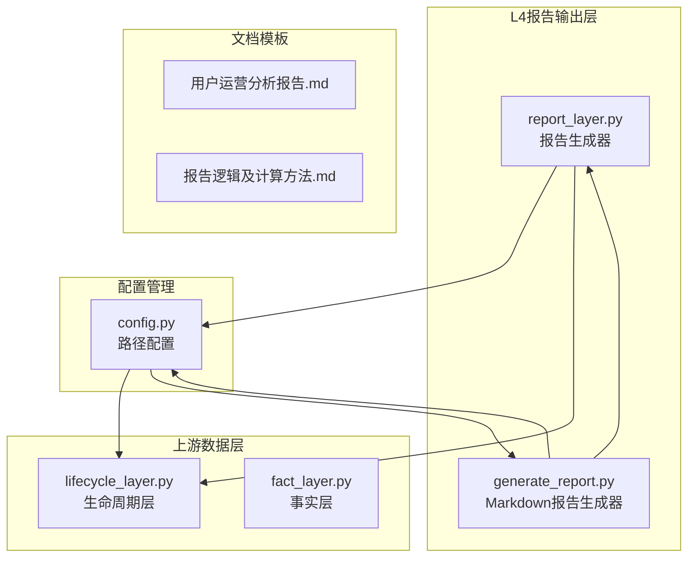
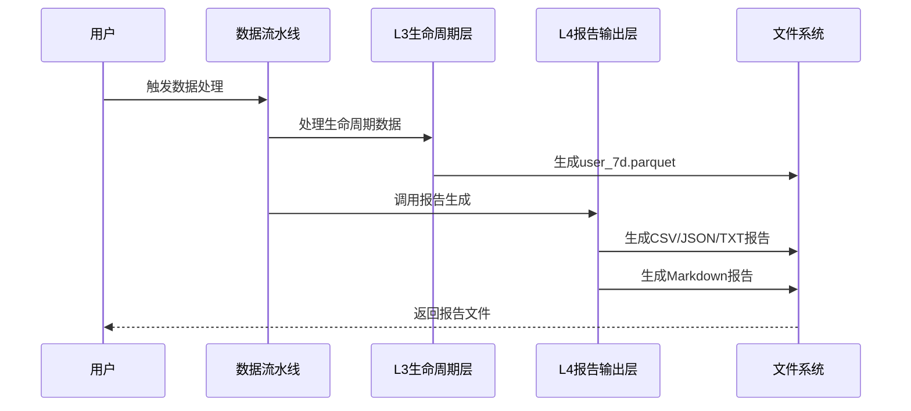
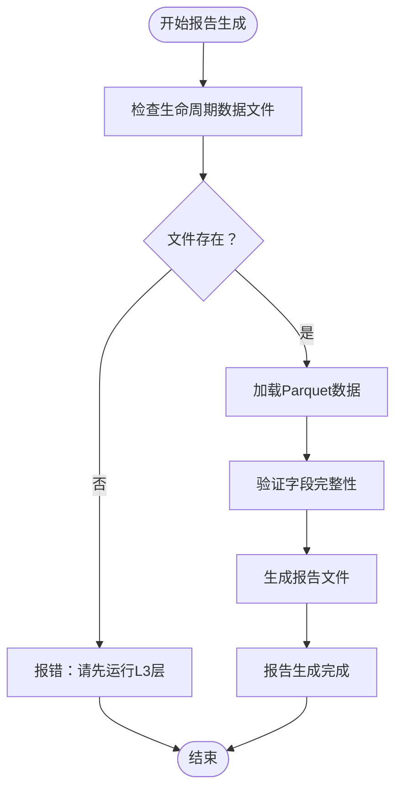
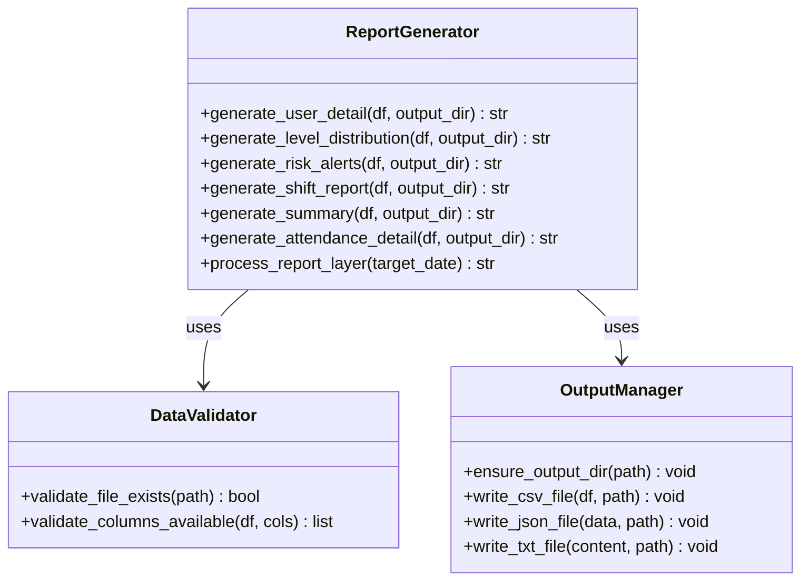
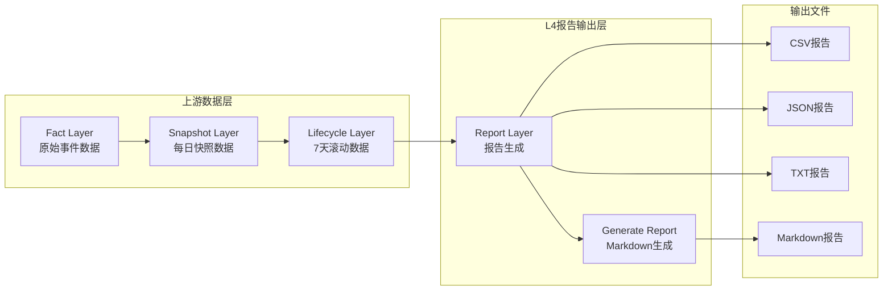
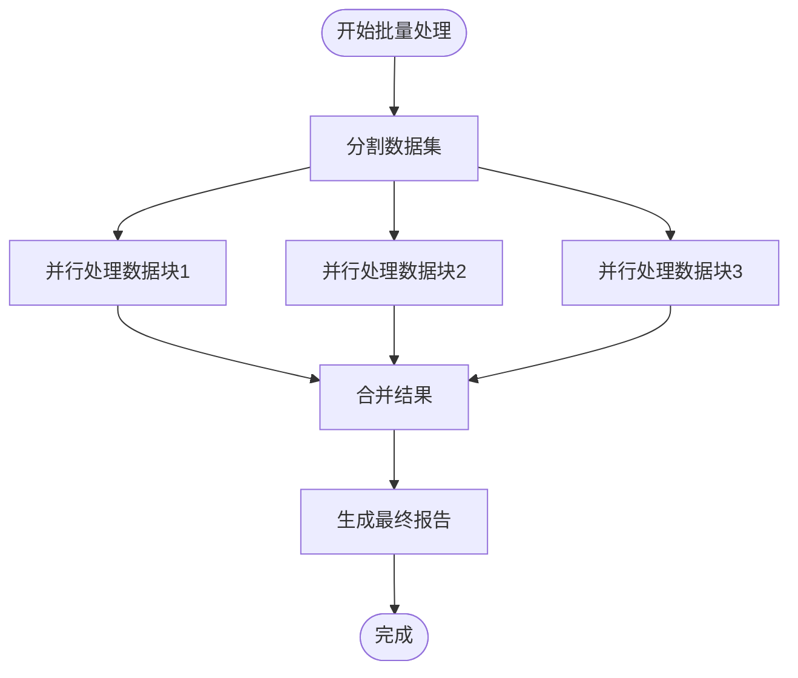

# L4报告输出层

<cite>
**本文档引用的文件**
- [report_layer.py](file://src/pipeline/report_layer.py)
- [generate_report.py](file://src/report/generate_report.py)
- [run_pipeline.py](file://src/pipeline/run_pipeline.py)
- [config.py](file://config/config.py)
- [lifecycle_layer.py](file://src/pipeline/lifecycle_layer.py)
- [fact_layer.py](file://src/pipeline/fact_layer.py)
- [用户运营分析报告.md](file://docs/用户运营分析报告.md)
- [报告逻辑及计算方法.md](file://docs/报告逻辑及计算方法.md)
- [各指标参数.md](file://各指标参数.md)
</cite>

## 目录
1. [简介](#简介)
2. [项目结构](#项目结构)
3. [核心组件](#核心组件)
4. [架构概览](#架构概览)
5. [详细组件分析](#详细组件分析)
6. [依赖关系分析](#依赖关系分析)
7. [性能考虑](#性能考虑)
8. [故障排除指南](#故障排除指南)
9. [结论](#结论)
10. [附录](#附录)

## 简介
L4报告输出层是用户特征画像分析系统的第四层，负责将生命周期层生成的用户画像数据转换为多种格式的业务报告。该层专注于数据的最终呈现，不进行任何计算处理，确保报告的准确性和一致性。

## 项目结构
L4报告输出层位于src/pipeline目录下，主要包含以下文件：

**图表来源**
- [report_layer.py:1-235](file://src/pipeline/report_layer.py#L1-L235)
- [generate_report.py:1-908](file://src/report/generate_report.py#L1-L908)
- [config.py:1-54](file://config/config.py#L1-L54)

**章节来源**
- [report_layer.py:1-235](file://src/pipeline/report_layer.py#L1-L235)
- [config.py:1-54](file://config/config.py#L1-L54)

## 核心组件
L4报告输出层包含两个主要组件：

### 报告生成器 (report_layer.py)
负责生成各种格式的报告文件，包括CSV、JSON、TXT等格式。

### Markdown报告生成器 (generate_report.py)
负责将L4生成的数据文件转换为专业的Markdown格式报告。

**章节来源**
- [report_layer.py:26-230](file://src/pipeline/report_layer.py#L26-L230)
- [generate_report.py:47-96](file://src/report/generate_report.py#L47-L96)

## 架构概览
L4报告输出层在整个数据流水线中扮演着最终输出的角色：

**图表来源**
- [run_pipeline.py:104-130](file://src/pipeline/run_pipeline.py#L104-L130)
- [report_layer.py:192-230](file://src/pipeline/report_layer.py#L192-L230)

## 详细组件分析

### 报告生成器 (process_report_layer)
这是L4层的主要入口函数，负责协调各种报告文件的生成。

#### 主要功能
1. **数据验证**：检查生命周期数据文件是否存在
2. **数据加载**：从Parquet文件读取用户数据
3. **报告生成**：生成7种不同格式的报告文件
4. **目录管理**：确保输出目录存在

#### 报告文件类型
系统生成以下7种报告文件：

| 文件名 | 格式 | 用途 | 字段数量 |
|--------|------|------|----------|
| user_detail.csv | CSV | 用户画像简表 | 20个字段 |
| user_7d_full.csv | CSV | 用户全量数据 | 99个字段 |
| level_distribution.csv | CSV | 等级分布统计 | 3个分布表 |
| risk_alerts.csv | CSV | 风险告警用户 | 8个字段 |
| user_monthly_attendance_detail.csv | CSV | 月度出勤明细 | 10个字段 |
| shift_report.json | JSON | 漂移检测报告 | 结构化指标 |
| summary.txt | TXT | 文本摘要报告 | 自然语言描述 |

**章节来源**
- [report_layer.py:192-230](file://src/pipeline/report_layer.py#L192-L230)

### 数据验证机制
L4层实现了严格的数据验证机制：

**图表来源**
- [report_layer.py:206-214](file://src/pipeline/report_layer.py#L206-L214)

### 报告模板设计
L4层采用模块化的报告模板设计：

#### CSV报告模板
- **user_detail.csv**：包含用户基本信息、行为指标、等级状态
- **level_distribution.csv**：包含等级分布、用户形态分布、策略分布
- **risk_alerts.csv**：包含高风险用户的关键指标
- **user_monthly_attendance_detail.csv**：包含月度用电预估明细

#### JSON报告模板
- **shift_report.json**：包含统计指标、分布数据、生成时间戳

#### TXT报告模板
- **summary.txt**：包含自然语言形式的摘要报告

**章节来源**
- [report_layer.py:26-170](file://src/pipeline/report_layer.py#L26-L170)

### 批量报告生成
L4层支持高效的批量报告生成：

**图表来源**
- [report_layer.py:26-230](file://src/pipeline/report_layer.py#L26-L230)

**章节来源**
- [report_layer.py:26-230](file://src/pipeline/report_layer.py#L26-L230)

## 依赖关系分析

### 上游三层依赖
L4报告输出层依赖于上游三层的数据：

**图表来源**
- [run_pipeline.py:98-101](file://src/pipeline/run_pipeline.py#L98-L101)
- [config.py:45-51](file://config/config.py#L45-L51)

### 数据字段映射
L4层使用的字段主要来源于L3层的user_7d.parquet文件：

| 字段类别 | 示例字段 | 数据来源 | 用途 |
|----------|----------|----------|------|
| 基本信息 | 用户id, 统计日期 | L3生命周期层 | 用户标识 |
| 行为指标 | 近7d总行驶距离_km, 近7d平均骑行电流_A | L3生命周期层 | 用户行为分析 |
| 等级状态 | 用户等级_动态, 用户生命周期状态_7d | L3生命周期层 | 用户分类 |
| 风险标签 | 风险标签, 策略建议 | L3生命周期层 | 风险评估 |
| 月度预估 | 单合约月度用电度数预估_kWh | L3生命周期层 | 业务预测 |

**章节来源**
- [report_layer.py:30-38](file://src/pipeline/report_layer.py#L30-L38)
- [report_layer.py:177-182](file://src/pipeline/report_layer.py#L177-L182)

## 性能考虑

### 内存管理优化
L4层采用了多项内存管理策略：

1. **分步处理**：每个报告文件独立生成，避免一次性加载所有数据
2. **字段选择**：只选择必要的字段进行输出，减少内存占用
3. **数据类型优化**：使用适当的数值类型，避免不必要的精度损失

### 磁盘I/O优化
1. **压缩输出**：CSV文件使用UTF-8-SIG编码，JSON文件使用紧凑格式
2. **批量写入**：每个报告文件独立写入，减少文件系统压力
3. **目录结构**：统一的输出目录结构，便于文件管理

### 并行处理策略
虽然L4层本身不进行并行处理，但可以与其他层配合实现：

**图表来源**
- [report_layer.py:221-227](file://src/pipeline/report_layer.py#L221-L227)

## 故障排除指南

### 常见错误及解决方案

#### 1. 生命周期数据文件不存在
**错误信息**：❌ 生命周期数据文件不存在，请先运行 L3 Lifecycle Layer

**解决方案**：
- 确保L3层已正确运行
- 检查配置文件中的EXPORT_PATH_LIFECYCLE_7D路径
- 验证user_7d.parquet文件是否生成

#### 2. 字段缺失问题
**解决方案**：
- 检查L3层是否正确生成所需字段
- 验证字段名称是否与报告模板匹配
- 使用available_cols机制自动处理字段缺失

#### 3. 文件权限问题
**解决方案**：
- 检查输出目录的写入权限
- 确保磁盘空间充足
- 处理可能的文件锁定问题

**章节来源**
- [report_layer.py:208-210](file://src/pipeline/report_layer.py#L208-L210)
- [report_layer.py:40-41](file://src/pipeline/report_layer.py#L40-L41)

### 数据验证机制
L4层实现了多层次的数据验证：

1. **文件存在性验证**：检查生命周期数据文件是否存在
2. **字段完整性验证**：验证必需字段是否可用
3. **数据质量验证**：检查数据的有效性和合理性

**章节来源**
- [report_layer.py:206-214](file://src/pipeline/report_layer.py#L206-L214)
- [report_layer.py:40-41](file://src/pipeline/report_layer.py#L40-L41)

## 结论
L4报告输出层作为用户特征画像分析系统的核心输出层，提供了完整的多格式报告生成功能。通过模块化的架构设计、严格的数据验证机制和高效的性能优化策略，确保了报告的质量和可靠性。

该层的主要优势包括：
- **多格式支持**：同时支持CSV、JSON、TXT等多种输出格式
- **模块化设计**：每个报告文件独立生成，便于维护和扩展
- **数据验证**：严格的输入验证确保输出数据的准确性
- **性能优化**：合理的内存管理和磁盘I/O优化策略

## 附录

### 报告文件规范

#### CSV文件规范
- 编码：UTF-8-SIG
- 分隔符：逗号
- 字段顺序：按照报告模板定义的顺序
- 数据类型：保持原始数据类型

#### JSON文件规范
- 编码：UTF-8
- 格式：紧凑格式，无多余空格
- 时间戳：ISO 8601格式
- 数值精度：保留两位小数

#### TXT文件规范
- 编码：UTF-8
- 格式：自然语言描述
- 结构：层次化的标题和内容
- 字符限制：每行不超过100字符

### 参数配置
L4层的配置主要通过config.py文件管理：

| 配置项 | 默认值 | 说明 |
|--------|--------|------|
| EXPORT_PATH_LIFECYCLE_7D | lifecycle/user_7d.parquet | 生命周期数据路径 |
| EXPORT_PATH_REPORTS | reports/ | 报告输出目录 |
| TEST_MODE | False | 测试模式开关 |

**章节来源**
- [config.py:45-51](file://config/config.py#L45-L51)
- [config.py:10](file://config/config.py#L10)