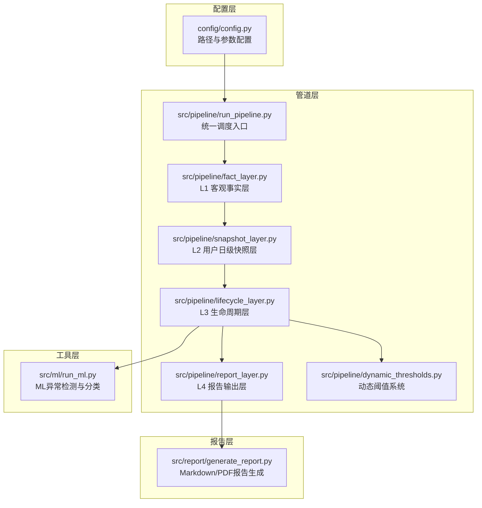
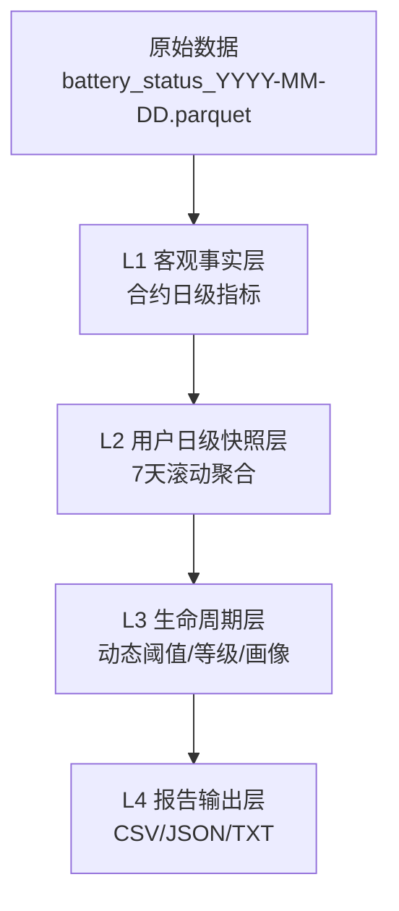
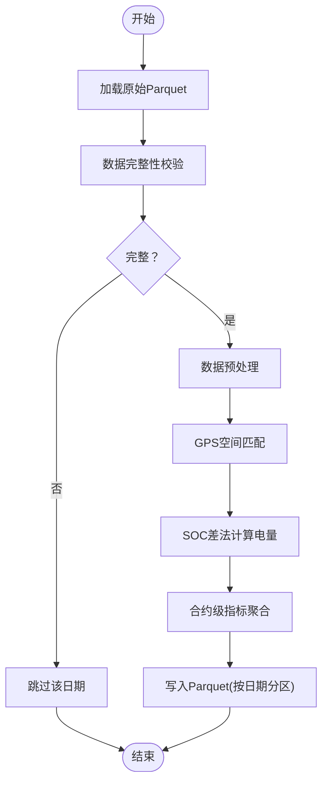
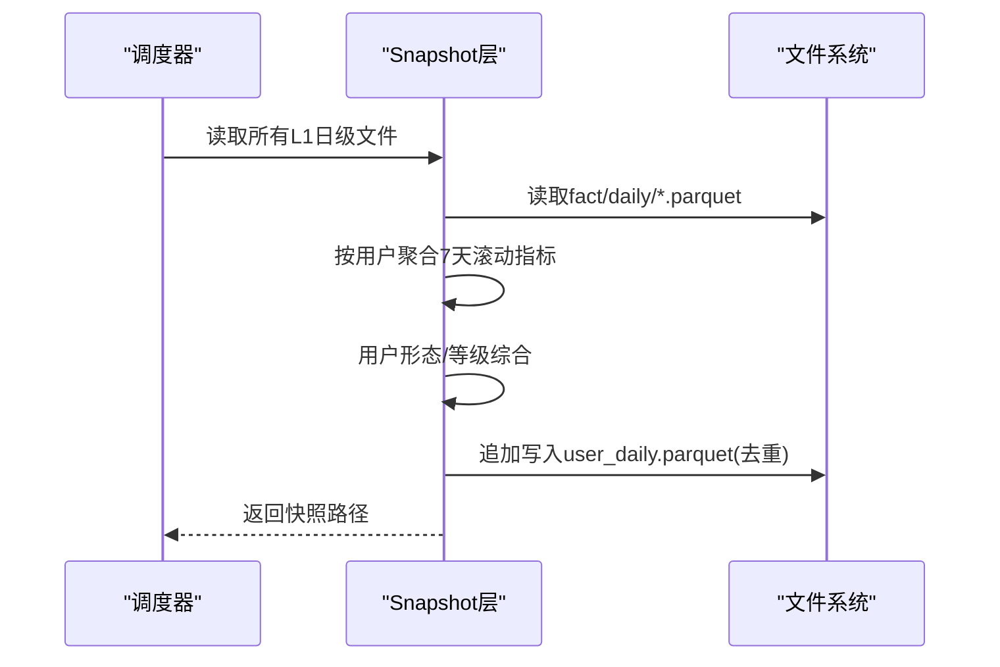
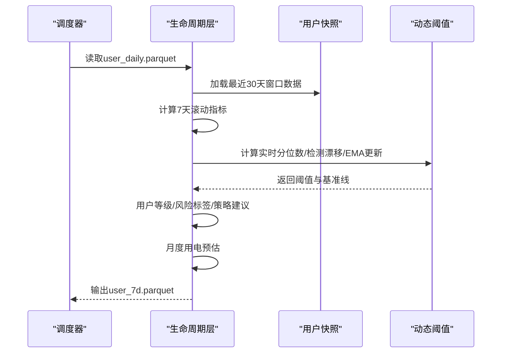
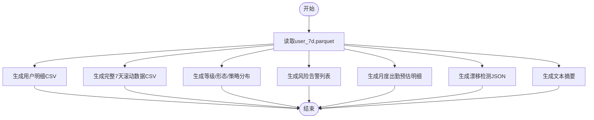
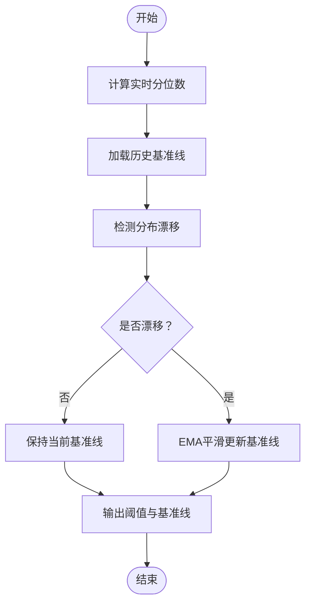
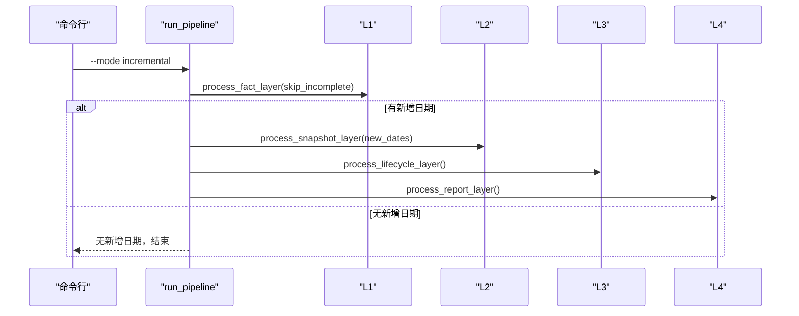
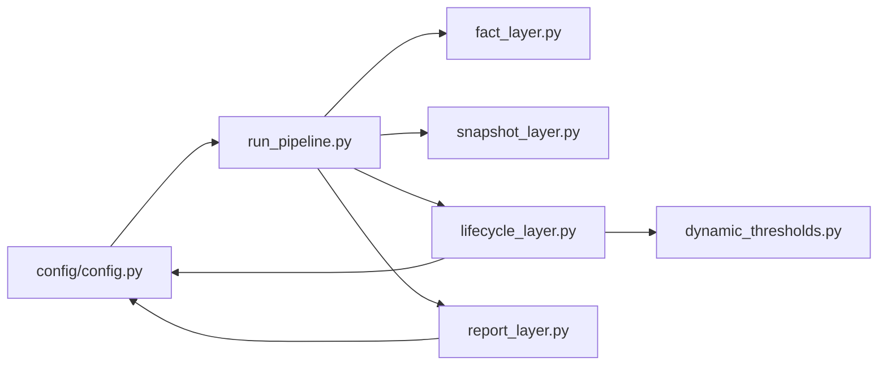
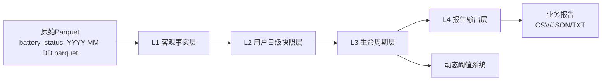

# 数据流水线架构

<cite>
**本文档引用的文件**
- [README.md](file://README.md)
- [config.py](file://config/config.py)
- [run_pipeline.py](file://src/pipeline/run_pipeline.py)
- [fact_layer.py](file://src/pipeline/fact_layer.py)
- [snapshot_layer.py](file://src/pipeline/snapshot_layer.py)
- [lifecycle_layer.py](file://src/pipeline/lifecycle_layer.py)
- [report_layer.py](file://src/pipeline/report_layer.py)
- [dynamic_thresholds.py](file://src/pipeline/dynamic_thresholds.py)
- [generate_report.py](file://src/report/generate_report.py)
- [run_ml.py](file://src/ml/run_ml.py)
</cite>

## 目录
1. [简介](#简介)
2. [项目结构](#项目结构)
3. [核心组件](#核心组件)
4. [架构总览](#架构总览)
5. [详细组件分析](#详细组件分析)
6. [依赖分析](#依赖分析)
7. [性能考虑](#性能考虑)
8. [故障排查指南](#故障排查指南)
9. [结论](#结论)
10. [附录](#附录)

## 简介
本项目为两轮车换电用户特征画像系统，采用L1-L4四层数据处理架构，实现从原始电池状态数据到多格式业务报告的自动化流水线。系统遵循分层解耦、增量处理、容错设计等原则，支持动态阈值自适应、可扩展指标与算法、配置驱动与路径管理、以及性能优化（Parquet列式存储、批量处理、并行计算）。

## 项目结构
项目采用“配置-管道-报告-工具”分层组织，核心模块包括：
- 配置层：统一管理路径与参数
- 管道层：L1-L4四层数据处理
- 报告层：业务报告生成
- 工具层：动态阈值、ML扩展等

**图表来源**
- [config.py:1-54](file://config/config.py#L1-L54)
- [run_pipeline.py:1-381](file://src/pipeline/run_pipeline.py#L1-L381)
- [fact_layer.py:1-1227](file://src/pipeline/fact_layer.py#L1-L1227)
- [snapshot_layer.py:1-452](file://src/pipeline/snapshot_layer.py#L1-L452)
- [lifecycle_layer.py:1-990](file://src/pipeline/lifecycle_layer.py#L1-L990)
- [report_layer.py:1-235](file://src/pipeline/report_layer.py#L1-L235)
- [dynamic_thresholds.py:1-580](file://src/pipeline/dynamic_thresholds.py#L1-L580)
- [generate_report.py:1-908](file://src/report/generate_report.py#L1-L908)
- [run_ml.py:1-395](file://src/ml/run_ml.py#L1-L395)

**章节来源**
- [README.md:1-800](file://README.md#L1-L800)
- [config.py:1-54](file://config/config.py#L1-L54)

## 核心组件
- 统一调度入口：支持全量重建、增量处理、刷新聚合、重新评级、仅报告等模式，具备日志与容错能力
- L1 客观事实层：将原始Parquet数据清洗、GPS匹配、SOC差法计算电量等，输出日级合约指标
- L2 用户日级快照层：按用户聚合日级指标，生成7天滚动窗口快照，补充用户形态与等级综合信息
- L3 生命周期层：7天滚动聚合、动态阈值计算、用户等级/风险标签/策略建议、月度用电预估、完整画像文本
- L4 报告输出层：输出CSV/JSON/TXT等业务报告，供BI与运营使用
- 动态阈值系统：分位数自适应、基准线持久化、分布漂移检测、EMA平滑更新
- 配置与路径管理：集中管理输入输出路径、GeoJSON围栏、合约信息、阈值基准文件等
- ML扩展：异常检测与监督分类，支持人工标注与反馈闭环

**章节来源**
- [run_pipeline.py:1-381](file://src/pipeline/run_pipeline.py#L1-L381)
- [fact_layer.py:1-1227](file://src/pipeline/fact_layer.py#L1-L1227)
- [snapshot_layer.py:1-452](file://src/pipeline/snapshot_layer.py#L1-L452)
- [lifecycle_layer.py:1-990](file://src/pipeline/lifecycle_layer.py#L1-L990)
- [report_layer.py:1-235](file://src/pipeline/report_layer.py#L1-L235)
- [dynamic_thresholds.py:1-580](file://src/pipeline/dynamic_thresholds.py#L1-L580)
- [config.py:1-54](file://config/config.py#L1-L54)

## 架构总览
系统采用分层解耦与增量处理设计，L1-L4逐层推进，每层职责清晰、可独立重跑；动态阈值系统贯穿L3，实现自适应评分与分类；ML模块与生命周期数据解耦，支持独立运行与反馈闭环。

**图表来源**
- [README.md:136-155](file://README.md#L136-L155)
- [fact_layer.py:1-1227](file://src/pipeline/fact_layer.py#L1-L1227)
- [snapshot_layer.py:1-452](file://src/pipeline/snapshot_layer.py#L1-L452)
- [lifecycle_layer.py:1-990](file://src/pipeline/lifecycle_layer.py#L1-L990)
- [report_layer.py:1-235](file://src/pipeline/report_layer.py#L1-L235)

## 详细组件分析

### L1 客观事实层（Fact Layer）
- 职责：将每日原始Parquet数据清洗、GPS空间匹配、SOC差法计算电量、聚合合约级指标
- 关键流程：
  - 数据完整性校验（时间跨度、小时覆盖）
  - 预处理（速度/电流过滤、异常值平滑、离线过滤）
  - GPS空间匹配（省/市/区三级）
  - 电量计算（SOC差法）
  - 合约级指标聚合（电量、骑行、电池健康、空间、换电时段等）
- 输出：按日期分区的Parquet文件，每个日期一个文件

**图表来源**
- [fact_layer.py:135-400](file://src/pipeline/fact_layer.py#L135-L400)
- [fact_layer.py:238-800](file://src/pipeline/fact_layer.py#L238-L800)

**章节来源**
- [README.md:160-223](file://README.md#L160-L223)
- [fact_layer.py:1-1227](file://src/pipeline/fact_layer.py#L1-L1227)

### L2 用户日级快照层（Snapshot Layer）
- 职责：将L1输出按用户聚合，生成用户日级快照；计算7天滚动窗口指标；用户形态与等级综合
- 关键流程：
  - 读取所有L1日级文件
  - 按用户+日期排序，确保时间连续性
  - 逐用户滚动窗口聚合（加权/极值/占比/累计）
  - 用户类型判定（地摊/储能、专送/众包/标准/普通）
  - 追加写入用户快照文件（去重）
- 输出：用户日级快照（user_daily.parquet）

**图表来源**
- [snapshot_layer.py:212-447](file://src/pipeline/snapshot_layer.py#L212-L447)

**章节来源**
- [README.md:389-498](file://README.md#L389-L498)
- [snapshot_layer.py:1-452](file://src/pipeline/snapshot_layer.py#L1-L452)

### L3 生命周期层（Lifecycle Layer）
- 职责：7天滚动聚合、动态阈值计算、用户等级/风险标签/策略建议、月度用电预估、完整画像文本
- 关键流程：
  - 读取用户快照（最近30天窗口）
  - 计算7天滚动指标（加权平均/极值/占比/累计）
  - 动态阈值计算（分位数+基准线+漂移检测+EMA更新）
  - 用户形态/等级/风险标签判定
  - 月度用电预估（基于出勤率）
  - 生成完整画像文本
- 输出：用户7天生命周期档案（user_7d.parquet）

**图表来源**
- [lifecycle_layer.py:186-596](file://src/pipeline/lifecycle_layer.py#L186-L596)
- [dynamic_thresholds.py:349-456](file://src/pipeline/dynamic_thresholds.py#L349-L456)

**章节来源**
- [README.md:501-700](file://README.md#L501-L700)
- [lifecycle_layer.py:1-990](file://src/pipeline/lifecycle_layer.py#L1-L990)
- [dynamic_thresholds.py:1-580](file://src/pipeline/dynamic_thresholds.py#L1-L580)

### L4 报告输出层（Report Layer）
- 职责：将生命周期数据导出为多种业务友好的报告格式
- 输出清单：
  - 用户明细CSV、完整7天滚动数据CSV
  - 等级/形态/策略分布统计
  - 风险告警列表
  - 月度出勤预估明细
  - 漂移检测JSON报告
  - 文本摘要报告
- 输出：data/reports/目录（覆盖最新）

**图表来源**
- [report_layer.py:26-230](file://src/pipeline/report_layer.py#L26-L230)

**章节来源**
- [README.md:702-722](file://README.md#L702-L722)
- [report_layer.py:1-235](file://src/pipeline/report_layer.py#L1-L235)

### 动态阈值系统（Dynamic Thresholds）
- 目标：解决静态阈值无法适应业务变化的问题
- 工作流程：
  - 实时分位数计算
  - 加载历史基准线
  - 分布漂移检测（KS检验思路）
  - 生成自适应阈值
  - EMA平滑更新基准线（可选）
- 输出：阈值字典与基准线文件

**图表来源**
- [dynamic_thresholds.py:349-456](file://src/pipeline/dynamic_thresholds.py#L349-L456)

**章节来源**
- [README.md:724-800](file://README.md#L724-L800)
- [dynamic_thresholds.py:1-580](file://src/pipeline/dynamic_thresholds.py#L1-L580)

### 统一调度入口（run_pipeline.py）
- 支持多种执行模式：全量、增量、刷新、重算、仅报告
- 增量模式：自动检测缺失日期，跳过已有日期与当天
- 容错设计：目录清理兼容OneDrive文件锁，异常捕获与日志记录
- 日志系统：TeeOutput同时输出到控制台与日志文件

**图表来源**
- [run_pipeline.py:135-165](file://src/pipeline/run_pipeline.py#L135-L165)

**章节来源**
- [run_pipeline.py:1-381](file://src/pipeline/run_pipeline.py#L1-L381)

## 依赖分析
- 组件耦合与内聚：
  - L1-L4严格分层，L3依赖L2输出，L4依赖L3输出
  - 动态阈值系统作为L3的可插拔模块，通过接口注入阈值与基准线
  - 配置模块集中管理路径，避免硬编码
- 外部依赖：
  - pandas/numpy/pyarrow（Parquet列式存储）
  - scipy/shapely（凸包与空间匹配）
  - tqdm（进度显示）
  - fpdf（可选PDF报告）

**图表来源**
- [config.py:1-54](file://config/config.py#L1-L54)
- [run_pipeline.py:1-381](file://src/pipeline/run_pipeline.py#L1-L381)
- [lifecycle_layer.py:1-990](file://src/pipeline/lifecycle_layer.py#L1-L990)
- [dynamic_thresholds.py:1-580](file://src/pipeline/dynamic_thresholds.py#L1-L580)

**章节来源**
- [config.py:1-54](file://config/config.py#L1-L54)
- [run_pipeline.py:1-381](file://src/pipeline/run_pipeline.py#L1-L381)

## 性能考虑
- Parquet列式存储：高效压缩与查询，适合大规模时间序列数据
- 批量处理：L1按日期批量读取与写入，L2按用户分组聚合，减少IO与内存压力
- 并行计算：多进程/多线程并行处理不同日期或用户组（可扩展）
- 增量处理：仅处理新增日期，避免重复计算
- 追加写入与去重：L2对快照文件采用追加写入并去重，降低写放大
- 空间计算优化：凸包计算限制点数与异常值处理，提升稳定性

[本节为通用性能指导，无需具体文件引用]

## 故障排查指南
- 增量模式无新增日期：检查目标日期是否已处理、是否为当天、是否启用数据完整性校验
- 目录清理失败（OneDrive锁）：系统已兼容删除失败场景，可覆盖写入
- 数据完整性校验失败：检查原始数据时间跨度与小时覆盖是否满足阈值
- 动态阈值基准线未更新：确认漂移检测是否触发EMA更新，或手动启用force_refresh
- 报告生成异常：确认生命周期数据文件是否存在，字段是否齐全

**章节来源**
- [run_pipeline.py:222-259](file://src/pipeline/run_pipeline.py#L222-L259)
- [fact_layer.py:213-223](file://src/pipeline/fact_layer.py#L213-L223)
- [dynamic_thresholds.py:434-446](file://src/pipeline/dynamic_thresholds.py#L434-L446)

## 结论
本系统通过L1-L4分层架构实现了从原始数据到业务报告的全链路自动化，具备良好的可扩展性与可维护性。动态阈值系统使评分与分类具备自适应能力，配置驱动与路径管理降低了部署与运维成本，性能优化策略保障了大规模数据处理的效率与稳定性。

[本节为总结性内容，无需具体文件引用]

## 附录

### 可扩展性设计
- 新增指标：在对应层的计算函数中扩展字段，无需改动其他层
- 新增算法：在L3引入新的评分/分类算法，通过配置切换
- 动态阈值：通过阈值基准文件与EMA机制自动适应业务变化
- ML扩展：独立的ML模块，支持异常检测、人工标注与监督分类

**章节来源**
- [README.md:145-155](file://README.md#L145-L155)
- [dynamic_thresholds.py:1-580](file://src/pipeline/dynamic_thresholds.py#L1-L580)
- [run_ml.py:1-395](file://src/ml/run_ml.py#L1-L395)

### 配置驱动与路径管理
- 统一路径配置：BASE_EXPORT_PATH、各层输出路径、GeoJSON围栏、合约与电池信息路径
- 动态阈值基准文件：统一管理与版本追踪
- 测试模式：TEST_MODE切换测试/正式路径

**章节来源**
- [config.py:1-54](file://config/config.py#L1-L54)

### 数据流图（端到端）

**图表来源**
- [README.md:136-155](file://README.md#L136-L155)
- [run_pipeline.py:1-381](file://src/pipeline/run_pipeline.py#L1-L381)
- [dynamic_thresholds.py:1-580](file://src/pipeline/dynamic_thresholds.py#L1-L580)
- [report_layer.py:1-235](file://src/pipeline/report_layer.py#L1-L235)