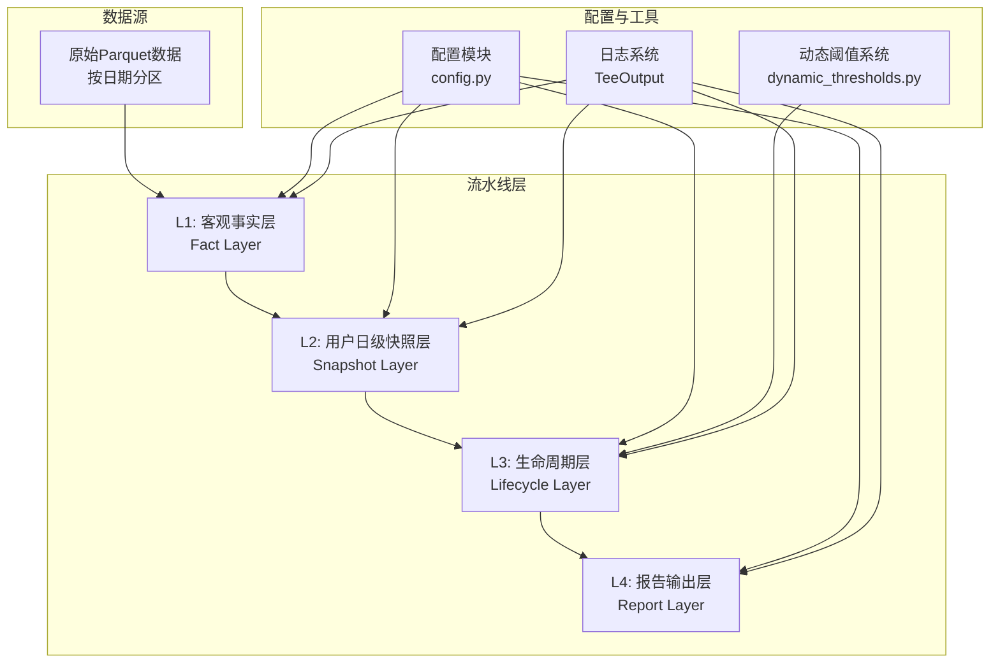
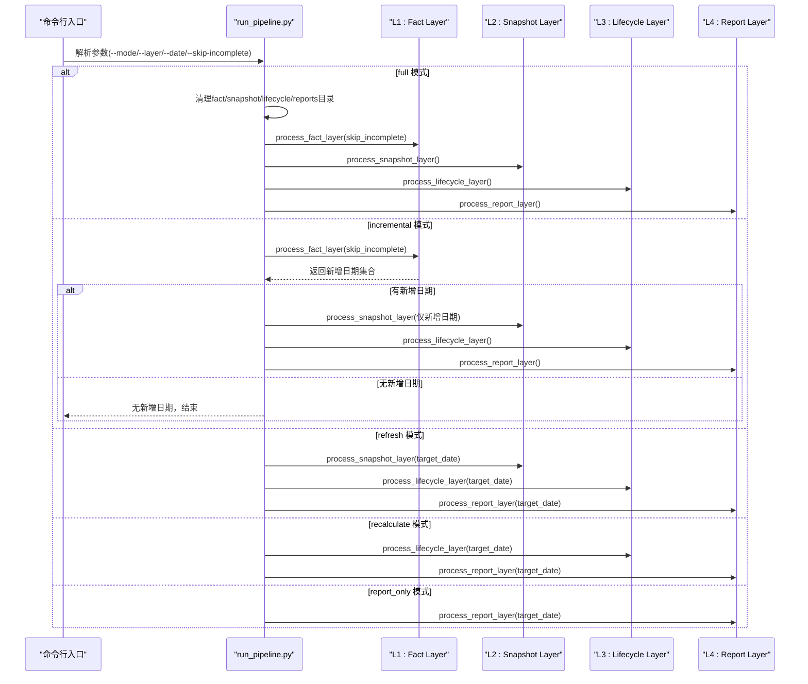
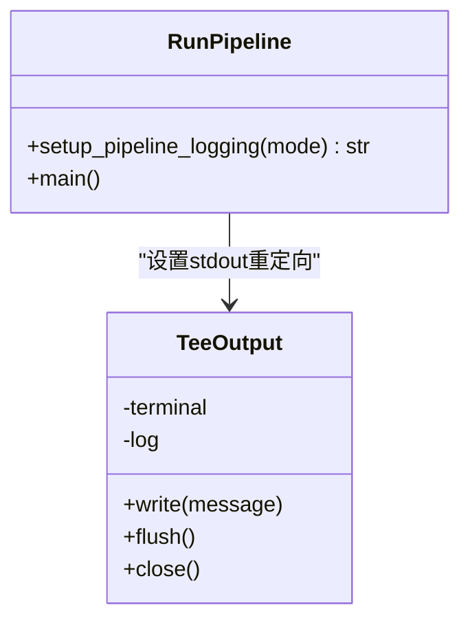
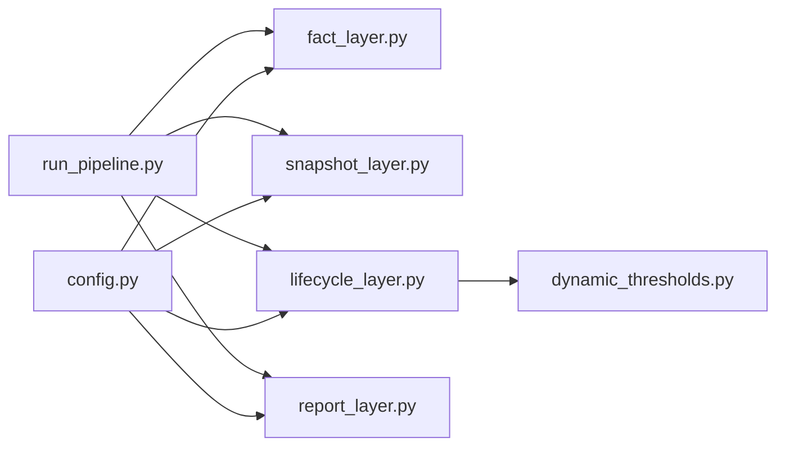

# 流水线执行模式

<cite>
**本文引用的文件**
- [README.md](file://README.md)
- [run_pipeline.py](file://src/pipeline/run_pipeline.py)
- [config.py](file://config/config.py)
- [fact_layer.py](file://src/pipeline/fact_layer.py)
- [snapshot_layer.py](file://src/pipeline/snapshot_layer.py)
- [lifecycle_layer.py](file://src/pipeline/lifecycle_layer.py)
- [report_layer.py](file://src/pipeline/report_layer.py)
- [dynamic_thresholds.py](file://src/pipeline/dynamic_thresholds.py)
- [generate_report.py](file://src/report/generate_report.py)
</cite>

## 目录
1. [简介](#简介)
2. [项目结构](#项目结构)
3. [核心组件](#核心组件)
4. [架构总览](#架构总览)
5. [详细组件分析](#详细组件分析)
6. [依赖关系分析](#依赖关系分析)
7. [性能考虑](#性能考虑)
8. [故障排查指南](#故障排查指南)
9. [结论](#结论)
10. [附录](#附录)

## 简介
本文件面向“数据流水线执行模式”的使用者与维护者，系统化阐述五种执行模式的设计目的、适用场景、命令行参数配置、从指定层开始重建的清理顺序与数据依赖关系、日志系统实现原理、数据完整性检查机制、使用示例以及错误处理与异常恢复策略。目标是帮助读者在不同业务需求下正确选择与组合执行模式，确保数据处理的准确性、可追溯性与可维护性。

## 项目结构
项目采用分层架构，围绕L1-L4四层流水线组织数据处理，配合动态阈值系统与报告输出层，形成从原始数据到业务报告的完整链路。

图表来源
- [run_pipeline.py:104-220](file://src/pipeline/run_pipeline.py#L104-L220)
- [config.py:44-54](file://config/config.py#L44-L54)
- [dynamic_thresholds.py:349-457](file://src/pipeline/dynamic_thresholds.py#L349-L457)

章节来源
- [README.md:106-134](file://README.md#L106-L134)
- [config.py:44-54](file://config/config.py#L44-L54)

## 核心组件
- 执行入口与模式调度：run_pipeline.py 提供五种执行模式与从指定层开始重建的能力，并负责日志输出重定向。
- 分层处理模块：fact_layer、snapshot_layer、lifecycle_layer、report_layer 分别实现L1-L4层的处理逻辑。
- 配置与路径：config.py 统一管理数据输出根路径与各层输出目录。
- 动态阈值系统：dynamic_thresholds.py 提供基准线持久化、分布漂移检测与EMA平滑更新。
- 报告生成：report_layer.py 生成业务所需的CSV/JSON/TXT报告；另有独立的报告生成脚本 generate_report.py 用于自动化生成Markdown报告。

章节来源
- [run_pipeline.py:307-378](file://src/pipeline/run_pipeline.py#L307-L378)
- [config.py:44-54](file://config/config.py#L44-L54)
- [dynamic_thresholds.py:349-457](file://src/pipeline/dynamic_thresholds.py#L349-L457)
- [report_layer.py:192-235](file://src/pipeline/report_layer.py#L192-L235)

## 架构总览
下图展示了五种执行模式在L1-L4层之间的调用关系与数据流向，以及从指定层开始重建时的清理顺序。

图表来源
- [run_pipeline.py:104-220](file://src/pipeline/run_pipeline.py#L104-L220)
- [run_pipeline.py:262-303](file://src/pipeline/run_pipeline.py#L262-L303)

章节来源
- [run_pipeline.py:104-220](file://src/pipeline/run_pipeline.py#L104-L220)
- [run_pipeline.py:262-303](file://src/pipeline/run_pipeline.py#L262-L303)

## 详细组件分析

### 执行模式与适用场景
- full 全量重建
  - 设计目的：彻底清理历史数据并从头开始计算，保证结果一致性与可复现性。
  - 适用场景：首次部署、数据结构变更、基准线重置、回归测试。
  - 调用链：清理L1-L4目录 → L1 → L2 → L3 → L4。
- incremental 增量处理
  - 设计目的：仅处理缺失日期，避免重复计算，提升效率。
  - 适用场景：日常生产任务，默认模式。
  - 调用链：L1自动检测缺失日期并处理 → L2仅处理新增日期 → L3全量滚动窗口 → L4。
- refresh 刷新聚合
  - 设计目的：在L2聚合逻辑或输入数据发生变化后，重算L2-L4，保留L1事实层。
  - 适用场景：L2聚合规则调整、输入数据格式变更。
  - 调用链：L2 → L3 → L4。
- recalculate 重新评级
  - 设计目的：在L3评分/分类规则调整后，重算L3-L4，保留L1-L2。
  - 适用场景：阈值基准线更新、评分策略调整。
  - 调用链：L3 → L4。
- report_only 仅报告生成
  - 设计目的：在L3数据稳定后，仅生成报告，加速交付。
  - 适用场景：报表定时生成、CI/CD流水线中的报告阶段。
  - 调用链：L4。

章节来源
- [run_pipeline.py:104-220](file://src/pipeline/run_pipeline.py#L104-L220)
- [run_pipeline.py:262-303](file://src/pipeline/run_pipeline.py#L262-L303)

### 命令行参数与组合选项
- --mode
  - 取值：full、incremental、refresh、recalculate、report_only
  - 默认：incremental
- --date
  - 目标日期 YYYY-MM-DD，用于指定某一天的处理或报告生成
- --layer
  - 取值：L1、L2、L3、L4
  - 作用：从指定层开始重建，清理该层及下游目录后重算
  - 组合：--layer L1 等价于 full；--layer L2 等价于 refresh；--layer L3 等价于 recalculate；--layer L4 等价于 report_only
- --skip-incomplete
  - 默认开启，跳过不完整日期
  - 关闭方式：--skip-incomplete false

章节来源
- [run_pipeline.py:307-378](file://src/pipeline/run_pipeline.py#L307-L378)

### 从指定层开始重建的清理顺序与数据依赖
- 清理顺序（自上而下）：L1→L2→L3→L4
- 数据依赖关系：
  - L1 依赖原始Parquet数据（按日期分区）
  - L2 依赖 L1 的每日输出
  - L3 依赖 L2 的全量快照（7天滚动窗口）
  - L4 依赖 L3 的生命周期数据
- OneDrive文件锁定兼容：清理阶段采用逐文件删除与目录遍历策略，遇到锁定文件会提示并继续写入，保证流程可用性。

章节来源
- [run_pipeline.py:222-259](file://src/pipeline/run_pipeline.py#L222-L259)
- [run_pipeline.py:262-303](file://src/pipeline/run_pipeline.py#L262-L303)
- [snapshot_layer.py:212-447](file://src/pipeline/snapshot_layer.py#L212-L447)
- [lifecycle_layer.py:186-217](file://src/pipeline/lifecycle_layer.py#L186-L217)

### 日志系统实现原理
- TeeOutput 类
  - 功能：将标准输出同时写入控制台与日志文件
  - 实现：重写 sys.stdout，write() 同时输出到终端与文件句柄，flush/close 时同步刷新与恢复stdout
- 日志文件命名：pipeline_{mode}_{timestamp}.log，自动保存在 logs/ 目录
- 使用方式：入口函数 setup_pipeline_logging(mode) 设置 TeeOutput 并返回日志路径

图表来源
- [run_pipeline.py:57-90](file://src/pipeline/run_pipeline.py#L57-L90)

章节来源
- [run_pipeline.py:57-90](file://src/pipeline/run_pipeline.py#L57-L90)

### 数据完整性检查机制
- L1 层在数据预处理前进行完整性校验，满足以下全部条件才视为完整：
  - 时间跨度 ≥ 20小时
  - 小时覆盖 ≥ 20个/24小时
- 不满足条件的日期将被跳过，不参与统计与后续出勤率计算
- 关闭方式：--skip-incomplete false

章节来源
- [README.md:213-222](file://README.md#L213-L222)
- [fact_layer.py:135-216](file://src/pipeline/fact_layer.py#L135-L216)

### 动态阈值系统与EMA更新
- 基准线持久化：BaselineStore 负责读取/保存阈值基准文件，记录版本、更新时间、样本量与分位数
- 分布漂移检测：DistributionShiftDetector 对比实时分位数与基准线，检测相对偏差是否超过阈值
- EMA 平滑更新：use_ema_update=true 且检测到漂移时，按平滑系数更新基准线，避免剧烈波动
- 生命周期层集成：lifecycle_layer 通过 DynamicBatteryAnalyzer 获取阈值并进行评分与分类

章节来源
- [dynamic_thresholds.py:34-145](file://src/pipeline/dynamic_thresholds.py#L34-L145)
- [dynamic_thresholds.py:151-235](file://src/pipeline/dynamic_thresholds.py#L151-L235)
- [dynamic_thresholds.py:241-343](file://src/pipeline/dynamic_thresholds.py#L241-L343)
- [dynamic_thresholds.py:349-457](file://src/pipeline/dynamic_thresholds.py#L349-L457)
- [lifecycle_layer.py:58-114](file://src/pipeline/lifecycle_layer.py#L58-L114)

### 报告生成与输出
- L4 报告层：生成用户明细、全量7天滚动数据、等级分布、风险告警、月度出勤明细、漂移报告与文本摘要
- 独立报告：generate_report.py 读取 reports/ 下的CSV/JSON，自动生成Markdown运营分析报告

章节来源
- [report_layer.py:26-230](file://src/pipeline/report_layer.py#L26-L230)
- [generate_report.py:1-16](file://src/report/generate_report.py#L1-L16)

## 依赖关系分析
- 模块耦合
  - run_pipeline.py 作为统一入口，按模式调度各层函数，耦合度低，便于扩展
  - 各层内部职责清晰，L1-L4之间通过Parquet文件衔接，接口稳定
- 外部依赖
  - pandas/pyarrow 用于数据读写与Schema兼容
  - tqdm 用于进度显示
  - 动态阈值系统依赖 numpy/pandas/json
- 循环依赖
  - 无循环导入，各层按单向依赖传递

图表来源
- [run_pipeline.py:96-101](file://src/pipeline/run_pipeline.py#L96-L101)
- [config.py:44-54](file://config/config.py#L44-L54)

章节来源
- [run_pipeline.py:96-101](file://src/pipeline/run_pipeline.py#L96-L101)
- [config.py:44-54](file://config/config.py#L44-L54)

## 性能考虑
- 增量模式优先：incremental 仅处理缺失日期，减少I/O与计算
- Parquet列式存储：提高读写效率与压缩比
- 7天滚动窗口：在L3层进行加权聚合，避免全量重算
- 进度条与日志：tqdm 与 TeeOutput 提升可观测性与调试效率
- OneDrive兼容：清理阶段逐文件删除与遍历，降低锁冲突概率

## 故障排查指南
- 常见问题
  - L1/L2/L3/L4目录为空或缺失：检查 DATA_OUTPUT_ROOT 与各层输出路径配置
  - 增量无数据：确认目标日期是否已存在或是否为当天
  - OneDrive文件锁定：清理阶段会提示被锁定文件数量，可继续写入
  - 报告生成失败：确认 L3 输出文件是否存在
- 错误处理
  - run_pipeline.main() 捕获异常并打印堆栈，退出码非0
  - 生命周期状态判定：已到期/新用户优先，避免误判
- 建议
  - 使用 --layer 指定层进行局部重跑，缩小问题范围
  - 关闭 --skip-incomplete 进行全量检查，定位不完整日期

章节来源
- [run_pipeline.py:364-377](file://src/pipeline/run_pipeline.py#L364-L377)
- [run_pipeline.py:222-259](file://src/pipeline/run_pipeline.py#L222-L259)
- [lifecycle_layer.py:719-750](file://src/pipeline/lifecycle_layer.py#L719-L750)

## 结论
本文系统梳理了五种执行模式的设计意图、参数配置、从指定层重建的清理顺序与数据依赖、日志系统实现、完整性检查机制、动态阈值与报告生成，并提供了故障排查与性能优化建议。建议在日常运维中优先采用增量模式，在规则或数据结构变更时使用相应模式或从指定层重建，确保数据质量与系统稳定性。

## 附录

### 使用示例（命令行）
- 日常增量处理（默认）
  - python src/pipeline/run_pipeline.py
  - python src/pipeline/run_pipeline.py --mode incremental
- 全量重建
  - python src/pipeline/run_pipeline.py --mode full
- 刷新聚合（L2逻辑调整后）
  - python src/pipeline/run_pipeline.py --mode refresh
  - python src/pipeline/run_pipeline.py --mode refresh --date 2026-04-19
- 重新评级（L3规则调整后）
  - python src/pipeline/run_pipeline.py --mode recalculate
  - python src/pipeline/run_pipeline.py --mode recalculate --date 2026-04-19
- 仅生成报告
  - python src/pipeline/run_pipeline.py --mode report_only
  - python src/pipeline/run_pipeline.py --mode report_only --date 2026-04-19
- 从指定层开始重建
  - python src/pipeline/run_pipeline.py --layer L1
  - python src/pipeline/run_pipeline.py --layer L2
  - python src/pipeline/run_pipeline.py --layer L3
  - python src/pipeline/run_pipeline.py --layer L4
- 关闭数据完整性检查
  - python src/pipeline/run_pipeline.py --mode incremental --skip-incomplete false

章节来源
- [run_pipeline.py:13-41](file://src/pipeline/run_pipeline.py#L13-L41)