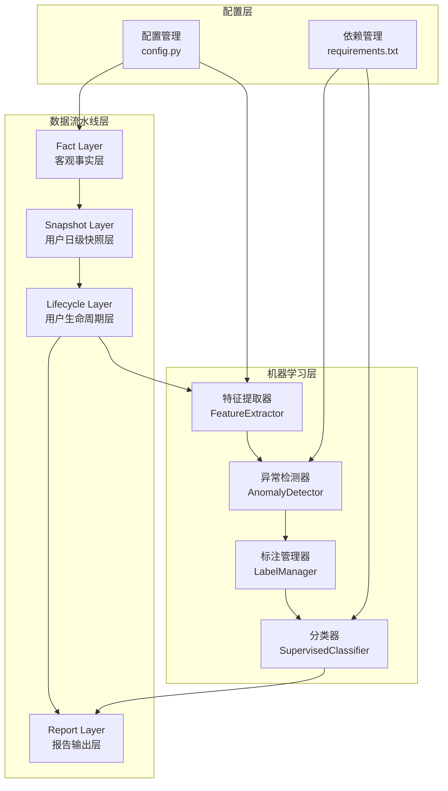
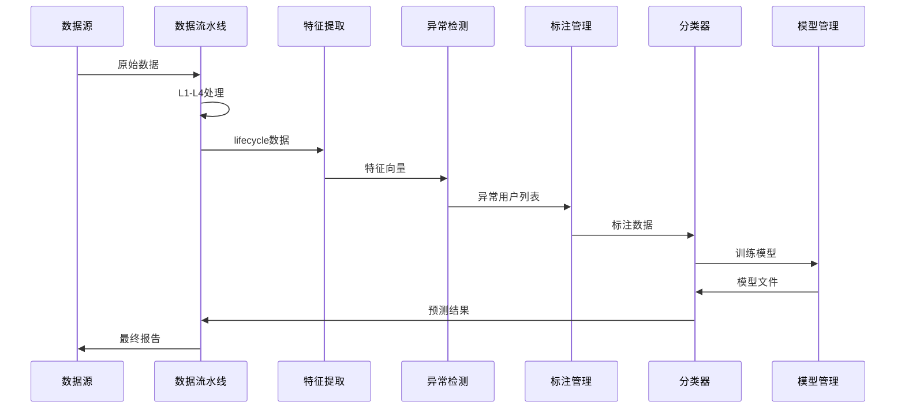
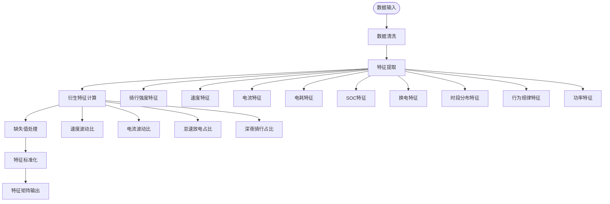
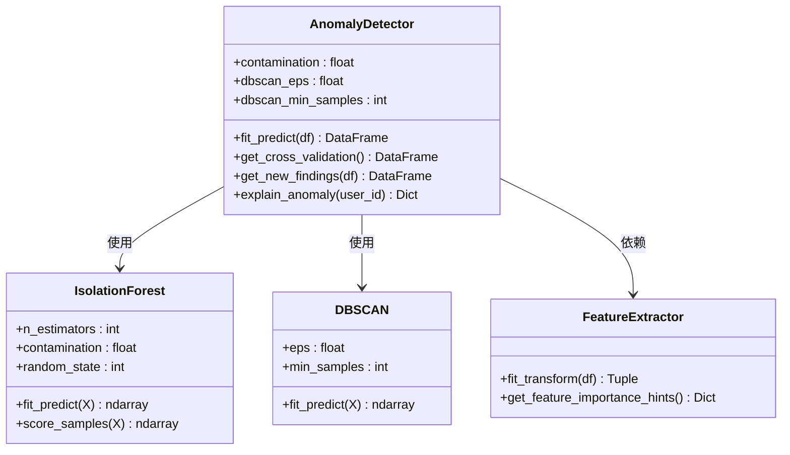
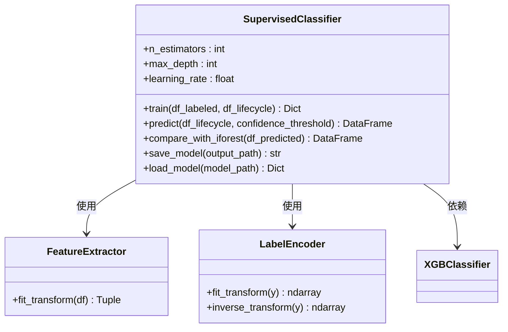
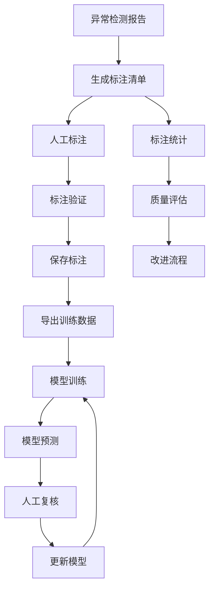
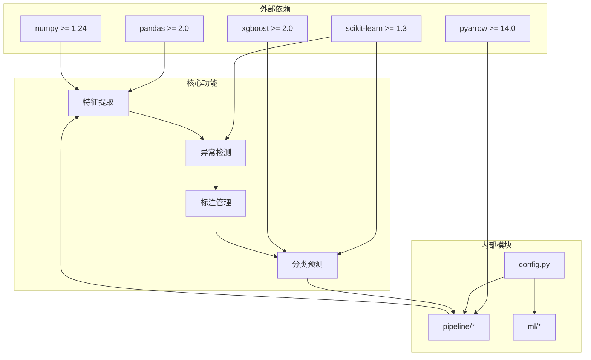

# 机器学习集成架构

<cite>
**本文档引用的文件**
- [src/ml/run_ml.py](file://src/ml/run_ml.py)
- [src/ml/anomaly.py](file://src/ml/anomaly.py)
- [src/ml/classifier.py](file://src/ml/classifier.py)
- [src/ml/features.py](file://src/ml/features.py)
- [src/ml/labeler.py](file://src/ml/labeler.py)
- [src/pipeline/run_pipeline.py](file://src/pipeline/run_pipeline.py)
- [src/pipeline/lifecycle_layer.py](file://src/pipeline/lifecycle_layer.py)
- [src/pipeline/snapshot_layer.py](file://src/pipeline/snapshot_layer.py)
- [src/pipeline/dynamic_thresholds.py](file://src/pipeline/dynamic_thresholds.py)
- [config/config.py](file://config/config.py)
- [requirements.txt](file://requirements.txt)
</cite>

## 目录
1. [引言](#引言)
2. [项目结构](#项目结构)
3. [核心组件](#核心组件)
4. [架构概览](#架构概览)
5. [详细组件分析](#详细组件分析)
6. [依赖关系分析](#依赖关系分析)
7. [性能考虑](#性能考虑)
8. [故障排除指南](#故障排除指南)
9. [结论](#结论)

## 引言

本项目是一个两轮车换电用户特征画像系统，集成了机器学习模块与数据流水线的完整架构。系统通过五层数据流水线（L1-L4）生成用户行为特征，再通过机器学习模块实现异常检测和分类预测。

系统的核心创新在于：
- **双模型异常检测**：结合孤立森林和DBSCAN算法，既能发现规则无法识别的异常，又能发现新的用户群体
- **监督学习分类**：基于人工标注数据训练XGBoost多分类器，实现异常类型自动识别
- **特征工程自动化**：从lifecycle层数据自动提取300+特征向量，支持缺失值处理和衍生特征计算
- **动态阈值系统**：自适应调整业务阈值，避免静态阈值过时

## 项目结构

系统采用分层架构设计，包含数据流水线和机器学习两大核心模块：

**图表来源**
- [src/pipeline/run_pipeline.py:1-381](file://src/pipeline/run_pipeline.py#L1-L381)
- [src/ml/run_ml.py:1-395](file://src/ml/run_ml.py#L1-L395)

**章节来源**
- [src/pipeline/run_pipeline.py:1-381](file://src/pipeline/run_pipeline.py#L1-L381)
- [src/ml/run_ml.py:1-395](file://src/ml/run_ml.py#L1-L395)

## 核心组件

### 数据流水线组件

**L1 Fact Layer（客观事实层）**
- 负责将每日原始数据转换为结构化的合约日级指标
- 实现SOC差法电量计算，避免电流噪声影响
- 提供数据完整性校验，确保统计准确性

**L2 Snapshot Layer（用户日级快照层）**
- 将多日Fact数据聚合成用户维度的7天滚动窗口快照
- 计算各类加权统计指标，支持极值、均值、占比等多种聚合方式

**L3 Lifecycle Layer（用户生命周期层）**
- 实现用户评分分类、风险标签生成和完整画像文本
- 集成动态阈值系统，实现自适应业务规则
- 生成月度用电量预估和用户完全体画像

**L4 Report Layer（报告输出层）**
- 将最终结果导出为多种业务友好的报告格式
- 支持CSV、JSON、TXT等多种输出格式

### 机器学习组件

**特征提取器（FeatureExtractor）**
- 从lifecycle层数据自动提取300+特征向量
- 支持缺失值中位数填充和特征衍生计算
- 包含7大特征组：骑行强度、速度特征、电流特征、电耗特征、SOC特征、换电特征、时段分布

**异常检测器（AnomalyDetector）**
- 孤立森林算法：基于异常点容易被分离的特性识别异常
- DBSCAN聚类：基于密度发现新的用户群体
- 双模型交叉验证，提高检测准确性

**分类器（SupervisedClassifier）**
- XGBoost多分类器，支持异常类型自动识别
- 集成特征重要性分析和SHAP解释
- 支持模型持久化和在线推理

**标注管理器（LabelManager）**
- 管理人工标注流程，避免重复标注
- 提供标注统计和质量评估
- 支持标注数据导出用于监督学习

**章节来源**
- [src/pipeline/lifecycle_layer.py:1-800](file://src/pipeline/lifecycle_layer.py#L1-L800)
- [src/ml/features.py:1-321](file://src/ml/features.py#L1-L321)
- [src/ml/anomaly.py:1-396](file://src/ml/anomaly.py#L1-L396)
- [src/ml/classifier.py:1-517](file://src/ml/classifier.py#L1-L517)
- [src/ml/labeler.py:1-381](file://src/ml/labeler.py#L1-L381)

## 架构概览

系统采用"流水线驱动机器学习"的架构模式，数据流水线为机器学习模块提供高质量的特征数据：

**图表来源**
- [src/pipeline/run_pipeline.py:104-166](file://src/pipeline/run_pipeline.py#L104-L166)
- [src/ml/run_ml.py:83-250](file://src/ml/run_ml.py#L83-L250)

系统的核心优势：
1. **端到端自动化**：从数据采集到模型部署的完整流程
2. **双模型互补**：无监督异常检测与监督分类相结合
3. **持续学习**：人工标注数据不断改进模型性能
4. **实时推理**：支持在线预测和风险预警

## 详细组件分析

### 特征工程模块

特征提取器实现了自动化的特征工程流程：

**图表来源**
- [src/ml/features.py:182-250](file://src/ml/features.py#L182-L250)

特征工程的关键特性：
- **自动列名匹配**：兼容不同版本的数据字段
- **缺失值处理**：中位数填充并标记缺失
- **特征衍生**：自动计算比值类衍生特征
- **特征组合**：7大特征组提供全面的用户画像

**章节来源**
- [src/ml/features.py:1-321](file://src/ml/features.py#L1-L321)

### 异常检测架构

系统采用双模型异常检测架构：

**图表来源**
- [src/ml/anomaly.py:60-158](file://src/ml/anomaly.py#L60-L158)

异常检测算法选择依据：
- **孤立森林**：适合高维稀疏数据，对异常点敏感
- **DBSCAN**：无需预设类别数，能发现新的用户群体
- **双模型验证**：交叉验证提高检测可靠性

**章节来源**
- [src/ml/anomaly.py:1-396](file://src/ml/anomaly.py#L1-L396)

### 分类器架构

监督学习分类器采用XGBoost多分类器：

**图表来源**
- [src/ml/classifier.py:76-270](file://src/ml/classifier.py#L76-L270)

分类器设计特点：
- **多分类支持**：支持6种异常类型分类
- **置信度控制**：低置信度样本自动标记
- **模型对比**：与孤立森林结果进行对比分析
- **特征重要性**：提供特征重要性排序和解释

**章节来源**
- [src/ml/classifier.py:1-517](file://src/ml/classifier.py#L1-L517)

### 标注管理流程

标注管理器实现了完整的标注工作流：

**图表来源**
- [src/ml/labeler.py:103-176](file://src/ml/labeler.py#L103-L176)

标注管理的关键功能：
- **智能筛选**：优先标注规则判正常的异常用户
- **冲突避免**：避免重复标注已标注用户
- **质量控制**：提供标注统计和质量评估
- **流程自动化**：从标注到训练的完整闭环

**章节来源**
- [src/ml/labeler.py:1-381](file://src/ml/labeler.py#L1-L381)

## 依赖关系分析

系统依赖关系呈现清晰的层次结构：

**图表来源**
- [requirements.txt:1-9](file://requirements.txt#L1-L9)
- [config/config.py:1-54](file://config/config.py#L1-L54)

**章节来源**
- [requirements.txt:1-9](file://requirements.txt#L1-L9)
- [config/config.py:1-54](file://config/config.py#L1-L54)

## 性能考虑

系统在多个层面进行了性能优化：

### 数据处理优化
- **Parquet格式**：列式存储，压缩比高，I/O效率优异
- **批处理计算**：L1层采用批量处理，避免逐行计算开销
- **内存管理**：特征提取器支持大数据集处理，自动内存回收

### 算法优化
- **特征选择**：自动特征工程减少冗余特征
- **模型压缩**：XGBoost模型支持序列化存储
- **增量处理**：流水线支持增量模式，避免全量重算

### 并行计算
- **多进程处理**：L1层支持并行处理多个日期的数据
- **向量化计算**：NumPy数组操作提升计算效率
- **异步I/O**：文件读写采用异步模式

## 故障排除指南

### 常见问题及解决方案

**数据路径错误**
- 检查配置文件中的基础路径设置
- 确认数据文件存在且格式正确
- 验证文件权限和磁盘空间

**模型训练失败**
- 检查标注数据质量和数量
- 验证特征工程是否正常
- 确认依赖包版本兼容性

**异常检测结果异常**
- 调整孤立森林的异常比例参数
- 检查DBSCAN的邻域半径设置
- 验证特征数据的完整性

**性能问题**
- 检查系统资源使用情况
- 优化特征工程参数
- 考虑增加硬件资源配置

**章节来源**
- [src/ml/run_ml.py:83-103](file://src/ml/run_ml.py#L83-L103)
- [src/pipeline/run_pipeline.py:364-377](file://src/pipeline/run_pipeline.py#L364-L377)

## 结论

本机器学习集成架构成功实现了数据流水线与机器学习模块的深度融合。通过双模型异常检测、自动化特征工程、智能标注管理和持续学习机制，系统能够：

1. **全面识别异常行为**：结合无监督和监督学习的优势
2. **自动化特征提取**：从原始数据中自动挖掘有价值的特征
3. **持续改进模型**：通过人工标注数据不断优化预测性能
4. **支持实时推理**：为业务运营提供及时的风险预警

系统的架构设计充分考虑了可扩展性、可维护性和性能优化，在保证准确性的同时实现了高效的批量处理和实时推理能力。通过模块化的组件设计和清晰的接口定义，系统为后续的功能扩展和技术演进奠定了坚实基础。