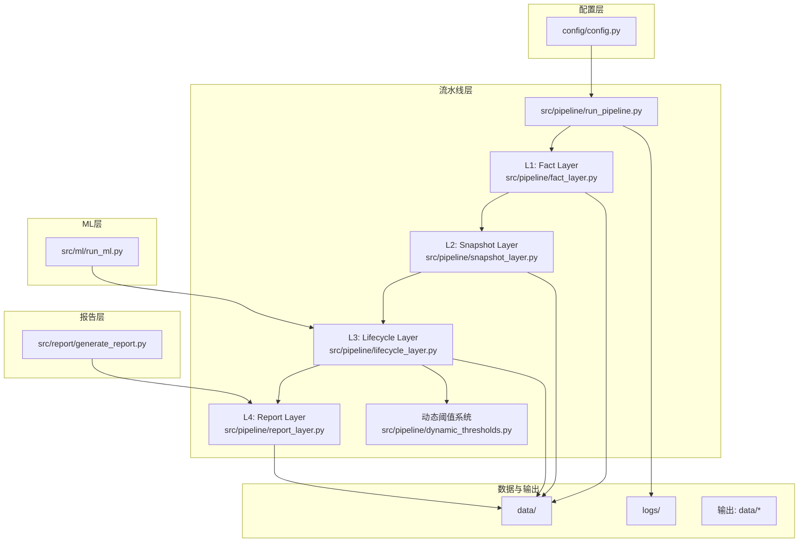
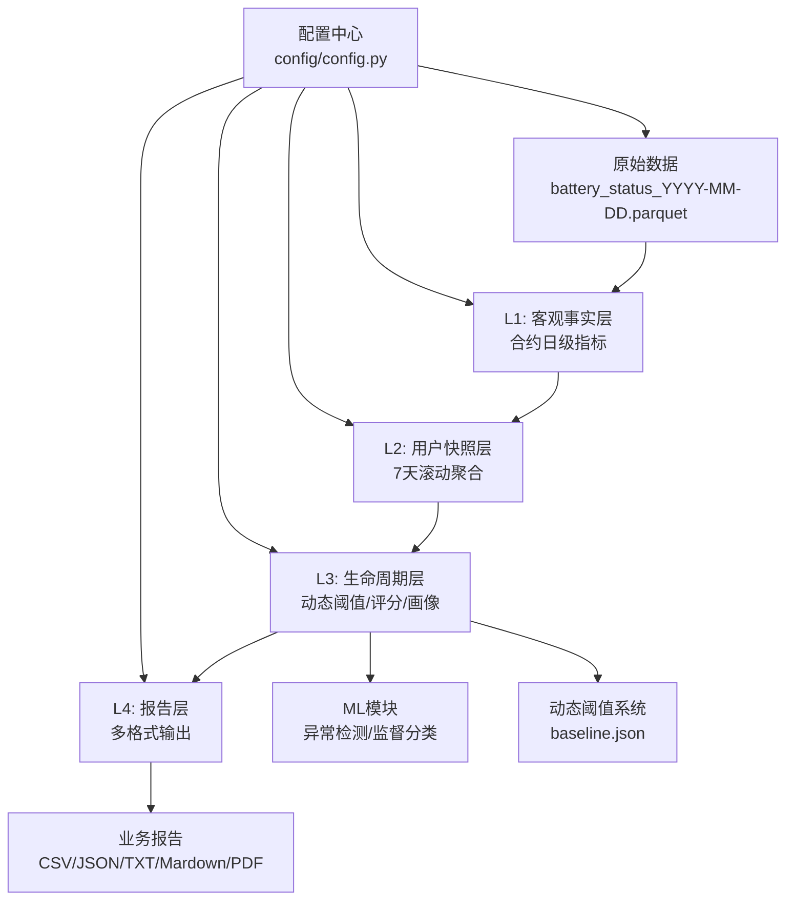
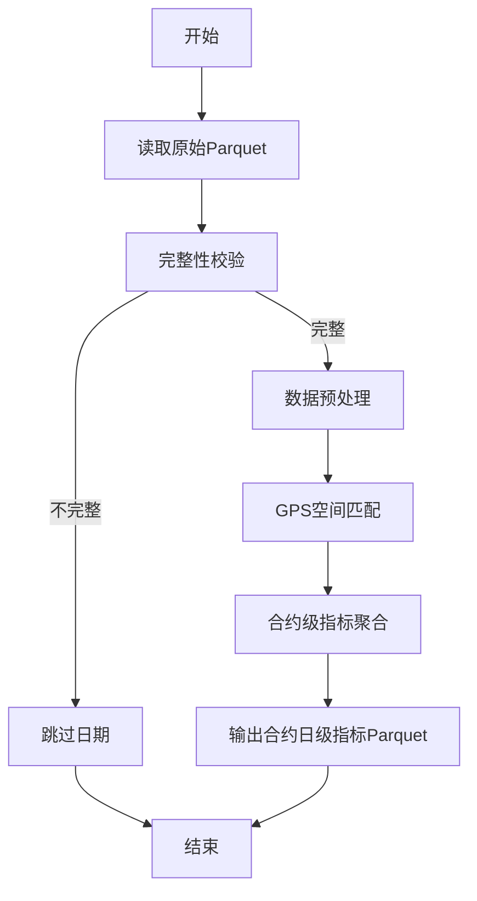
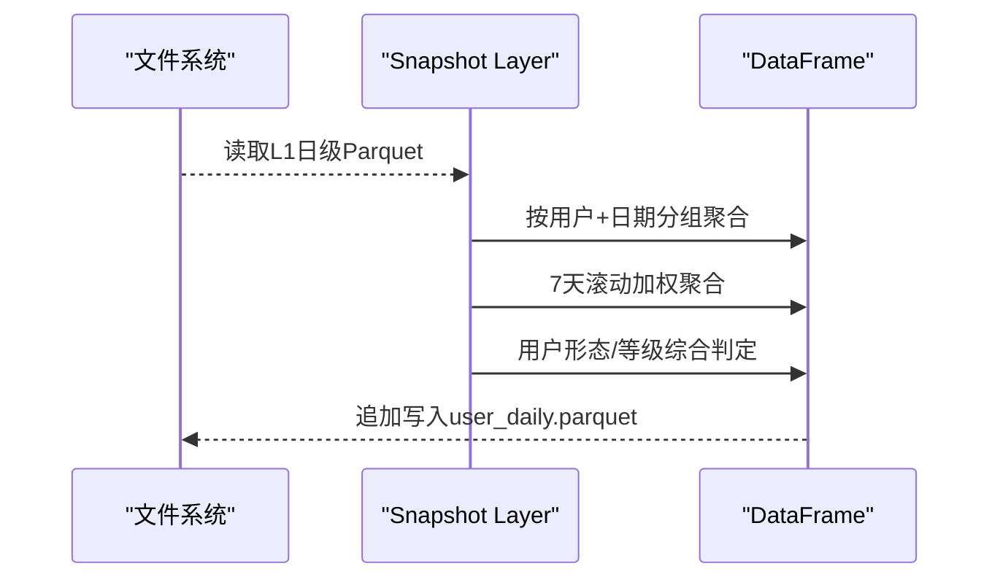
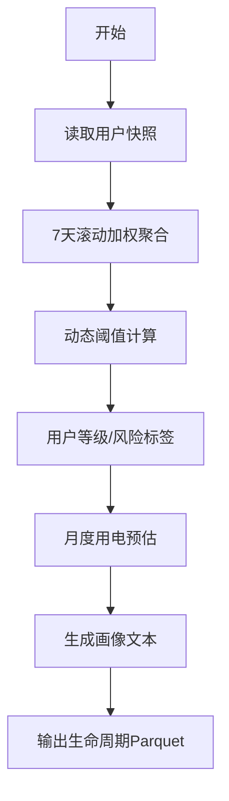
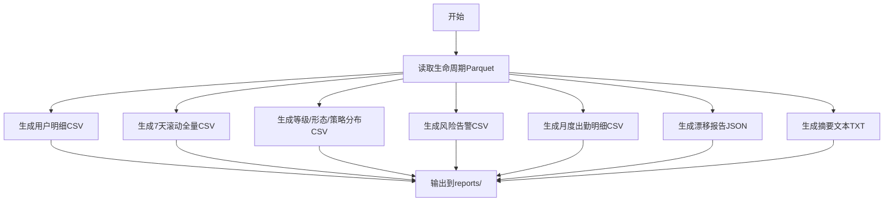
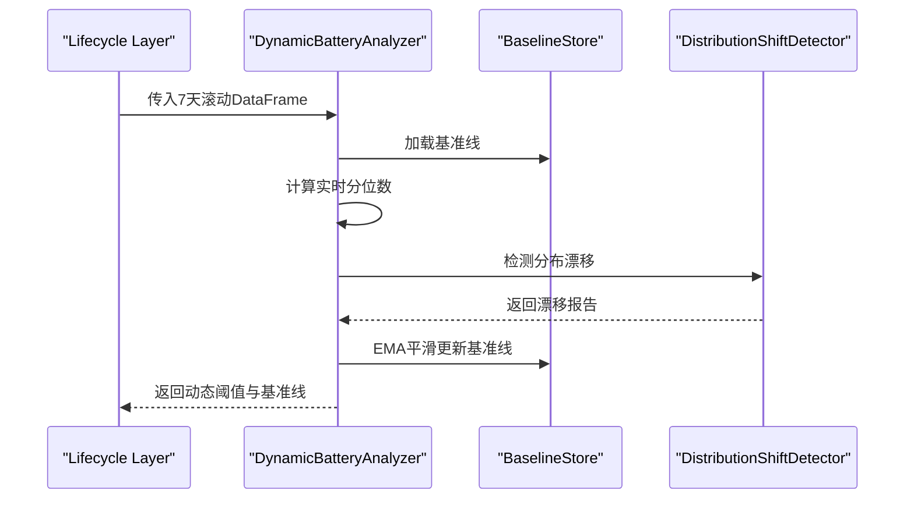
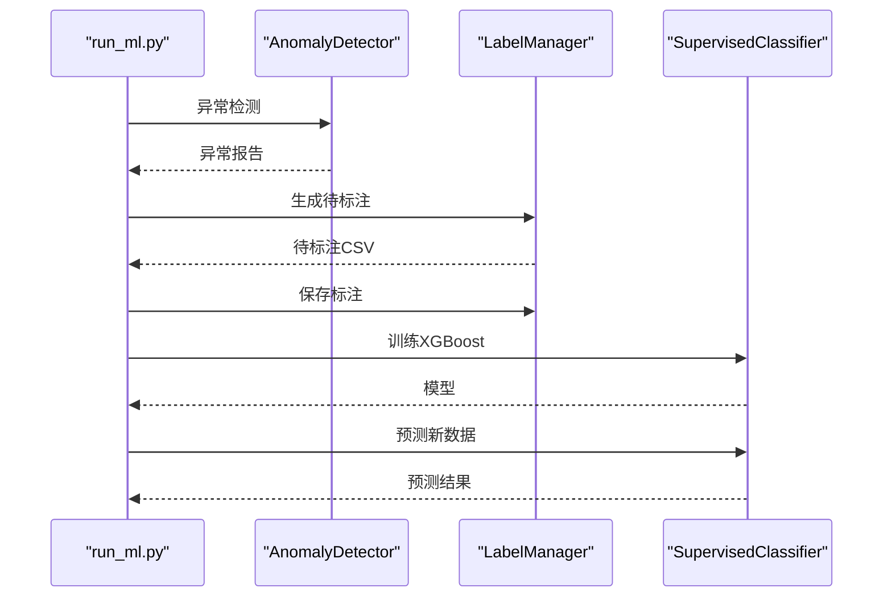
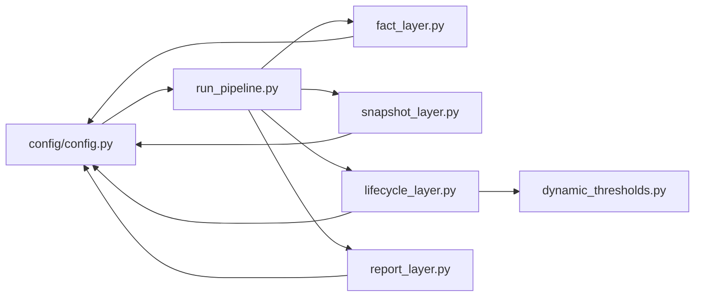

# 系统架构设计

<cite>
**本文档引用的文件**
- [README.md](file://README.md)
- [config.py](file://config/config.py)
- [run_pipeline.py](file://src/pipeline/run_pipeline.py)
- [fact_layer.py](file://src/pipeline/fact_layer.py)
- [snapshot_layer.py](file://src/pipeline/snapshot_layer.py)
- [lifecycle_layer.py](file://src/pipeline/lifecycle_layer.py)
- [report_layer.py](file://src/pipeline/report_layer.py)
- [dynamic_thresholds.py](file://src/pipeline/dynamic_thresholds.py)
- [run_ml.py](file://src/ml/run_ml.py)
- [generate_report.py](file://src/report/generate_report.py)
</cite>

## 目录
1. [简介](#简介)
2. [项目结构](#项目结构)
3. [核心组件](#核心组件)
4. [架构总览](#架构总览)
5. [详细组件分析](#详细组件分析)
6. [依赖关系分析](#依赖关系分析)
7. [性能考虑](#性能考虑)
8. [故障排查指南](#故障排查指南)
9. [结论](#结论)
10. [附录](#附录)

## 简介
本系统是一个两轮车换电用户行为分析与生命周期管理系统，采用L1-L4分层数据处理架构，实现从原始电池状态数据到多格式业务报告的全链路自动化处理。系统具备分层解耦、增量处理、容错设计、配置驱动、可扩展性与性能优化等特性，支持动态阈值自适应、众包/专送增强判定、ML异常检测与监督分类等高级能力。

## 项目结构
项目采用模块化分层组织，核心目录包括：
- config：统一配置管理（路径、参数）
- src/pipeline：L1-L4数据处理流水线
- src/ml：机器学习异常检测与监督分类
- src/report：报告生成与可视化
- data：辅助数据（地理围栏、电池规格等）
- logs：运行日志
- temp：临时输出与测试数据

**图表来源**
- [config.py:1-54](file://config/config.py#L1-L54)
- [run_pipeline.py:1-381](file://src/pipeline/run_pipeline.py#L1-L381)
- [fact_layer.py:1-1227](file://src/pipeline/fact_layer.py#L1-L1227)
- [snapshot_layer.py:1-452](file://src/pipeline/snapshot_layer.py#L1-L452)
- [lifecycle_layer.py:1-990](file://src/pipeline/lifecycle_layer.py#L1-L990)
- [report_layer.py:1-235](file://src/pipeline/report_layer.py#L1-L235)
- [dynamic_thresholds.py:1-580](file://src/pipeline/dynamic_thresholds.py#L1-L580)
- [run_ml.py:1-395](file://src/ml/run_ml.py#L1-L395)
- [generate_report.py:1-908](file://src/report/generate_report.py#L1-L908)

**章节来源**
- [README.md:79-156](file://README.md#L79-L156)
- [config.py:1-54](file://config/config.py#L1-L54)

## 核心组件
- 配置中心：集中管理路径、参数与环境开关，支持测试/生产双模式。
- 流水线调度：统一入口，支持全量重建、增量处理、刷新聚合、重算评级、仅报告等模式。
- L1客观事实层：原始Parquet→合约日级指标，含数据完整性校验、GPS空间匹配、SOC差法电量计算等。
- L2用户快照层：合约→用户聚合，7天滚动窗口，用户形态/等级综合判定。
- L3生命周期层：动态阈值计算、用户等级/风险标签、月度用电预估、画像文本生成。
- L4报告层：多格式业务报告输出，CSV/JSON/TXT。
- 动态阈值系统：分位数自适应、基准线持久化、分布漂移检测、EMA平滑更新。
- ML模块：无监督异常检测、标注管理、监督分类训练与预测。
- 报告生成：Markdown/PDF自动报告生成。

**章节来源**
- [README.md:158-722](file://README.md#L158-L722)
- [run_pipeline.py:1-381](file://src/pipeline/run_pipeline.py#L1-L381)
- [fact_layer.py:1-1227](file://src/pipeline/fact_layer.py#L1-L1227)
- [snapshot_layer.py:1-452](file://src/pipeline/snapshot_layer.py#L1-L452)
- [lifecycle_layer.py:1-990](file://src/pipeline/lifecycle_layer.py#L1-L990)
- [report_layer.py:1-235](file://src/pipeline/report_layer.py#L1-L235)
- [dynamic_thresholds.py:1-580](file://src/pipeline/dynamic_thresholds.py#L1-L580)
- [run_ml.py:1-395](file://src/ml/run_ml.py#L1-L395)
- [generate_report.py:1-908](file://src/report/generate_report.py#L1-L908)

## 架构总览
系统采用“配置驱动 + 分层解耦”的架构设计，L1-L4各层职责清晰、数据单向流动，支持增量处理与容错恢复；动态阈值系统贯穿L3，实现自适应评分；ML模块与报告模块作为独立扩展点接入。

**图表来源**
- [README.md:136-156](file://README.md#L136-L156)
- [config.py:1-54](file://config/config.py#L1-L54)
- [run_pipeline.py:1-381](file://src/pipeline/run_pipeline.py#L1-L381)
- [dynamic_thresholds.py:1-580](file://src/pipeline/dynamic_thresholds.py#L1-L580)

## 详细组件分析

### L1: 客观事实层（Fact Layer）
- 职责：将每日原始Parquet转换为合约日级可观测指标，不含业务推断。
- 关键流程：
  - 数据完整性校验（时间跨度、小时覆盖）
  - 预处理清洗（无效电流/电压、GPS过滤、漂移速度过滤、离线状态过滤）
  - GPS空间匹配（省/市/区三级行政区匹配）
  - 电量计算（SOC差法：标准电压×满容量×SOC差）
  - 骑行/速度/电流/温度/SOC等多维指标聚合
  - 新增：众包/专送增强特征（上线时间熵值、路线曲折系数、速度变异系数等）

**图表来源**
- [fact_layer.py:135-800](file://src/pipeline/fact_layer.py#L135-L800)

**章节来源**
- [README.md:160-387](file://README.md#L160-L387)
- [fact_layer.py:1-1227](file://src/pipeline/fact_layer.py#L1-L1227)

### L2: 用户快照层（Snapshot Layer）
- 职责：将合约日级指标聚合为用户日级快照，支持增量追加写入。
- 关键流程：
  - 读取L1全量日级文件
  - 按用户+日期聚合，7天滚动窗口加权聚合
  - 用户形态/等级综合判定（优先级：地摊/储能 > 改装/超速 > 众数）
  - 新增：众包/专送增强特征聚合（上线时间熵值、路线曲折系数、速度变异系数等）

**图表来源**
- [snapshot_layer.py:212-447](file://src/pipeline/snapshot_layer.py#L212-L447)

**章节来源**
- [README.md:389-499](file://README.md#L389-L499)
- [snapshot_layer.py:1-452](file://src/pipeline/snapshot_layer.py#L1-L452)

### L3: 生命周期层（Lifecycle Layer）
- 职责：7天滚动指标、动态阈值、用户等级/风险标签、月度用电预估、画像文本生成。
- 关键流程：
  - 7天滚动加权聚合（权重随天数递减）
  - 动态阈值计算（分位数+EMA平滑更新）
  - 用户形态/等级判定（专送/众包/地摊/储能等）
  - 月度用电预估（基于出勤率与日均用电）
  - 生命周期状态（已到期/新用户/活跃/轻度活跃/沉默/流失）

**图表来源**
- [lifecycle_layer.py:186-596](file://src/pipeline/lifecycle_layer.py#L186-L596)
- [dynamic_thresholds.py:349-456](file://src/pipeline/dynamic_thresholds.py#L349-L456)

**章节来源**
- [README.md:501-700](file://README.md#L501-L700)
- [lifecycle_layer.py:1-990](file://src/pipeline/lifecycle_layer.py#L1-L990)
- [dynamic_thresholds.py:1-580](file://src/pipeline/dynamic_thresholds.py#L1-L580)

### L4: 报告输出层（Report Layer）
- 职责：将生命周期数据导出为多格式业务报告。
- 输出清单：用户明细、7天滚动全量、等级分布、风险告警、月度出勤明细、漂移报告、摘要文本等。

**图表来源**
- [report_layer.py:192-230](file://src/pipeline/report_layer.py#L192-L230)

**章节来源**
- [README.md:702-722](file://README.md#L702-L722)
- [report_layer.py:1-235](file://src/pipeline/report_layer.py#L1-L235)

### 动态阈值系统（Dynamic Thresholds）
- 设计目标：解决静态阈值无法适应业务变化的问题。
- 工作流程：实时分位数→加载基准线→对比漂移→生成自适应阈值→EMA平滑更新基准文件。
- 特性：零人工干预、可追溯、可回滚、支持EMA平滑。

**图表来源**
- [dynamic_thresholds.py:349-456](file://src/pipeline/dynamic_thresholds.py#L349-L456)

**章节来源**
- [README.md:724-800](file://README.md#L724-L800)
- [dynamic_thresholds.py:1-580](file://src/pipeline/dynamic_thresholds.py#L1-L580)

### ML模块（异常检测与监督分类）
- 异常检测：无监督（孤立森林+DBSCAN）发现规则之外的异常。
- 标注管理：生成待标注、保存标注、统计查看。
- 监督分类：XGBoost多分类训练与预测。
- 流程：anomaly → label generate → label save → train → predict。

**图表来源**
- [run_ml.py:83-249](file://src/ml/run_ml.py#L83-L249)

**章节来源**
- [run_ml.py:1-395](file://src/ml/run_ml.py#L1-L395)

### 报告生成（Markdown/PDF）
- 自动统计与报告生成，支持Markdown与PDF输出。
- 数据源：reports/目录下的CSV/JSON文件。
- 输出：用户运营分析报告.md与PDF。

**章节来源**
- [generate_report.py:1-908](file://src/report/generate_report.py#L1-L908)

## 依赖关系分析
- 配置依赖：config.py集中管理路径与参数，被各层与模块导入使用。
- 层间依赖：L1→L2→L3→L4单向依赖，L3依赖动态阈值系统。
- 外部依赖：pandas/numpy/pyarrow/GeoJSON/shapely/scipy等。
- 运行时依赖：日志系统（TeeOutput）、OneDrive文件锁兼容处理。

**图表来源**
- [config.py:1-54](file://config/config.py#L1-L54)
- [run_pipeline.py:96-101](file://src/pipeline/run_pipeline.py#L96-L101)

**章节来源**
- [run_pipeline.py:1-381](file://src/pipeline/run_pipeline.py#L1-L381)
- [config.py:1-54](file://config/config.py#L1-L54)

## 性能考虑
- 列式存储：Parquet（Snappy/ZSTD压缩）提升I/O与查询性能。
- 批量处理：L1按日期分区批量读取与写入，L2按用户聚合减少重复计算。
- 并行计算：多进程/多线程并行处理（如tqdm进度条与分组计算）。
- 增量处理：仅处理新增日期，避免全量重算。
- 内存优化：滚动窗口与分批聚合，避免一次性加载全量数据。
- I/O优化：追加写入user_daily.parquet，减少随机写入。

**章节来源**
- [README.md:43-52](file://README.md#L43-L52)
- [fact_layer.py:221-232](file://src/pipeline/fact_layer.py#L221-L232)
- [snapshot_layer.py:157-209](file://src/pipeline/snapshot_layer.py#L157-L209)

## 故障排查指南
- 日志系统：统一输出到logs/目录，包含stdout与文件双通道。
- 文件锁兼容：清理目录时兼容OneDrive文件锁，失败文件将被覆盖写入。
- 数据完整性：L1阶段跳过不完整日期，避免污染后续计算。
- 模式选择：根据需求选择full/incremental/refresh/recalculate/report_only模式。
- 动态阈值：若阈值异常，可强制刷新基准线或关闭EMA更新。

**章节来源**
- [run_pipeline.py:57-90](file://src/pipeline/run_pipeline.py#L57-L90)
- [run_pipeline.py:222-259](file://src/pipeline/run_pipeline.py#L222-L259)
- [fact_layer.py:100-103](file://src/pipeline/fact_layer.py#L100-L103)

## 结论
本系统通过L1-L4分层架构实现了从原始数据到业务报告的全链路自动化处理，具备良好的可扩展性、容错性与性能表现。动态阈值系统与ML模块进一步增强了系统的智能化水平，适合在实际运营中持续迭代与扩展。

## 附录
- 快速开始：执行命令行入口，选择合适模式运行。
- 参数校准：动态阈值系统支持EMA平滑与漂移检测，自动更新基准线。
- ML闭环：异常检测→人工标注→监督分类→预测，形成反馈闭环。

**章节来源**
- [README.md:8-27](file://README.md#L8-L27)
- [run_pipeline.py:13-41](file://src/pipeline/run_pipeline.py#L13-L41)
- [dynamic_thresholds.py:489-497](file://src/pipeline/dynamic_thresholds.py#L489-L497)