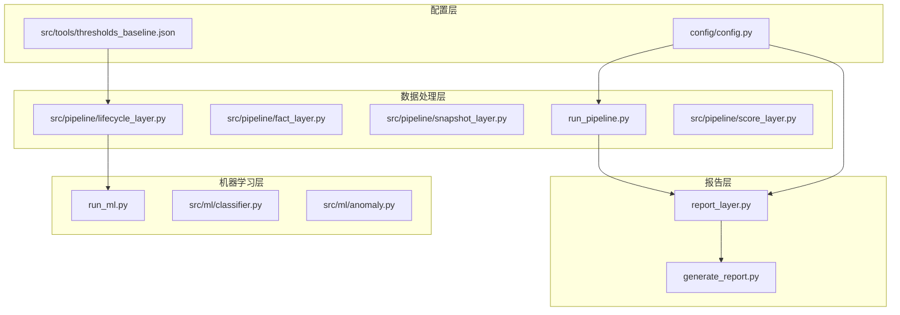
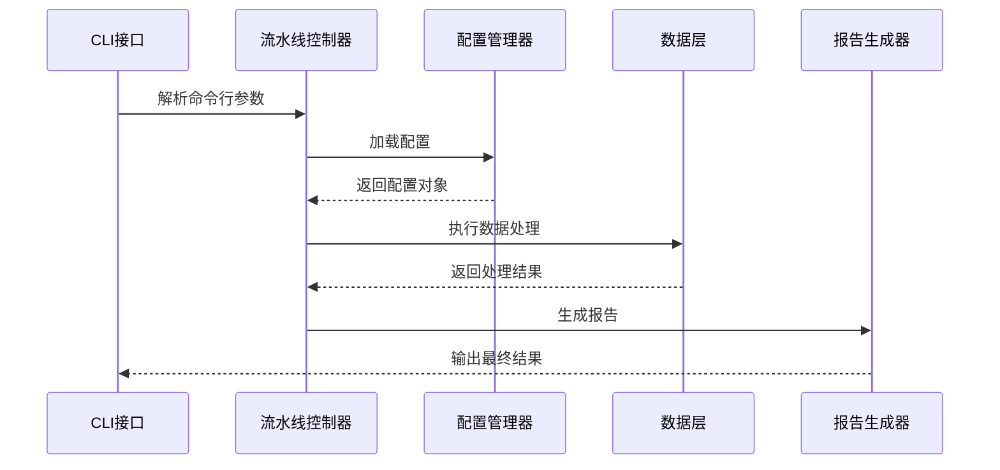
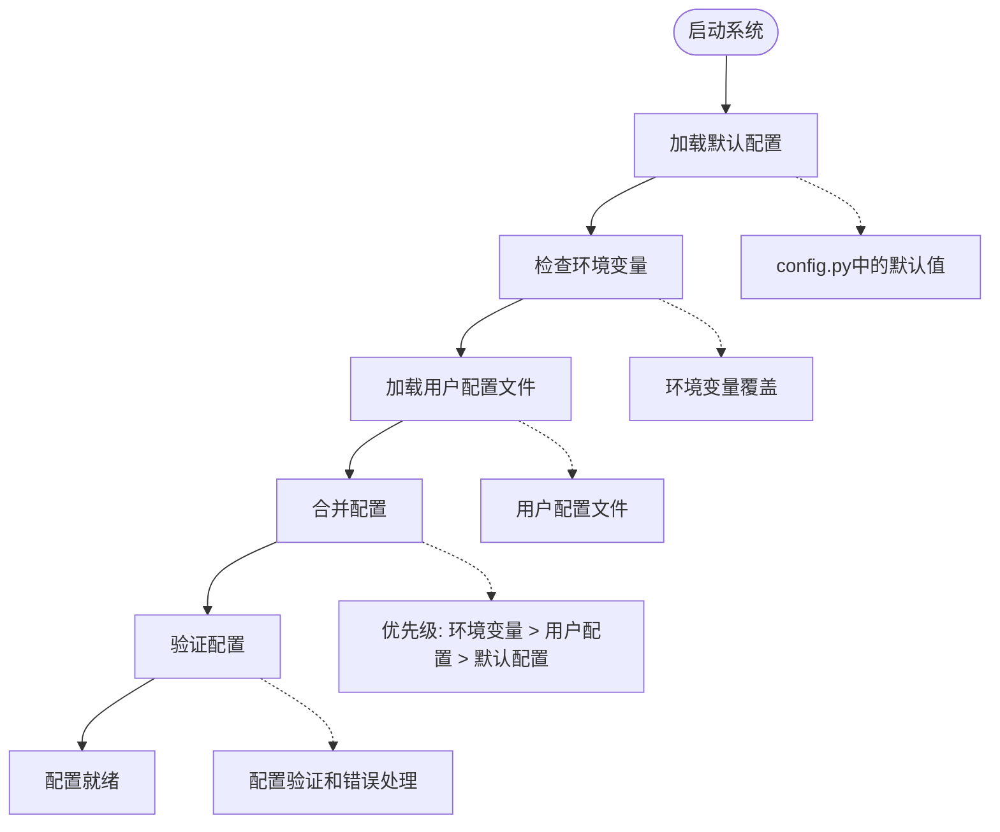
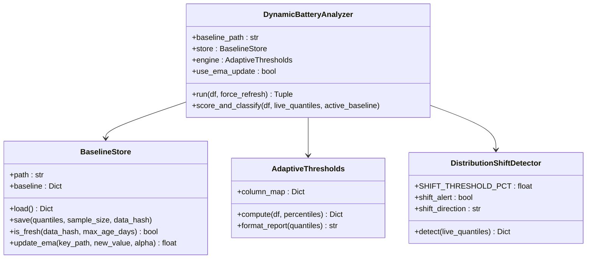
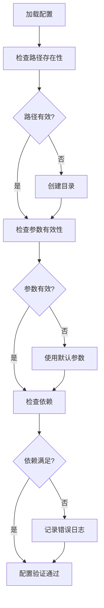
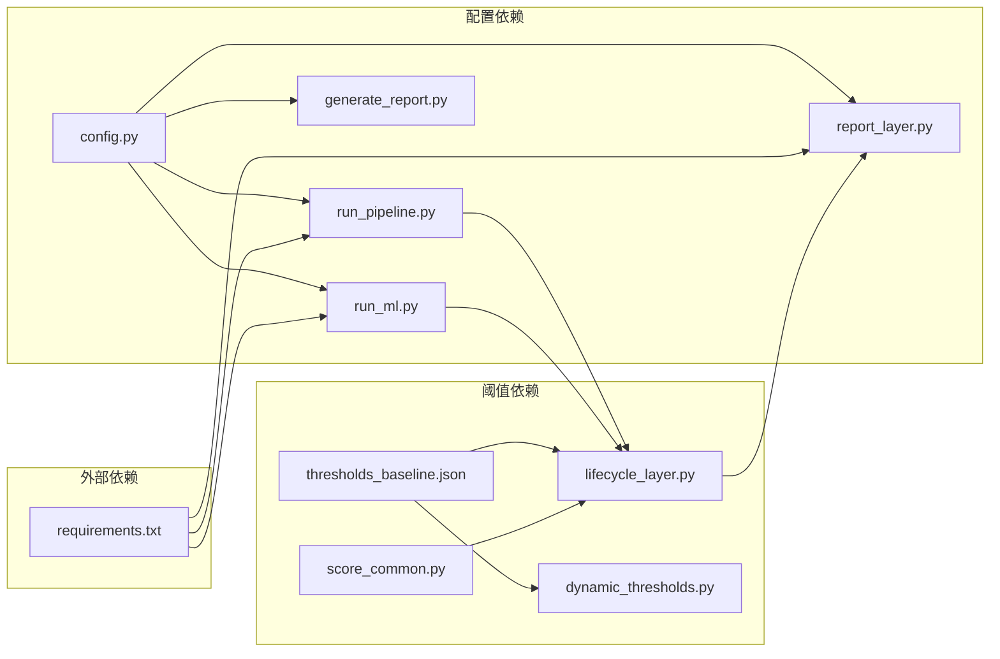

# 配置管理架构

<cite>
**本文档引用的文件**
- [config.py](file://config/config.py)
- [run_pipeline.py](file://src/pipeline/run_pipeline.py)
- [dynamic_thresholds.py](file://src/pipeline/dynamic_thresholds.py)
- [thresholds_baseline.json](file://src/tools/thresholds_baseline.json)
- [score_common.py](file://src/pipeline/score_common.py)
- [report_layer.py](file://src/pipeline/report_layer.py)
- [generate_report.py](file://src/report/generate_report.py)
- [run_ml.py](file://src/ml/run_ml.py)
- [README.md](file://README.md)
- [requirements.txt](file://requirements.txt)
- [test_pipeline.py](file://tests/test_pipeline.py)
</cite>

## 目录
1. [简介](#简介)
2. [项目结构](#项目结构)
3. [核心组件](#核心组件)
4. [架构概览](#架构概览)
5. [详细组件分析](#详细组件分析)
6. [依赖关系分析](#依赖关系分析)
7. [性能考虑](#性能考虑)
8. [故障排除指南](#故障排除指南)
9. [结论](#结论)
10. [附录](#附录)

## 简介

两轮车换电用户特征画像系统采用配置驱动的架构模式，通过统一的配置管理实现系统的灵活性和可维护性。该系统的核心特点包括：

- **分层配置管理**：将配置分为基础路径配置、数据路径配置、参数配置和阈值配置四个层次
- **配置驱动的流水线**：通过配置文件控制数据流向和处理逻辑
- **动态阈值系统**：基于历史基准线的自适应阈值计算
- **多格式报告输出**：支持多种业务友好的报告格式

## 项目结构

系统采用模块化设计，主要目录结构如下：



**图表来源**
- [config.py:1-54](file://config/config.py#L1-L54)
- [run_pipeline.py:1-381](file://src/pipeline/run_pipeline.py#L1-L381)
- [dynamic_thresholds.py:1-580](file://src/pipeline/dynamic_thresholds.py#L1-L580)

**章节来源**
- [README.md:79-156](file://README.md#L79-L156)

## 核心组件

### 配置模块架构

系统配置采用模块化设计，主要包含以下组件：

#### 1. 基础路径配置
- **测试模式开关**：控制开发和生产环境的路径切换
- **基础导出路径**：统一的数据输出根目录
- **动态路径生成**：基于基础路径生成具体文件路径

#### 2. 数据路径配置
- **输入数据路径**：原始数据的存储位置
- **输出数据路径**：各层处理结果的存储位置
- **辅助数据路径**：地理围栏等辅助数据文件

#### 3. 阈值配置
- **动态阈值基准线**：JSON格式的阈值基准文件
- **评分常量**：用户等级判定的阈值参数
- **动态阈值计算**：基于分位数的自适应阈值

#### 4. 参数配置
- **执行模式参数**：流水线的不同执行模式
- **数据完整性检查**：跳过不完整数据的阈值
- **ML模型参数**：机器学习算法的配置参数

**章节来源**
- [config.py:8-54](file://config/config.py#L8-L54)
- [score_common.py:8-28](file://src/pipeline/score_common.py#L8-L28)

## 架构概览

系统采用分层架构，通过配置驱动实现各层之间的解耦：



**图表来源**
- [run_pipeline.py:307-378](file://src/pipeline/run_pipeline.py#L307-L378)
- [config.py:17-19](file://config/config.py#L17-L19)

## 详细组件分析

### 配置加载与优先级机制

系统采用多层配置加载策略：



**图表来源**
- [config.py:10-19](file://config/config.py#L10-L19)
- [run_pipeline.py:307-378](file://src/pipeline/run_pipeline.py#L307-L378)

#### 配置分类说明

**路径配置**
- 基础路径：`BASE_EXPORT_PATH`
- 输入路径：`EXPORT_FILE_*` 变量
- 输出路径：`DATA_OUTPUT_ROOT` 及其子目录

**参数配置**
- 执行模式：`--mode` 参数
- 数据完整性：`--skip-incomplete` 参数
- 目标日期：`--date` 参数

**阈值配置**
- 动态阈值：`thresholds_baseline.json`
- 评分常量：`score_common.py` 中的阈值参数
- ML参数：`run_ml.py` 中的算法参数

**报告配置**
- 报告输出目录：`EXPORT_PATH_REPORTS`
- 报告文件格式：CSV、JSON、TXT
- 报告生成逻辑：`report_layer.py`

**章节来源**
- [config.py:22-54](file://config/config.py#L22-L54)
- [run_pipeline.py:307-336](file://src/pipeline/run_pipeline.py#L307-L336)
- [report_layer.py:23-24](file://src/pipeline/report_layer.py#L23-L24)

### 动态阈值配置系统

动态阈值系统是配置管理的核心组件：



**图表来源**
- [dynamic_thresholds.py:33-145](file://src/pipeline/dynamic_thresholds.py#L33-L145)
- [dynamic_thresholds.py:151-235](file://src/pipeline/dynamic_thresholds.py#L151-L235)
- [dynamic_thresholds.py:241-343](file://src/pipeline/dynamic_thresholds.py#L241-L343)
- [dynamic_thresholds.py:349-511](file://src/pipeline/dynamic_thresholds.py#L349-L511)

#### 阈值配置文件结构

阈值基准线文件采用JSON格式，包含以下结构：

| 字段 | 类型 | 描述 | 示例值 |
|------|------|------|--------|
| version | string | 版本号 | "v1.0" |
| updated_at | string | 更新时间 | "2026-04-20T09:48:20.737284" |
| data_hash | string | 数据指纹 | "61368bfe768c82a1" |
| sample_size | integer | 样本数量 | 21526 |
| quantiles | dict | 分位数阈值 | 包含各指标的P10-P99分位数 |
| user_level_thresholds | dict | 用户等级阈值 | {"excellent": 21.6, "good": 15.9, "normal": 10.6} |

**章节来源**
- [thresholds_baseline.json:1-141](file://src/tools/thresholds_baseline.json#L1-L141)
- [dynamic_thresholds.py:349-457](file://src/pipeline/dynamic_thresholds.py#L349-L457)

### 配置验证与错误处理

系统实现了多层次的配置验证机制：



**图表来源**
- [run_pipeline.py:222-259](file://src/pipeline/run_pipeline.py#L222-L259)
- [dynamic_thresholds.py:68-78](file://src/pipeline/dynamic_thresholds.py#L68-L78)

#### 错误处理策略

系统采用渐进式错误处理策略：

1. **路径不存在**：自动创建目录结构
2. **配置文件损坏**：使用默认配置回退
3. **依赖缺失**：记录详细错误信息并终止执行
4. **数据完整性检查失败**：跳过不完整日期并记录警告

**章节来源**
- [run_pipeline.py:235-259](file://src/pipeline/run_pipeline.py#L235-L259)
- [dynamic_thresholds.py:76-78](file://src/pipeline/dynamic_thresholds.py#L76-L78)

## 依赖关系分析

系统配置管理的依赖关系如下：



**图表来源**
- [config.py:96-99](file://config/config.py#L96-L99)
- [requirements.txt:1-9](file://requirements.txt#L1-L9)

**章节来源**
- [requirements.txt:1-9](file://requirements.txt#L1-L9)
- [README.md:44-52](file://README.md#L44-L52)

## 性能考虑

配置管理对系统性能的影响主要体现在以下几个方面：

### 配置加载性能
- **延迟加载**：非关键配置采用延迟加载策略
- **缓存机制**：基准线文件和合约信息采用内存缓存
- **批量操作**：路径生成采用批量处理减少I/O操作

### 内存使用优化
- **分层配置**：只加载当前需要的配置层次
- **按需解析**：阈值文件采用按需解析策略
- **资源释放**：及时释放不再使用的配置资源

### 并发处理
- **线程安全**：配置访问采用线程安全的设计
- **异步加载**：大型配置文件采用异步加载机制

## 故障排除指南

### 常见配置问题

**问题1：路径配置错误**
- **症状**：系统无法找到数据文件或输出目录
- **解决方案**：检查 `BASE_EXPORT_PATH` 设置，确认路径存在且有写权限

**问题2：阈值配置失效**
- **症状**：动态阈值计算失败或结果异常
- **解决方案**：检查 `thresholds_baseline.json` 文件完整性，必要时删除文件让系统重新生成

**问题3：参数配置冲突**
- **症状**：执行模式相互冲突或参数无效
- **解决方案**：检查命令行参数组合，确保参数符合预期的执行模式

### 调试技巧

1. **启用详细日志**：通过环境变量设置日志级别
2. **配置验证**：使用 `--dry-run` 参数验证配置正确性
3. **分步调试**：逐层执行流水线验证配置影响

**章节来源**
- [run_pipeline.py:364-368](file://src/pipeline/run_pipeline.py#L364-L368)
- [test_pipeline.py:358-483](file://tests/test_pipeline.py#L358-L483)

## 结论

两轮车换电用户特征画像系统的配置管理架构具有以下特点：

1. **模块化设计**：配置按照功能和作用域进行清晰划分
2. **层次化管理**：通过多层配置实现灵活的优先级控制
3. **动态适应**：支持运行时配置调整和阈值自适应
4. **健壮性保障**：完善的错误处理和回退机制

该架构为系统的可维护性、可扩展性和可靠性提供了坚实的基础，能够适应不断变化的业务需求和技术环境。

## 附录

### 配置模板

**基础配置模板**
```python
# config.py 基础模板
TEST_MODE = False
BASE_EXPORT_PATH = "/path/to/data"

# 路径配置
USER_BEHAVIOR_FOLDER = "用户行为习惯/用户特征画像"
DATA_OUTPUT_ROOT = os.path.join(BASE_EXPORT_PATH, USER_BEHAVIOR_FOLDER)
```

**阈值配置模板**
```json
{
  "version": "v1.0",
  "updated_at": "2026-04-20T09:48:20.737284",
  "sample_size": 21526,
  "quantiles": {
    "avg_current": {"P75": 22.3, "P90": 28.3, "P95": 32.1, "P99": 40.4}
  }
}
```

### 最佳实践

1. **配置分离**：将不同类型的配置分离到不同的文件中
2. **版本控制**：对配置文件进行版本管理
3. **文档同步**：配置变更时同步更新相关文档
4. **测试验证**：配置变更后进行全面的功能测试
5. **监控告警**：建立配置异常的监控和告警机制