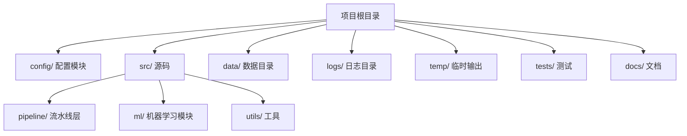
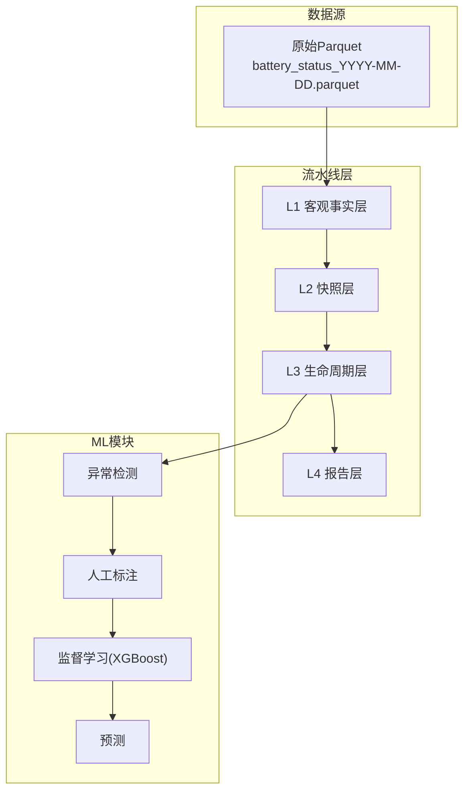
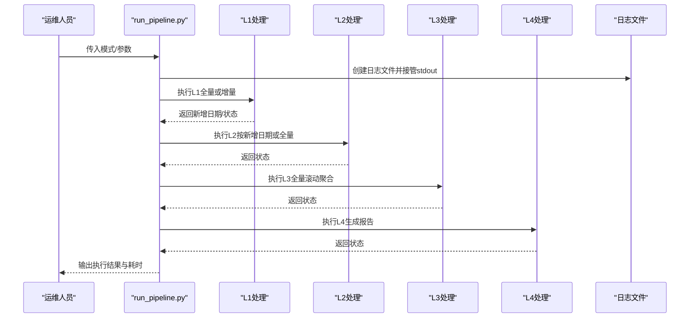
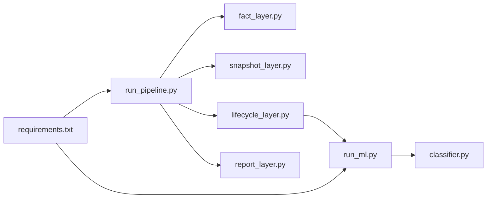

# 部署和运维

<cite>
**本文引用的文件**
- [README.md](file://README.md)
- [requirements.txt](file://requirements.txt)
- [config/config.py](file://config/config.py)
- [src/pipeline/run_pipeline.py](file://src/pipeline/run_pipeline.py)
- [src/pipeline/fact_layer.py](file://src/pipeline/fact_layer.py)
- [src/pipeline/snapshot_layer.py](file://src/pipeline/snapshot_layer.py)
- [src/pipeline/lifecycle_layer.py](file://src/pipeline/lifecycle_layer.py)
- [src/ml/run_ml.py](file://src/ml/run_ml.py)
- [src/ml/classifier.py](file://src/ml/classifier.py)
- [docs/报告逻辑及计算方法.md](file://docs/报告逻辑及计算方法.md)
- [ML模型说明.md](file://ML模型说明.md)
- [各指标参数.md](file://各指标参数.md)
</cite>

## 目录
1. [简介](#简介)
2. [项目结构](#项目结构)
3. [核心组件](#核心组件)
4. [架构总览](#架构总览)
5. [详细组件分析](#详细组件分析)
6. [依赖关系分析](#依赖关系分析)
7. [性能考虑](#性能考虑)
8. [故障排查指南](#故障排查指南)
9. [结论](#结论)
10. [附录](#附录)

## 简介
本文件面向生产环境的部署与运维，围绕“两轮车换电用户特征画像系统”提供从服务器环境准备、依赖安装、配置、服务启动、日志管理、性能监控、备份恢复、故障诊断、运维自动化到扩容升级的完整指导。系统采用分层流水线架构（L1-L4），并提供机器学习闭环（异常检测→人工标注→训练→预测），支持增量与全量两种执行模式，具备自动日志记录与容错设计。

## 项目结构
- 顶层目录包含配置、数据、源码、临时输出、测试与文档等模块。
- 核心执行入口为流水线统一调度器与ML统一入口，分别负责批处理与模型闭环。
- 配置模块集中管理路径与测试模式开关，便于生产/测试切换。

图表来源
- [config/config.py:1-54](file://config/config.py#L1-L54)
- [src/pipeline/run_pipeline.py:1-120](file://src/pipeline/run_pipeline.py#L1-L120)
- [src/ml/run_ml.py:1-60](file://src/ml/run_ml.py#L1-L60)

章节来源
- [README.md:1-120](file://README.md#L1-L120)
- [config/config.py:1-54](file://config/config.py#L1-L54)

## 核心组件
- 流水线统一调度器：支持全量、增量、刷新、重算、仅报告等模式，自动记录日志，具备容错与文件锁兼容处理。
- L1 客观事实层：从原始Parquet数据清洗、完整性校验、GPS空间匹配、SOC差法计算等，输出日级事实。
- L2 快照层：按用户7天滚动窗口聚合，生成用户日级快照与用户形态判定。
- L3 生命周期层：7天滚动聚合、动态阈值计算、用户等级/风险标签、月度用电预估、完整画像文本。
- L4 报告层：将生命周期结果导出为多格式报告。
- ML统一入口：异常检测（孤立森林+DBSCAN）→人工标注→监督学习（XGBoost）→预测闭环。
- 配置模块：集中管理路径、测试模式、输入输出目录。

章节来源
- [src/pipeline/run_pipeline.py:1-120](file://src/pipeline/run_pipeline.py#L1-L120)
- [src/pipeline/fact_layer.py:1-120](file://src/pipeline/fact_layer.py#L1-L120)
- [src/pipeline/snapshot_layer.py:1-120](file://src/pipeline/snapshot_layer.py#L1-L120)
- [src/pipeline/lifecycle_layer.py:1-120](file://src/pipeline/lifecycle_layer.py#L1-L120)
- [src/ml/run_ml.py:1-120](file://src/ml/run_ml.py#L1-L120)
- [config/config.py:1-54](file://config/config.py#L1-L54)

## 架构总览
系统采用分层流水线与ML闭环相结合的架构，数据从原始Parquet进入L1，逐层向上聚合，最终输出报告与画像；ML模块基于生命周期数据进行异常检测与监督分类，形成闭环。

图表来源
- [README.md:81-155](file://README.md#L81-L155)
- [src/pipeline/run_pipeline.py:96-101](file://src/pipeline/run_pipeline.py#L96-L101)
- [src/ml/run_ml.py:277-391](file://src/ml/run_ml.py#L277-L391)

## 详细组件分析

### 流水线统一调度器（run_pipeline.py）
- 功能：统一入口，支持多种执行模式，自动记录日志，处理OneDrive文件锁，容错与断点续跑。
- 关键特性：
  - 日志：TeeOutput将stdout同时写入日志文件，文件名包含模式与时间戳。
  - 模式：full/incremental/refresh/recalculate/report_only/from_layer。
  - 容错：清理目录时兼容OneDrive锁定，失败时打印traceback并退出码非零。
- 建议：生产环境建议使用增量模式，必要时使用from_layer从指定层重建。

图表来源
- [src/pipeline/run_pipeline.py:104-220](file://src/pipeline/run_pipeline.py#L104-L220)
- [src/pipeline/run_pipeline.py:262-303](file://src/pipeline/run_pipeline.py#L262-L303)

章节来源
- [src/pipeline/run_pipeline.py:57-90](file://src/pipeline/run_pipeline.py#L57-L90)
- [src/pipeline/run_pipeline.py:104-220](file://src/pipeline/run_pipeline.py#L104-L220)
- [src/pipeline/run_pipeline.py:262-303](file://src/pipeline/run_pipeline.py#L262-L303)

### L1 客观事实层（fact_layer.py）
- 功能：原始数据清洗、完整性校验、GPS空间匹配、SOC差法计算、多项指标聚合。
- 关键点：
  - 数据完整性校验：时间跨度≥20小时、小时覆盖≥20个。
  - GPS过滤与漂移速度过滤，避免异常点影响。
  - SOC差法计算日耗电量，避免电流噪声影响。
- 建议：确保原始Parquet命名规范与路径正确，避免跳过日期导致统计偏差。

章节来源
- [src/pipeline/fact_layer.py:100-120](file://src/pipeline/fact_layer.py#L100-L120)
- [src/pipeline/fact_layer.py:135-200](file://src/pipeline/fact_layer.py#L135-L200)

### L2 快照层（snapshot_layer.py）
- 功能：按用户7天滚动窗口聚合，生成用户日级快照与用户形态判定。
- 关键点：
  - 追加写入user_daily.parquet，自动对齐列与类型差异。
  - 用户形态优先级：地摊/储能 > 专送骑手 > 众包骑手 > 标准骑手 > 普通骑手 > 数据不足。
- 建议：定期检查快照文件schema一致性，避免历史字段变更导致写入失败。

章节来源
- [src/pipeline/snapshot_layer.py:157-200](file://src/pipeline/snapshot_layer.py#L157-L200)
- [src/pipeline/snapshot_layer.py:38-100](file://src/pipeline/snapshot_layer.py#L38-L100)

### L3 生命周期层（lifecycle_layer.py）
- 功能：7天滚动聚合、动态阈值计算、用户等级/风险标签、月度用电预估、完整画像文本。
- 关键点：
  - 动态阈值：基于全体用户分布计算分位数，支持EMA自动更新基准线。
  - 合约信息缓存：首次加载后全局缓存，避免重复I/O。
  - 月度用电预估：三档估算，覆盖数据不足场景。
- 建议：定期检查thresholds_baseline.json更新日志，确保阈值随业务演进。

章节来源
- [src/pipeline/lifecycle_layer.py:58-114](file://src/pipeline/lifecycle_layer.py#L58-L114)
- [src/pipeline/lifecycle_layer.py:186-200](file://src/pipeline/lifecycle_layer.py#L186-L200)

### L4 报告层（report_layer.py）
- 功能：将生命周期结果导出为CSV/JSON/TXT等多格式报告，供BI与运营使用。
- 建议：统一编码（UTF-8 with BOM）保证Excel兼容性。

章节来源
- [README.md:708-722](file://README.md#L708-L722)

### ML统一入口（run_ml.py）
- 功能：异常检测（孤立森林+DBSCAN）→人工标注→监督学习（XGBoost）→预测闭环。
- 关键点：
  - 自动查找最新异常报告/模型/标注文件，减少手工路径配置。
  - 标注统计与模型训练指标输出，便于质量评估。
- 建议：标注≥50条再训练，宁缺毋滥，低置信度样本回标注闭环。

章节来源
- [src/ml/run_ml.py:277-391](file://src/ml/run_ml.py#L277-L391)
- [ML模型说明.md:1-120](file://ML模型说明.md#L1-L120)

### 配置模块（config.py）
- 功能：集中管理基础路径、输入输出路径、测试模式开关。
- 建议：生产环境关闭TEST_MODE，确保输出路径指向生产数据盘。

章节来源
- [config/config.py:1-54](file://config/config.py#L1-L54)

## 依赖关系分析
- 运行时依赖：Python 3.13+，pandas/numpy/scipy/scikit-learn/pyarrow/xgboost/geopandas/tqdm/fpdf2。
- 模块依赖：流水线层之间强依赖（L1→L2→L3→L4），ML依赖生命周期输出。
- 外部数据：原始Parquet、省市区GeoJSON、合约信息、电池单体电压表。

图表来源
- [requirements.txt:1-9](file://requirements.txt#L1-L9)
- [src/pipeline/run_pipeline.py:96-101](file://src/pipeline/run_pipeline.py#L96-L101)
- [src/ml/run_ml.py:39-42](file://src/ml/run_ml.py#L39-L42)

章节来源
- [requirements.txt:1-9](file://requirements.txt#L1-L9)
- [src/pipeline/run_pipeline.py:96-101](file://src/pipeline/run_pipeline.py#L96-L101)
- [src/ml/run_ml.py:39-42](file://src/ml/run_ml.py#L39-L42)

## 性能考虑
- I/O与存储
  - Parquet列式存储，压缩（Snappy）提升读写效率；建议使用SSD或高性能存储。
  - L2追加写入user_daily.parquet，注意schema对齐与类型兼容。
- 并行与批处理
  - L1按日期批处理，L2按用户7天滚动聚合，建议在集群或容器中并行执行。
- 内存管理
  - 大数据集聚合（L2/L3）需关注内存峰值，建议分批或分用户并行。
- 进度与日志
  - tqdm进度条与自动日志记录，便于监控执行状态与定位问题。

章节来源
- [README.md:43-52](file://README.md#L43-L52)
- [src/pipeline/snapshot_layer.py:157-200](file://src/pipeline/snapshot_layer.py#L157-L200)
- [src/pipeline/run_pipeline.py:57-90](file://src/pipeline/run_pipeline.py#L57-L90)

## 故障排查指南
- 常见问题
  - 原始数据不完整：L1完整性校验失败，跳过该日期。可通过--skip-incomplete false关闭校验。
  - OneDrive文件锁：清理目录时兼容锁定，部分文件可能无法删除，系统会提示并继续写入。
  - 缺少依赖：安装requirements.txt中列出的包。
  - 路径错误：确认config.py中的BASE_EXPORT_PATH与数据路径一致。
- 日志分析
  - run_pipeline.py自动记录日志文件，包含开始/结束时间、执行模式、异常traceback。
  - ML模块输出异常报告、交叉验证报告、预测结果等，便于定位模型问题。
- 错误处理
  - try-except + 日志记录 + 退出码非零，便于自动化监控捕获失败。

章节来源
- [src/pipeline/run_pipeline.py:222-260](file://src/pipeline/run_pipeline.py#L222-L260)
- [src/pipeline/run_pipeline.py:364-377](file://src/pipeline/run_pipeline.py#L364-L377)
- [src/ml/run_ml.py:83-104](file://src/ml/run_ml.py#L83-L104)

## 结论
本系统通过清晰的分层架构与自动日志记录，提供了可靠的生产执行能力。建议在生产环境中：
- 使用增量模式日常运行，必要时从指定层重建；
- 建立完善的日志轮转与告警机制；
- 定期校验阈值基准线与模型性能；
- 制定备份与恢复策略，确保数据安全；
- 建立自动化巡检与扩容升级流程，保障系统稳定与可扩展性。

## 附录

### A. 生产环境部署清单
- 服务器环境
  - 操作系统：Linux/Windows（建议Linux）
  - Python：3.13+
  - 存储：SSD，预留充足空间（Parquet压缩后仍较大）
- 依赖安装
  - pip install -r requirements.txt
- 配置
  - 设置config.py中的BASE_EXPORT_PATH为生产路径
  - 确认数据源路径（原始Parquet、GeoJSON、合约与电池信息）
- 服务启动
  - 增量执行：python src/pipeline/run_pipeline.py
  - 全量重建：python src/pipeline/run_pipeline.py --mode full
  - 仅报告：python src/pipeline/run_pipeline.py --mode report_only
  - 从指定层重建：python src/pipeline/run_pipeline.py --layer L3

章节来源
- [requirements.txt:1-9](file://requirements.txt#L1-L9)
- [config/config.py:1-54](file://config/config.py#L1-L54)
- [src/pipeline/run_pipeline.py:13-41](file://src/pipeline/run_pipeline.py#L13-L41)

### B. 日志系统配置与管理
- 自动生成日志
  - run_pipeline.py自动创建logs/pipeline_{mode}_YYYYMMDD_HHMMSS.log
  - TeeOutput同时输出到控制台与日志文件
- 日志级别
  - 系统未显式设置logging级别，建议通过外部日志系统（如rsyslog/logrotate）统一管理
- 日志轮转
  - 建议使用logrotate或系统自带轮转工具，按大小/时间轮转
- 日志分析
  - 关注开始/结束时间、异常traceback、耗时统计
  - ML模块输出的异常报告、交叉验证报告、预测结果可用于模型质量分析

章节来源
- [src/pipeline/run_pipeline.py:57-90](file://src/pipeline/run_pipeline.py#L57-L90)
- [src/ml/run_ml.py:45-81](file://src/ml/run_ml.py#L45-L81)

### C. 性能监控与优化建议
- 资源监控
  - CPU/内存/磁盘IO：使用top/htop/iostat/iotop
  - Python进程：使用psutil或进程监控工具
- 处理速度优化
  - Parquet列裁剪与过滤
  - 分批处理与并行（按用户/按日期）
  - 合理设置tqdm显示与日志级别
- 内存管理
  - 分批聚合（L2/L3）
  - 及时释放中间变量，避免内存泄漏
- I/O优化
  - 使用SSD或高性能存储
  - 合理分区与压缩（Snappy）

章节来源
- [README.md:43-52](file://README.md#L43-L52)
- [src/pipeline/snapshot_layer.py:157-200](file://src/pipeline/snapshot_layer.py#L157-L200)

### D. 备份与恢复策略
- 备份对象
  - 原始Parquet（每日）
  - L1-L3输出（Parquet/CSV）
  - ML模型与标注库（JSON/CSV）
  - 配置文件与阈值基准线
- 备份策略
  - 增量备份：每日增量，保留7-30天
  - 全量备份：每周/每月全量
  - 异地备份：跨机房/云存储
- 恢复流程
  - 恢复原始数据 → 恢复L1-L3输出 → 恢复ML模型与标注库
  - 验证数据完整性与一致性（完整性校验、阈值基准线）

章节来源
- [docs/报告逻辑及计算方法.md:557-571](file://docs/报告逻辑及计算方法.md#L557-L571)
- [src/ml/run_ml.py:58-81](file://src/ml/run_ml.py#L58-L81)

### E. 运维自动化方案
- 定时任务
  - crontab：每日增量执行，失败邮件/告警
  - 周/月任务：生成汇总报告与模型训练
- 批量处理脚本
  - 从指定层重建：--layer L2/L3
  - 仅报告：--mode report_only
- 监控告警
  - 日志轮转与异常告警
  - 模型性能下降自动告警（低置信度样本增加）

章节来源
- [src/pipeline/run_pipeline.py:13-41](file://src/pipeline/run_pipeline.py#L13-L41)
- [ML模型说明.md:247-256](file://ML模型说明.md#L247-L256)

### F. 系统扩容与升级指导
- 扩容
  - 存储：增加SSD容量，分层存储（原始/中间/报告）
  - 计算：分布式执行（多节点并行），容器化部署
- 升级
  - 语义化版本管理（vX.Y.Z）
  - 渐进式发布：灰度/蓝绿部署
  - 回滚策略：保留上一版本输出与模型
- 指标与参数
  - 参考各指标参数文档，定期校准阈值与策略

章节来源
- [各指标参数.md:1-50](file://各指标参数.md#L1-L50)
- [README.md:54-76](file://README.md#L54-L76)