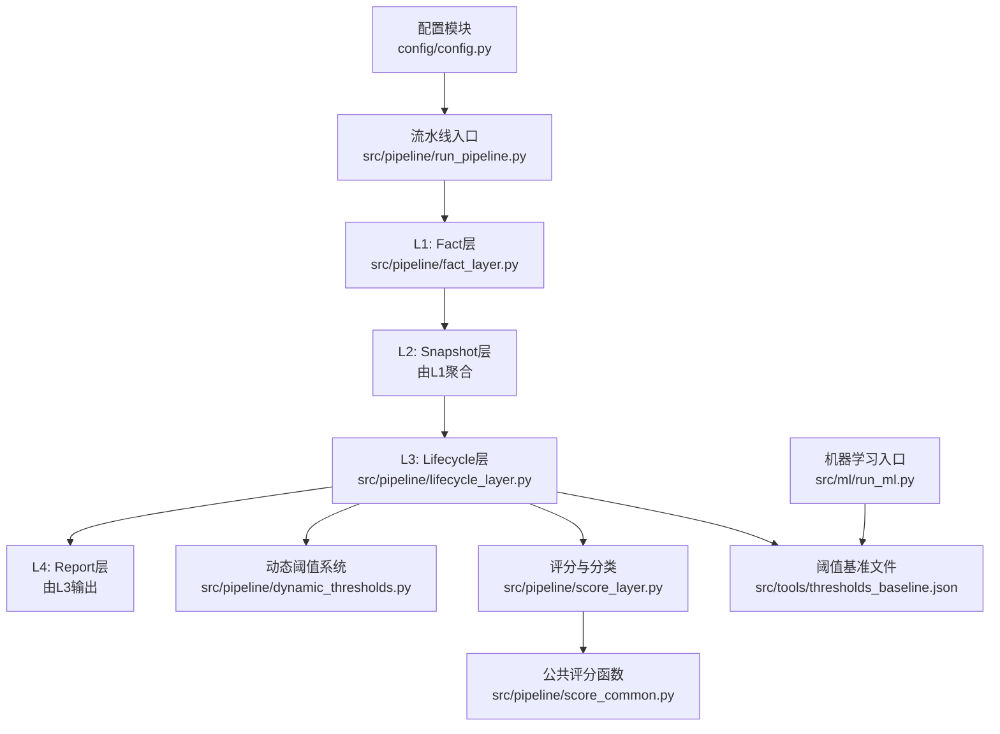
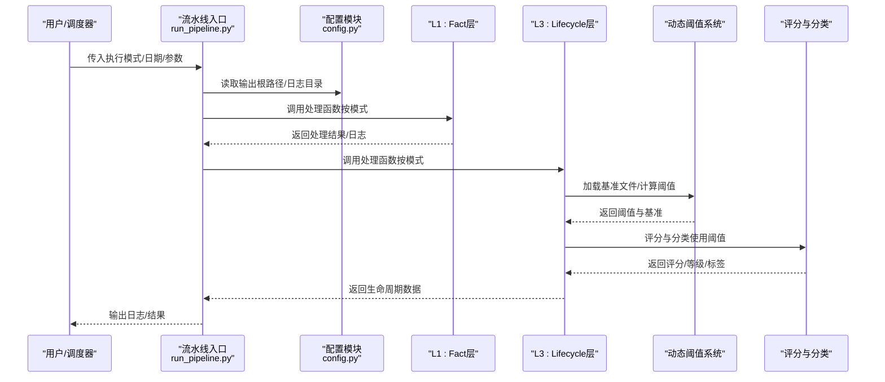
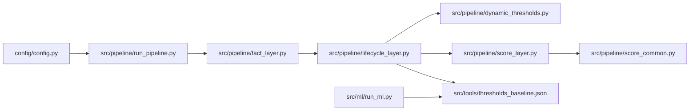

# 配置管理

<cite>
**本文引用的文件**   
- [config/config.py](file://config/config.py)
- [src/pipeline/run_pipeline.py](file://src/pipeline/run_pipeline.py)
- [src/pipeline/dynamic_thresholds.py](file://src/pipeline/dynamic_thresholds.py)
- [src/pipeline/score_layer.py](file://src/pipeline/score_layer.py)
- [src/pipeline/score_common.py](file://src/pipeline/score_common.py)
- [src/pipeline/fact_layer.py](file://src/pipeline/fact_layer.py)
- [src/pipeline/lifecycle_layer.py](file://src/pipeline/lifecycle_layer.py)
- [src/ml/run_ml.py](file://src/ml/run_ml.py)
- [src/tools/thresholds_baseline.json](file://src/tools/thresholds_baseline.json)
- [requirements.txt](file://requirements.txt)
- [README.md](file://README.md)
</cite>

## 目录
1. [简介](#简介)
2. [项目结构](#项目结构)
3. [核心组件](#核心组件)
4. [架构总览](#架构总览)
5. [详细组件分析](#详细组件分析)
6. [依赖关系分析](#依赖关系分析)
7. [性能考虑](#性能考虑)
8. [故障排查指南](#故障排查指南)
9. [结论](#结论)
10. [附录](#附录)

## 简介
本文件面向“两轮车换电用户特征画像系统”的配置管理，围绕路径配置、数据源配置、参数调优、配置优先级与继承、配置验证与错误处理、以及不同部署环境的最佳实践展开，帮助开发者与运维人员在开发、测试、生产环境中稳定、可重复地运行系统。

## 项目结构
系统采用分层流水线架构，配置主要集中在配置模块与各层模块中：
- 配置模块：集中管理基础路径、输入/输出路径、辅助数据路径等
- 流水线入口：统一调度 L1-L4 各层，支持多种执行模式
- 动态阈值系统：基于历史基准与实时数据计算自适应阈值
- 评分与分类：基于动态阈值进行用户等级与风险标签判定
- 机器学习模块：异常检测与监督分类的统一入口
- 工具与基准：阈值基准文件（JSON）与地理围栏数据

图表来源
- [config/config.py:1-54](file://config/config.py#L1-L54)
- [src/pipeline/run_pipeline.py:1-381](file://src/pipeline/run_pipeline.py#L1-L381)
- [src/pipeline/dynamic_thresholds.py:1-580](file://src/pipeline/dynamic_thresholds.py#L1-L580)
- [src/pipeline/score_layer.py:1-524](file://src/pipeline/score_layer.py#L1-L524)
- [src/pipeline/score_common.py:1-194](file://src/pipeline/score_common.py#L1-L194)
- [src/pipeline/fact_layer.py:1-200](file://src/pipeline/fact_layer.py#L1-L200)
- [src/pipeline/lifecycle_layer.py:1-200](file://src/pipeline/lifecycle_layer.py#L1-L200)
- [src/ml/run_ml.py:1-395](file://src/ml/run_ml.py#L1-L395)
- [src/tools/thresholds_baseline.json:1-141](file://src/tools/thresholds_baseline.json#L1-L141)

章节来源
- [config/config.py:1-54](file://config/config.py#L1-L54)
- [src/pipeline/run_pipeline.py:1-381](file://src/pipeline/run_pipeline.py#L1-L381)
- [README.md:79-156](file://README.md#L79-L156)

## 核心组件
- 路径配置
  - 基础路径：通过测试模式开关切换测试/正式路径
  - 输入路径：每日电池状态数据、地理围栏、合约信息等
  - 输出路径：原始事实、日级事实、快照、生命周期画像、报告等
- 数据源配置
  - 原始数据：每日 Parquet 文件（按日期分区）
  - 地理围栏：省/市/区县 GeoJSON
  - 合约信息：CSV 文件（首次入网、到期时间）
  - 阈值基准：JSON 文件（动态阈值基准）
- 参数配置
  - 流水线执行模式与参数（增量/全量/刷新/重算/仅报告）
  - 数据完整性校验开关
  - 动态阈值系统参数（EMA 平滑、漂移检测）
  - 评分与分类阈值（全局常量）
  - 机器学习参数（异常检测比例、训练/预测阈值）

章节来源
- [config/config.py:8-54](file://config/config.py#L8-L54)
- [src/pipeline/run_pipeline.py:307-381](file://src/pipeline/run_pipeline.py#L307-L381)
- [src/pipeline/dynamic_thresholds.py:349-457](file://src/pipeline/dynamic_thresholds.py#L349-L457)
- [src/pipeline/score_layer.py:48-78](file://src/pipeline/score_layer.py#L48-L78)
- [src/ml/run_ml.py:277-395](file://src/ml/run_ml.py#L277-L395)

## 架构总览
配置贯穿系统各层，形成“配置驱动的数据处理流水线”：
- 配置模块提供统一的路径与数据源定义
- 流水线入口根据模式与参数调度各层
- 动态阈值系统与评分层依赖配置中的基准文件与阈值
- 机器学习模块依赖生命周期数据与阈值基准

图表来源
- [src/pipeline/run_pipeline.py:96-101](file://src/pipeline/run_pipeline.py#L96-L101)
- [src/pipeline/lifecycle_layer.py:29-30](file://src/pipeline/lifecycle_layer.py#L29-L30)
- [src/pipeline/dynamic_thresholds.py:360-369](file://src/pipeline/dynamic_thresholds.py#L360-L369)
- [src/pipeline/score_layer.py:416-468](file://src/pipeline/score_layer.py#L416-L468)

## 详细组件分析

### 路径配置与数据源
- 基础路径与测试模式
  - 通过测试模式开关切换基础导出路径，便于本地测试与生产隔离
  - 提供统一的相对路径拼接函数，保证路径一致性
- 输入数据路径
  - 每日电池状态数据：Parquet 文件，按日期分区
  - 地理围栏：省/市/区县 GeoJSON
  - 合约信息：CSV 文件（首次入网、到期时间）
- 输出数据路径
  - 原始事实、日级事实、快照、生命周期画像、报告等
  - 阈值基准文件路径固定在工具目录下

章节来源
- [config/config.py:8-54](file://config/config.py#L8-L54)
- [README.md:166-170](file://README.md#L166-L170)
- [README.md:131-134](file://README.md#L131-L134)

### 流水线执行模式与参数
- 模式
  - full：全量重建，清理历史数据后依次执行 L1-L4
  - incremental：增量处理，自动检测缺失日期并跳过当天
  - refresh：仅重算 L2-L4（保留 L1）
  - recalculate：仅重算 L3-L4（保留 L1-L2）
  - report_only：仅生成报告（保留 L1-L3）
- 参数
  - --date：目标日期（YYYY-MM-DD，默认今天）
  - --layer：从指定层开始重建（L1-L4）
  - --skip-incomplete：是否跳过数据不完整的日期（默认开启）

章节来源
- [src/pipeline/run_pipeline.py:6-41](file://src/pipeline/run_pipeline.py#L6-L41)
- [src/pipeline/run_pipeline.py:307-381](file://src/pipeline/run_pipeline.py#L307-L381)

### 动态阈值系统与阈值基准
- 基准文件结构
  - 版本号、更新时间、数据指纹、样本量、分位数、用户等级阈值等
- 动态阈值计算
  - 从数据计算实时分位数，与历史基准对比检测分布漂移
  - 可选启用 EMA 平滑更新基准文件
- 评分与分类
  - 使用动态阈值进行用户等级与风险标签判定
  - 评分与分类逻辑在评分层中实现，支持向量化优化

章节来源
- [src/pipeline/dynamic_thresholds.py:33-145](file://src/pipeline/dynamic_thresholds.py#L33-L145)
- [src/pipeline/dynamic_thresholds.py:349-457](file://src/pipeline/dynamic_thresholds.py#L349-L457)
- [src/pipeline/score_layer.py:416-468](file://src/pipeline/score_layer.py#L416-L468)
- [src/tools/thresholds_baseline.json:1-141](file://src/tools/thresholds_baseline.json#L1-L141)

### 评分与分类阈值
- 全局阈值常量
  - 电流、温度、速度、SOC、换电次数、累计时长等阈值
- 评分函数
  - 基于多维度指标的向量化评分与等级分类
  - 支持“黄金区间”奖励、“暴力/高损耗”惩罚等规则

章节来源
- [src/pipeline/score_layer.py:48-78](file://src/pipeline/score_layer.py#L48-L78)
- [src/pipeline/score_layer.py:80-411](file://src/pipeline/score_layer.py#L80-L411)
- [src/pipeline/score_common.py:30-194](file://src/pipeline/score_common.py#L30-L194)

### 机器学习模块参数
- 异常检测
  - 预期异常比例（contamination，默认 0.05）
  - 输入生命周期数据路径
- 标注管理
  - 生成待标注文件（Top-N）
  - 保存标注结果、查看统计
- 训练与预测
  - 训练集比例（test_size，默认 0.2）
  - 预测置信度阈值（confidence，默认 0.6）

章节来源
- [src/ml/run_ml.py:83-250](file://src/ml/run_ml.py#L83-L250)
- [src/ml/run_ml.py:277-395](file://src/ml/run_ml.py#L277-L395)

## 依赖关系分析
- 配置模块依赖
  - 流水线入口依赖配置模块提供的输出根路径
  - 生命周期层依赖配置模块提供的快照与生命周期输出路径
  - 动态阈值系统依赖基准文件路径
- 数据依赖
  - L1 依赖每日 Parquet 原始数据
  - L2 依赖 L1 输出的按日期分区的 Parquet
  - L3 依赖 L2 输出的用户日级快照与合约信息
  - 评分与分类依赖动态阈值系统输出的阈值与基准
- 算法依赖
  - 评分与分类依赖公共评分函数模块
  - 机器学习模块依赖生命周期数据与阈值基准

图表来源
- [config/config.py:96-96](file://config/config.py#L96-L96)
- [src/pipeline/run_pipeline.py:96-101](file://src/pipeline/run_pipeline.py#L96-L101)
- [src/pipeline/lifecycle_layer.py:29-30](file://src/pipeline/lifecycle_layer.py#L29-L30)
- [src/pipeline/score_layer.py:416-468](file://src/pipeline/score_layer.py#L416-L468)
- [src/ml/run_ml.py:39-41](file://src/ml/run_ml.py#L39-L41)

章节来源
- [config/config.py:96-96](file://config/config.py#L96-L96)
- [src/pipeline/run_pipeline.py:96-101](file://src/pipeline/run_pipeline.py#L96-L101)
- [src/pipeline/lifecycle_layer.py:29-30](file://src/pipeline/lifecycle_layer.py#L29-L30)
- [src/pipeline/score_layer.py:416-468](file://src/pipeline/score_layer.py#L416-L468)
- [src/ml/run_ml.py:39-41](file://src/ml/run_ml.py#L39-L41)

## 性能考虑
- 路径与I/O
  - 使用 Parquet 列式存储，减少磁盘I/O与内存占用
  - 按日期分区输出，便于增量处理与并行读取
- 计算优化
  - 评分与分类采用向量化操作，避免 apply(axis=1) 的性能瓶颈
  - 动态阈值系统支持 EMA 平滑，平衡响应性与稳定性
- 并行与批处理
  - L1 层使用批量处理与并行计算，提高吞吐
  - 日志系统自动保存，便于性能监控与问题定位

章节来源
- [src/pipeline/score_layer.py:86-88](file://src/pipeline/score_layer.py#L86-L88)
- [src/pipeline/dynamic_thresholds.py:434-446](file://src/pipeline/dynamic_thresholds.py#L434-L446)
- [README.md:154-155](file://README.md#L154-L155)

## 故障排查指南
- 路径与权限
  - 确认基础路径与输出路径存在且可写
  - 处理 OneDrive 等文件锁定问题（流水线入口提供清理逻辑）
- 数据完整性
  - 使用数据完整性校验开关（默认开启），不完整日期将被跳过
  - 如需关闭校验，可在命令行传入相应参数
- 动态阈值
  - 检查基准文件是否存在与可读
  - 关注分布漂移检测报告，必要时手动更新基准
- 评分与分类
  - 核对全局阈值常量是否符合业务预期
  - 检查评分与分类逻辑的输入字段是否齐全
- 机器学习
  - 确认生命周期数据与标注数据存在
  - 调整异常检测比例与预测置信度阈值

章节来源
- [src/pipeline/run_pipeline.py:222-259](file://src/pipeline/run_pipeline.py#L222-L259)
- [src/pipeline/run_pipeline.py:338-335](file://src/pipeline/run_pipeline.py#L338-L335)
- [src/pipeline/dynamic_thresholds.py:424-456](file://src/pipeline/dynamic_thresholds.py#L424-L456)
- [src/pipeline/score_layer.py:430-432](file://src/pipeline/score_layer.py#L430-L432)
- [src/ml/run_ml.py:83-104](file://src/ml/run_ml.py#L83-L104)

## 结论
本配置管理体系通过集中式路径与参数配置、清晰的执行模式与参数、完善的动态阈值与评分机制，实现了从原始数据到用户画像与报告的自动化流水线。建议在不同环境遵循统一的配置策略与验证流程，确保系统在开发、测试、生产环境的一致性与稳定性。

## 附录

### 配置文件组织与优先级机制
- 配置文件组织
  - config/config.py：集中管理路径与数据源
  - thresholds_baseline.json：动态阈值基准文件
- 优先级机制
  - 测试模式优先于生产路径
  - 命令行参数优先于默认值
  - 基准文件优先于实时计算（若新鲜且数据指纹一致）

章节来源
- [config/config.py:8-19](file://config/config.py#L8-L19)
- [src/pipeline/run_pipeline.py:307-381](file://src/pipeline/run_pipeline.py#L307-L381)
- [src/pipeline/dynamic_thresholds.py:394-406](file://src/pipeline/dynamic_thresholds.py#L394-L406)

### 不同部署环境下的配置差异与最佳实践
- 开发环境
  - 使用测试模式，基础路径指向本地测试目录
  - 可开启更宽松的数据完整性校验，便于调试
- 测试环境
  - 使用与生产相近的路径与数据规模
  - 关注动态阈值的 EMA 更新与漂移检测
- 生产环境
  - 严格的数据完整性校验与日志记录
  - 基于历史基准文件的稳定阈值，谨慎启用 EMA 更新
  - 定期校验阈值基准文件的版本与数据指纹

章节来源
- [config/config.py:10-15](file://config/config.py#L10-L15)
- [src/pipeline/run_pipeline.py:338-335](file://src/pipeline/run_pipeline.py#L338-L335)
- [src/pipeline/dynamic_thresholds.py:434-446](file://src/pipeline/dynamic_thresholds.py#L434-L446)

### 参数调优指南
- 性能优化参数
  - Parquet 分区与压缩策略
  - 向量化评分与分类的阈值常量
- 算法参数
  - 动态阈值：EMA 平滑系数（建议 0.2-0.4）
  - 分布漂移检测阈值（建议 10%-20%）
- 阈值参数
  - 电流/温度/速度/SOC 等阈值应结合业务场景与历史数据校准
  - 评分与分类的等级门槛应基于活跃用户的真实分布动态调整

章节来源
- [src/pipeline/dynamic_thresholds.py:167-234](file://src/pipeline/dynamic_thresholds.py#L167-L234)
- [src/pipeline/score_layer.py:290-301](file://src/pipeline/score_layer.py#L290-L301)
- [README.md:780-800](file://README.md#L780-L800)

### 配置验证与错误处理
- 配置验证
  - 路径存在性与可写性检查
  - 基准文件可读性与版本/指纹校验
  - 数据源完整性校验（默认开启）
- 错误处理
  - 流水线入口捕获异常并输出完整 traceback
  - 日志系统自动保存运行日志，便于问题定位
  - 文件锁定问题的清理与覆盖策略

章节来源
- [src/pipeline/run_pipeline.py:80-90](file://src/pipeline/run_pipeline.py#L80-L90)
- [src/pipeline/run_pipeline.py:364-377](file://src/pipeline/run_pipeline.py#L364-L377)
- [src/pipeline/run_pipeline.py:222-259](file://src/pipeline/run_pipeline.py#L222-L259)