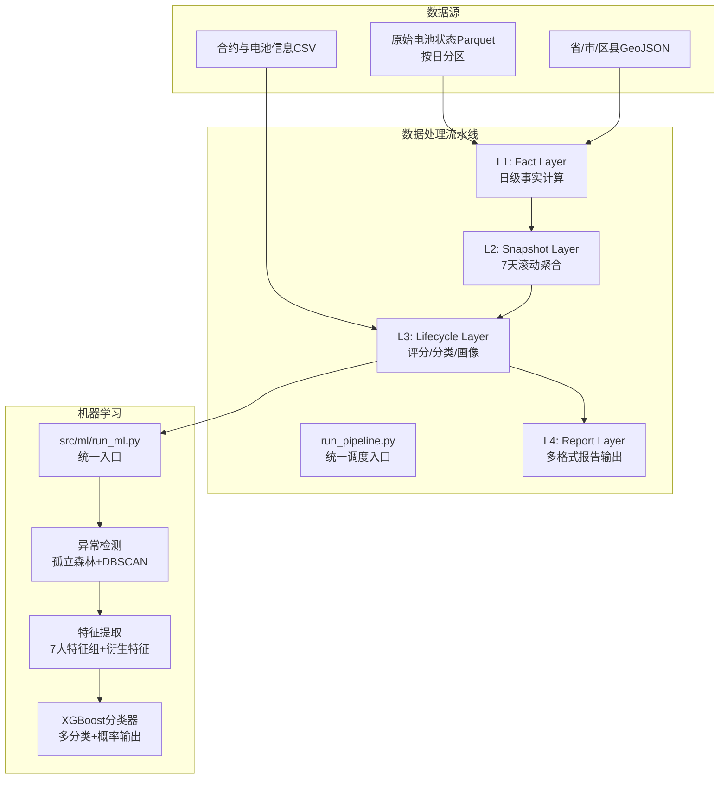
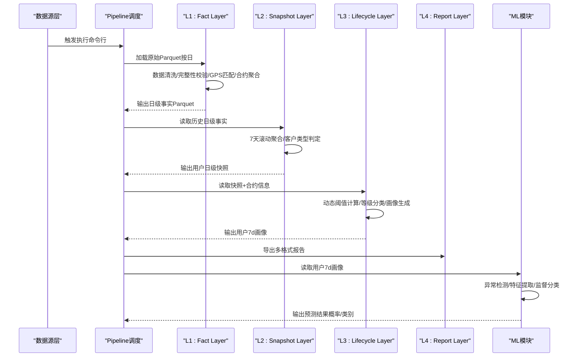
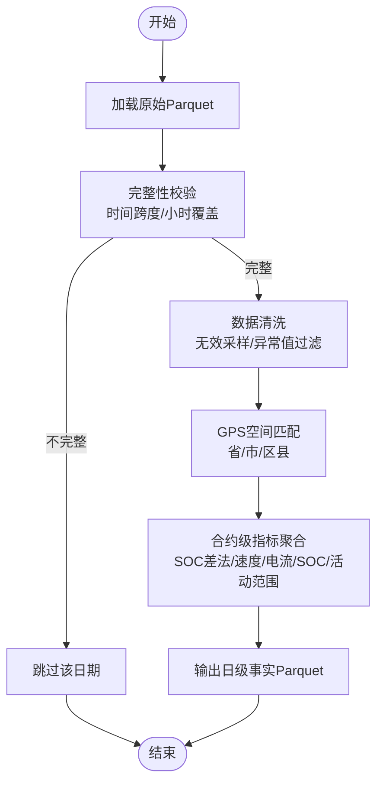
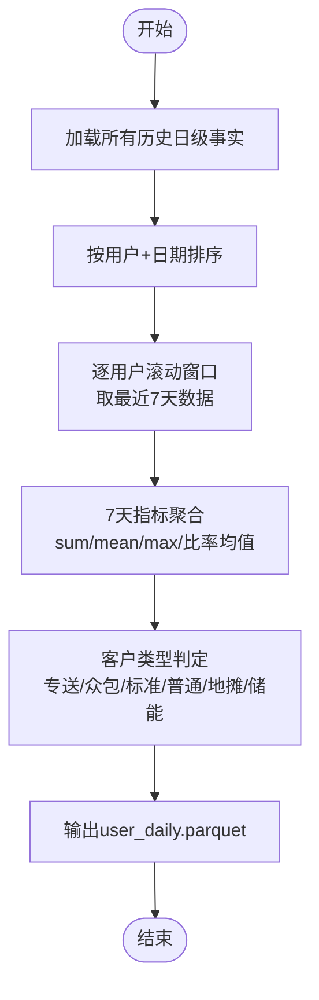
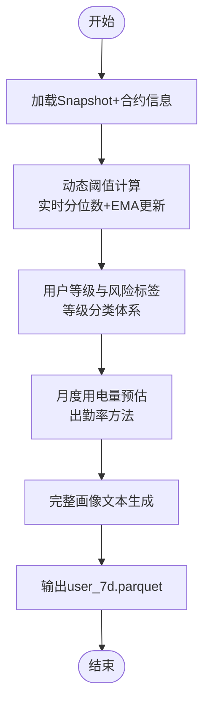
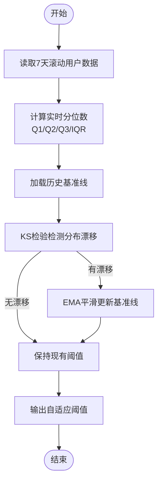
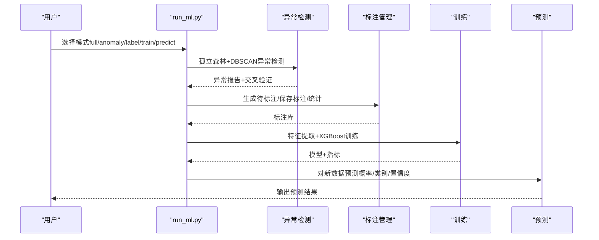
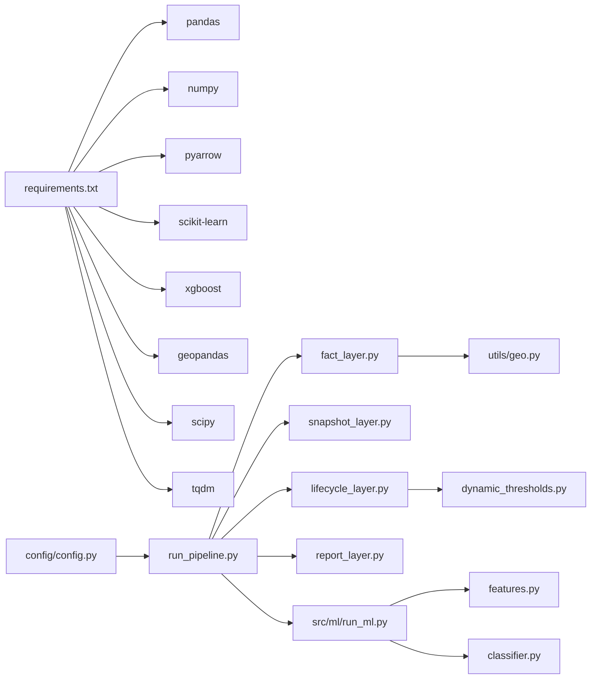

# 项目概述

<cite>
**本文引用的文件**
- [README.md](file://README.md)
- [requirements.txt](file://requirements.txt)
- [config/config.py](file://config/config.py)
- [src/pipeline/run_pipeline.py](file://src/pipeline/run_pipeline.py)
- [src/pipeline/fact_layer.py](file://src/pipeline/fact_layer.py)
- [src/pipeline/snapshot_layer.py](file://src/pipeline/snapshot_layer.py)
- [src/pipeline/lifecycle_layer.py](file://src/pipeline/lifecycle_layer.py)
- [src/pipeline/dynamic_thresholds.py](file://src/pipeline/dynamic_thresholds.py)
- [src/ml/run_ml.py](file://src/ml/run_ml.py)
- [src/ml/features.py](file://src/ml/features.py)
- [src/ml/classifier.py](file://src/ml/classifier.py)
- [utils/geo.py](file://utils/geo.py)
- [docs/报告逻辑及计算方法.md](file://docs/报告逻辑及计算方法.md)
- [docs/用户运营分析报告.md](file://docs/用户运营分析报告.md)
- [ML模型说明.md](file://ML模型说明.md)
- [各指标参数.md](file://各指标参数.md)
</cite>

## 目录
1. [引言](#引言)
2. [项目结构](#项目结构)
3. [核心组件](#核心组件)
4. [架构总览](#架构总览)
5. [详细组件分析](#详细组件分析)
6. [依赖关系分析](#依赖关系分析)
7. [性能考量](#性能考量)
8. [故障排查指南](#故障排查指南)
9. [结论](#结论)
10. [附录](#附录)

## 引言
本项目是“两轮车换电用户特征画像系统”，旨在通过对电池使用数据的采集、处理与分析，构建用户行为特征画像，支撑用户分层运营策略与风险预警机制。系统采用分层流水线架构，将原始电池状态数据逐步加工为日级事实、用户7天滚动快照、生命周期画像与多格式报告输出，并在v2.9版本引入车辆形态三级分级、众包/专送增强判定与机器学习异常检测闭环。

业务价值与核心能力
- 用户行为特征画像构建：多维度刻画骑行习惯、用电规律、地理活动范围
- 生命周期状态识别与分类：支撑用户分层运营策略
- 动态风险预警与策略建议：及时发现异常行为，降低运营风险
- 运营决策数据支撑：为BI系统、CRM提供数据基础

技术栈与版本演进
- 语言与生态：Python 3.13+，pandas、numpy、pyarrow、scikit-learn、xgboost、geopandas、scipy、tqdm
- 数据格式：Parquet（列式压缩）、CSV/JSON（报告输出）
- 执行模式：命令行Pipeline，支持全量重建、增量处理、刷新聚合、重新评级、仅报告等
- 版本演进：v1.0至v2.9，持续优化阈值系统、算法与特征工程，引入ML闭环

**章节来源**
- [README.md:1-800](file://README.md#L1-L800)

## 项目结构
项目采用模块化分层组织，核心目录与职责如下：
- config：基础路径与数据路径配置
- src/pipeline：四层流水线（L1-L4）与动态阈值模块
- src/ml：机器学习异常检测与监督分类
- utils：通用工具（地理空间匹配）
- data：辅助地理围栏数据
- docs：报告与参数说明文档
- logs：运行日志输出
- temp：临时输出与示例脚本

**图表来源**
- [README.md:81-134](file://README.md#L81-L134)
- [src/pipeline/run_pipeline.py:1-381](file://src/pipeline/run_pipeline.py#L1-L381)
- [src/ml/run_ml.py:1-395](file://src/ml/run_ml.py#L1-L395)

**章节来源**
- [README.md:81-134](file://README.md#L81-L134)
- [config/config.py:1-54](file://config/config.py#L1-L54)

## 核心组件
- L1: 客观事实层（Fact Layer）
  - 职责：将每日原始数据清洗、完整性校验、GPS空间匹配与合约级指标聚合，输出日级事实
  - 关键能力：SOC差法计算用电量、7天滚动窗口聚合、地理围栏匹配、数据完整性校验
- L2: 用户日级快照层（Snapshot Layer）
  - 职责：按用户聚合7天滚动指标，生成用户日级快照，进行客户类型判定
  - 关键能力：7天滚动加权聚合、客户类型判定（专送/众包/标准/普通/地摊/储能）
- L3: 生命周期层（Lifecycle Layer）
  - 职责：整合合约信息，动态阈值计算，用户等级与风险标签生成，月度用电量预估，完整画像文本
  - 关键能力：动态阈值（EMA更新）、等级分类体系、画像文本生成、车辆形态与用户形态（v2.9）
- L4: 报告输出层（Report Layer）
  - 职责：将生命周期层结果导出为CSV/JSON/TXT等多格式报告
- 动态阈值系统（Dynamic Thresholds）
  - 职责：基于7天滚动窗口实时分位数与历史基准对比，检测分布漂移并EMA更新
- 机器学习模块（src/ml）
  - 异常检测：孤立森林+DBSCAN双模型，输出异常分数与交叉验证
  - 特征工程：7大特征组与衍生特征，适配v2.9新字段
  - 监督分类：XGBoost多分类，输出预测类别、置信度与概率分布

**章节来源**
- [README.md:158-700](file://README.md#L158-L700)
- [src/pipeline/fact_layer.py:1-200](file://src/pipeline/fact_layer.py#L1-L200)
- [src/pipeline/snapshot_layer.py:1-200](file://src/pipeline/snapshot_layer.py#L1-L200)
- [src/pipeline/lifecycle_layer.py:1-200](file://src/pipeline/lifecycle_layer.py#L1-L200)
- [src/pipeline/dynamic_thresholds.py](file://src/pipeline/dynamic_thresholds.py)
- [src/ml/run_ml.py:1-395](file://src/ml/run_ml.py#L1-L395)
- [src/ml/features.py:1-200](file://src/ml/features.py#L1-L200)
- [src/ml/classifier.py:1-200](file://src/ml/classifier.py#L1-L200)

## 架构总览
系统整体采用“数据源层 → Pipeline流水线 → 输出层”的分层架构，配合ML闭环实现规则与模型的协同治理。数据流从原始Parquet文件进入L1，经L2滚动聚合，L3评分分类与画像生成，最终L4输出业务就绪报告。ML模块从生命周期层数据抽取特征，进行异常检测与监督分类，形成“规则-模型”双通道的风控体系。

**图表来源**
- [README.md:136-143](file://README.md#L136-L143)
- [src/pipeline/run_pipeline.py:104-220](file://src/pipeline/run_pipeline.py#L104-L220)
- [src/ml/run_ml.py:83-250](file://src/ml/run_ml.py#L83-L250)

**章节来源**
- [README.md:136-143](file://README.md#L136-L143)
- [src/pipeline/run_pipeline.py:1-381](file://src/pipeline/run_pipeline.py#L1-L381)

## 详细组件分析

### L1: 客观事实层（Fact Layer）
- 数据输入：每日一个Parquet文件，包含用户、合约、电池、GPS、电流/电压/SOC等字段
- 数据预处理：清洗无效采样、缺失字段、异常速度/温度、GPS漂移过滤、电流中位数平滑
- 空间匹配：基于GeoJSON围栏进行省/市/区县匹配，计算活动中心点与活动半径
- 指标聚合：按合约ID聚合日级指标（用电量、功率、速度、电流、SOC、活动范围等）
- 用电量计算：v1.8引入SOC差法，基于首末SOC与容量计算实际耗电量，避免电流噪声影响

**图表来源**
- [src/pipeline/fact_layer.py:135-200](file://src/pipeline/fact_layer.py#L135-L200)
- [utils/geo.py:93-162](file://utils/geo.py#L93-L162)

**章节来源**
- [src/pipeline/fact_layer.py:1-200](file://src/pipeline/fact_layer.py#L1-L200)
- [utils/geo.py:1-162](file://utils/geo.py#L1-L162)

### L2: 用户日级快照层（Snapshot Layer）
- 输入：L1输出的所有历史日级事实
- 处理：按用户+日期排序，确保时间连续性，逐用户滚动窗口聚合
- 聚合规则：累加型（总和）、平均型（均值）、极值型（最大值）、占比型（比率均值）
- 客户类型判定：基于7天累积数据，区分专送/众包/标准/普通/地摊/储能/数据不足

**图表来源**
- [src/pipeline/snapshot_layer.py:186-200](file://src/pipeline/snapshot_layer.py#L186-L200)

**章节来源**
- [src/pipeline/snapshot_layer.py:1-200](file://src/pipeline/snapshot_layer.py#L1-L200)

### L3: 生命周期层（Lifecycle Layer）
- 输入：L2输出的用户7天快照，辅助合约信息与动态阈值基准
- 处理：加载合约信息（入网/到期时间），计算7天滚动指标，动态阈值分析，用户等级与风险标签，月度用电量预估，完整画像文本
- v2.9新增：车辆形态三级分级（电动自行车/轻便摩托车/摩托车/改装/超速车/数据不足）、用户形态综合（专送/众包/标准/普通/地摊/储能/数据不足）、增强行为特征（时间熵值、路线曲折系数、速度变异系数、静止占比、跨区域转移次数、骑行时段集中度）

**图表来源**
- [src/pipeline/lifecycle_layer.py:58-115](file://src/pipeline/lifecycle_layer.py#L58-L115)
- [src/pipeline/dynamic_thresholds.py](file://src/pipeline/dynamic_thresholds.py)

**章节来源**
- [src/pipeline/lifecycle_layer.py:1-200](file://src/pipeline/lifecycle_layer.py#L1-L200)

### L4: 报告输出层（Report Layer）
- 职责：将生命周期层数据导出为CSV/JSON/TXT等多格式报告，供BI与运营使用
- 输出清单：完整用户画像、月度出勤预估明细、用户画像文本、生命周期统计摘要

**章节来源**
- [README.md:702-722](file://README.md#L702-L722)

### 动态阈值系统（Dynamic Thresholds）
- 目标：解决静态阈值无法适应业务变化的问题，通过KS检验检测分布漂移，EMA平滑更新基准线
- 工作流：实时统计→加载历史基准→对比检测→生成自适应阈值→EMA更新

**图表来源**
- [README.md:724-800](file://README.md#L724-L800)
- [src/pipeline/dynamic_thresholds.py](file://src/pipeline/dynamic_thresholds.py)

**章节来源**
- [README.md:724-800](file://README.md#L724-L800)

### 机器学习模块（src/ml）
- 统一入口：src/ml/run_ml.py，支持异常检测、标注管理、训练、预测、全流程一键执行
- 异常检测：孤立森林+DBSCAN双模型，输出异常分数与交叉验证，标记“新发现”
- 特征工程：从lifecycle层提取7大特征组与衍生特征，适配v2.9新字段（功率、行为规律、用户形态/车辆形态）
- 监督分类：XGBoost多分类（5类异常+正常），输出预测类别、置信度与概率分布，支持低置信度回流标注

**图表来源**
- [src/ml/run_ml.py:83-250](file://src/ml/run_ml.py#L83-L250)
- [src/ml/features.py:165-200](file://src/ml/features.py#L165-L200)
- [src/ml/classifier.py:76-120](file://src/ml/classifier.py#L76-L120)

**章节来源**
- [src/ml/run_ml.py:1-395](file://src/ml/run_ml.py#L1-L395)
- [src/ml/features.py:1-200](file://src/ml/features.py#L1-L200)
- [src/ml/classifier.py:1-200](file://src/ml/classifier.py#L1-L200)

## 依赖关系分析
- 外部依赖：pandas、numpy、pyarrow、scikit-learn、xgboost、geopandas、scipy、tqdm
- 内部依赖：config提供路径配置；L1依赖utils.geo进行空间匹配；L3依赖动态阈值模块；ML模块依赖特征提取与分类器
- 数据依赖：L1输入原始Parquet，L2读取L1输出，L3读取L2与合约信息，L4读取L3输出；ML模块读取L3输出

**图表来源**
- [requirements.txt:1-9](file://requirements.txt#L1-L9)
- [config/config.py:1-54](file://config/config.py#L1-L54)
- [src/pipeline/run_pipeline.py:96-101](file://src/pipeline/run_pipeline.py#L96-L101)
- [src/ml/run_ml.py:39-42](file://src/ml/run_ml.py#L39-L42)

**章节来源**
- [requirements.txt:1-9](file://requirements.txt#L1-L9)
- [config/config.py:1-54](file://config/config.py#L1-L54)
- [src/pipeline/run_pipeline.py:1-381](file://src/pipeline/run_pipeline.py#L1-L381)
- [src/ml/run_ml.py:1-395](file://src/ml/run_ml.py#L1-L395)

## 性能考量
- 列式存储与批处理：使用PyArrow Parquet进行高效读写与压缩，减少I/O与内存占用
- 并行与进度：tqdm提供处理进度条，分层独立函数便于并行与断点续跑
- 空间匹配优化：坐标降维缓存（经纬度保留3位小数）与GeoPandas sjoin加速
- 滚动窗口加权：对7天指标采用时间衰减权重，提升近期行为的代表性
- 动态阈值EMA：平滑响应业务分布变化，避免阈值剧烈波动

**章节来源**
- [README.md:145-155](file://README.md#L145-L155)
- [utils/geo.py:115-162](file://utils/geo.py#L115-L162)
- [src/pipeline/lifecycle_layer.py:165-184](file://src/pipeline/lifecycle_layer.py#L165-L184)

## 故障排查指南
- 日志系统：v2.8引入TeeOutput，所有stdout同时写入日志文件，异常包含完整traceback
- 目录清理：针对OneDrive文件锁问题，提供递归删除与覆盖写入策略
- 数据完整性：v2.3新增完整性校验（时间跨度≥20h、小时覆盖≥20），不完整日期跳过且不计入出勤率
- 常见问题：路径配置错误、依赖缺失、GeoJSON字段不匹配、标注数据为空导致训练失败

**章节来源**
- [src/pipeline/run_pipeline.py:57-91](file://src/pipeline/run_pipeline.py#L57-L91)
- [src/pipeline/run_pipeline.py:222-259](file://src/pipeline/run_pipeline.py#L222-L259)
- [README.md:213-223](file://README.md#L213-L223)

## 结论
本系统通过“规则+模型”的双通道设计，实现了从原始电池数据到用户画像与运营策略的全链路自动化。v2.9在阈值系统、地理空间分析、用户形态与车辆形态的精细化刻画以及ML特征工程方面取得显著进展，为两轮车换电平台提供了稳健、可扩展、可解释的用户特征画像能力。建议在生产环境中结合日志监控、阈值EMA更新与标注闭环，持续优化模型效果与业务适配度。

## 附录
- 报告逻辑与计算方法：涵盖活跃用户、日活率、周留存率、人均里程、高风险用户占比、用户等级分布、风险标签体系、区域对比等指标的计算口径
- 用户运营分析报告：展示核心指标看板、生命周期结构、风险标签分析、用户形态分析与区域运营分析
- ML模型说明：异常检测、标注管理、训练与预测的完整流程与最佳实践
- 各指标参数：详述阈值体系、判定逻辑与业务含义，便于非技术背景人员理解

**章节来源**
- [docs/报告逻辑及计算方法.md:1-200](file://docs/报告逻辑及计算方法.md#L1-L200)
- [docs/用户运营分析报告.md:1-200](file://docs/用户运营分析报告.md#L1-L200)
- [ML模型说明.md:1-256](file://ML模型说明.md#L1-L256)
- [各指标参数.md:1-800](file://各指标参数.md#L1-L800)